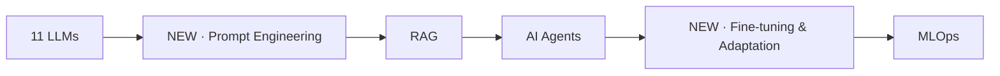

# Curriculum Validation & Review

> A critical review of the 20-module curriculum for **completeness, ordering, and effectiveness**. This is the moment to fix structural issues — we are still pre-content, so changes are cheap now and expensive later.

> [!NOTE]
> This document *proposes* changes. Nothing is renumbered until the maintainer approves — see the decision at the bottom.

> [!IMPORTANT]
> **✅ DECISION APPLIED (2026-07-08): Option A — Insert & renumber.** The curriculum is now **22 modules**: `12-Prompt-Engineering` inserted after LLMs and `15-Fine-Tuning` inserted after AI-Agents, with former modules 12–19 renumbered to 13–21. All planning docs and [scripts/generate_structure.py](scripts/generate_structure.py) reflect this. The gap-analysis and smaller-improvement recommendations below remain the backlog for content authoring.

---

## Verdict

The curriculum is **strong and well-sequenced** for a software developer becoming an AI Engineer. Engineering foundations (Linux, Git, SQL, CS) before ML is the right call and sets it apart from model-only courses.

However, review surfaced **three genuine gaps** and a few smaller improvements. Addressing them makes the path complete and industry-current.

---

## Gap analysis

| Severity | Missing / thin topic | Where it should live | Why it matters |
|:--:|---|---|---|
| 🔴 High | **Fine-tuning & model adaptation** (LoRA, QLoRA, PEFT, RLHF/DPO, instruction tuning) | New module after LLMs | A core AI-Engineer skill; currently absent entirely. You must know *when* to fine-tune vs prompt vs RAG, and *how*. |
| 🔴 High | **Prompt engineering** as first-class content | Dedicated module (or explicit weeks in LLMs) | The highest-leverage day-one skill; too important to bury inside "LLMs". |
| 🟡 Medium | **Data engineering / pipelines** (ETL, streaming, feature stores, data quality) | Expand Data Analysis, or a dedicated module | Production AI is bottlenecked by data plumbing, not models. |
| 🟡 Medium | **Evaluation** as a consolidated discipline | Strengthen Production AI + LLMs | Currently scattered; deserves a coherent treatment (offline evals, LLM-as-judge, regression detection). |
| 🟢 Low | **Vector search internals** (ANN, HNSW, quantization) | Deepen RAG | Often asked in interviews; currently implied. |
| 🟢 Low | **Responsible AI / governance** (bias, privacy, compliance) | Strengthen Production AI | Increasingly required in enterprise settings. |
| 🟢 Low | **Multimodal & vision-language** (optional survey) | Optional appendix module | Growing area; a survey suffices for most AI Engineers. |
| 🟢 Low | **Testing & software quality** for AI code | Weave into MLOps | AI code still needs unit/integration testing discipline. |

---

## Recommended additions (the two high-severity gaps)

The cleanest fix inserts **two modules** in Phase IV, where they belong pedagogically:

| Proposed | Module | Rationale |
|---|---|---|
| **New** | **Prompt Engineering** — after `11-LLMs`, before RAG | Prompting is the interface to every LLM; learn it before building on top |
| **New** | **Fine-tuning & Adaptation** — after RAG/Agents, before MLOps | Adapt models once you understand prompting, retrieval, and agents |

### Proposed revised sequence (Phase IV+)

> [!IMPORTANT]
> Because no lesson content exists yet, adding these now only means **renumbering folders 12–19 upward by two**. After content is written, this becomes far more disruptive. **Now is the time to decide.**

### Two ways to apply it

| Option | Effect | Tradeoff |
|---|---|---|
| **A — Insert & renumber** (recommended) | 22 modules, clean numeric order | One-time renumber of `12`–`19` → `14`–`21` |
| **B — Append at the end** | Keep `00–19`, add `20-Prompt-Engineering`, `21-Fine-Tuning` | No renumber, but out of pedagogical order |

---

## Smaller improvements (no renumbering needed)

- **Add explicit evaluation weeks** to `11-LLMs` (LLM eval basics) and `19-Production-AI` (production eval, LLM-as-judge, regression detection).
- **Deepen `07-Data-Analysis`** with a data-engineering week (pipelines, data quality, feature basics), or flag a future dedicated module.
- **Deepen `13-RAG`** with an ANN/index-internals week (HNSW, quantization, hybrid search).
- **Add a governance/responsible-AI week** to `19-Production-AI`.
- **Weave testing discipline** into `16-MLOps` explicitly.
- **Consider an optional `Multimodal` survey** appended at the end for learners who want breadth.

---

## Ordering & dependency check

| Check | Result |
|---|---|
| Foundations precede ML | ✅ Correct (00–05 → 06–09) |
| Math precedes ML/DL | ✅ `06-Mathematics` before `08/09` |
| NLP precedes LLMs | ✅ `10 → 11` |
| Prompting precedes building on LLMs | ⚠️ Fix via new module |
| Fine-tuning after RAG/Agents | ⚠️ Fix via new module |
| Production after applied LLM work | ✅ Correct |
| Interview prep leverages CS + system design | ✅ `18` depends on `02`, `16` |
| Capstone last, integrates everything | ✅ Correct |

No modules are out of order; the only issues are the **two missing modules**.

---

## Effectiveness improvements (learning design)

- ✅ **Milestone audits** already in the roadmap (A–D) — keep.
- ➕ Add a **"connect-back" requirement**: every module's first lesson explicitly retrieves a prior module (already encoded in [retention standards](standards/retention-standards.md)).
- ➕ Add a **mid-program mini-capstone** after Module 15 (applied LLM system: prompting + RAG + agent + fine-tuning) so learners ship something real before the long production phase.
- ➕ Add a **"you are here" progress banner** convention to each module README (optional visual aid).

---

## Decision required

> [!IMPORTANT]
> **Should we add the two missing modules now (Prompt Engineering, Fine-tuning), and if so via Option A (insert + renumber) or Option B (append)?**
> This is the one structural decision that is cheap today and costly after content exists. Everything else above can be applied incrementally without renumbering.

Once decided, [scripts/generate_structure.py](scripts/generate_structure.py) is updated (single source of truth), regenerated, and the change is logged in [CHANGELOG.md](CHANGELOG.md).
