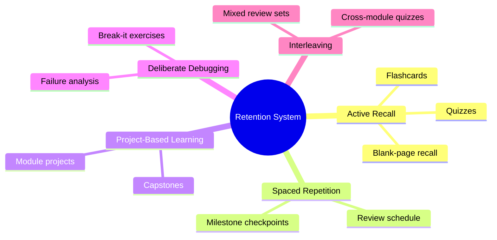
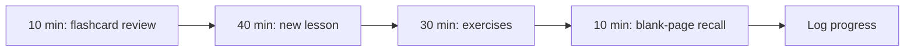

# Learning Strategy

> This handbook is engineered for **long-term retention and real capability**, not passive reading. This document explains the system and how to use it every day.

> [!TIP]
> The single most important idea here: **you learn by retrieving and building, not by reading.** Reading feels productive but fades fast. The system below forces retrieval and application.

---

## The five pillars

| Pillar | Why it works | Where it lives |
|---|---|---|
| **Active recall** | Retrieving strengthens memory far more than rereading | `quizzes/`, `flashcards/` |
| **Spaced repetition** | Reviewing at increasing intervals fights forgetting | Schedule below + milestones |
| **Project-based learning** | Applying knowledge exposes real gaps | `projects/`, capstones |
| **Deliberate debugging** | Fixing broken systems builds durable intuition | "Break-it" exercises |
| **Interleaving** | Mixing topics improves discrimination and transfer | Cross-module review sets |

---

## Daily loop

| Time | Activity |
|---|---|
| 10 min | Review due flashcards (yesterday's + spaced ones) |
| 40 min | Study one new lesson section — actively, pen in hand |
| 30 min | Do the matching exercises |
| 10 min | **Blank-page recall**: close everything, write what you remember |
| — | Update [PROGRESS_TRACKER.md](PROGRESS_TRACKER.md) |

---

## Spaced-repetition schedule

Review each lesson's flashcards on this expanding schedule after first learning it:

| Review | Interval after learning |
|:--:|---|
| 1 | Same day (evening) |
| 2 | +1 day |
| 3 | +3 days |
| 4 | +7 days |
| 5 | +16 days |
| 6 | +35 days |

> [!NOTE]
> If you fail a card, reset it to interval 1. This is normal — failing and recovering is where the learning happens.

---

## Weekly loop

| Day | Focus |
|---|---|
| Mon–Thu | New lessons + exercises |
| Fri | Module project work |
| Sat | Interleaved review (mixed quiz across recent modules) |
| Sun | Rest or light flashcard catch-up + plan next week |

---

## Milestone checkpoints

At each checkpoint (see [ROADMAP.md](ROADMAP.md)), do a **full active-recall audit** before moving on:

| Checkpoint | After | Audit |
|---|---|---|
| **A** | Module 04 | Rebuild a small neural net from memory; explain backprop aloud |
| **B** | Module 06 | Diagram a Transformer and the decoding loop from scratch |
| **C** | Module 10 | Design a RAG + agent system on a blank page |
| **D** | Module 15 | Full system-design mock interview + capstone review |

If you cannot pass a checkpoint from memory, revise before proceeding. **Do not accumulate debt.**

---

## How to study a lesson (the right way)

1. **Preview** — read objectives and summary first; prime your brain for what matters.
2. **Engage** — read the Intuition and First-Principles sections slowly; explain each idea to yourself in your own words.
3. **Implement** — type the code yourself; never copy-paste blindly.
4. **Break it** — deliberately introduce a bug and observe the failure. Understanding failure modes is core to engineering.
5. **Recall** — close the lesson and reconstruct it on a blank page.
6. **Schedule** — create/queue the flashcards and set the first review.

> [!WARNING]
> Avoid the "tutorial trap": watching/reading along while feeling like you understand. If you can't reproduce it without looking, you haven't learned it yet.

---

## Interview readiness (runs throughout)

Don't leave interview prep to the end. From Module 06 onward, spend **one session per week** in `interview-prep/`:

- Explain a concept out loud in under 3 minutes.
- Do one system-design prompt per week.
- Keep a running list of your weakest topics and target them.

See [interview-prep/](interview-prep/) for the question banks and rubrics.
