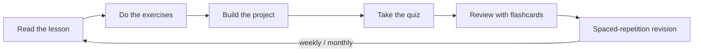

# The AI Engineer's Handbook

> A first-principles, production-focused handbook for becoming an AI Engineer capable of **designing, building, deploying, debugging, scaling, and maintaining** real-world AI systems.

  

> **Illustration placeholder** — `assets/images/handbook-cover.png`: a clean cover graphic showing a layered stack (data → model → serving → application) with an engineer at the center, in a calm technical style.

---

## What this is

This repository is a **long-form technical book disguised as a GitHub repo**. It is meant to be studied every day for a year and to hold up as a public reference for thousands of other engineers.

It is **not** a collection of shallow tutorials. Every concept is built from first principles, and every module builds on the ones before it.

| | |
|---|---|
| **Audience** | Working software developers who know Python and want to become production AI Engineers |
| **Assumed knowledge** | Python fundamentals, general software engineering, Git, the command line |
| **Not taught** | Basic syntax, loops, variables, functions (used, not explained) |
| **Teaching style** | First principles → intuition → math → code → production → debugging |
| **Format** | Markdown book with tables, callouts, Mermaid diagrams, exercises, quizzes, flashcards, and projects |

---

## How to use this handbook

1. **Read** the lesson in `docs/`.
2. **Practice** with the matching `exercises/`.
3. **Build** the module `projects/`.
4. **Test** yourself with `quizzes/`.
5. **Retain** using `flashcards/` and the spaced-repetition schedule in [LEARNING_STRATEGY.md](LEARNING_STRATEGY.md).
6. **Track** your progress in [PROGRESS_TRACKER.md](PROGRESS_TRACKER.md).

> [!TIP]
> Do not rush. This handbook rewards depth. One deeply understood lesson beats five skimmed ones.

---

## Start here

| Document | Purpose |
|---|---|
| [ROADMAP.md](ROADMAP.md) | The complete learning path with modules, weeks, time estimates, difficulty, and dependencies |
| [CURRICULUM.md](CURRICULUM.md) | Detailed lesson-by-lesson breakdown of every module |
| [REPOSITORY_STRUCTURE.md](REPOSITORY_STRUCTURE.md) | What every folder and file is for |
| [LEARNING_STRATEGY.md](LEARNING_STRATEGY.md) | How to actually retain this material long-term |
| [PROGRESS_TRACKER.md](PROGRESS_TRACKER.md) | Your personal checklist through the whole program |
| [RESOURCES.md](RESOURCES.md) | Curated external books, papers, courses, and tools |
| [GLOSSARY.md](GLOSSARY.md) | Definitions of every term used in the handbook |
| [FAQ.md](FAQ.md) | Common questions about the material and the journey |
| [CONTRIBUTING.md](CONTRIBUTING.md) | Style guide and standards for adding content |
| [CHANGELOG.md](CHANGELOG.md) | History of changes to the handbook |

---

## The curriculum at a glance

| # | Module | Theme | Difficulty |
|---|--------|-------|:----------:|
| 00 | Foundations & Engineering Setup | Environment, tooling, mindset | ⭐ |
| 01 | Advanced Python for AI | Typing, async, packaging, performance | ⭐⭐ |
| 02 | Math & ML Intuition | Linear algebra, calculus, probability | ⭐⭐⭐ |
| 03 | Classical Machine Learning | Regression, trees, evaluation | ⭐⭐⭐ |
| 04 | Deep Learning Foundations | Backprop, optimization, PyTorch | ⭐⭐⭐⭐ |
| 05 | NLP & the Transformer | Tokenization, attention, embeddings | ⭐⭐⭐⭐ |
| 06 | Large Language Models | Pretraining, decoding, internals | ⭐⭐⭐⭐ |
| 07 | Prompt Engineering | Structured prompting, reasoning | ⭐⭐ |
| 08 | Retrieval-Augmented Generation | Vector DBs, retrieval, grounding | ⭐⭐⭐ |
| 09 | Fine-tuning & Adaptation | LoRA, PEFT, alignment | ⭐⭐⭐⭐ |
| 10 | AI Agents & Tool Use | Planning, tools, orchestration | ⭐⭐⭐⭐ |
| 11 | LLMOps & Deployment | Serving, APIs, CI/CD | ⭐⭐⭐⭐ |
| 12 | Scaling & Infrastructure | GPUs, distributed, cost | ⭐⭐⭐⭐⭐ |
| 13 | Evaluation & Observability | Metrics, tracing, monitoring | ⭐⭐⭐⭐ |
| 14 | Safety, Security & Ethics | Guardrails, red-teaming, governance | ⭐⭐⭐ |
| 15 | Capstone Projects | End-to-end production systems | ⭐⭐⭐⭐⭐ |

See [ROADMAP.md](ROADMAP.md) for the full week-by-week plan.

---

## Status

> [!NOTE]
> **Current phase: Planning complete.** The repository structure and all planning documents are in place. Module content will be authored one module at a time. See [PROGRESS_TRACKER.md](PROGRESS_TRACKER.md) and [CHANGELOG.md](CHANGELOG.md).

---

## License

Content is intended to be shared publicly. A license will be added before public release (see [CONTRIBUTING.md](CONTRIBUTING.md)).
