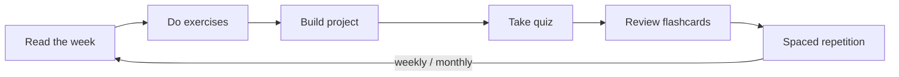

# The AI Engineer's Handbook

> A first-principles, production-focused handbook for becoming an AI Engineer capable of **designing, building, deploying, debugging, scaling, and maintaining** real-world AI systems.

  

> **Illustration placeholder** — `assets/images/handbook-cover.png`: a clean cover graphic showing a layered stack (foundations → data → models → LLMs → production) with an engineer at the center, in a calm technical style.

---

## What this is

A **long-form technical book disguised as a GitHub repository** — meant to be studied every day for a year and to hold up as a public reference for thousands of engineers. Not shallow tutorials: every concept is built from first principles, and every module builds on the ones before it.

| | |
|---|---|
| **Audience** | Working software developers who know Python and want to become production AI Engineers |
| **Assumed knowledge** | Python fundamentals, general software engineering |
| **Not taught** | Basic syntax, loops, variables, functions (used, not explained) |
| **Teaching style** | First principles → intuition → math → code → production → debugging |
| **Format** | Markdown book with tables, callouts, Mermaid diagrams, exercises, quizzes, flashcards, and projects |

---

## How to use this handbook

1. **Read** the module in [docs/](docs/).
2. **Practice** with each module's `exercises/`.
3. **Build** the module `projects/`.
4. **Test** yourself with `quizzes/`.
5. **Retain** with `flashcards/` and the schedule in [LEARNING_STRATEGY.md](LEARNING_STRATEGY.md).
6. **Track** progress in [PROGRESS_TRACKER.md](PROGRESS_TRACKER.md).

> [!TIP]
> Depth beats speed. One deeply understood lesson beats five skimmed ones.

---

## Start here

| Document | Purpose |
|---|---|
| [docs/](docs/README.md) | The handbook modules |
| [ROADMAP.md](ROADMAP.md) | Modules → weeks → lessons, with estimates, difficulty & dependencies |
| [CURRICULUM.md](CURRICULUM.md) | Lesson-by-lesson learning outcomes |
| [REPOSITORY_STRUCTURE.md](REPOSITORY_STRUCTURE.md) | What every folder and file is for |
| [LEARNING_STRATEGY.md](LEARNING_STRATEGY.md) | How to actually retain this material |
| [PROGRESS_TRACKER.md](PROGRESS_TRACKER.md) | Your personal checklist |
| [RESOURCES.md](RESOURCES.md) · [GLOSSARY.md](GLOSSARY.md) · [FAQ.md](FAQ.md) | Supporting references |
| [CONTRIBUTING.md](CONTRIBUTING.md) · [standards/](standards/README.md) | Style guide & the detailed standards rulebook |
| [CURRICULUM_REVIEW.md](CURRICULUM_REVIEW.md) | Curriculum validation, gap analysis & recommendations |
| [CHANGELOG.md](CHANGELOG.md) · [LICENSE.md](LICENSE.md) | History & licensing |

---

## The curriculum at a glance

| # | Module | Theme |
|---|--------|-------|
| 00 | [Orientation](docs/00-Orientation/README.md) | Mindset, environment, how to study |
| 01 | [Advanced Python](docs/01-Advanced-Python/README.md) | Typing, async, packaging, performance |
| 02 | [Computer Science](docs/02-Computer-Science/README.md) | Data structures, algorithms, complexity |
| 03 | [Linux](docs/03-Linux/README.md) | Shell, processes, permissions |
| 04 | [Git](docs/04-Git/README.md) | Version control & collaboration |
| 05 | [SQL](docs/05-SQL/README.md) | Relational modeling & queries |
| 06 | [Mathematics](docs/06-Mathematics/README.md) | Linear algebra, calculus, probability |
| 07 | [Data Analysis](docs/07-Data-Analysis/README.md) | NumPy, pandas, EDA, visualization |
| 08 | [Machine Learning](docs/08-Machine-Learning/README.md) | Classical ML & evaluation |
| 09 | [Deep Learning](docs/09-Deep-Learning/README.md) | Neural nets, backprop, PyTorch |
| 10 | [NLP](docs/10-NLP/README.md) | Tokenization, embeddings, Transformers |
| 11 | [LLMs](docs/11-LLMs/README.md) | Pretraining, decoding, internals |
| 12 | [Prompt Engineering](docs/12-Prompt-Engineering/README.md) | Structured prompting & reasoning |
| 13 | [RAG](docs/13-RAG/README.md) | Retrieval, vector DBs, grounding |
| 14 | [AI Agents](docs/14-AI-Agents/README.md) | Tool use, planning, orchestration |
| 15 | [Fine-tuning](docs/15-Fine-Tuning/README.md) | LoRA/PEFT, alignment |
| 16 | [MLOps](docs/16-MLOps/README.md) | Deployment, CI/CD, monitoring |
| 17 | [Cloud](docs/17-Cloud/README.md) | Infra, containers, GPUs |
| 18 | [System Design](docs/18-System-Design/README.md) | Scalable & AI system design |
| 19 | [Production AI](docs/19-Production-AI/README.md) | Reliability, security, cost |
| 20 | [Interview Preparation](docs/20-Interview-Preparation/README.md) | DSA, ML, system design, behavioral |
| 21 | [Capstone Projects](docs/21-Capstone-Projects/README.md) | End-to-end production systems |

See [ROADMAP.md](ROADMAP.md) for the full week-by-week plan and dependency graph.

---

## Repository map

| Folder | Purpose |
|---|---|
| [docs/](docs/) | The 22 handbook modules |
| [assets/](assets/) | `diagrams/`, `images/`, `icons/`, `cheatsheets/` |
| [code/](code/) | Standalone runnable code samples |
| [notebooks/](notebooks/) | Interactive Jupyter lessons |
| [exercises/](exercises/) · [quizzes/](quizzes/) · [flashcards/](flashcards/) | Cross-module practice & retention |
| [projects/](projects/) | Large & capstone projects |
| [interview-preparation/](interview-preparation/) | Interview banks & rubrics |
| [templates/](templates/) | Reusable page templates |
| [references/](references/) | Papers, books, reading notes |
| [scripts/](scripts/) | Repository automation |
| [archive/](archive/) | Superseded material |

---

## Status

> [!NOTE]
> **Phase 2 complete: full repository skeleton in place.** All folders, module READMEs with navigation, templates, and root planning documents exist. Module *content* is authored next, one module at a time — see [PROGRESS_TRACKER.md](PROGRESS_TRACKER.md) and [CHANGELOG.md](CHANGELOG.md).

## License

Content under **CC BY 4.0**, code under **MIT** — see [LICENSE.md](LICENSE.md).
