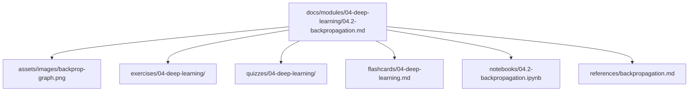

# Repository Structure

> A map of every folder in the handbook and what belongs in it. Read this before adding content so the repository stays organized as it grows past several thousand pages.

---

## Top-level layout

```text
ai-engineers-handbook/
├── README.md                  # Entry point and overview
├── ROADMAP.md                 # Modules → weeks → lessons, with estimates
├── CURRICULUM.md              # Lesson-by-lesson learning outcomes
├── REPOSITORY_STRUCTURE.md    # This file
├── LEARNING_STRATEGY.md       # How to retain the material
├── CONTRIBUTING.md            # Style guide and standards
├── PROGRESS_TRACKER.md        # Personal progress checklist
├── CHANGELOG.md               # History of changes
├── RESOURCES.md               # Curated external resources
├── GLOSSARY.md                # Master glossary (index)
├── FAQ.md                     # Frequently asked questions
│
├── docs/                      # The book itself
│   └── modules/
│       ├── 00-foundations/
│       ├── 01-advanced-python/
│       ├── 02-math-ml-intuition/
│       └── ... one folder per module
│
├── assets/
│   ├── images/                # Illustrations, screenshots, cover art
│   └── diagrams/              # Source files for diagrams (e.g. .mmd, .excalidraw)
│
├── exercises/                 # Hands-on practice, per module
├── quizzes/                   # Self-assessment questions & answers
├── flashcards/                # Spaced-repetition cards (Q/A)
├── projects/                  # Buildable projects, per module + capstones
├── notebooks/                 # Jupyter notebooks for interactive lessons
├── references/                # Deep-dive notes, paper summaries
├── cheatsheets/               # Quick-reference one-pagers
├── interview-prep/            # System design, questions, mock interviews
├── glossary/                  # Per-topic glossary fragments
├── templates/                 # Lesson/exercise/project templates
└── .github/workflows/         # CI (link checks, linting)
```

---

## Folder responsibilities

| Folder | Contains | Naming convention |
|---|---|---|
| `docs/modules/<NN>-<slug>/` | Lesson Markdown files, one per lesson | `NN.M-lesson-slug.md` (e.g. `04.2-backpropagation.md`) |
| `assets/images/` | PNG/JPG/SVG illustrations referenced by lessons | `topic-descriptor.png` |
| `assets/diagrams/` | Editable diagram sources | `topic.mmd`, `topic.excalidraw` |
| `exercises/<NN>-<slug>/` | Problem statements + solution files | `exercise-N.md`, `solution-N.py` |
| `quizzes/<NN>-<slug>/` | Question banks with answer keys | `quiz.md`, `answers.md` |
| `flashcards/` | Q/A decks, one file per module | `NN-<slug>.md` |
| `projects/<NN>-<slug>/` | Project brief, starter code, rubric | `README.md`, `starter/`, `rubric.md` |
| `notebooks/` | `.ipynb` companions | `NN.M-topic.ipynb` |
| `references/` | Paper summaries, deep dives | `topic.md` |
| `cheatsheets/` | One-page references | `topic-cheatsheet.md` |
| `interview-prep/` | Questions, system design, rubrics | `topic.md` |
| `glossary/` | Topic-scoped term fragments merged into `GLOSSARY.md` | `NN-<slug>.md` |
| `templates/` | Reusable scaffolds | `lesson-template.md`, etc. |

---

## How a single lesson maps across folders



One concept is reinforced across **reading, practice, testing, retention, and interactive exploration** — this is deliberate (see [LEARNING_STRATEGY.md](LEARNING_STRATEGY.md)).

---

## Conventions

> [!IMPORTANT]
> - **Module numbers are zero-padded** (`00`–`15`) so folders sort correctly.
> - **Every folder has a `README.md`** describing its contents once it holds real content.
> - **Images are always referenced with a placeholder + description** until the real asset exists.
> - **Never renumber modules or lessons** once published; append instead. See [CONTRIBUTING.md](CONTRIBUTING.md).

Placeholder `.gitkeep` files hold currently-empty directories in version control and are removed as real content lands.
