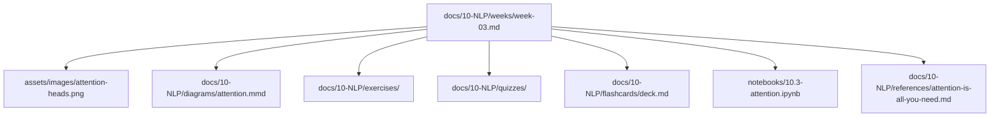

# Repository Structure

> A map of every folder in the handbook and what belongs in it. Read this before adding content so the repository stays organized as it grows past several thousand pages.

---

## Top-level layout

```text
AI-Engineer-Handbook/
├── README.md ROADMAP.md CURRICULUM.md ...   # root planning docs
├── LICENSE.md  .gitignore
│
├── docs/                       # The book — 22 module folders
│   ├── 00-Orientation/
│   ├── 01-Advanced-Python/
│   ├── ...
│   └── 21-Capstone-Projects/
│
├── assets/
│   ├── diagrams/               # Mermaid/Excalidraw sources + exports
│   ├── images/                 # Illustrations, screenshots
│   ├── icons/                  # Reusable icons & badges
│   └── cheatsheets/            # Repo-wide printable cheat sheets
│
├── code/                       # Standalone runnable code samples
├── notebooks/                  # Interactive Jupyter lessons
├── exercises/                  # Cross-module exercise sets
├── quizzes/                    # Cross-module & cumulative quizzes
├── flashcards/                 # Global/cumulative decks
├── interview-preparation/      # Question banks, system design, rubrics
├── projects/                   # Large & capstone projects
├── templates/                  # Reusable Markdown templates
├── references/                 # Papers, books, reading notes
├── scripts/                    # Repository automation
└── archive/                    # Superseded material (never linked live)
```

---

## Module folders

Every module under `docs/` uses the **same eight subfolders** so the book is predictable:

```text
docs/NN-Name/
├── README.md          # Purpose, outcomes, navigation
├── weeks/             # week-01.md, week-02.md, ...
├── diagrams/          # topic.mmd, topic.png
├── exercises/         # exercise-01.md (+ solution-01.*)
├── projects/          # project-01/ (README.md, starter/, rubric.md)
├── quizzes/           # quiz-01.md (+ answers-01.md)
├── flashcards/        # deck.md
├── cheat-sheets/      # topic-cheatsheet.md
└── references/        # paper summaries, deep dives
```

---

## Folder responsibilities

| Folder | Contains | Naming convention |
|---|---|---|
| `docs/NN-Name/` | A module | `NN-Name` (zero-padded, `Title-Case`) |
| `…/weeks/` | Weekly lessons | `week-NN.md` |
| `…/exercises/` | Problems + solutions | `exercise-NN.md`, `solution-NN.*` |
| `…/projects/` | Project folders | `project-NN/` |
| `…/quizzes/` | Quizzes + keys | `quiz-NN.md`, `answers-NN.md` |
| `…/flashcards/` | Decks | `deck.md` |
| `…/cheat-sheets/` | One-pagers | `topic-cheatsheet.md` |
| `…/diagrams/` | Diagram sources | `topic.mmd`, `topic.png` |
| `assets/images/` | Figures | `topic-descriptor.png` |
| `code/` | Runnable samples | `NN-topic/` |
| `notebooks/` | Notebooks | `NN.M-topic.ipynb` |
| `templates/` | Templates | `type-template.md` |

---

## How one concept maps across the repo



One concept is reinforced across **reading, practice, testing, retention, and interactive exploration** — by design (see [LEARNING_STRATEGY.md](LEARNING_STRATEGY.md)).

---

## Conventions

> [!IMPORTANT]
> - **Module numbers are zero-padded** (`00`–`21`) so folders sort correctly.
> - **Every folder has a `README.md`** with purpose + navigation.
> - **Never renumber published modules or lessons** — append instead.
> - **Images use a placeholder + description** until the real asset exists.
> - **Superseded content moves to `archive/`** and is never linked from live pages.

See [CONTRIBUTING.md](CONTRIBUTING.md) for the full Markdown and naming standards. The structure is generated and kept consistent by [scripts/generate_structure.py](scripts/generate_structure.py).
