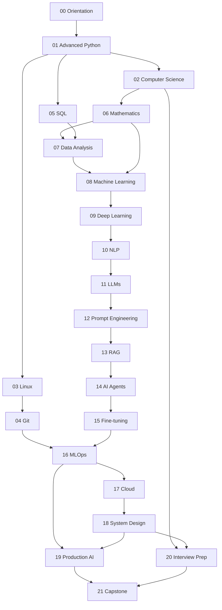

# Roadmap

> The complete learning path — from working software developer to production AI Engineer, across **22 modules** organized into six phases.

This roadmap breaks the journey into **modules → weeks → lessons**, with time estimates, a difficulty rating, and explicit dependencies so nothing feels disconnected.

> [!NOTE]
> Estimates assume **~10 focused hours/week**. The full program spans **~52 weeks**. Adjust to your pace — sequence matters more than the calendar.

---

## Legend

| Symbol | Meaning |
|---|---|
| ⭐–⭐⭐⭐⭐⭐ | Difficulty |
| 📖 | Study time · 🛠️ Project time · 🔁 Revision time |
| ➡️ | Depends on (complete first) |

---

## Module dependency graph

---

## Program summary

| Phase | Modules | Weeks | Focus |
|---|---|:---:|---|
| **I — Engineering Foundations** | 00–05 | 1–12 | Python, CS, Linux, Git, SQL |
| **II — Data & Math** | 06–07 | 13–18 | Math intuition & data analysis |
| **III — Machine Learning** | 08–09 | 19–26 | Classical ML & deep learning |
| **IV — Language & LLMs** | 10–15 | 27–43 | NLP, LLMs, prompting, RAG, agents, fine-tuning |
| **V — Production Engineering** | 16–19 | 44–53 | MLOps, cloud, system design, production |
| **VI — Mastery** | 20–21 | 54–57 | Interview prep & capstones |

**Totals (approx.):** 📖 ~420h · 🛠️ ~170h · 🔁 ~75h → **~665 hours** across **~57 weeks**

---

## Phase I — Engineering Foundations (Weeks 1–12)

| # | Module | ➡️ Depends | Weeks | Est. |
|---|---|---|:---:|---|
| 00 | Orientation ⭐ | — | 1 | 📖 6h 🔁 1h |
| 01 | Advanced Python ⭐⭐ | 00 | 2–3 | 📖 12h 🛠️ 4h |
| 02 | Computer Science ⭐⭐⭐ | 01 | 4–5 | 📖 16h 🛠️ 4h |
| 03 | Linux ⭐⭐ | — | 6–7 | 📖 12h 🛠️ 3h |
| 04 | Git ⭐⭐ | 03 | 8 | 📖 6h 🛠️ 2h |
| 05 | SQL ⭐⭐ | 01 | 9–12 | 📖 14h 🛠️ 6h |

## Phase II — Data & Math (Weeks 13–18)

| # | Module | ➡️ Depends | Weeks | Est. |
|---|---|---|:---:|---|
| 06 | Mathematics ⭐⭐⭐ | 02 | 13–16 | 📖 20h 🔁 4h |
| 07 | Data Analysis ⭐⭐⭐ | 05, 06 | 17–18 | 📖 12h 🛠️ 6h |

## Phase III — Machine Learning (Weeks 19–26)

| # | Module | ➡️ Depends | Weeks | Est. |
|---|---|---|:---:|---|
| 08 | Machine Learning ⭐⭐⭐ | 06, 07 | 19–22 | 📖 24h 🛠️ 8h |
| 09 | Deep Learning ⭐⭐⭐⭐ | 08 | 23–26 | 📖 28h 🛠️ 10h |

> 🏁 **Milestone A** — Rebuild a small neural net from memory; explain backprop aloud.

## Phase IV — Language & LLMs (Weeks 27–43)

| # | Module | ➡️ Depends | Weeks | Est. |
|---|---|---|:---:|---|
| 10 | NLP ⭐⭐⭐⭐ | 09 | 27–30 | 📖 24h 🛠️ 8h |
| 11 | LLMs ⭐⭐⭐⭐ | 10 | 31–34 | 📖 24h 🔁 5h |
| 12 | Prompt Engineering ⭐⭐ | 11 | 35–36 | 📖 12h 🛠️ 6h |
| 13 | RAG ⭐⭐⭐ | 12 | 37–38 | 📖 16h 🛠️ 10h |
| 14 | AI Agents ⭐⭐⭐⭐ | 13 | 39–40 | 📖 16h 🛠️ 12h |
| 15 | Fine-tuning ⭐⭐⭐⭐ | 14 | 41–43 | 📖 20h 🛠️ 10h |

> 🏁 **Milestone B/C** — Diagram a Transformer + decoding loop; design a RAG + agent system on a blank page.

## Phase V — Production Engineering (Weeks 44–53)

| # | Module | ➡️ Depends | Weeks | Est. |
|---|---|---|:---:|---|
| 16 | MLOps ⭐⭐⭐⭐ | 04, 15 | 44–47 | 📖 20h 🛠️ 10h |
| 17 | Cloud ⭐⭐⭐⭐ | 16 | 48–49 | 📖 14h 🛠️ 4h |
| 18 | System Design ⭐⭐⭐⭐⭐ | 17 | 50–51 | 📖 16h 🛠️ 4h |
| 19 | Production AI ⭐⭐⭐⭐ | 16, 18 | 52–53 | 📖 16h 🛠️ 8h |

## Phase VI — Mastery (Weeks 54–57)

| # | Module | ➡️ Depends | Weeks | Est. |
|---|---|---|:---:|---|
| 20 | Interview Preparation ⭐⭐⭐⭐ | 02, 18 | 54–55 | 📖 12h 🛠️ 8h |
| 21 | Capstone Projects ⭐⭐⭐⭐⭐ | 19, 20 | 56–57 | 🛠️ 30h |

> 🏁 **Milestone D** — Full system-design mock interview + capstone review.

---

## Revision checkpoints

| After | Checkpoint | Audit |
|---|---|---|
| Module 09 | **A** | ML & DL foundations |
| Module 11 | **B** | Transformers & LLM internals |
| Module 15 | **C** | Applied LLM engineering (prompting → RAG → agents → fine-tuning) |
| Module 21 | **D** | Full-system & interview readiness |

See [LEARNING_STRATEGY.md](LEARNING_STRATEGY.md) for how checkpoints use spaced repetition and active recall, and [CURRICULUM.md](CURRICULUM.md) for lesson-level detail.
