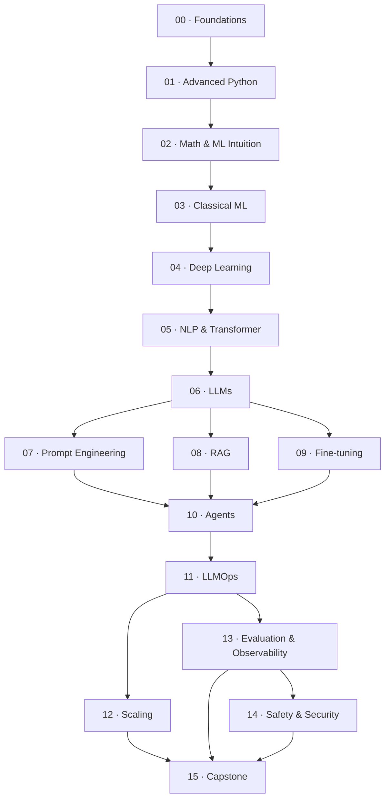

# Roadmap

> The complete learning path — from working software developer to production AI Engineer.

This roadmap breaks the journey into **modules → weeks → lessons**, with estimates for study, project, and revision time, a difficulty rating, and explicit dependencies so nothing feels disconnected.

> [!NOTE]
> Time estimates assume **~10 focused hours per week**. Adjust to your pace — the sequence matters more than the calendar. The full program is designed for **~52 weeks**.

---

## Legend

| Symbol | Meaning |
|---|---|
| ⭐–⭐⭐⭐⭐⭐ | Difficulty (1 = light, 5 = very demanding) |
| 📖 | Study time (reading + exercises) |
| 🛠️ | Project time |
| 🔁 | Revision time |
| ➡️ | Depends on (must complete first) |

---

## Module dependency graph

> [!TIP]
> Modules 07, 08, and 09 all branch from Module 06 and can be studied in any order — but complete all three before Module 10 (Agents).

---

## Program summary

| Phase | Modules | Weeks | Focus |
|---|---|:---:|---|
| **I — Foundations** | 00–01 | 1–4 | Engineering environment & advanced Python |
| **II — ML Core** | 02–04 | 5–16 | Math, classical ML, deep learning |
| **III — Language & LLMs** | 05–06 | 17–24 | Transformers and large language models |
| **IV — Applied LLM Engineering** | 07–10 | 25–38 | Prompting, RAG, fine-tuning, agents |
| **V — Production** | 11–14 | 39–48 | Deployment, scaling, evaluation, safety |
| **VI — Mastery** | 15 | 49–52 | Capstone systems & interview prep |

**Totals:** 📖 ~360h study · 🛠️ ~140h projects · 🔁 ~70h revision → **~570 hours**

---

## Phase I — Foundations (Weeks 1–4)

### Module 00 · Foundations & Engineering Setup ⭐
➡️ None · 📖 6h · 🛠️ 2h · 🔁 1h

| Week | Lessons |
|:---:|---|
| 1 | What is an AI Engineer? · The AI systems landscape · Dev environment (uv/poetry, VS Code, GPUs, notebooks) · Reproducibility & experiment mindset |

### Module 01 · Advanced Python for AI ⭐⭐
➡️ M00 · 📖 12h · 🛠️ 4h · 🔁 2h

| Week | Lessons |
|:---:|---|
| 2 | Type hints & typing discipline · Dataclasses & Pydantic · Iterators, generators, comprehensions at scale |
| 3 | Async & concurrency · Multiprocessing vs threading vs async for AI workloads |
| 4 | Packaging, dependency management, profiling & performance · NumPy vectorization |

---

## Phase II — ML Core (Weeks 5–16)

### Module 02 · Math & ML Intuition ⭐⭐⭐
➡️ M01 · 📖 20h · 🛠️ 4h · 🔁 4h

| Week | Lessons |
|:---:|---|
| 5 | Linear algebra for ML (vectors, matrices, dot products, projections) |
| 6 | Calculus & gradients · The chain rule as the engine of learning |
| 7 | Probability & statistics · Distributions, expectation, Bayes |
| 8 | Optimization intuition · Loss surfaces, gradient descent |

### Module 03 · Classical Machine Learning ⭐⭐⭐
➡️ M02 · 📖 24h · 🛠️ 8h · 🔁 4h

| Week | Lessons |
|:---:|---|
| 9 | The ML workflow · Data splits, leakage, the bias–variance tradeoff |
| 10 | Linear & logistic regression from scratch |
| 11 | Trees, ensembles, gradient boosting · Feature engineering |
| 12 | Evaluation: metrics, cross-validation, calibration, error analysis |

### Module 04 · Deep Learning Foundations ⭐⭐⭐⭐
➡️ M03 · 📖 28h · 🛠️ 10h · 🔁 5h

| Week | Lessons |
|:---:|---|
| 13 | Neurons, layers, activations · Backpropagation from scratch |
| 14 | PyTorch deeply · Tensors, autograd, modules, training loops |
| 15 | Optimization in practice · Regularization, normalization, initialization |
| 16 | Debugging neural nets · Overfitting, vanishing gradients, reproducibility |

---

## Phase III — Language & LLMs (Weeks 17–24)

### Module 05 · NLP & the Transformer ⭐⭐⭐⭐
➡️ M04 · 📖 24h · 🛠️ 8h · 🔁 5h

| Week | Lessons |
|:---:|---|
| 17 | Text representation · Tokenization (BPE, WordPiece), embeddings |
| 18 | Sequence models & their limits (RNN → attention motivation) |
| 19 | The attention mechanism from first principles |
| 20 | Building a Transformer block from scratch |

### Module 06 · Large Language Models ⭐⭐⭐⭐
➡️ M05 · 📖 24h · 🛠️ 6h · 🔁 5h

| Week | Lessons |
|:---:|---|
| 21 | Pretraining objectives · Next-token prediction, scaling laws |
| 22 | Decoding strategies · Temperature, top-k/top-p, beam search |
| 23 | Context windows, KV cache, positional encodings |
| 24 | The modern LLM landscape · Open vs closed, model selection |

---

## Phase IV — Applied LLM Engineering (Weeks 25–38)

### Module 07 · Prompt Engineering ⭐⭐
➡️ M06 · 📖 12h · 🛠️ 6h · 🔁 3h

| Week | Lessons |
|:---:|---|
| 25 | Anatomy of a prompt · System/user roles, structured output |
| 26 | Reasoning techniques · Few-shot, chain-of-thought, self-consistency |
| 27 | Prompt reliability · Guardrails, JSON schemas, testing prompts |

### Module 08 · Retrieval-Augmented Generation ⭐⭐⭐
➡️ M06 · 📖 20h · 🛠️ 10h · 🔁 4h

| Week | Lessons |
|:---:|---|
| 28 | Why RAG · Grounding, hallucination, knowledge cutoffs |
| 29 | Embeddings & vector databases · Chunking strategies |
| 30 | Retrieval quality · Hybrid search, reranking, evaluation |
| 31 | Building a production RAG pipeline |

### Module 09 · Fine-tuning & Adaptation ⭐⭐⭐⭐
➡️ M06 · 📖 20h · 🛠️ 10h · 🔁 4h

| Week | Lessons |
|:---:|---|
| 32 | When to fine-tune vs prompt vs RAG |
| 33 | Parameter-efficient fine-tuning · LoRA / QLoRA / PEFT |
| 34 | Data curation & instruction tuning |
| 35 | Alignment basics · RLHF/DPO intuition |

### Module 10 · AI Agents & Tool Use ⭐⭐⭐⭐
➡️ M07, M08, M09 · 📖 20h · 🛠️ 12h · 🔁 4h

| Week | Lessons |
|:---:|---|
| 36 | Agent foundations · The reasoning–action loop |
| 37 | Tools, function calling, structured actions |
| 38 | Multi-step & multi-agent orchestration · Memory, planning, failure recovery |

---

## Phase V — Production (Weeks 39–48)

### Module 11 · LLMOps & Deployment ⭐⭐⭐⭐
➡️ M10 · 📖 20h · 🛠️ 10h · 🔁 4h

| Week | Lessons |
|:---:|---|
| 39 | Serving models · APIs, batching, streaming |
| 40 | Packaging & containerization · Docker, environments |
| 41 | CI/CD for AI systems · Testing, versioning, rollbacks |
| 42 | Caching, rate limiting, cost control |

### Module 12 · Scaling & Infrastructure ⭐⭐⭐⭐⭐
➡️ M11 · 📖 16h · 🛠️ 6h · 🔁 4h

| Week | Lessons |
|:---:|---|
| 43 | GPUs & accelerators · Memory, quantization, inference optimization |
| 44 | Distributed training & serving · Parallelism strategies |
| 45 | Latency, throughput, and cost engineering |

### Module 13 · Evaluation & Observability ⭐⭐⭐⭐
➡️ M11 · 📖 16h · 🛠️ 8h · 🔁 4h

| Week | Lessons |
|:---:|---|
| 46 | Evaluating LLM systems · Offline metrics, LLM-as-judge |
| 47 | Observability · Tracing, logging, monitoring in production |
| 48 | Feedback loops · Data flywheels, regression detection |

### Module 14 · Safety, Security & Ethics ⭐⭐⭐
➡️ M13 · 📖 12h · 🛠️ 4h · 🔁 3h

| Week | Lessons |
|:---:|---|
| (within 46–48) | Prompt injection & security · Guardrails & red-teaming · Privacy, bias, governance |

---

## Phase VI — Mastery (Weeks 49–52)

### Module 15 · Capstone Projects ⭐⭐⭐⭐⭐
➡️ M12, M13, M14 · 📖 8h · 🛠️ 30h · 🔁 4h

| Week | Focus |
|:---:|---|
| 49–50 | Design & build a full production AI system (RAG + agent + serving + eval) |
| 51 | Load-test, observe, harden, and document it |
| 52 | Interview preparation · System design · Portfolio polish |

---

## Revision checkpoints

| After | Checkpoint |
|---|---|
| Module 04 | **Milestone A** — ML & DL foundations review |
| Module 06 | **Milestone B** — Transformers & LLM internals review |
| Module 10 | **Milestone C** — Applied LLM engineering review |
| Module 15 | **Milestone D** — Full-system & interview review |

See [LEARNING_STRATEGY.md](LEARNING_STRATEGY.md) for how these checkpoints use spaced repetition and active recall.
