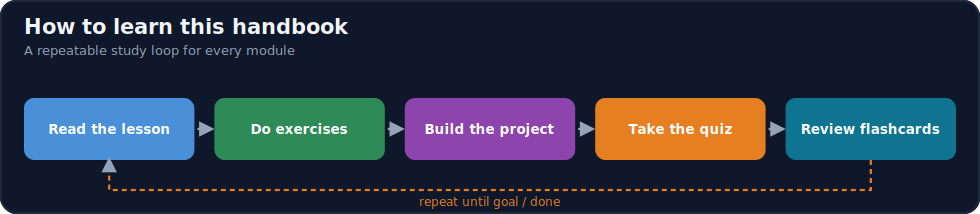
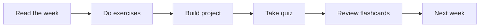

# Module 00 · Orientation

[⬅ docs](../README.md) · [🏠 docs](../README.md) · [🗺 Roadmap](../../ROADMAP.md) · [01 · Advanced Python ➡](../01-Advanced-Python/README.md)

> How to use this handbook, the AI-engineer mindset, and setting up a reproducible environment.

---

## Purpose

This module covers **Orientation**. How to use this handbook, the AI-engineer mindset, and setting up a reproducible environment. It fits into the overall program as described in the [Roadmap](../../ROADMAP.md) and [Curriculum](../../CURRICULUM.md).

## What you'll learn

- What an AI Engineer does and the systems they own
- How to study this handbook for long-term retention
- Setting up a reproducible Python + GPU environment
- The experiment and reproducibility mindset

## 📖 Lessons (start here)

> ✅ **This module's content is written.** Work through the lessons in order via the [lesson index](weeks/README.md).

| # | Lesson |
|---|---|
| 00.1 | [Introduction: The Vocabulary of the Field](weeks/00.1-introduction.md) |
| 00.2 | [The AI Engineering Landscape](weeks/00.2-ai-engineering-landscape.md) |
| 00.3 | [Career Roadmap & Roles](weeks/00.3-career-roadmap.md) |
| 00.4 | [Learning Strategy](weeks/00.4-learning-strategy.md) |
| 00.5 | [The Development Environment](weeks/00.5-development-environment.md) |
| 00.6 | [GitHub Repository Workflow](weeks/00.6-github-repository-workflow.md) |
| 00.7 | [Reading Technical Documentation](weeks/00.7-reading-technical-documentation.md) |
| 00.8 | [Reading Research Papers](weeks/00.8-reading-research-papers.md) |
| 00.9 | [The Daily Learning Workflow](weeks/00.9-learning-workflow.md) |
| 00.10 | [The AI Engineer Mindset](weeks/00.10-ai-engineer-mindset.md) |
| 00.11 | [Recommended Resources](weeks/00.11-recommended-resources.md) |
| 00.12 | [Summary, Cheat Sheet & Review](weeks/00.12-summary.md) |

**Companion artifacts:** [Exercises](exercises/README.md) · [Quiz](quizzes/quiz-01.md) · [Flashcards](flashcards/deck.md) · [Cheat sheet](cheat-sheets/orientation-cheatsheet.md)

## How this module is organized

Content is delivered week by week. Each module uses the same subfolders:

| Folder | Contents |
|---|---|
| [`weeks/`](weeks/) | Weekly lesson content, one file per week (`week-01.md`, `week-02.md`, …). |
| [`diagrams/`](diagrams/) | Mermaid sources and exported diagram assets for this module. |
| [`exercises/`](exercises/) | Hands-on practice problems with solutions. |
| [`projects/`](projects/) | Buildable projects that apply this module's skills. |
| [`quizzes/`](quizzes/) | Self-assessment question banks with answer keys. |
| [`flashcards/`](flashcards/) | Spaced-repetition Q/A decks for active recall. |
| [`cheat-sheets/`](cheat-sheets/) | One-page quick references for this module. |
| [`references/`](references/) | Paper summaries and deep-dive notes. |

## Suggested study flow

## File & naming conventions

| Item | Convention | Example |
|---|---|---|
| Weekly lesson | `week-NN.md` | `weeks/week-01.md` |
| Exercise | `exercise-NN.md` (+ `solution-NN.*`) | `exercises/exercise-01.md` |
| Project | `project-NN/` folder with `README.md` | `projects/project-01/` |
| Quiz | `quiz-NN.md` (+ `answers-NN.md`) | `quizzes/quiz-01.md` |
| Flashcards | `deck.md` | `flashcards/deck.md` |
| Diagram | `topic.mmd` / `topic.png` | `diagrams/attention.mmd` |

## Markdown conventions

This file follows the repository Markdown standards — see [CONTRIBUTING.md](../../CONTRIBUTING.md): one H1 per file, tables over prose, GitHub callouts (`> [!NOTE]`), fenced code blocks with a language, Mermaid for diagrams, and relative internal links.

## Related modules

- [Advanced Python](../01-Advanced-Python/README.md)
- [MLOps](../16-MLOps/README.md)

---

## Navigation

| Direction | Link |
|---|---|
| ⬆ Parent | [docs/](../README.md) |
| ⬅ Previous | [⬅ docs](../README.md) |
| ➡ Next | [01 · Advanced Python ➡](../01-Advanced-Python/README.md) |
| 🗺 Roadmap | [ROADMAP.md](../../ROADMAP.md) |
| 📚 Curriculum | [CURRICULUM.md](../../CURRICULUM.md) |
| 🏠 Repo root | [README.md](../../README.md) |
