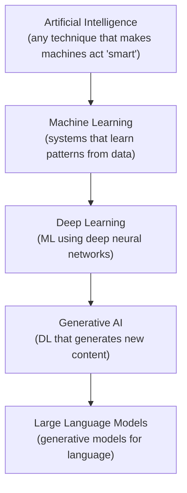
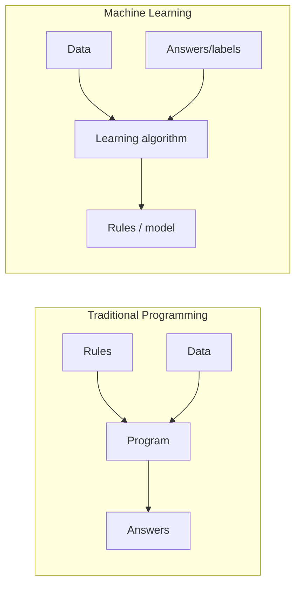
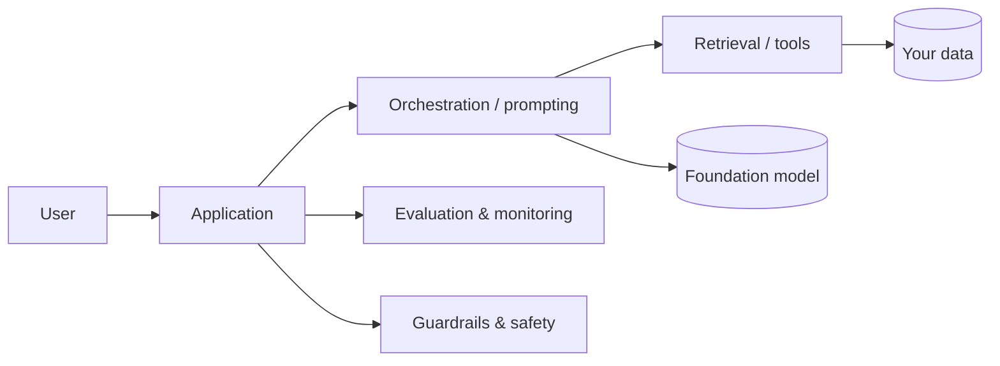

<!-- Module 00 · Lesson 1 — follows ../../../standards/. Orientation content: template sections not applicable to conceptual material (e.g. Security/Performance Considerations) are intentionally omitted. -->

# 00.1 · Introduction: The Vocabulary of the Field

[⬅ Module index](README.md) · [🏠 Module](../README.md) · [🗺 Roadmap](../../../ROADMAP.md) · [Next ➡](00.2-ai-engineering-landscape.md)

> Before you can build AI systems, you must be able to name their parts precisely. This lesson gives you the exact vocabulary the rest of the handbook depends on.

| | |
|---|---|
| **Module** | `00 · Orientation & Foundations` |
| **Lesson** | `00.1` |
| **Difficulty** | ⭐ |
| **Estimated study time** | 45 min read · 15 min reflection |
| **Status** | 🟢 stable |

---

## 1. Learning Objectives

By the end of this lesson you will be able to:

- [ ] Define **AI, AGI, ML, Deep Learning, Generative AI, LLMs,** and **AI Engineering** precisely, and use each term correctly.
- [ ] Explain how these fields **nest inside one another** rather than being separate silos.
- [ ] Distinguish **AI Engineering** from Machine Learning, Data Science, and Software Engineering.
- [ ] Avoid the most common vocabulary mistakes that mark someone as a beginner.

## 2. Prerequisites

None. This is the first lesson of the handbook. You only need curiosity and the willingness to be precise with language.

---

## 3. Why This Topic Exists

Every mature engineering field has a **shared, precise vocabulary**. When a civil engineer says "load-bearing wall," every other civil engineer knows exactly what is meant. AI is a young field, and its vocabulary is polluted by marketing, hype, and casual misuse. People say "AI" when they mean a linear regression, and "AGI" when they mean a good chatbot.

As an engineer, imprecise language leads to imprecise thinking, which leads to broken systems. If you cannot tell the difference between "machine learning" and "an LLM API call," you cannot reason about cost, latency, failure modes, or whether a problem even needs ML at all.

> [!IMPORTANT]
> Precision of language is not pedantry. It is the first tool of engineering. Vague words hide expensive mistakes.

## 4. Problems It Solves

| Problem caused by vague vocabulary | What precise vocabulary gives you |
|---|---|
| Reaching for ML when a rule or SQL query would do | The judgment to pick the simplest tool |
| Confusing "training a model" with "calling an API" | Correct cost and architecture decisions |
| Believing marketing claims about "AGI" | A grounded, skeptical engineering mindset |
| Miscommunicating with teammates | Shared, unambiguous design conversations |

---

## 5. The Core Definitions

Let's build the vocabulary from the outside in. The single most important mental model in this lesson is that **these fields are nested, like Russian dolls** — not separate, competing things.



> **Illustration placeholder** — `assets/images/ai-nesting-dolls.png`: a set of nested concentric circles (or literal Russian nesting dolls) labeled AI ⊃ ML ⊃ DL ⊃ Generative AI ⊃ LLMs, making the "subset of a subset" relationship visually obvious.

### Artificial Intelligence (AI)

**AI** is the broadest term: *any technique that enables a machine to perform tasks that would normally require human intelligence.* This includes things that have nothing to do with modern machine learning.

| Era / approach | Example | Is it "learning"? |
|---|---|---|
| Symbolic AI / expert systems | A hand-coded chess engine using rules | ❌ No |
| Search & planning | A* pathfinding in a game | ❌ No |
| Machine learning | A spam filter trained on emails | ✅ Yes |

> [!NOTE]
> A pile of `if/else` statements that plays tic-tac-toe perfectly is *technically* AI. This is why "AI" alone is almost useless as a technical term — it describes a goal (act intelligently), not a method.

### Artificial General Intelligence (AGI)

**AGI** is a hypothetical system with the ability to understand, learn, and apply knowledge across *any* domain at or above human level — the same flexible intelligence a person has, not a system narrowly trained for one task.

| | Narrow AI (what exists today) | AGI (hypothetical) |
|---|---|---|
| Scope | One task or domain | Any task, like a human |
| Example | An LLM, a chess engine, a fraud detector | Does not exist |
| Transfers skills across domains | Poorly | Fully |
| Status | Real, deployed everywhere | Research goal / speculation |

> [!WARNING]
> **Myth:** "Modern chatbots are basically AGI." **Reality:** Today's most capable models are extraordinary *narrow* systems. They are trained to predict language and are remarkably general *within language tasks*, but AGI — human-level competence across all domains, with genuine understanding and autonomous goal-setting — does not exist. As an engineer, treat AGI as a research topic, not a product you can ship.

### Machine Learning (ML)

**Machine Learning** is a subset of AI in which systems **learn patterns from data** instead of being explicitly programmed with rules. You don't write the logic; you show the system examples, and it infers the logic.

The defining shift:



- **Traditional programming:** you provide *rules + data* → the program produces *answers*.
- **Machine learning:** you provide *data + answers* → the algorithm produces the *rules* (the model).

That inversion is the whole idea. ML is worth using precisely when the rules are too complex, too numerous, or too subtle to write by hand (e.g., "is this email spam?").

### Deep Learning (DL)

**Deep Learning** is a subset of ML that uses **neural networks with many layers** ("deep" networks). These models learn *hierarchical representations* of data — early layers learn simple features, later layers combine them into complex concepts.

| | Classical ML | Deep Learning |
|---|---|---|
| Feature engineering | Mostly manual (you design the inputs) | Mostly learned (the network finds features) |
| Data hunger | Works with smaller datasets | Usually needs large datasets |
| Compute | Modest | High (often GPUs) |
| Best at | Tabular data, clear features | Images, audio, text, raw signals |
| Example | Gradient-boosted trees on spreadsheets | A Transformer reading text |

Deep learning is what made modern breakthroughs in vision, speech, and language possible — and it is the foundation under every LLM.

### Generative AI (GenAI)

**Generative AI** is deep learning that **produces new content** — text, images, audio, video, or code — rather than only classifying or predicting a number.

| Task type | Question it answers | Example |
|---|---|---|
| **Discriminative** | "Which category is this?" | Is this a cat or a dog? |
| **Generative** | "Produce something new" | Write a poem; draw a cat |

Generative AI is a *capability category*, not a specific architecture. An LLM writing an essay is generative; an image model producing a picture is generative.

### Large Language Models (LLMs)

An **LLM** is a large generative deep-learning model trained on vast amounts of text to **predict the next token** (roughly, the next chunk of text) given what came before. From that single, simple training objective — *predict what comes next* — emerges the ability to answer questions, write code, summarize, translate, and reason to a surprising degree.

Key facts to internalize now (you'll study each deeply later):

| Concept | One-line meaning | Studied in |
|---|---|---|
| **Token** | The unit of text the model reads/writes (≈ a word-piece) | [Module 10 · NLP](../../10-NLP/README.md) |
| **Next-token prediction** | The training objective behind LLMs | [Module 11 · LLMs](../../11-LLMs/README.md) |
| **Transformer** | The neural architecture LLMs are built on | [Module 10 · NLP](../../10-NLP/README.md) |
| **Context window** | How much text the model can consider at once | [Module 11 · LLMs](../../11-LLMs/README.md) |

> [!NOTE]
> "LLM" describes the *model*. When you call a hosted model over an API, you are doing **AI Engineering** — building a system *around* an LLM you did not train. That distinction is the heart of this handbook.

### AI Engineering

Here is the term this entire handbook is about.

> **AI Engineering** is the discipline of **designing, building, deploying, scaling, and maintaining production software systems that use AI models** — most often large foundation models you consume rather than train from scratch.

An AI Engineer is a **software engineer whose systems have a model at their core.** You spend far more time on data flow, APIs, retrieval, evaluation, reliability, cost, and user experience than on gradient descent. You must *understand* the models deeply — enough to choose them, prompt them, adapt them, and debug them — but your product is the **system**, not the model.



The model is one box. **Everything else in that diagram is your job.**

---

## 6. Comparing the Adjacent Roles

The words above describe *fields*. The words below describe *what people do*. This is where most beginners are fuzzy, so let's be sharp. (Roles get a full treatment in [Lesson 00.3](00.3-career-roadmap.md); here we only separate the concepts.)

| Discipline | Core question | Primary output | Model role |
|---|---|---|---|
| **Software Engineering** | "How do I build reliable software?" | Applications, services | None (usually) |
| **Data Science** | "What does the data tell us?" | Insights, analyses, reports | A means to an insight |
| **Machine Learning Engineering** | "How do I train & ship a model?" | Trained models + pipelines | The model *is* the product |
| **AI Engineering** | "How do I build products around foundation models?" | AI-powered systems | A component you orchestrate |

> [!TIP]
> A useful heuristic: **Data Scientists** produce *understanding*, **ML Engineers** produce *models*, **AI Engineers** produce *products*. All three overlap, and the boundaries are blurry in small teams — but the emphasis differs sharply.

### Where does AI Engineering sit relative to ML Engineering?

This is the most common point of confusion, so here is a focused comparison:

| | ML Engineer | AI Engineer |
|---|---|---|
| Typically trains models from scratch | Often | Rarely |
| Works with foundation models via API/weights | Sometimes | Almost always |
| Core skills | Math, training, MLOps for training | Systems, prompting, RAG, evaluation, product |
| Owns | The model and its training pipeline | The application and its behavior |
| Analogy | Builds the engine | Builds the car around an engine |

Neither is "better." They are different specializations, and this handbook deliberately gives you enough ML depth (Modules 06–09) to be a strong AI Engineer who *understands the engine*, not just drives it.

---

## 7. Mental Model: The Nesting Dolls + The Orchestra

Two images to keep for life:

1. **Nesting dolls** — AI ⊃ ML ⊃ DL ⊃ GenAI ⊃ LLMs. Every LLM is deep learning; every deep-learning system is ML; every ML system is AI. The reverse is not true.
2. **The orchestra** — a foundation model is a single, extraordinarily talented musician. **AI Engineering is conducting the orchestra**: choosing the players, writing the score (prompts), cueing entrances (tool calls), and making sure the concert (the product) is on time, in budget, and doesn't collapse when one player has a bad night.

> **Illustration placeholder** — `assets/images/ai-engineer-as-conductor.png`: an engineer as a conductor in front of an orchestra where the instruments are labeled "LLM," "Vector DB," "Tools," "Guardrails," "Cache," "Monitoring" — conveying orchestration over raw model-building.

---

## 8. Common Mistakes & Misconceptions

| Mistake | Why it's wrong | Say instead |
|---|---|---|
| Calling any automation "AI" | Dilutes the term; hides whether learning is involved | Name the method (rules, ML, LLM) |
| Using "ML" and "AI" interchangeably | ML is a *subset* of AI | Use the narrowest accurate term |
| Thinking AI Engineering = training models | Most AI Engineers rarely train from scratch | "Building systems around models" |
| Believing bigger model = always better | Cost, latency, and data quality often dominate | "Right-sized model for the job" |
| Treating LLM output as ground truth | Models can be confidently wrong (hallucinate) | "Generated, must be verified" |

> [!WARNING]
> **The single most expensive beginner mistake:** reaching for an LLM (or any ML) when a **simple rule, database query, or regular function** would solve the problem more cheaply and reliably. The most senior engineers reach for AI *last*, not first. Always ask: *does this problem actually need learning?*

---

## 9. Interview Questions

**Beginner**
1. Explain the relationship between AI, ML, and Deep Learning.
2. What is an LLM, in one sentence, and what is its core training objective?
3. How does machine learning differ from traditional programming?

**Intermediate**
1. How would you explain the difference between an ML Engineer and an AI Engineer to a non-technical manager?
2. Give an example of a problem that looks like it needs ML but doesn't. How would you solve it instead?
3. What does "generative" mean, and how does a generative task differ from a discriminative one?

**Advanced**
1. Why is "AGI" a problematic term to use in an engineering design discussion? What would you say instead?
2. An LLM produces a confident but wrong answer in production. Whose responsibility is that — the model's or the AI Engineer's? Defend your answer in system terms.

**System-design prompt**
- A product manager says "let's add AI to our search feature." Walk through how you'd decide *whether* AI is even the right tool, and *which kind*. — *Follow-ups:* How would you measure success? What's the simplest non-AI baseline?

---

## 10. Summary

| Key idea | Takeaway |
|---|---|
| The fields nest | AI ⊃ ML ⊃ DL ⊃ GenAI ⊃ LLMs |
| ML inverts programming | Data + answers → rules, instead of rules + data → answers |
| Deep learning learns features | Neural nets replace manual feature engineering |
| LLMs predict the next token | A simple objective yields broad language ability |
| AI Engineering builds *systems* | The model is one component you orchestrate |
| AGI is not a product | Treat it as research, not something to ship |
| Reach for AI last | Prefer the simplest tool that solves the problem |

## 11. Cheat Sheet

```text
AI      = any machine acting "smart" (rules OR learning)
ML      = learns patterns from data (data + answers -> rules)
DL      = ML with deep neural networks (learns features)
GenAI   = DL that creates new content
LLM     = generative model for language; predicts next token
AI Eng  = builds/deploys/maintains SYSTEMS around foundation models

Nesting:  AI ⊃ ML ⊃ DL ⊃ GenAI ⊃ LLM
Roles:    DS -> understanding | MLE -> models | AI Eng -> products
Golden rule: reach for AI LAST, not first.
```

## 12. Flashcards

> Add these to [`../flashcards/deck.md`](../flashcards/deck.md). Review per [LEARNING_STRATEGY.md](../../../LEARNING_STRATEGY.md).

- **Q:** How do AI, ML, DL, and LLMs relate? — **A:** They nest: AI ⊃ ML ⊃ DL ⊃ Generative AI ⊃ LLMs.
- **Q:** What inversion defines ML vs traditional programming? — **A:** Traditional: rules + data → answers. ML: data + answers → rules (the model).
- **Q:** What is an LLM's core training objective? — **A:** Next-token prediction over large text corpora.
- **Q:** In one line, what is AI Engineering? — **A:** Designing, building, deploying, and maintaining production systems built around AI models.
- **Q:** Difference between ML Engineer and AI Engineer? — **A:** MLE builds/trains the model (the engine); AI Engineer builds the product around foundation models (the car).
- **Q:** Why avoid "AGI" in design discussions? — **A:** It's hypothetical and undefined operationally; it hides real, shippable requirements.

## 13. Hands-on Exercises

> Full set in [`../exercises/`](../exercises/).

- [ ] **(⭐ Reflection)** In your own words, write a 5-sentence explanation of AI Engineering for a friend who is a web developer.
- [ ] **(⭐⭐ Classify)** For five real products you use (e.g., a search bar, a recommendation feed, autocomplete), guess whether each uses rules, classical ML, or an LLM — and why.
- [ ] **(⭐⭐ Judgment)** List three problems at a hypothetical company and decide, for each, whether it needs AI at all. Justify the simplest solution.

## 14. Mini Project

> Start your **learning journal** (you'll formalize this in [Lesson 00.9](00.9-learning-workflow.md)). Create `journal/00-orientation.md` in your own study repo and write a one-page "What I currently believe about AI Engineering" entry. You'll revisit and correct it at the end of the module — a built-in demonstration of how much you learned.

## 15. References

> Citation format: [reference standards](../../../standards/reference-standards.md). A fuller, annotated list is in [Lesson 00.11](00.11-recommended-resources.md).

- Russell, S. & Norvig, P. *Artificial Intelligence: A Modern Approach*. (Canonical definition of the AI field.)
- Chip Huyen. *Designing Machine Learning Systems* / writing on AI Engineering. (On the systems view.)

## 16. What's Next

You now have the vocabulary. Next, we assemble those words into a **map**: how Python, data, models, LLMs, RAG, agents, MLOps, and cloud connect into one production system.

➡️ **Next:** [00.2 · The AI Engineering Landscape](00.2-ai-engineering-landscape.md)

---

### 🔁 Revision checklist
- [ ] I can draw the AI→ML→DL→GenAI→LLM nesting from memory
- [ ] I can define AI Engineering in one sentence
- [ ] I can name the difference between an ML Engineer and an AI Engineer
- [ ] I created my learning journal and wrote the first entry
