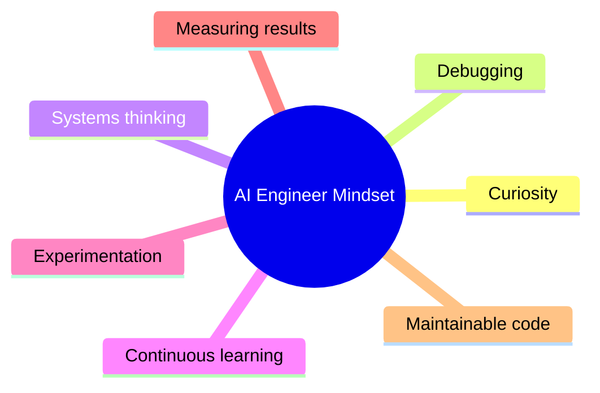
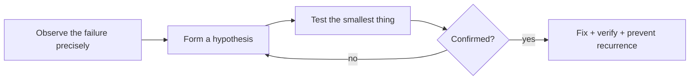
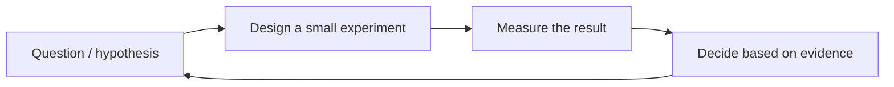
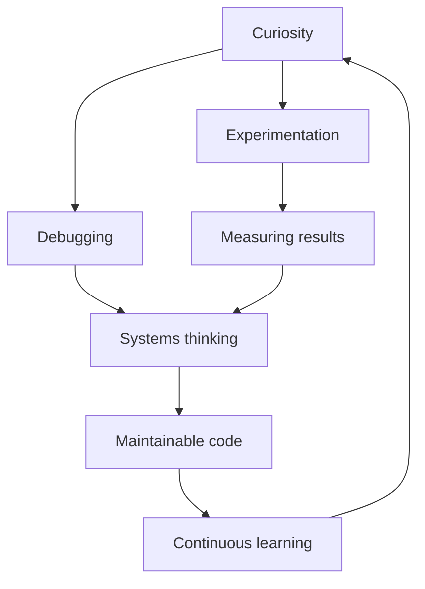

<!-- Module 00 · Lesson 10 — follows ../../../standards/. -->

# 00.10 · The AI Engineer Mindset

[⬅ 00.9 Learning Workflow](00.9-learning-workflow.md) · [🏠 Module](../README.md) · [🗺 Roadmap](../../../ROADMAP.md) · [Next ➡](00.11-recommended-resources.md)

> The habits of thought that separate an engineer who *builds and debugs* AI systems from someone who merely *uses* AI tools. Skills can be taught; mindset must be cultivated. This lesson plants the seeds.

| | |
|---|---|
| **Module** | `00 · Orientation & Foundations` |
| **Lesson** | `00.10` |
| **Difficulty** | ⭐ |
| **Estimated study time** | 45 min read |
| **Status** | 🟢 stable |

---

## 1. Learning Objectives

By the end of this lesson you will be able to:

- [ ] Describe the seven core mindsets: **curiosity, debugging, systems thinking, continuous learning, experimentation, measuring results, maintainable code.**
- [ ] Recognize the difference between a **tool user** and an **engineer**.
- [ ] Apply each mindset to concrete situations you'll face this year.

## 2. Prerequisites

- The whole module so far — this lesson synthesizes its attitude.

---

## 3. Why This Topic Exists

AI tools are now so capable that anyone can *use* them — ask a model a question, get an answer, ship a demo. This is wonderful, and it's also a trap: it lets people mistake *using* AI for *engineering* AI. When the demo breaks in production, the tool user is stuck; the engineer diagnoses and fixes it.

The difference isn't knowledge — it's **mindset**: how you approach problems, uncertainty, and failure. These habits can't be memorized from a table; they're cultivated through deliberate practice. This lesson makes them explicit so you can practice them consciously from day one.

> [!IMPORTANT]
> In the age of powerful AI tools, your value is not in *using* the tools — everyone can do that. It's in *engineering reliable systems* with them: understanding, debugging, measuring, and maintaining. Mindset is the moat.

## 4. Tool User vs Engineer

| Situation | Tool user | Engineer |
|---|---|---|
| The output is wrong | Shrugs, tries again | Investigates *why*, forms a hypothesis |
| It works in the demo | Ships it | Asks "will it work at scale, cheaply, safely?" |
| A new library appears | Waits for a tutorial | Reads the docs and evaluates it |
| Something is slow | Accepts it | Measures, profiles, optimizes |
| Code is messy but works | Moves on | Refactors for the next person |
| Faced with uncertainty | Guesses | Runs an experiment |

> **Illustration placeholder** — `assets/images/tool-user-vs-engineer.png`: a split illustration — one side a person pressing a single glowing "AI" button, the other side an engineer at a console with dials labeled "measure, debug, iterate, maintain" wired into a system.

---

## 5. The Seven Mindsets



### 1 · Curiosity — "How does this actually work?"

The engine of everything. When something works, the engineer isn't satisfied — they want to know *why*. When a model gives a great answer, curiosity asks: what made it good? Could it fail? What's happening inside?

> [!TIP]
> Cultivate curiosity by always asking one more "why." "The model got it right." *Why?* "Because the prompt had examples." *Why did examples help?* This ladder is how surface users become deep engineers.

### 2 · Debugging — "It's broken; let me find out why, methodically"

Debugging is the defining engineering skill. It's not random flailing — it's a **methodical hypothesis-test loop**. AI systems fail in new ways (a model hallucinates, a prompt regresses, a retrieval misses), and the engineer approaches each the same disciplined way.



> [!IMPORTANT]
> **Debugging is a skill you can get dramatically better at.** The best engineers aren't the ones who write bug-free code (no one does) — they're the ones who *locate and fix* problems fastest, calmly and systematically. You'll practice this deliberately in every module's debugging exercises.

### 3 · Systems Thinking — "How do the parts interact?"

An AI system is more than its model. Systems thinking means seeing the whole picture (recall the [architecture from 00.2](00.2-ai-engineering-landscape.md)) — how data flows, where latency accumulates, how one component's failure cascades. Problems often live *between* components, not inside them.

| Narrow thinking | Systems thinking |
|---|---|
| "The model is slow" | "Where in the request path is the time going?" |
| "Fix this function" | "How does this change ripple through the system?" |
| "It works in isolation" | "Does it work when everything runs together?" |

### 4 · Continuous Learning — "The field moves; so do I"

AI changes monthly. The half-life of specific tools is short; the engineer who stops learning is obsolete in a year. This isn't a burden — it's the job, and it's why you built doc- and paper-reading skills ([00.7](00.7-reading-technical-documentation.md), [00.8](00.8-reading-research-papers.md)).

> [!NOTE]
> Focus your continuous learning on **fundamentals and patterns**, not just the tool of the week. Fundamentals are stable; they let you absorb each new tool quickly. Chase understanding, and the tools take care of themselves.

### 5 · Experimentation — "I don't know; let me find out"

Engineers resolve uncertainty with **experiments**, not opinions. Will a different prompt work better? Will this chunk size improve retrieval? Don't argue — measure. This scientific attitude is central to AI, where behavior is empirical and often surprising.



> [!TIP]
> Make experiments **cheap and fast**. The engineer who can test ten ideas in an hour beats the one who theorizes for a week. Small, quick, measured experiments compound into fast progress.

### 6 · Measuring Results — "If you can't measure it, you can't improve it"

Opinions about quality are worthless without measurement. "The chatbot feels better" is not engineering; "accuracy on our eval set rose from 71% to 84%" is. AI systems especially demand measurement because their behavior is probabilistic and easy to fool yourself about.

| Without measurement | With measurement |
|---|---|
| "It seems good" | "It scores X on metric Y" |
| Guessing at improvements | Data-driven iteration |
| Silent regressions | Caught by evals |

> [!WARNING]
> It is dangerously easy to fool yourself with a few cherry-picked good outputs. Anecdotes are not evaluation. You'll build real evaluation discipline in [Module 19 · Production AI](../../19-Production-AI/README.md) — but adopt the *attitude* now: **claims about quality require measurement.**

### 7 · Writing Maintainable Code — "Code is read far more than it's written"

Your code will be read — by teammates, by future-you — many times more than it's written. Maintainable code (clear names, small functions, tests, docs) isn't a luxury; it's what lets a system evolve instead of ossify. AI code is still *code*, and the same discipline from [Module 01](../../01-Advanced-Python/README.md) applies.

> [!IMPORTANT]
> "It works" is the *floor*, not the ceiling. Working-but-unmaintainable code is a liability that slows every future change. Optimize for the next person to read it — that person is usually you, six months from now, having forgotten everything.

---

## 6. Bringing It Together

These seven aren't separate — they reinforce each other:



Curiosity sparks experiments; experiments demand measurement; measurement reveals system behavior; systems thinking guides debugging; maintainable code keeps it all evolvable; continuous learning renews it. Together they are what "thinking like an engineer" means.

---

## 7. Common Mistakes & Misconceptions

| Mistake | Reality |
|---|---|
| "The AI does the thinking, so I don't have to" | The AI is a component; *you* engineer the system |
| Debugging by random changes | Debugging is a methodical hypothesis-test loop |
| Trusting vibes over metrics | Quality claims require measurement |
| Learning only the hot new tool | Fundamentals transfer; tools expire |
| "It works, ship it" | Maintainability determines long-term velocity |
| Optimizing without measuring | You can't improve what you don't measure |

> [!WARNING]
> The subtlest trap in the AI era: letting the tool's fluency lull you into *not thinking*. A confident wrong answer from a model is more dangerous than an obvious error, precisely because it invites you to stop questioning. Stay curious and skeptical.

---

## 8. Interview Questions

**Beginner**
1. What separates a "tool user" from an "engineer" when an AI output is wrong?
2. Why is measurement essential when evaluating an AI system?

**Intermediate**
1. Walk through your debugging process for a system that "sometimes gives wrong answers."
2. Why should continuous learning focus on fundamentals rather than only new tools?

**Advanced**
1. Give an example of a problem that lives *between* components rather than inside one, and how systems thinking surfaces it.
2. How do you guard against fooling yourself that an AI system improved when it didn't?

**System-design / behavioral**
- Describe a time you debugged something hard (from any domain). Walk through your hypothesis-test process. — *Follow-ups:* How did you avoid random guessing? How did you confirm the fix?

---

## 9. Summary

| Mindset | One-line essence |
|---|---|
| Curiosity | Always ask one more "why" |
| Debugging | Methodical hypothesis → test → fix |
| Systems thinking | See the whole; problems live between parts |
| Continuous learning | The field moves; master fundamentals |
| Experimentation | Resolve uncertainty with cheap tests |
| Measuring results | Claims about quality need numbers |
| Maintainable code | Optimize for the next reader (future-you) |

## 10. Cheat Sheet

```text
TOOL USER: uses the AI, stuck when it breaks
ENGINEER : understands, debugs, measures, maintains the SYSTEM

7 MINDSETS:
  curiosity        -> ask one more "why"
  debugging        -> observe → hypothesize → test → fix → prevent
  systems thinking -> problems live BETWEEN components
  continuous learn -> fundamentals > tool of the week
  experimentation  -> measure, don't argue; make tests cheap
  measure results  -> "feels better" ≠ engineering; use metrics
  maintainable code-> read >> written; optimize for the next person
TRAP: a confident wrong answer invites you to stop thinking. Don't.
```

## 11. Flashcards

- **Q:** What distinguishes an engineer from a tool user when output is wrong? — **A:** The engineer methodically investigates *why* and fixes it; the tool user retries or gives up.
- **Q:** What is debugging, properly done? — **A:** A methodical loop: observe → hypothesize → test the smallest thing → fix → verify → prevent recurrence.
- **Q:** Why does systems thinking matter in AI? — **A:** Problems often live *between* components (data flow, latency, cascades), not inside a single part.
- **Q:** Why measure instead of trusting vibes? — **A:** AI output is probabilistic; a few cherry-picked good results easily fool you. Metrics make quality claims real.
- **Q:** Why write maintainable code even for AI systems? — **A:** Code is read far more than written; maintainability determines how fast the system can evolve.
- **Q:** The subtle AI-era trap? — **A:** A model's confident fluency tempting you to stop thinking; stay curious and skeptical.

## 12. Hands-on Exercises

> Full set in [`../exercises/`](../exercises/).

- [ ] **(⭐ Reflection)** For each of the seven mindsets, write one concrete way you'll practice it this year.
- [ ] **(⭐⭐ Debug)** Recall a past bug (any domain). Rewrite how you solved it as an explicit hypothesis-test loop. Where did you guess instead of test?
- [ ] **(⭐⭐ Skeptic)** Take a confident AI answer to a factual question and design a quick way to *verify* it. Did it hold up?

## 13. Mini Project

> Add `journal/mindset-commitments.md` to your study repo: the seven mindsets, and for each, one habit you'll build. Revisit it at each milestone (A–D) and grade yourself honestly.

## 14. References

- Andrew Ng and other practitioners' talks on the engineering (not just modeling) discipline of AI.
- *The Pragmatic Programmer* (Hunt & Thomas) — timeless engineering mindset, fully applicable to AI systems.

## 15. What's Next

You have the vocabulary, the map, the environment, the workflow, and the mindset. The last piece is knowing **where to keep learning** — a curated resource library to feed your continuous-learning habit.

➡️ **Next:** [00.11 · Recommended Resources](00.11-recommended-resources.md)

---

### 🔁 Revision checklist
- [ ] I can name and apply all seven mindsets
- [ ] I reframed a past bug as a hypothesis-test loop
- [ ] I practiced verifying (not trusting) an AI answer
- [ ] I wrote my mindset commitments

### 🔗 Spaced-repetition callback
> Recall [00.4's "illusion of competence"](00.4-learning-strategy.md): the *measuring results* mindset is the same idea applied to systems — just as rereading fools you into thinking you learned, cherry-picked outputs fool you into thinking your system works. Both are cured by honest measurement (recall / evals).
