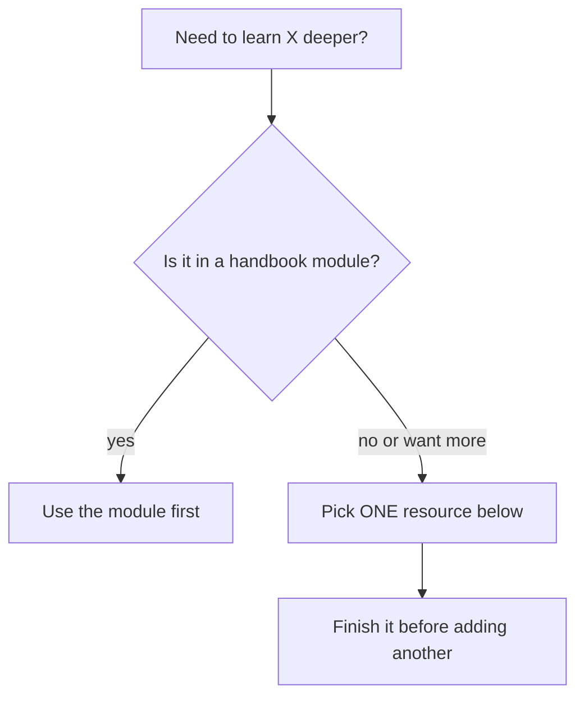

<!-- Module 00 · Lesson 11 — follows ../../../standards/ and ../../../standards/reference-standards.md. -->

# 00.11 · Recommended Resources

[⬅ 00.10 Mindset](00.10-ai-engineer-mindset.md) · [🏠 Module](../README.md) · [🗺 Roadmap](../../../ROADMAP.md) · [Next ➡](00.12-summary.md)

> A curated, annotated library to feed your continuous-learning habit — books, docs, courses, channels, repos, paper collections, blogs, and podcasts. Quality over quantity: every entry earns its place, with a note on *why* it's worth your time.

| | |
|---|---|
| **Module** | `00 · Orientation & Foundations` |
| **Lesson** | `00.11` |
| **Difficulty** | ⭐ |
| **Estimated study time** | 30 min read (then reference as needed) |
| **Status** | 🟢 stable |

---

## 1. Learning Objectives

By the end of this lesson you will be able to:

- [ ] Identify **high-quality resources** in each category and know *why* each is valuable.
- [ ] Choose resources that **complement** (not replace) this handbook.
- [ ] Avoid the **resource-hoarding trap** and use sources deliberately.

## 2. Prerequisites

- [00.7](00.7-reading-technical-documentation.md) & [00.8](00.8-reading-research-papers.md) — how to *use* these resources well.

---

## 3. How to Use This Lesson

> [!IMPORTANT]
> This handbook is **self-contained** — you can complete the whole program without any external resource. These are for going *deeper* on topics that grab you, and for staying current after you finish. Do **not** try to consume all of them.

> [!WARNING]
> **The resource-hoarding trap:** collecting courses, bookmarks, and "to-read" lists *feels* productive but is procrastination in disguise. Ten finished pages beat a thousand saved ones. Pick *one* resource per topic, finish it, move on. Depth over breadth.

A simple rule for choosing:



The master, continually-updated list lives in [RESOURCES.md](../../../RESOURCES.md); this lesson is the annotated orientation to it.

---

## 4. Books

> Books give **depth and durability** — the fundamentals that don't expire.

| Book | Why it's valuable | Best for |
|---|---|---|
| *Hands-On Machine Learning* — A. Géron | Practical, code-first tour of ML & DL | Modules 08–09 |
| *Deep Learning* — Goodfellow, Bengio, Courville | The rigorous DL reference (free online) | Deep dives |
| *Mathematics for Machine Learning* — Deisenroth et al. | Exactly the math you need, no more (free PDF) | Module 06 |
| *Designing Machine Learning Systems* — Chip Huyen | The systems/production view of ML | Modules 16–19 |
| *Designing Data-Intensive Applications* — M. Kleppmann | The bible of data systems & reliability | Module 18 |
| *The Pragmatic Programmer* — Hunt & Thomas | Timeless engineering mindset | Module 00's mindset |
| *Make It Stick* — Brown, Roediger, McDaniel | The science of durable learning | Your study method |

> [!TIP]
> Start with *Hands-On Machine Learning* as your practical companion, and keep *Mathematics for ML* nearby as a just-in-time reference. Don't read math books cover-to-cover — consult them when a concept appears.

---

## 5. Official Documentation

> Docs are the **primary source** — always current, always authoritative ([reference standards](../../../standards/reference-standards.md)).

| Docs | Why |
|---|---|
| Python official docs | The language's source of truth |
| NumPy / pandas | Core data tools (Modules 07–08) |
| PyTorch | The deep-learning framework you'll live in (Module 09+) |
| Hugging Face (`transformers`, `datasets`, `peft`) | The hub of open models & fine-tuning |
| Your chosen model provider's API docs | For building LLM apps (Modules 11–15) |
| Docker | Packaging for production (Module 16) |

> [!NOTE]
> When building AI applications, consult the **model provider's own docs** for current model IDs, capabilities, pricing, and limits — and default to the latest, most capable models. Never rely on memory or a blog for these; they change constantly.

---

## 6. Courses

> Courses give **structure and guided practice**. Pick one per area; finish it.

| Course | Why |
|---|---|
| Karpathy — *Neural Networks: Zero to Hero* | Build neural nets & a GPT from scratch — perfectly aligned with "implement before import" |
| fast.ai — *Practical Deep Learning for Coders* | Top-down, practical DL |
| Stanford **CS229** (Machine Learning) | Rigorous ML foundations |
| Stanford **CS224N** (NLP with Deep Learning) | Transformers & NLP depth |
| "Learning How to Learn" (Oakley/Sejnowski) | Meta-skill: how to learn effectively |

---

## 7. YouTube Channels

> Great for **intuition and visual explanation** of hard concepts.

| Channel | Why |
|---|---|
| **3Blue1Brown** | The best visual intuition for the math (linear algebra, calculus, neural nets) |
| **Andrej Karpathy** | From-scratch builds of neural nets and LLMs |
| **StatQuest** | Clear, friendly ML/stats explanations |
| **Two Minute Papers** | Fast awareness of new research (awareness, not depth) |

> [!TIP]
> Video is excellent for *first-pass intuition* but weak for retention — you can't do active recall while watching. Follow any video with the daily loop's build/revise steps ([00.9](00.9-learning-workflow.md)) or it won't stick.

---

## 8. GitHub Repositories

> Reading real code teaches what tutorials can't ([00.7](00.7-reading-technical-documentation.md) — read repos & tests).

| Repo type | Why valuable |
|---|---|
| `karpathy/nanoGPT` (minimal GPT) | A tiny, readable LLM implementation — study it after Module 10 |
| Awesome-* lists (curated topic indexes) | Fast maps of a subfield's key resources |
| The libraries you use (PyTorch, transformers) | Their source & tests are the ultimate reference |
| Well-run open-source AI projects | Models of structure, docs, and workflow (like this handbook) |

---

## 9. Research Paper Collections

> Where the ideas originate ([00.8](00.8-reading-research-papers.md) taught you how to read them).

| Source | Why |
|---|---|
| **arXiv** (`cs.CL`, `cs.LG`) | Preprints — where AI research appears first |
| **Papers with Code** | Papers linked to implementations & benchmarks |
| Curated "key papers" lists | Foundational reads without the firehose |

> [!NOTE]
> A short list of *foundational* papers (Transformer, GPT, RAG, LoRA, etc.) is mapped to the modules that need them in [RESOURCES.md](../../../RESOURCES.md#key-papers-read-as-you-reach-the-relevant-module). Read each when you reach its module, not before.

---

## 10. Blogs & Written Sources

> For **practitioner wisdom** and clear explanations of applied topics.

| Source type | Why |
|---|---|
| Provider engineering blogs | Authoritative applied guidance on their models/tools |
| Individual practitioner blogs (e.g., Chip Huyen, Lilian Weng) | Deep, well-researched explainers on LLMs & systems |
| Company ML/AI engineering blogs | Real production case studies |

> [!WARNING]
> Blogs vary wildly in quality and age fast. Cross-check technical claims against primary sources (docs/papers). A confident blog post is not a specification.

---

## 11. Podcasts

> For **breadth and staying current** during commutes/walks — passive, so pair with active study.

| Podcast type | Why |
|---|---|
| AI/ML engineering interview podcasts | Hear how practitioners think about real problems |
| Research-oriented podcasts | Broad awareness of directions in the field |

> [!TIP]
> Use podcasts for *awareness and motivation*, not primary learning — you can't take notes or do recall while listening. They're a supplement to the loop, never a replacement.

---

## 12. Choosing Well — A Summary Matrix

| Category | Gives you | Retention value | Use for |
|---|---|:--:|---|
| Books | Depth, durability | High | Fundamentals |
| Docs | Authoritative detail | High (as reference) | Building |
| Courses | Structure, practice | High | Guided learning |
| YouTube | Visual intuition | Low (passive) | First-pass intuition |
| Repos | Real-world code | Medium | Learning by reading |
| Papers | Original ideas | High (with notes) | Depth & currency |
| Blogs | Applied wisdom | Medium | Practical topics |
| Podcasts | Breadth, awareness | Low (passive) | Staying current |

> [!IMPORTANT]
> Weight your time toward **high-retention, active** sources (books, docs, courses, papers + the daily loop). Use passive sources (video, podcasts) as seasoning, not the meal.

---

## 13. Common Mistakes

| Mistake | Better |
|---|---|
| Hoarding resources you never finish | One per topic; finish before adding |
| Passive consuming (video/podcast) as main method | Active study + recall as the core |
| Trusting a blog over docs/papers | Primary sources win ties |
| Reading ahead of the module (e.g., papers too early) | Read each resource when its module needs it |
| Ignoring the handbook to chase courses | The handbook is your spine; resources are ribs |

---

## 14. Interview Questions

**Beginner**
1. Why are official docs preferred over blog posts for technical facts?
2. Which resource types are high-retention, and which are passive?

**Intermediate**
1. How would you decide, for a topic you want to learn deeper, which single resource to use?
2. Why is video a weak *primary* learning method despite feeling effective?

**Advanced**
1. You need current, authoritative information about a model's capabilities and pricing. Where do you look, and why not a tutorial?
2. Design a personal system to stay current in AI over five years without drowning in content.

---

## 15. Summary

| Key idea | Takeaway |
|---|---|
| Handbook is self-contained | Resources are for depth & currency, not the core |
| Depth over breadth | One resource per topic; finish it |
| Prefer active, high-retention | Books, docs, courses, papers + the loop |
| Passive = seasoning | Video & podcasts supplement, never replace |
| Primary sources win | Docs & papers over blogs for facts |

## 16. Cheat Sheet

```text
PICK: one resource per topic → FINISH → then add another (no hoarding)
ACTIVE (high retention): books · docs · courses · papers  → weight time here
PASSIVE (awareness only): YouTube · podcasts             → seasoning
FACTS: prefer docs/papers over blogs. Model IDs/pricing → provider docs (latest models).
TIMING: read each resource WHEN its module needs it, not ahead.
Master list → RESOURCES.md
```

## 17. Flashcards

- **Q:** What's the resource-hoarding trap? — **A:** Collecting resources you never finish; it feels productive but is procrastination. Finish one before adding another.
- **Q:** Which resource categories are high-retention? — **A:** Books, docs, courses, and papers (paired with active recall) — not passive video/podcasts.
- **Q:** Where do you get authoritative model capabilities/pricing? — **A:** The model provider's official docs — never a blog or memory; default to the latest models.
- **Q:** How should you use YouTube and podcasts? — **A:** For first-pass intuition and awareness — supplements to active study, not primary learning.
- **Q:** Is external material required to finish this handbook? — **A:** No — it's self-contained; resources are optional depth and currency.

## 18. Hands-on Exercises

> Full set in [`../exercises/`](../exercises/).

- [ ] **(⭐ Curate)** Choose exactly *one* resource per category you'll actually use this year. Add them to `notes/my-resources.md` with a one-line "why."
- [ ] **(⭐ Prune)** If you have a bloated bookmark/"to-read" list, cut it to five items. Notice the relief.
- [ ] **(⭐⭐ Verify)** Take one technical claim from a blog and confirm (or refute) it against the official docs.

## 19. Mini Project

> Create `notes/my-resources.md`: your chosen resource per category, why each, and which module it supports. This is *your* deliberately-small library — the antidote to hoarding.

## 20. References

- [RESOURCES.md](../../../RESOURCES.md) — the handbook's master, maintained resource list.
- [reference standards](../../../standards/reference-standards.md) — how to evaluate and cite sources.

## 21. What's Next

You now have everything: vocabulary, landscape, careers, strategy, environment, workflow, reading skills, mindset, and resources. The final lesson **consolidates the whole module** — cheat sheet, flashcards, interview prep, and your readiness check for Module 01.

➡️ **Next:** [00.12 · Summary, Cheat Sheet & Review](00.12-summary.md)

---

### 🔁 Revision checklist
- [ ] I chose one resource per category (no hoarding)
- [ ] I pruned any bloated reading list
- [ ] I verified a blog claim against primary docs
- [ ] I created `notes/my-resources.md`

### 🔗 Spaced-repetition callback
> Recall [00.10's "continuous learning" mindset](00.10-ai-engineer-mindset.md): these resources *feed* that mindset — but weighted toward fundamentals, exactly as that lesson urged. And [00.8's paper-reading](00.8-reading-research-papers.md) is how you'll use the paper collections here.
