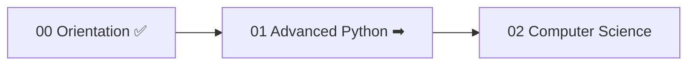

<!-- Module 00 · Lesson 12 — module consolidation. Follows ../../../standards/retention-standards.md. -->

# 00.12 · Summary, Cheat Sheet & Review

[⬅ 00.11 Resources](00.11-recommended-resources.md) · [🏠 Module](../README.md) · [🗺 Roadmap](../../../ROADMAP.md) · [Next module ➡](../../01-Advanced-Python/README.md)

> The consolidation lesson. One-page summary, master cheat sheet, full flashcard set, interview questions, revision checklist, glossary additions, and your readiness check for Module 01. Use this to *lock in* everything Module 00 taught.

| | |
|---|---|
| **Module** | `00 · Orientation & Foundations` |
| **Lesson** | `00.12` |
| **Difficulty** | ⭐ |
| **Estimated study time** | 45 min (active review) |
| **Status** | 🟢 stable |

---

## 1. One-Page Summary of Module 00

| Lesson | The one thing to remember |
|---|---|
| **00.1 Introduction** | Fields nest: AI ⊃ ML ⊃ DL ⊃ GenAI ⊃ LLMs. **AI Engineering builds *systems* around models.** |
| **00.2 Landscape** | AI Engineering is a **layered stack**; the model is one box, and engineering is all the others. |
| **00.3 Careers** | Optimize for the **work** and **trajectory**, not the title. AI Engineer is the widest on-ramp. |
| **00.4 Learning Strategy** | Foundations first · implement before import · production is first-class · recall beats rereading. |
| **00.5 Dev Environment** | **Isolation + declaration + reproducibility.** One venv per project; commit the lockfile, not `.venv/`. |
| **00.6 Repo Workflow** | Small daily commits (`type: why`), `main` always works, maintain docs/version/changelog as you go. |
| **00.7 Reading Docs** | Docs are a reference, not a book. Read by need; examples & tests over prose; stop when you can act. |
| **00.8 Reading Papers** | Three-pass method; extract the core contribution; chase plain-English intuition over every equation. |
| **00.9 Learning Workflow** | Daily loop: Study→Build→Revise→Quiz→Flashcards→Journal→Commit. Never skip retrieval; no zero days. |
| **00.10 Mindset** | Be an **engineer**, not a tool user: curiosity, debugging, systems thinking, measurement, maintainability. |
| **00.11 Resources** | Handbook is self-contained; one resource per topic, finished. Weight active/high-retention sources. |

> [!IMPORTANT]
> If you remember nothing else from Module 00, remember this: **You are becoming a software engineer whose systems have a model at their core. Build strong foundations, work in a reproducible and versioned way, learn actively with retrieval, and think like an engineer — measure, debug, and understand rather than merely use.**

---

## 2. Master Cheat Sheet

```text
═══════════════ MODULE 00 · ORIENTATION — MASTER CHEAT SHEET ═══════════════

VOCAB:   AI ⊃ ML ⊃ DL ⊃ GenAI ⊃ LLM
         AI Eng = design/build/deploy/maintain SYSTEMS around foundation models
         ML inverts programming: data + answers → rules (the model)

STACK:   Foundations → Data&Math → ML → DL → NLP/LLMs → Applied LLMs → Production → Mastery
         (the model is ONE box; engineering is everything around it)
FLOW:    Python→Data→ML→DL→LLM→RAG→Agents→MLOps→Cloud→Production

ROLES:   AI Eng (products ⭐) · ML Eng (models) · Data Scientist (insight)
         Applied AI · Research Eng · Prompt Eng (a skill) · MLOps Eng
         → optimize for WORK + TRAJECTORY, not titles

4 PRINCIPLES: foundations first · implement before import · production first-class
              · learning science (recall + spacing + projects)

ENVIRONMENT: isolation + declaration + reproducibility
             one venv/project · commit pyproject+lock, NOT .venv/
             ruff(format+lint) · mypy(types) · pytest(works) · Py 3.11+

GIT:     small daily commits `type(scope): why` · main always works
         branch for risk · SemVer MAJOR.MINOR.PATCH · maintain changelog
         NEVER commit secrets (.env is git-ignored; commit .env.example)

READ DOCS:  navigate by need · examples & tests > prose · match version · stop to act
READ PAPERS: 3 passes (gist/idea/reimplement) · core template · intuition > equations

DAILY LOOP: Study→Build→Revise→Quiz→Flashcards→Journal→Commit
            short on time? cut NEW STUDY, never retrieval. No zero days.

MINDSET: curiosity · debugging(hypothesis→test) · systems thinking
         continuous learning · experimentation · MEASURE results · maintainable code
         → be an ENGINEER, not a tool user

RESOURCES: self-contained handbook · one/topic, finish it · active > passive
═════════════════════════════════════════════════════════════════════════════
```

> A copy of this lives at [`../cheat-sheets/orientation-cheatsheet.md`](../cheat-sheets/orientation-cheatsheet.md) for quick reference.

---

## 3. Complete Flashcard Set

> The full deck is in [`../flashcards/deck.md`](../flashcards/deck.md). Review it on the [spaced-repetition schedule](../../../LEARNING_STRATEGY.md). A sample of the most important cards:

- **Q:** In one sentence, what is AI Engineering? — **A:** Designing, building, deploying, and maintaining production systems built around AI/foundation models.
- **Q:** How do AI, ML, DL, GenAI, and LLMs relate? — **A:** They nest: AI ⊃ ML ⊃ DL ⊃ Generative AI ⊃ LLMs.
- **Q:** The three properties of a good project environment? — **A:** Isolation, declaration, reproducibility.
- **Q:** What do you commit vs ignore for environments? — **A:** Commit `pyproject.toml` + lockfile; ignore `.venv/`.
- **Q:** The seven daily-loop steps? — **A:** Study, Build, Revise, Quiz, Flashcards, Journal, Commit.
- **Q:** Reading order for a research paper? — **A:** Abstract → intro's contribution paragraph → conclusion → figures → method → detailed results → appendix.
- **Q:** What separates an engineer from a tool user? — **A:** The engineer understands, debugs, measures, and maintains the system rather than just using it.

---

## 4. Module Interview Questions

A consolidated set spanning the module (per [interview standards](../../../standards/interview-standards.md)):

**Beginner**
1. Define AI, ML, DL, and LLM, and explain how they relate.
2. Why do we use one virtual environment per project?
3. What makes a good Git commit?

**Intermediate**
1. Explain the difference between an AI Engineer and an ML Engineer to a manager.
2. Walk through the three-pass method for reading a paper.
3. Why is production engineering treated as a first-class skill, not an afterthought?

**Advanced**
1. Trace a request through a RAG-based support assistant and identify where to add caching and guardrails.
2. How do you avoid fooling yourself that an AI system improved when it didn't?
3. Defend "implement before you import" to a teammate who thinks it wastes time.

**System-design prompt**
- A PM asks you to "add AI" to a product feature. Walk through deciding *whether* AI is the right tool, *which kind*, how you'd architect it, and how you'd measure success. — *Follow-ups:* Simplest non-AI baseline? Where do cost and latency come from? How do you keep it grounded and safe?

---

## 5. Revision Checklist — Module 00 Mastery

Tick each only if you can do it **from memory**:

- [ ] Draw the AI→ML→DL→GenAI→LLM nesting and define AI Engineering
- [ ] Draw the 8-layer stack and a full request-flow architecture
- [ ] Distinguish the seven roles by their core function
- [ ] State and justify the four curriculum principles
- [ ] Set up a reproducible, quality-tooled Python project from scratch
- [ ] Explain the Git workflow: commits, branches, SemVer, changelog
- [ ] Read docs by need and extract an API contract
- [ ] Run the three-pass method and fill the core-contribution template
- [ ] Run the seven-step daily loop and explain why each step matters
- [ ] Name the seven engineer mindsets and apply each
- [ ] Choose resources deliberately without hoarding

> [!TIP]
> Any box you *can't* tick is a signal, not a failure. Revisit that lesson's summary and flashcards before starting Module 01. Don't carry gaps forward — foundations compound.

---

## 6. Glossary Additions

These terms from Module 00 are added to the master [GLOSSARY.md](../../../GLOSSARY.md):

| Term | One-line definition |
|---|---|
| **AI Engineering** | Building/deploying/maintaining production systems around foundation models |
| **AGI** | Hypothetical human-level, general-purpose intelligence (not a shippable product) |
| **Generative AI** | Deep learning that produces new content (text, images, audio, code) |
| **Virtual environment** | An isolated, per-project Python interpreter + packages |
| **Reproducibility** | The ability to rebuild an identical environment/result from declared files |
| **Semantic Versioning (SemVer)** | `MAJOR.MINOR.PATCH` versioning convention |
| **Conventional Commits** | `type(scope): summary` commit-message standard |
| **Three-pass method** | Reading a paper in three increasingly deep passes |
| **Active recall** | Learning by retrieving from memory rather than rereading |
| **Spaced repetition** | Reviewing material at expanding intervals to fight forgetting |

---

## 7. Related Modules

| Module | How Module 00 connects to it |
|---|---|
| [01 · Advanced Python](../../01-Advanced-Python/README.md) | The first foundation you'll build; your dev environment is ready for it |
| [04 · Git](../../04-Git/README.md) | Deepens the version-control workflow introduced here |
| [16 · MLOps](../../16-MLOps/README.md) | Where the "production first-class" principle is fully realized |
| [19 · Production AI](../../19-Production-AI/README.md) | Where "measure results" becomes rigorous evaluation |
| [21 · Capstone](../../21-Capstone-Projects/README.md) | Where the whole mindset and workflow pay off |

---

## 8. Next Module Preview — 01 · Advanced Python

You know Python basics; Module 01 makes you a **professional Python engineer**. It covers:

| Coming in Module 01 | Why it matters for AI |
|---|---|
| Type hints & static checking | Keeps large AI codebases sane and bug-resistant |
| Dataclasses & Pydantic | Validating LLM inputs/outputs and structured data |
| Iterators & generators at scale | Streaming large datasets without exhausting memory |
| Async & concurrency | Efficiently orchestrating many model/API calls |
| Packaging & performance | Shipping and speeding up real AI code |



> [!IMPORTANT]
> Before starting Module 01, make sure your **study repository, dev environment, journal, and daily loop are actually set up** — not just read about. Module 00's real deliverable isn't knowledge; it's the *infrastructure and habits* that carry you through everything ahead.

---

## 9. Close the Loop — Revisit Your First Journal Entry

Remember the journal entry from [Lesson 00.1's mini-project](00.1-introduction.md#14-mini-project): *"What I currently believe about AI Engineering."* Re-read it now.

- What did you get wrong? What's sharper now?
- Update it with your corrected understanding.

> [!TIP]
> This before/after comparison is concrete proof of how much you learned in one module — and a preview of how much the next 21 will change you. Do this at the end of every module.

➡️ **Begin:** [Module 01 · Advanced Python](../../01-Advanced-Python/README.md)

---

### 🔁 Final revision checklist
- [ ] I completed the Module 00 mastery checklist (§5) from memory
- [ ] My repo, environment, journal, and daily loop are set up and running
- [ ] I added Module 00's terms to my flashcards
- [ ] I revisited and corrected my first journal entry
- [ ] I'm ready for Module 01

### 🔗 Spaced-repetition callback
> This entire lesson *is* spaced repetition — it retrieves every prior lesson (00.1–00.11) at once. That interleaved recall (from [00.9](00.9-learning-workflow.md)) is exactly the Saturday-review discipline that locks a module into long-term memory.
