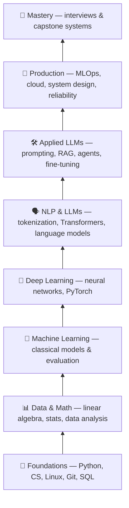
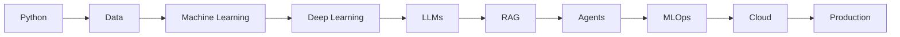
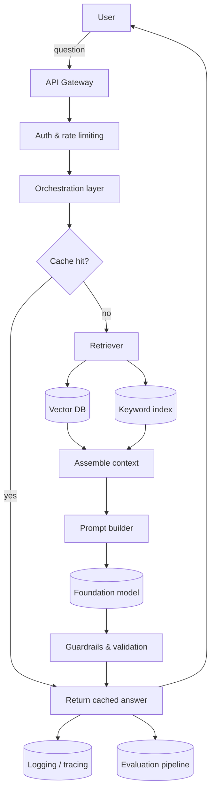
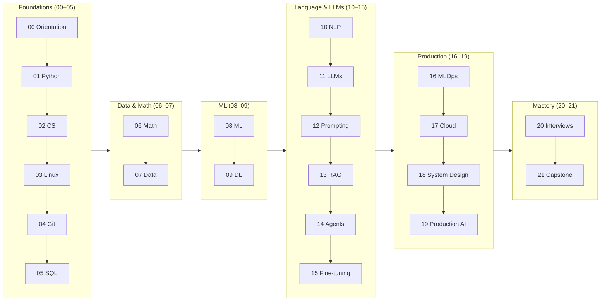

<!-- Module 00 · Lesson 2 — follows ../../../standards/. Conceptual orientation content. -->

# 00.2 · The AI Engineering Landscape

[⬅ 00.1 Introduction](00.1-introduction.md) · [🏠 Module](../README.md) · [🗺 Roadmap](../../../ROADMAP.md) · [Next ➡](00.3-career-roadmap.md)

> A map of the entire field: every layer you'll learn, how they stack, and how a real request flows through a production AI system.

| | |
|---|---|
| **Module** | `00 · Orientation & Foundations` |
| **Lesson** | `00.2` |
| **Difficulty** | ⭐ |
| **Estimated study time** | 45 min read |
| **Status** | 🟢 stable |

---

## 1. Learning Objectives

By the end of this lesson you will be able to:

- [ ] Describe the **full stack** of AI Engineering, from Python up to production.
- [ ] Explain **why each layer exists** and what breaks without it.
- [ ] Trace a **single user request** through a realistic AI system.
- [ ] See how this handbook's **22 modules map onto the landscape**.

## 2. Prerequisites

- [00.1 · Introduction](00.1-introduction.md) — the vocabulary of the field.

---

## 3. Why This Topic Exists

When you start learning AI, it feels like a chaotic pile of disconnected topics: NumPy, gradients, tokenizers, vector databases, Docker, GPUs, prompts. Beginners drown because they can't see how the pieces fit — so everything feels equally important and equally mysterious.

A **map** solves this. Once you see the landscape, every future lesson has a home. You'll know *why* you're learning linear algebra (to understand models), *why* you're learning SQL (to feed data to systems), and *why* you're learning Docker (to ship them). Nothing is disconnected.

> [!IMPORTANT]
> Keep this lesson bookmarked. Whenever a future topic feels random, come back and locate it on the map. Context is the antidote to overwhelm.

## 4. Problems It Solves

| Without a map | With a map |
|---|---|
| Topics feel random and equally weighted | Each topic has a clear purpose and place |
| You can't tell foundational from advanced | You learn in the right order |
| You memorize instead of understand | You reason about how systems fit together |
| You can't explain a system end-to-end | You can whiteboard the whole pipeline |

---

## 5. The Layered Stack

AI Engineering is best understood as a **layered stack**. Each layer rests on the ones below it. You cannot skip foundations — a beautiful RAG system built on shaky Python and no version control will collapse in production.



> **Illustration placeholder** — `assets/images/ai-engineering-stack.png`: a clean layered "pyramid" or "stack" graphic with the eight layers above, foundations at the bottom widest, mastery at the top, each layer annotated with its key tools.

### Why each layer exists

| Layer | Why it exists | What breaks without it |
|---|---|---|
| **Foundations** | Everything is code, run on machines, versioned, and fed by data | Fragile, unreproducible, unshippable work |
| **Data & Math** | Models are math; systems are fed by data | You can't reason about *why* models behave as they do |
| **Machine Learning** | The core ideas of learning, evaluation, and error | You misuse models and can't measure them |
| **Deep Learning** | The engine under every modern model | LLMs stay a black box you can't debug |
| **NLP & LLMs** | Language is the interface of modern AI | You use LLMs superstitiously, not skillfully |
| **Applied LLMs** | Turning models into useful behavior | Impressive demos that fail in the real world |
| **Production** | Real users, real scale, real money | Prototypes that never survive contact with reality |
| **Mastery** | Proving and applying it all | Knowledge that never becomes a career |

---

## 6. The Flow: Python → Data → ML → DL → LLMs → RAG → Agents → MLOps → Cloud → Production

The prompt for this module asked for exactly this flow, and it's worth drawing as a pipeline — because it *is* roughly the order in which capability builds on capability.



Read it as a sentence: *"You write **Python** to wrangle **data**, which trains **machine-learning** and **deep-learning** models, the most powerful of which are **LLMs**, which you ground with **RAG** and orchestrate as **agents**, then operate with **MLOps** on the **cloud** to reach **production**."*

That single sentence is the arc of this entire handbook.

---

## 7. Anatomy of a Production AI System

The layered stack is what you *learn*. A production system is what you *build*. Here's the anatomy of a realistic AI application — say, a customer-support assistant that answers questions from a company's documentation.



Notice how **little** of this diagram is "the model." The foundation model is one box. The craft of AI Engineering lives in every other box:

| Component | Responsibility | Handbook module |
|---|---|---|
| API gateway, auth, rate limiting | Safe, controlled access | [16 · MLOps](../../16-MLOps/README.md), [18 · System Design](../../18-System-Design/README.md) |
| Orchestration | Decide what happens in what order | [12 · Prompt Eng](../../12-Prompt-Engineering/README.md), [14 · Agents](../../14-AI-Agents/README.md) |
| Cache | Cut cost and latency | [19 · Production AI](../../19-Production-AI/README.md) |
| Retriever + vector DB | Ground answers in real data | [13 · RAG](../../13-RAG/README.md) |
| Prompt builder | Turn context into effective instructions | [12 · Prompt Eng](../../12-Prompt-Engineering/README.md) |
| Foundation model | Generate the answer | [11 · LLMs](../../11-LLMs/README.md) |
| Guardrails & validation | Keep output safe and well-formed | [19 · Production AI](../../19-Production-AI/README.md) |
| Logging, tracing, evaluation | Know if it actually works | [19 · Production AI](../../19-Production-AI/README.md) |

> [!TIP]
> When you interview for AI Engineering roles, being able to **draw this diagram from memory** and explain each box is worth more than reciting how attention works. Systems thinking is the differentiator.

---

## 8. The Tooling Landscape

Each layer has a characteristic toolset. You don't need to know these yet — this is a map, not a syllabus — but seeing them grouped removes the mystery.

| Layer | Representative tools & concepts |
|---|---|
| Foundations | Python, `uv`/`poetry`, Git, Bash, SQL, VS Code |
| Data & Math | NumPy, pandas, Matplotlib, linear algebra, statistics |
| Machine Learning | scikit-learn, cross-validation, metrics |
| Deep Learning | PyTorch, tensors, autograd, GPUs |
| NLP & LLMs | tokenizers, Transformers, Hugging Face, model APIs |
| Applied LLMs | prompt patterns, vector DBs, retrieval, LoRA/PEFT, agent loops |
| Production | Docker, FastAPI, CI/CD, cloud (compute/storage), observability |

> [!NOTE]
> Tools change; **concepts endure**. This handbook teaches tools as vehicles for concepts. When a library becomes obsolete in three years, your understanding of *why* it existed will let you learn its replacement in an afternoon.

---

## 9. How This Handbook Maps to the Landscape

Here's the payoff: the 22 modules are not arbitrary. They *are* the stack, in order.



> [!IMPORTANT]
> If a later module ever feels disconnected, return here. Every module is a floor in a building; you're constructing it bottom-up. See the full plan in [ROADMAP.md](../../../ROADMAP.md).

---

## 10. Common Mistakes & Misconceptions

| Mistake | Why it's wrong | Better |
|---|---|---|
| "I'll skip foundations and jump to LLMs" | LLM systems are still software; weak foundations = fragile systems | Build the base first |
| "The model is the hard part" | Orchestration, data, and ops are where most effort and bugs live | Respect the whole system |
| "I need to master every tool" | Tools are interchangeable; concepts aren't | Learn concepts; pick up tools on demand |
| "RAG and agents are separate from engineering" | They're *patterns* built with ordinary engineering | Treat them as system designs |

> [!WARNING]
> **The skip-ahead trap:** it is tempting to rush to the exciting layers (LLMs, agents) and skip Python, Git, and data. People who do this build impressive demos that **cannot be deployed, reproduced, debugged, or maintained** — the exact skills that make you employable. Depth compounds; shortcuts don't.

---

## 11. Interview Questions

**Beginner**
1. Draw the AI Engineering stack from foundations to production. What sits at each layer?
2. Why does an AI Engineer need to know Git and SQL?

**Intermediate**
1. Trace a user's question through a RAG-based support assistant, naming each component.
2. In a production AI system, what fraction of the work is "the model," and where does the rest of the effort go?

**Advanced**
1. You're asked to reduce the cost and latency of the system in §7 without hurting quality. Which components would you target first, and why?
2. Argue for or against the claim: "As models get better, the surrounding engineering matters less."

**System-design prompt**
- Design the high-level architecture for an AI assistant that answers questions over a company's internal documents. — *Follow-ups:* Where do you add caching? How do you keep answers grounded? How do you know it's working?

---

## 12. Summary

| Key idea | Takeaway |
|---|---|
| AI Engineering is layered | Foundations → Data/Math → ML → DL → LLMs → Applied → Production → Mastery |
| Each layer rests on those below | You can't skip foundations |
| The model is one box | Most of the work surrounds it |
| Concepts > tools | Tools change; understanding transfers |
| The 22 modules *are* the stack | Nothing is disconnected |

## 13. Cheat Sheet

```text
STACK (bottom → top):
Foundations (Py/CS/Linux/Git/SQL)
→ Data & Math
→ Machine Learning
→ Deep Learning
→ NLP & LLMs
→ Applied LLMs (prompt/RAG/agents/fine-tune)
→ Production (MLOps/cloud/system design)
→ Mastery (interviews/capstone)

FLOW: Python→Data→ML→DL→LLM→RAG→Agents→MLOps→Cloud→Production
SYSTEM: user → API → orchestration → retrieval → model → guardrails → response → logging/eval
RULE: the model is ONE box; engineering is all the others.
```

## 14. Flashcards

- **Q:** Name the layers of the AI Engineering stack, bottom to top. — **A:** Foundations → Data & Math → ML → DL → NLP & LLMs → Applied LLMs → Production → Mastery.
- **Q:** In a production AI system, what surrounds the model? — **A:** API/auth, orchestration, cache, retrieval, prompt building, guardrails, logging, evaluation.
- **Q:** Why learn concepts over tools? — **A:** Tools become obsolete; conceptual understanding transfers to their replacements.
- **Q:** What is the "skip-ahead trap"? — **A:** Rushing to LLMs/agents while skipping foundations, producing demos that can't be deployed or maintained.

## 15. Hands-on Exercises

> Full set in [`../exercises/`](../exercises/).

- [ ] **(⭐ Recall)** Redraw the layered stack from memory. Check it against §5.
- [ ] **(⭐⭐ Trace)** Pick any AI product you use and sketch its likely architecture using the §7 template.
- [ ] **(⭐⭐⭐ Map)** For each of the 22 modules, write one sentence on which layer it serves and why it comes when it does.

## 16. Mini Project

> Create `notes/landscape-map.md` in your study repo. Reproduce the full-system diagram from §7 in Mermaid, then annotate each box with (a) what it does and (b) which module teaches it. This becomes your personal reference for the rest of the year.

## 17. References

- Chip Huyen. *Designing Machine Learning Systems* (systems view of ML/AI in production).
- The handbook's own [ROADMAP.md](../../../ROADMAP.md) and [CURRICULUM.md](../../../CURRICULUM.md).

## 18. What's Next

You can see the field and the systems. Now let's talk about **you** — the roles you could grow into, what each does day to day, and how to aim your learning.

➡️ **Next:** [00.3 · Career Roadmap & Roles](00.3-career-roadmap.md)

---

### 🔁 Revision checklist
- [ ] I can draw the 8-layer stack from memory
- [ ] I can trace a request through the §7 system diagram
- [ ] I can place any module on the map
- [ ] I created `notes/landscape-map.md`

### 🔗 Spaced-repetition callback
> Recall the nesting dolls from [00.1](00.1-introduction.md): LLMs sit at the top of AI ⊃ ML ⊃ DL ⊃ GenAI ⊃ LLM — and here they sit in the middle of the *engineering* stack, because a model alone is not a product.
