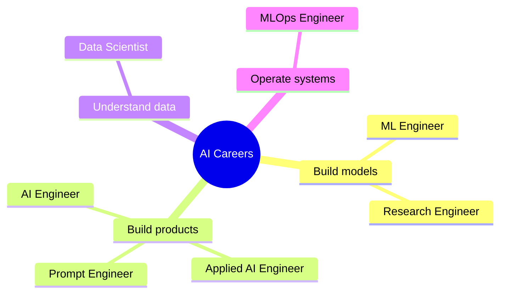
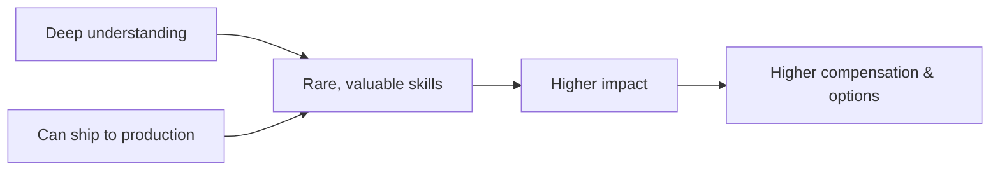
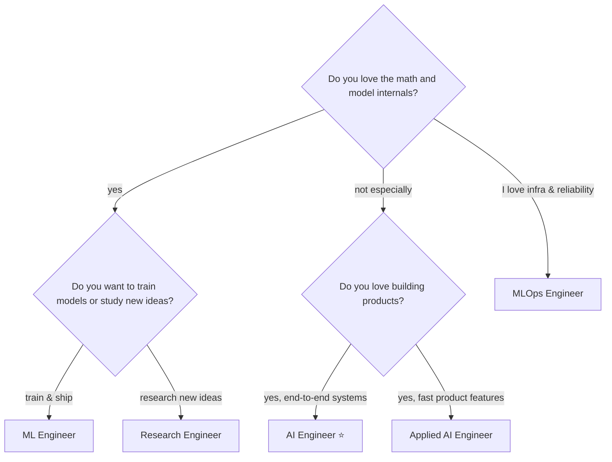

<!-- Module 00 · Lesson 3 — follows ../../../standards/. Conceptual orientation content. -->

# 00.3 · Career Roadmap & Roles

[⬅ 00.2 Landscape](00.2-ai-engineering-landscape.md) · [🏠 Module](../README.md) · [🗺 Roadmap](../../../ROADMAP.md) · [Next ➡](00.4-learning-strategy.md)

> The roles in and around AI, what they actually do all day, the skills they demand, and how careers grow. So you can aim your learning deliberately.

| | |
|---|---|
| **Module** | `00 · Orientation & Foundations` |
| **Lesson** | `00.3` |
| **Difficulty** | ⭐ |
| **Estimated study time** | 50 min read |
| **Status** | 🟢 stable |

---

## 1. Learning Objectives

By the end of this lesson you will be able to:

- [ ] Distinguish the major roles: **AI Engineer, ML Engineer, Data Scientist, Applied AI Engineer, Research Engineer, Prompt Engineer, MLOps Engineer.**
- [ ] Describe each role's **daily work, required skills, and growth path.**
- [ ] Reason about **compensation trends** at a conceptual level (drivers, not numbers).
- [ ] Choose a **target role** and see how this handbook prepares you for it.

## 2. Prerequisites

- [00.1 · Introduction](00.1-introduction.md) and [00.2 · Landscape](00.2-ai-engineering-landscape.md).

---

## 3. Why This Topic Exists

"AI" job titles are a mess. The same title means different things at different companies, and different titles sometimes mean the same job. A "Data Scientist" at a startup might build and deploy models end-to-end; at a bank, they might only write analyses in notebooks. If you don't understand the *underlying functions*, you'll apply for the wrong jobs, prepare for the wrong interviews, and undersell yourself.

This lesson cuts through the titles to the **functions** — the actual work — so you can navigate the market with clarity.

> [!IMPORTANT]
> Optimize for the **work you want to do**, not the title. Read job *descriptions*, not job *titles*. The descriptions reveal the real role.

## 4. Problems It Solves

| Confusion | Clarity this lesson gives |
|---|---|
| "Which role am I even training for?" | A function-based map of the field |
| "What skills do I actually need?" | Per-role skill profiles |
| "Where does this lead in 5 years?" | Concrete growth paths |
| "Am I a Data Scientist or an AI Engineer?" | The distinguishing questions to ask |

---

## 5. The Roles at a Glance



Think of the field as four *functions*: **build models**, **build products with models**, **understand data**, and **operate systems in production**. Every title is a blend of these.

---

## 6. Role-by-Role Deep Dive

### AI Engineer

> Builds production applications powered by foundation models. **This handbook's target role.**

| Aspect | Detail |
|---|---|
| **Daily work** | Designing system architecture, prompt/RAG/agent pipelines, integrating model APIs, writing application code, evaluating output quality, controlling cost/latency |
| **Core skills** | Strong software engineering, prompting, RAG, agents, evaluation, some ML/DL depth, cloud & deployment |
| **Rarely does** | Trains large models from scratch |
| **Growth path** | AI Engineer → Senior → Staff/Lead AI Engineer → AI Architect / Eng Manager |
| **Mindset** | "How do I turn this model into a reliable product?" |

### ML Engineer

> Builds, trains, and ships machine-learning models and their pipelines.

| Aspect | Detail |
|---|---|
| **Daily work** | Feature engineering, training pipelines, model tuning, deployment of *custom* models, retraining, data pipelines |
| **Core skills** | Strong ML/DL math, PyTorch/TensorFlow, MLOps, data engineering, software engineering |
| **Growth path** | ML Engineer → Senior → Staff ML Engineer → ML Architect / Applied Science lead |
| **Mindset** | "How do I train a model that performs and ships reliably?" |

### Data Scientist

> Extracts insight and builds models to answer business questions.

| Aspect | Detail |
|---|---|
| **Daily work** | Exploratory analysis, statistics, experiment design (A/B tests), dashboards, sometimes modeling |
| **Core skills** | Statistics, data analysis, SQL, communication, visualization, domain knowledge |
| **Growth path** | Data Scientist → Senior → Lead / Principal DS → Head of Data Science |
| **Mindset** | "What is the data telling us, and how confident are we?" |

### Applied AI Engineer

> A close cousin of the AI Engineer, often embedded in a product team, tilted even further toward shipping features fast.

| Aspect | Detail |
|---|---|
| **Daily work** | Rapidly integrating AI features into existing products, prototyping, prompt iteration, user-facing behavior |
| **Core skills** | Product sense, software engineering, prompting/RAG, pragmatism |
| **Distinction** | More product-embedded and iteration-focused than a platform-focused AI Engineer |
| **Mindset** | "How do I ship a valuable AI feature this sprint?" |

### Research Engineer

> Bridges research and engineering — implements, scales, and experiments with novel model ideas.

| Aspect | Detail |
|---|---|
| **Daily work** | Implementing papers, running experiments, building training infrastructure, collaborating with researchers |
| **Core skills** | Deep ML/DL theory, strong coding, distributed training, reading/writing papers |
| **Growth path** | Research Engineer → Senior RE → Research Scientist / Staff RE |
| **Mindset** | "Can we make this new idea work and scale?" |

### Prompt Engineer

> Specializes in eliciting reliable behavior from LLMs through prompt design, evaluation, and tooling.

| Aspect | Detail |
|---|---|
| **Daily work** | Designing/testing prompts, building evaluation sets, structured-output schemas, guardrails |
| **Core skills** | Deep LLM behavior knowledge, evaluation rigor, some engineering |
| **Reality check** | Increasingly a *skill* absorbed into the AI Engineer role rather than a standalone long-term title |
| **Mindset** | "How do I make the model do this *reliably*, not just once?" |

> [!NOTE]
> "Prompt Engineer" as a pure job title is consolidating into the broader AI Engineer role. Prompting is essential — but as **one skill among many** ([Module 12](../../12-Prompt-Engineering/README.md)), not usually a whole career by itself. Build breadth.

### MLOps Engineer

> Builds the infrastructure and automation that lets models and AI systems run reliably in production.

| Aspect | Detail |
|---|---|
| **Daily work** | CI/CD for models, deployment automation, monitoring, scaling, cost control, reliability |
| **Core skills** | DevOps/cloud, containers, orchestration, observability, some ML understanding |
| **Growth path** | MLOps Engineer → Senior → Platform/Infra Lead → Head of ML Platform |
| **Mindset** | "How do I make this run reliably, cheaply, and repeatably at scale?" |

---

## 7. Side-by-Side Comparison

| Role | Builds models? | Builds products? | Ops focus? | Math depth | This handbook prepares you? |
|---|:--:|:--:|:--:|:--:|:--:|
| **AI Engineer** | Rarely | ✅✅ | Some | Medium | ✅ **Primary target** |
| **ML Engineer** | ✅✅ | Some | Some | High | ✅ Strong (Modules 06–09, 16) |
| **Data Scientist** | Sometimes | Rarely | Rarely | High (stats) | ⚠️ Partial (Modules 05–08) |
| **Applied AI Engineer** | Rarely | ✅✅✅ | Some | Low–Med | ✅ Strong |
| **Research Engineer** | ✅✅ | Rarely | Some | Very high | ⚠️ Foundation only |
| **Prompt Engineer** | ❌ | ✅ | ❌ | Low | ✅ (as a skill, Module 12) |
| **MLOps Engineer** | ❌ | Some | ✅✅✅ | Low | ✅ (Modules 16–19) |

> [!TIP]
> The beauty of the AI Engineer path is its **optionality**: the same foundations let you pivot toward ML Engineering (go deeper on Modules 06–09), MLOps (Modules 16–19), or product (Applied AI). You are not locking a door — you're building a base.

---

## 8. Compensation Trends (Concepts, Not Numbers)

We deliberately avoid specific salary figures — they vary wildly by geography, company stage, and change yearly. Instead, understand the **drivers** of compensation, which are durable.

| Driver | Effect on comp | Why |
|---|---|---|
| **Scarcity of skill** | ⬆️ | Fewer people can do it → higher pay |
| **Production impact** | ⬆️ | Systems that touch revenue/users are valued |
| **Depth + breadth ("T-shaped")** | ⬆️ | Rare combination of one deep area + broad system skill |
| **Ability to ship, not just prototype** | ⬆️ | Demos are cheap; reliable production is rare |
| **Seniority & scope** | ⬆️ | Owning larger systems and mentoring others |
| **Pure title-chasing** | ↔️ | Titles without substance don't hold value |



> [!IMPORTANT]
> The most reliable way to increase your value is **boringly simple**: understand systems deeply and be able to *ship them reliably*. This handbook is built end-to-end around exactly that. Compensation follows demonstrated production impact.

---

## 9. Choosing Your Target (and Staying Flexible)

You don't need to commit forever, but a **direction** focuses your effort.



> [!NOTE]
> This is a *decision aid*, not destiny. Most successful engineers move between these roles over a career. The AI Engineer path (⭐) is the widest on-ramp, which is why this handbook centers it.

---

## 10. Common Mistakes & Misconceptions

| Mistake | Reality |
|---|---|
| Chasing the trendiest title | Titles shift; skills and impact endure |
| Believing you must have a PhD | Most AI Engineering roles do not require one |
| Thinking prompt engineering is a whole career | It's a vital *skill*, increasingly part of AI Engineering |
| Ignoring software engineering to "focus on AI" | AI roles *are* software roles with a model inside |
| Optimizing only for first-job comp | Optimize for *trajectory* — skills that compound |

> [!WARNING]
> Do not neglect **fundamental software engineering** (Modules 01–05) because it feels less glamorous than LLMs. In every one of these roles, the people who get promoted are the ones who can build reliable, maintainable systems. Glamour fades; reliability compounds.

---

## 11. Interview Questions

**Beginner**
1. What's the core difference between an AI Engineer and a Data Scientist?
2. Which role trains models from scratch most often?

**Intermediate**
1. A job is titled "Data Scientist" but the description is all about deploying model APIs and building pipelines. What role is it *really*, and how would you prepare?
2. Why is "Prompt Engineer" consolidating into the AI Engineer role?

**Advanced**
1. You want to maximize long-term career optionality. Which foundational skills give you the most pivots between roles, and why?
2. Argue what actually drives AI compensation over a decade, independent of hype cycles.

**System-design prompt (career framing)**
- Design your own 12-month learning plan to become an AI Engineer, given you already know Python. Which modules would you prioritize and why? — *Follow-ups:* Where would you go deeper to pivot toward ML Engineering? Toward MLOps?

---

## 12. Summary

| Key idea | Takeaway |
|---|---|
| Functions > titles | Read descriptions, not titles |
| Four functions | Build models · build products · understand data · operate systems |
| AI Engineer = widest on-ramp | Product-focused, model-orchestrating, high optionality |
| Comp follows impact | Deep understanding + ability to ship = durable value |
| Stay flexible | Foundations let you pivot between roles |

## 13. Cheat Sheet

```text
ROLES (function):
  AI Engineer        -> products around foundation models  ⭐ target
  ML Engineer        -> train & ship custom models
  Data Scientist     -> insight from data (stats, analysis)
  Applied AI Eng     -> ship AI product features fast
  Research Engineer  -> implement & scale new ideas
  Prompt Engineer    -> reliable LLM behavior (a SKILL now)
  MLOps Engineer     -> run AI reliably at scale

COMP DRIVERS: skill scarcity + production impact + ship-ability + scope
RULE: optimize for the WORK and for TRAJECTORY, not the title.
```

## 14. Flashcards

- **Q:** Which role does this handbook primarily target? — **A:** AI Engineer — building production products around foundation models.
- **Q:** ML Engineer vs AI Engineer in one line? — **A:** MLE trains/ships models; AI Engineer builds products around (often pre-trained) models.
- **Q:** Is "Prompt Engineer" a durable standalone career? — **A:** Increasingly no — it's becoming a core *skill* of the AI Engineer.
- **Q:** Name three durable drivers of AI compensation. — **A:** Skill scarcity, production impact, and the ability to ship reliably (plus scope/seniority).
- **Q:** Why read job descriptions over titles? — **A:** The same title means different work at different companies; descriptions reveal the real role.

## 15. Hands-on Exercises

> Full set in [`../exercises/`](../exercises/).

- [ ] **(⭐ Reflection)** Write which role you're aiming for and three reasons why.
- [ ] **(⭐⭐ Research)** Find three real job postings for "AI Engineer." List the skills they share. Compare against this handbook's modules.
- [ ] **(⭐⭐ Contrast)** Find one "Data Scientist" and one "ML Engineer" posting. Highlight the differences in daily responsibilities.

## 16. Mini Project

> Create `notes/career-target.md` in your study repo. Fill in: your target role, the top 5 skills it needs, which modules build them, and one measurable milestone (e.g., "ship a deployed RAG demo by Module 13"). Revisit it every phase.

## 17. References

- Public job boards (read real postings) — the most current signal on role expectations.
- Chip Huyen and other practitioners' writing on AI/ML careers and the systems mindset.

## 18. What's Next

You know the field, the systems, and the roles. Now we explain **why this specific curriculum is built the way it is** — so you trust the path enough to follow it fully.

➡️ **Next:** [00.4 · Learning Strategy](00.4-learning-strategy.md)

---

### 🔁 Revision checklist
- [ ] I can distinguish all seven roles by their core function
- [ ] I chose a target role and wrote down why
- [ ] I researched real postings and matched them to modules
- [ ] I created `notes/career-target.md`

### 🔗 Spaced-repetition callback
> Recall the [landscape stack](00.2-ai-engineering-landscape.md): notice how each role "lives" mostly at certain layers — ML Engineers at ML/DL, AI Engineers at Applied LLMs, MLOps Engineers at Production. Roles are *specializations within the same stack*.
