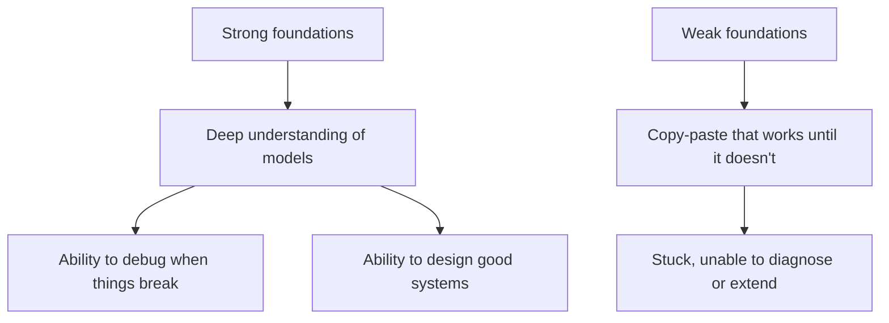
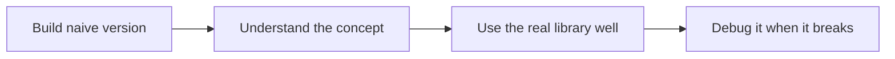
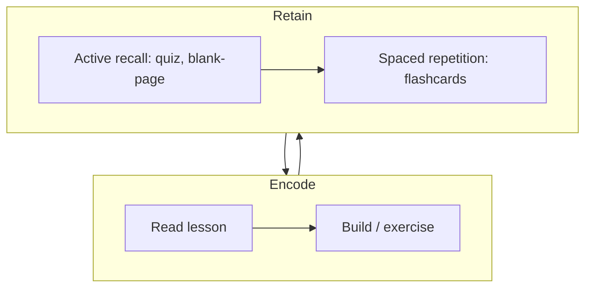
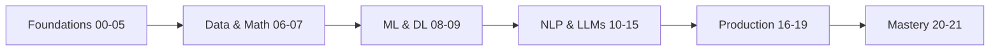

<!-- Module 00 · Lesson 4 — follows ../../../standards/. Conceptual orientation content. -->

# 00.4 · Learning Strategy

[⬅ 00.3 Careers](00.3-career-roadmap.md) · [🏠 Module](../README.md) · [🗺 Roadmap](../../../ROADMAP.md) · [Next ➡](00.5-development-environment.md)

> Why this curriculum is built the way it is — foundations first, implement-before-import, production always. Understand the design and you'll trust the path enough to finish it.

| | |
|---|---|
| **Module** | `00 · Orientation & Foundations` |
| **Lesson** | `00.4` |
| **Difficulty** | ⭐ |
| **Estimated study time** | 45 min read |
| **Status** | 🟢 stable |

---

## 1. Learning Objectives

By the end of this lesson you will be able to:

- [ ] Explain **why foundations come before LLMs** in this curriculum.
- [ ] Justify the **"implement before you import"** principle.
- [ ] Explain **why production engineering is a first-class topic**, not an afterthought.
- [ ] Describe the **learning science** (active recall, spaced repetition, project-based learning) baked into the handbook.

## 2. Prerequisites

- Lessons [00.1](00.1-introduction.md)–[00.3](00.3-career-roadmap.md).

---

## 3. Why This Topic Exists

Most people who set out to learn AI **quit or plateau**. Not because they lack intelligence, but because they follow a broken strategy: they binge tutorials, copy code they don't understand, skip fundamentals, and never build or revise. Six months later they can call an API but can't debug it, can't design a system, and can't pass an interview.

This handbook is engineered against those failure modes. But a plan only works if you *believe* in it. This lesson opens the hood so you can see *why* each design choice exists — and commit to the path with confidence.

> [!IMPORTANT]
> You are far more likely to finish a hard, year-long program if you understand and agree with its design. This lesson is that agreement.

## 4. Problems It Solves

| Common failure mode | How this curriculum's design prevents it |
|---|---|
| Tutorial hell (endless watching, no building) | Every lesson ends in exercises + a project |
| Forgetting most of what you read | Built-in spaced repetition & active recall |
| Shallow "API-caller" understanding | Implement-before-import; first-principles depth |
| Beautiful demos that never ship | Production engineering as a core phase |
| Losing motivation | Visible progress, milestones, and momentum |

---

## 5. Principle 1 — Foundations Before LLMs

The curriculum spends its first nine modules on Python, CS, Linux, Git, SQL, math, data, and classical ML/DL *before* reaching LLMs. This feels slow to beginners who want to build a chatbot on day one. Here's why it's right.



An LLM system is still **software**. When it breaks — and it will — you debug it with the same skills you'd use on any system: reading stack traces (Python), inspecting processes (Linux), diffing changes (Git), querying data (SQL), reasoning about the model (math/ML). Without those, an LLM is a black box that you can only pray to.

| If you skip… | You will be unable to… |
|---|---|
| Python depth | Write maintainable, performant AI code |
| Git | Collaborate, version experiments, recover from mistakes |
| SQL & data | Feed systems correctly; debug data problems |
| Math & ML | Understand *why* a model behaves as it does |
| Deep learning | Reason about LLM internals, cost, and limits |

> [!WARNING]
> The internet is full of "build an AI app in an afternoon" content. It's not wrong, but it's not *engineering*. It produces people who can assemble a demo and are helpless the moment it misbehaves. Foundations are what separate an engineer from a copy-paster.

---

## 6. Principle 2 — Implement Before You Import

For core concepts, this handbook has you **build a simple version from scratch before using the polished library**. You'll implement a tiny neural network's backpropagation by hand before using PyTorch's autograd; you'll write a naive retriever before reaching for a vector database.

Why deliberately "reinvent the wheel"?

| Reason | Payoff |
|---|---|
| **Demystification** | The library stops being magic; you know what it does |
| **Debugging power** | When the library misbehaves, you know where to look |
| **Transfer** | You can learn the *next* library instantly, because you know the concept |
| **Interviews** | "Implement X from scratch" is a classic interview task |
| **Judgment** | You learn *when* the library's defaults are wrong for you |



> [!NOTE]
> This is **not** anti-library. Professionals use libraries — you will too, heavily. The point is to use them *with understanding* instead of superstition. You build the wheel once, so you can trust and repair the ones you buy forever after.

> [!TIP]
> The rule of thumb: **implement once to learn, import forever to work.** After you've built backprop by hand once, you never do it again — you use PyTorch. But that one time changes how you see every training loop.

---

## 7. Principle 3 — Production Engineering Is First-Class

Many courses stop at "here's a model in a notebook." This handbook treats **deployment, scaling, evaluation, observability, cost, and safety** as core modules (16–19), not appendices. Because in the real world, *a model in a notebook has zero value*. Value is created only when a system reaches users, reliably, at acceptable cost.

| Notebook demo | Production system |
|---|---|
| Runs once, on your machine | Runs 24/7 for real users |
| No error handling | Handles failures gracefully |
| Ignores cost | Cost is a hard constraint |
| "It worked when I tried it" | Measured, monitored, evaluated |
| No security | Guardrails, auth, safety |

> [!IMPORTANT]
> The gap between "a model that works in a demo" and "a system that works in production" is where **most of the value and most of the jobs** are. This handbook lives in that gap on purpose.

---

## 8. Principle 4 — Learning Science, Built In

Depth is wasted if you forget it. So the handbook is engineered around three evidence-based techniques (detailed in [LEARNING_STRATEGY.md](../../../LEARNING_STRATEGY.md) and the [retention standards](../../../standards/retention-standards.md)).



| Technique | What it means | Where it lives |
|---|---|---|
| **Active recall** | Retrieving from memory, not rereading | Quizzes, flashcards, teach-back, blank-page recall |
| **Spaced repetition** | Reviewing at expanding intervals | Flashcard schedule, milestone audits |
| **Project-based learning** | Applying knowledge to real builds | Module projects & capstones |
| **Interleaving** | Mixing topics & callbacks to earlier lessons | Cross-module reviews, spaced callbacks |

> [!WARNING]
> **The illusion of competence:** rereading and highlighting *feel* productive but barely help retention. If you can't reconstruct a concept on a blank page, you haven't learned it — you've merely recognized it. Recognition is not recall.

---

## 9. Why the Order Is What It Is

Putting the principles together, the module order is deliberate:



- **Foundations first** — so everything after is buildable and debuggable.
- **Math & data before models** — so models aren't magic.
- **Classical ML/DL before LLMs** — so LLMs are understood, not worshipped.
- **Applied LLMs before production** — so you have something worth deploying.
- **Production before capstone** — so your capstone is real, not a toy.

Every dependency is shown in the [ROADMAP dependency graph](../../../ROADMAP.md#module-dependency-graph). Nothing is arbitrary.

---

## 10. How to Actually Use This (Non-Negotiables)

| Do | Don't |
|---|---|
| Build every project | Skip projects to "save time" |
| Do exercises before reading the solution | Read solutions first |
| Create and review flashcards | Rely on rereading |
| Keep a learning journal | Trust that you'll "remember" |
| Hit milestone audits from memory | Accumulate learning debt |
| Go at your own pace | Rush to feel productive |

> [!TIP]
> Slow is smooth, and smooth is fast. Depth early makes everything later faster, because you stop re-learning the same fundamentals over and over.

---

## 11. Common Mistakes & Misconceptions

| Mistake | Reality |
|---|---|
| "Foundations are boring, I'll skip to LLMs" | You'll hit a wall you can't debug |
| "Implementing from scratch is a waste — libraries exist" | You implement once to *understand*, then use libraries forever |
| "Deployment is someone else's job" | Shipping is where value and jobs are |
| "I read it, so I know it" | Recall, not recognition, proves learning |
| "Faster is better" | Retention and depth beat speed every time |

---

## 12. Interview Questions

**Beginner**
1. Why should an AI Engineer understand Git and SQL before building LLM apps?
2. What is active recall, and why does it beat rereading?

**Intermediate**
1. Defend the "implement before you import" principle to a skeptical teammate who says it wastes time.
2. Why is a model in a notebook worth almost nothing commercially?

**Advanced**
1. Design a personal spaced-repetition schedule for a year-long curriculum and justify the intervals.
2. A junior engineer can call an LLM API but can't debug why it's slow and expensive in production. What foundational gaps likely explain this, and how would you close them?

**System-design prompt (meta)**
- Design a learning system (not code) that maximizes a busy engineer's retention over 12 months. — *Follow-ups:* How do you prevent the illusion of competence? How do you measure real progress?

---

## 13. Summary

| Key idea | Takeaway |
|---|---|
| Foundations first | LLM systems are software; weak bases collapse |
| Implement before import | Build once to understand; use libraries forever |
| Production is first-class | Value lives in shipping, not demos |
| Learning science built in | Active recall + spaced repetition + projects |
| Order is deliberate | Every dependency is intentional |
| Recall > recognition | If you can't reconstruct it, you haven't learned it |

## 14. Cheat Sheet

```text
4 PRINCIPLES:
  1. Foundations before LLMs   (debuggable, buildable systems)
  2. Implement before import   (understand, then use libraries)
  3. Production is first-class  (value = shipping, not demos)
  4. Learning science built in  (recall + spacing + projects)

NON-NEGOTIABLES: build projects · do exercises first · flashcards ·
                 journal · pass milestones from memory · own pace
TRAP: illusion of competence — rereading ≠ learning. Recall proves it.
```

## 15. Flashcards

- **Q:** Why foundations before LLMs? — **A:** LLM systems are software; you debug and design them with foundational skills. Without them, the model is an unfixable black box.
- **Q:** What does "implement before import" mean and why? — **A:** Build a naive version of a concept before using the library, to understand it, debug it, and transfer to future tools.
- **Q:** Why is production engineering a core phase? — **A:** A model in a notebook has no value; value comes from reliable, affordable systems reaching users.
- **Q:** Name the three learning-science techniques baked in. — **A:** Active recall, spaced repetition, project-based learning (plus interleaving).
- **Q:** What is the "illusion of competence"? — **A:** Rereading/highlighting feels like learning but doesn't build recall; if you can't reproduce it blank-page, you don't know it.

## 16. Hands-on Exercises

> Full set in [`../exercises/`](../exercises/).

- [ ] **(⭐ Reflection)** Write about a past time you learned something shallowly and it failed you. How would these principles have changed it?
- [ ] **(⭐⭐ Plan)** Draft your personal weekly schedule (study/build/review) using [LEARNING_STRATEGY.md](../../../LEARNING_STRATEGY.md) as a base.
- [ ] **(⭐⭐ Commit)** Write a one-paragraph "learning contract" with yourself: your pace, your non-negotiables, and how you'll handle falling behind.

## 17. Mini Project

> Add `journal/learning-contract.md` to your study repo containing your schedule, non-negotiables, and spaced-repetition plan. Pin it. Re-read it at every milestone (A–D).

## 18. References

- [LEARNING_STRATEGY.md](../../../LEARNING_STRATEGY.md) — the handbook's retention system.
- Brown, Roediger, McDaniel. *Make It Stick* — the science of durable learning.
- Barbara Oakley. *A Mind for Numbers* / "Learning How to Learn" — practical learning techniques.

## 19. What's Next

You understand *why* the path is shaped this way. Now we get concrete and physical: **setting up the professional workstation** every future lesson assumes.

➡️ **Next:** [00.5 · The Development Environment](00.5-development-environment.md)

---

### 🔁 Revision checklist
- [ ] I can state and justify all four curriculum principles
- [ ] I understand active recall vs the illusion of competence
- [ ] I wrote my learning contract and weekly schedule
- [ ] I created `journal/learning-contract.md`

### 🔗 Spaced-repetition callback
> Recall the [roles lesson](00.3-career-roadmap.md): the reason "ability to ship reliably" drives compensation is the same reason this curriculum makes production first-class. Design choices here map directly to career value there.
