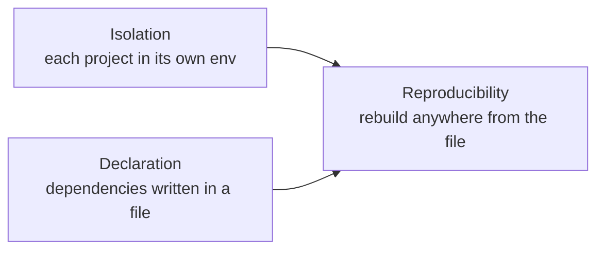
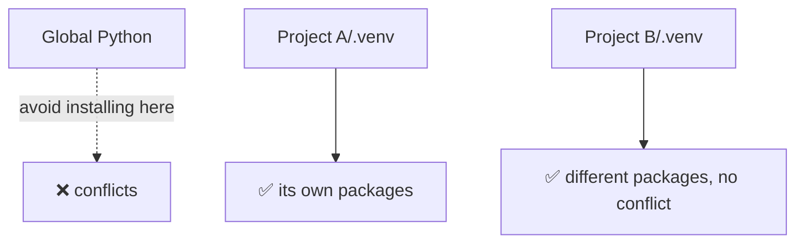
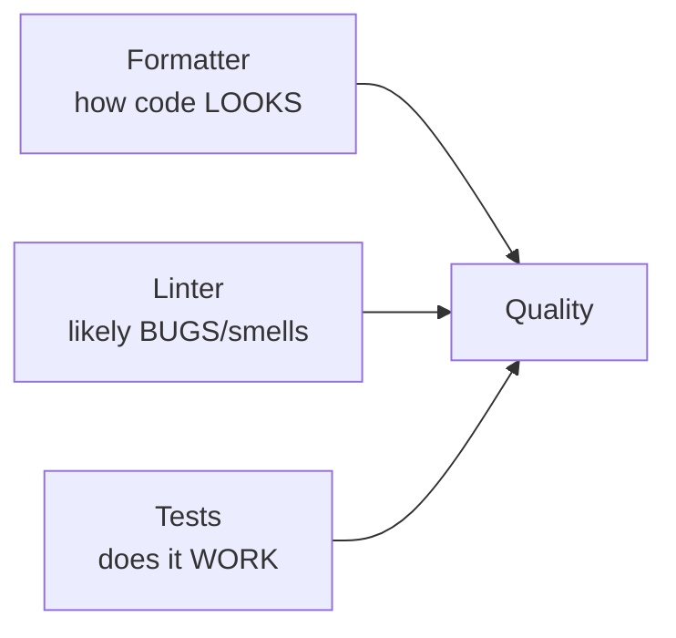

<!-- Module 00 · Lesson 5 — follows ../../../standards/. Setup content: code standards apply to all snippets. -->

# 00.5 · The Development Environment

[⬅ 00.4 Learning Strategy](00.4-learning-strategy.md) · [🏠 Module](../README.md) · [🗺 Roadmap](../../../ROADMAP.md) · [Next ➡](00.6-github-repository-workflow.md)

> Set up a professional AI Engineering workstation — and understand *why* each tool exists. A good environment removes friction so you can focus on learning, not fighting your machine.

| | |
|---|---|
| **Module** | `00 · Orientation & Foundations` |
| **Lesson** | `00.5` |
| **Difficulty** | ⭐⭐ |
| **Estimated study time** | 60 min read · 90 min setup |
| **Status** | 🟢 stable |

---

## 1. Learning Objectives

By the end of this lesson you will be able to:

- [ ] Explain **why virtual environments exist** and always work inside one.
- [ ] Choose and use a modern **package manager** (`uv` / `poetry`).
- [ ] Configure **VS Code** for Python and AI work with the right extensions.
- [ ] Set up **formatting, linting, and testing** and explain the role of each.
- [ ] Understand **Python versions** and how to manage more than one.
- [ ] Know how **GPUs and notebooks** fit into the workflow.

## 2. Prerequisites

- You know basic Python and can use a terminal at a beginner level.
- Lessons [00.1](00.1-introduction.md)–[00.4](00.4-learning-strategy.md).

---

## 3. Why This Topic Exists

Every hour you spend fighting a broken environment is an hour not spent learning. Worse, environment problems are **demoralizing** — nothing kills momentum like "it works on the tutorial but not on my machine." A deliberate, reproducible setup eliminates an entire category of suffering.

There's a second, deeper reason. **Reproducibility is a core engineering value.** If your project only runs on your laptop because of some undocumented global install, it is not real software. Learning to build isolated, declared, reproducible environments *is* learning to be an engineer.

> [!IMPORTANT]
> The goal is not just "a working setup." It's a setup you can **recreate from scratch on any machine** by reading a file. That property — reproducibility — is what makes software shippable.

## 4. Problems It Solves

| Problem | The right environment prevents it |
|---|---|
| "Works on my machine" | Declared, isolated, reproducible envs |
| Dependency conflicts between projects | One isolated environment per project |
| Mystery bugs from mismatched versions | Pinned, declared dependencies |
| Painful onboarding | `clone → install → run` in three commands |
| Slow, inconsistent code review | Auto-formatting + linting standardize everything |

---

## 5. The Mental Model: Isolation + Declaration + Reproducibility

Three ideas underpin everything in this lesson.



| Idea | What it means | Tool that provides it |
|---|---|---|
| **Isolation** | Project A's packages can't break project B | Virtual environments |
| **Declaration** | Your dependencies are written down, not implicit | `pyproject.toml` / lockfiles |
| **Reproducibility** | Anyone can rebuild the exact environment | Package manager + lockfile |

Hold these three words. Every tool below serves one of them.

---

## 6. Python Versions

Python evolves; different projects may need different versions. You should **never rely on the system Python** (the one your OS ships) for development — modifying it can break OS tools.

| Concept | Guidance |
|---|---|
| **Version** | Use **Python 3.11+** for this handbook (modern typing, performance) |
| **Never touch system Python** | Install your own; leave the OS copy alone |
| **Managing multiple versions** | Use a version manager (e.g. `pyenv`, or `uv`'s built-in Python management) |

```bash
# uv can install and manage Python versions for you
uv python install 3.12
uv python list
```

> [!NOTE]
> On Windows, prefer the official installer or `uv`'s managed Python. On macOS/Linux, avoid overwriting the system interpreter. When in doubt, let your package manager provide Python.

---

## 7. Virtual Environments — Isolation

A **virtual environment** is a self-contained folder holding a specific Python interpreter and that project's packages. Activate it, and `python`/`pip` refer to *that* environment, not the global one.



Why it matters: Project A might need `numpy==1.26` and Project B `numpy==2.1`. Without isolation, installing one breaks the other. With a venv per project, they coexist peacefully.

```bash
# The classic, always-available way (standard library):
python -m venv .venv
# activate — macOS/Linux:
source .venv/bin/activate
# activate — Windows (PowerShell):
.venv\Scripts\Activate.ps1
```

> [!WARNING]
> **Never `pip install` into your global/system Python** for project work. It's the #1 cause of "everything is broken and I don't know why." One environment per project, always. Add `.venv/` to `.gitignore` (already handled in this repo).

---

## 8. Package Managers — Declaration & Reproducibility

`pip` + `venv` works, but modern tools do more: they **resolve** compatible versions, **lock** exact versions, and **declare** everything in one file. Two strong choices:

| Tool | Strengths | Notes |
|---|---|---|
| **`uv`** | Extremely fast, manages Python versions too, modern | Recommended default for this handbook |
| **`poetry`** | Mature, great dependency resolution, widely used | Excellent alternative |

Both center on a **`pyproject.toml`** — the single source of truth for your project's metadata and dependencies — and a **lockfile** that pins exact versions for reproducibility.

```bash
# Using uv (recommended)
uv init my-ai-project      # create project + pyproject.toml
cd my-ai-project
uv add numpy pandas        # add deps (updates pyproject.toml + lockfile)
uv run python main.py      # run inside the managed environment
```

```toml
# pyproject.toml (excerpt) — your dependencies, declared
[project]
name = "my-ai-project"
version = "0.1.0"
requires-python = ">=3.11"
dependencies = [
    "numpy>=2.0",
    "pandas>=2.2",
]
```

> [!TIP]
> **Commit `pyproject.toml` and the lockfile; never commit `.venv/`.** The declaration + lock *is* your environment. Anyone can rebuild it with one command. That's reproducibility in action.

### Why not just `requirements.txt`?

`requirements.txt` still appears everywhere and is fine to know, but a bare list of packages without a lockfile doesn't pin *transitive* dependencies, so "the same" install can differ months apart. Prefer a manager with a lockfile; export to `requirements.txt` when a target needs it.

---

## 9. VS Code — Your Cockpit

You can use any editor, but **VS Code** is the de facto standard for Python/AI work: free, fast, huge extension ecosystem, excellent notebook and remote support.

### Recommended extensions

| Extension | Why |
|---|---|
| **Python** (Microsoft) | Core language support, environment selection |
| **Pylance** | Fast type-checking and IntelliSense |
| **Jupyter** | Run notebooks inside VS Code |
| **Ruff** | Lightning-fast linting + formatting |
| **GitLens** | Supercharged Git history/blame |
| **Even Better TOML** | Editing `pyproject.toml` |
| **Docker** | For later production modules |
| **Error Lens** | Inline error/warning display |

> [!NOTE]
> This repo can ship a `.vscode/extensions.json` recommending these (note `.gitignore` already whitelists it). Committing recommended extensions makes onboarding one click for anyone who clones your repo.

### Key configuration

- **Select the interpreter:** `Ctrl/Cmd+Shift+P → Python: Select Interpreter →` your project's `.venv`. This is the #1 thing beginners forget — VS Code must point at your project's environment, not the global one.
- **Format on save:** enable it so code is always clean.
- **Integrated terminal:** learn it; you'll live here.

```jsonc
// .vscode/settings.json (per-project, shareable)
{
  "python.defaultInterpreterPath": ".venv",
  "editor.formatOnSave": true,
  "[python]": {
    "editor.defaultFormatter": "charliermarsh.ruff",
    "editor.codeActionsOnSave": { "source.organizeImports": "explicit" }
  }
}
```

---

## 10. Formatting, Linting, and Testing

These three tools turn "code that runs" into "code a team can maintain." Learn what each does — they're different jobs.



| Tool type | Answers the question | Example | When it runs |
|---|---|---|---|
| **Formatter** | "Is the code styled consistently?" | `ruff format` / `black` | On save / pre-commit |
| **Linter** | "Are there likely bugs or bad patterns?" | `ruff check` | On save / CI |
| **Type checker** | "Do the types line up?" | `mypy` / Pylance | On save / CI |
| **Test runner** | "Does the code actually work?" | `pytest` | Locally / CI |

### Why each matters

- **Formatter** ends all style debates. No one argues about spaces vs tabs when a tool decides. Diffs stay small and about *logic*, not style.
- **Linter** catches unused variables, undefined names, risky patterns — bugs before they run.
- **Type checker** catches whole classes of errors ("you passed a `str` where an `int` was expected") without running the code.
- **Tests** are your safety net: they let you change code fearlessly, because you'll know instantly if you broke something.

```bash
uv add --dev ruff mypy pytest   # dev dependencies
ruff format .                    # auto-format
ruff check .                     # lint
mypy src                         # type-check
pytest                           # run tests
```

> [!TIP]
> Set these up **once per project** and wire them into a pre-commit hook and CI (you'll do this properly in [Module 16 · MLOps](../../16-MLOps/README.md)). The earlier they run, the cheaper the bug.

---

## 11. Terminal, Notebooks, and GPUs

### Terminal

You will spend a lot of time in the terminal — running scripts, managing environments, using Git. You'll go deep in [Module 03 · Linux](../../03-Linux/README.md). For now: get comfortable navigating directories, running commands, and reading output. On Windows, both PowerShell and a POSIX shell (Git Bash/WSL) are useful.

### Notebooks

**Jupyter notebooks** interleave code, output, and prose — perfect for **exploration, experiments, and learning**. This handbook uses them for interactive lessons ([notebooks/](../../../notebooks/)).

| Notebooks are great for | Notebooks are bad for |
|---|---|
| Exploration & prototyping | Production code |
| Teaching & visualization | Reusable modules |
| Quick experiments | Anything needing tests/versioning cleanly |

> [!WARNING]
> Notebooks encourage **hidden state** — cells run out of order can produce results you can't reproduce. Restart-and-run-all before trusting a notebook, and move any code you'll reuse into proper `.py` modules.

### GPUs

Deep learning ([Module 09](../../09-Deep-Learning/README.md)) and fine-tuning ([Module 15](../../15-Fine-Tuning/README.md)) benefit hugely from a **GPU** (massively parallel hardware that accelerates the matrix math models are made of). You do **not** need one for the early modules.

| Option | When to use |
|---|---|
| Your CPU | All early modules; small experiments |
| Free cloud GPUs (hosted notebooks) | Deep learning / fine-tuning without buying hardware |
| Local GPU | If you already have a capable one |
| Cloud GPU instances | Serious training (covered in [Module 17 · Cloud](../../17-Cloud/README.md)) |

> [!NOTE]
> Don't buy a GPU to start. Learn the foundations on your CPU and free cloud tiers. You'll know exactly what hardware you need by the time you need it.

---

## 12. The Reproducible-Setup Checklist

Your target state for **every** project from now on:

- [ ] A dedicated **virtual environment** (`.venv/`, git-ignored)
- [ ] Dependencies **declared** in `pyproject.toml` + a **lockfile** (committed)
- [ ] **Python 3.11+** selected as the interpreter in VS Code
- [ ] **Formatter + linter + type checker** configured (Ruff, mypy)
- [ ] A **test runner** (`pytest`) set up, even if tests are minimal at first
- [ ] Recommended **VS Code extensions** installed
- [ ] The project **rebuilds from scratch** with `clone → install → run`

> [!IMPORTANT]
> If you can delete `.venv/`, run one install command, and be back to a working state — you have reproducibility. That is the finish line for this lesson.

---

## 13. Common Mistakes & Debugging

| Symptom | Likely cause | Fix |
|---|---|---|
| `ModuleNotFoundError` for an installed package | VS Code using the wrong interpreter | Select the project's `.venv` interpreter |
| "Works for me, not for teammate" | Undeclared/global dependency | Declare everything in `pyproject.toml`; commit the lockfile |
| Package installs break another project | No isolation | One venv per project |
| Notebook gives different results each run | Hidden out-of-order state | Restart kernel + run all |
| Formatter/linter fight each other | Two style tools configured | Use one (Ruff does both) |
| `pip install` "permission denied" globally | Trying to write to system Python | Never install globally; use a venv |

> [!WARNING]
> **The most common beginner failure** is a mismatch between the terminal's active environment and VS Code's selected interpreter. If imports fail mysteriously, check *both* point at the same `.venv`.

---

## 14. Interview Questions

**Beginner**
1. What is a virtual environment and why do we use one per project?
2. What's the difference between a formatter and a linter?

**Intermediate**
1. Why commit `pyproject.toml` and the lockfile but not `.venv/`?
2. Explain reproducibility. How do you make a project rebuildable on any machine?

**Advanced**
1. A teammate reports a bug you can't reproduce locally. Walk through how environment differences could explain it and how you'd eliminate them.
2. When are notebooks the wrong tool, and how do you transition exploratory notebook code toward production?

**System-design prompt**
- Design an onboarding setup so a new engineer can go from `git clone` to a running project in under five minutes. — *Follow-ups:* How do you guarantee identical environments across the team? Where do formatting/linting/testing run?

---

## 15. Summary

| Key idea | Takeaway |
|---|---|
| Isolation | One virtual environment per project |
| Declaration | Dependencies in `pyproject.toml` + lockfile |
| Reproducibility | Rebuild anywhere from committed files |
| VS Code | Configure interpreter, format-on-save, extensions |
| Quality tools | Formatter (looks), linter (bugs), types (contracts), tests (works) |
| GPUs later | CPU + free cloud is enough to start |

## 16. Cheat Sheet

```text
ENV:   python -m venv .venv   ||   uv init / uv add / uv run
        one venv PER project | .venv is git-ignored
DECLARE: pyproject.toml + lockfile  (COMMIT these)
QUALITY: ruff format (style) · ruff check (lint) · mypy (types) · pytest (works)
VS CODE: select .venv interpreter · format on save · recommended extensions
PYTHON:  3.11+ · never touch system Python
GPU:     not needed early · use free cloud for DL/fine-tuning
GOLDEN:  delete .venv → one install → working = reproducible ✅
```

## 17. Flashcards

- **Q:** What three properties should every project environment have? — **A:** Isolation, declaration, reproducibility.
- **Q:** Why one virtual environment per project? — **A:** To prevent dependency conflicts between projects.
- **Q:** What do you commit vs ignore for environments? — **A:** Commit `pyproject.toml` + lockfile; ignore `.venv/`.
- **Q:** Formatter vs linter? — **A:** Formatter fixes how code *looks*; linter flags likely *bugs*/smells.
- **Q:** Most common beginner env bug? — **A:** VS Code interpreter ≠ the terminal's active `.venv`, causing import errors.
- **Q:** Do you need a GPU to start? — **A:** No — CPU and free cloud GPUs cover everything until deep learning/fine-tuning.

## 18. Hands-on Exercises

> Full set in [`../exercises/`](../exercises/).

- [ ] **(⭐ Setup)** Install `uv` (or poetry), create a project, add `numpy`, and run a script that prints its version — all inside a venv.
- [ ] **(⭐⭐ Reproduce)** Delete `.venv/`, reinstall from the lockfile, and confirm the project still runs. Document the exact commands.
- [ ] **(⭐⭐ Quality)** Add Ruff, mypy, and pytest to a project. Write one tiny function + one test and get all three green.
- [ ] **(⭐⭐⭐ Debug)** Deliberately select the wrong interpreter in VS Code, observe the import error, then fix it — and write down the diagnostic steps.

## 19. Mini Project

> Create your **study repository** (you'll formalize the workflow in [Lesson 00.6](00.6-github-repository-workflow.md)). Initialize it with `uv`, add Ruff/mypy/pytest, a `README.md`, a `.gitignore`, and a "hello AI" script. Confirm it rebuilds from scratch. This repo will hold your notes, journal, exercises, and projects for the whole year.

## 20. References

- Official docs for `uv`, `poetry`, `ruff`, `pytest`, and VS Code's Python extension — always prefer these (see [reference standards](../../../standards/reference-standards.md)).
- The handbook's own [.gitignore](../../../.gitignore) and [code standards](../../../standards/code-standards.md).

## 21. What's Next

Your machine is ready. Next: how to **organize and version your work** in Git and GitHub so it's professional, recoverable, and collaborative — the daily habits of a real engineer.

➡️ **Next:** [00.6 · GitHub Repository Workflow](00.6-github-repository-workflow.md)

---

### 🔁 Revision checklist
- [ ] I have a reproducible venv-based project I can rebuild from scratch
- [ ] Ruff, mypy, and pytest run green
- [ ] VS Code points at my project's `.venv`
- [ ] I created my study repository

### 🔗 Spaced-repetition callback
> Recall [Principle 2 "implement before import"](00.4-learning-strategy.md): reproducibility is the same value applied to *environments* — you understand and control your setup instead of trusting invisible global state.
