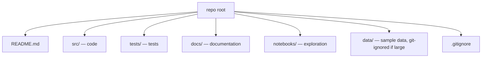
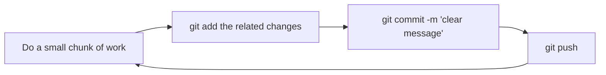
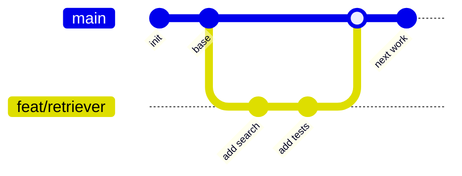
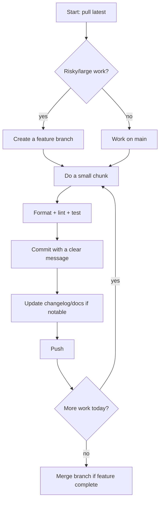

<!-- Module 00 · Lesson 6 — follows ../../../standards/. -->

# 00.6 · GitHub Repository Workflow

[⬅ 00.5 Dev Environment](00.5-development-environment.md) · [🏠 Module](../README.md) · [🗺 Roadmap](../../../ROADMAP.md) · [Next ➡](00.7-reading-technical-documentation.md)

> How to organize, commit, branch, and version your work like a professional. Good Git habits are the difference between "a folder of files" and an engineering project.

| | |
|---|---|
| **Module** | `00 · Orientation & Foundations` |
| **Lesson** | `00.6` |
| **Difficulty** | ⭐⭐ |
| **Estimated study time** | 55 min read · 45 min practice |
| **Status** | 🟢 stable |

---

## 1. Learning Objectives

By the end of this lesson you will be able to:

- [ ] Organize a repository with clear **folder structure and naming conventions**.
- [ ] Make **small, meaningful commits** with good messages, daily.
- [ ] Use a sensible **branch strategy** for solo and team work.
- [ ] Maintain **documentation, versioning, and a changelog** as you go.
- [ ] Explain *why* each habit matters, not just the commands.

> [!NOTE]
> This lesson is about **workflow and habits**. The deep mechanics of Git (the object model, rebasing, conflict resolution) are [Module 04 · Git](../../04-Git/README.md). Here we build the daily discipline you'll practice all year.

## 2. Prerequisites

- [00.5 · Development Environment](00.5-development-environment.md) — you have a study repo to apply this to.
- Basic Git familiarity (`add`, `commit`, `push`).

---

## 3. Why This Topic Exists

Your work has no value if it's lost, unrecoverable, or incomprehensible to others (including future-you). Git is the universal system engineers use to **track history, collaborate, and recover from mistakes**. GitHub is where that work lives, is shared, and becomes a **portfolio**.

Beyond safety, a clean repository is a **signal**. When you apply for jobs, employers look at your GitHub. A well-organized repo with thoughtful commits says "this person is a real engineer" louder than any bullet point on a résumé.

> [!IMPORTANT]
> Treat your study repository as a **public artifact from day one**. The habits you build here — clear structure, good commits, honest documentation — are exactly the habits senior engineers are judged on.

## 4. Problems It Solves

| Problem | Git/GitHub workflow prevents it |
|---|---|
| Lost work / "I overwrote it" | Full, recoverable history |
| "What did I change and why?" | Meaningful commit messages |
| Breaking working code while experimenting | Branches isolate risky work |
| Chaotic, unnavigable projects | Consistent structure & naming |
| No proof of your skills | A public portfolio of real work |

---

## 5. Repository Organization

A repository should be **navigable by a stranger in 60 seconds**. Anyone landing on it should immediately understand what it is and where things live. This handbook itself is the model — see [REPOSITORY_STRUCTURE.md](../../../REPOSITORY_STRUCTURE.md).

Principles:

| Principle | In practice |
|---|---|
| **Predictable structure** | Same layout across projects; folders sorted logically |
| **A README at the root** | What it is, how to run it, how it's organized |
| **A README in non-trivial folders** | Explain that folder's purpose |
| **Separate concerns** | `src/`, `tests/`, `docs/`, `data/`, `notebooks/` |
| **Zero-padded numbering** where order matters | `00-`, `01-` so folders sort correctly |



---

## 6. Naming Conventions

Consistency removes a thousand tiny decisions and makes everything greppable.

| Item | Convention | Example |
|---|---|---|
| Folders | `kebab-case` (or `NN-Title` where ordered) | `data-analysis/`, `00-orientation/` |
| Python files/modules | `snake_case.py` | `data_loader.py` |
| Python classes | `PascalCase` | `class VectorStore:` |
| Functions/variables | `snake_case` | `def load_data():` |
| Constants | `UPPER_SNAKE_CASE` | `MAX_TOKENS = 4096` |
| Branches | `type/short-description` | `feat/add-retriever` |
| Markdown docs | `kebab-case.md` | `reading-notes.md` |

> [!TIP]
> Pick a convention and **never think about it again**. The value of a convention is consistency, not correctness — a "worse" convention followed everywhere beats a "better" one applied randomly.

---

## 7. The Daily Commit Habit

The single most valuable Git habit for a learner: **commit small and often, every day you work.**



### What makes a good commit

| Good commit | Bad commit |
|---|---|
| One logical change | Ten unrelated changes lumped together |
| Clear message explaining *why* | `"stuff"`, `"fix"`, `"asdf"` |
| Leaves the repo in a working state | Half-broken, doesn't run |
| Small enough to review | 2,000 lines across 40 files |

### Commit message format

A widely used convention is **Conventional Commits**: `type(scope): summary`.

```text
feat(retriever): add cosine-similarity search over embeddings
fix(loader): handle empty CSV without crashing
docs(m00): add repository workflow lesson
refactor(api): extract prompt builder into its own module
test(loader): cover the empty-input case
chore(deps): pin numpy to 2.x
```

| Type | Use for |
|---|---|
| `feat` | A new feature |
| `fix` | A bug fix |
| `docs` | Documentation only |
| `refactor` | Code change that neither fixes a bug nor adds a feature |
| `test` | Adding or fixing tests |
| `chore` | Tooling, deps, housekeeping |

> [!IMPORTANT]
> Write commit messages for **future-you and your teammates**. Six months from now, `git log` should read like a clear story of how the project evolved. "why" belongs in the message; the "what" is already in the diff.

### For learners specifically

Commit your notes, exercises, and journal too — not just code. A daily "green square" of genuine work builds momentum and, on GitHub, visibly demonstrates consistency over a year.

---

## 8. Branch Strategy

A **branch** is an isolated line of work. You experiment on a branch without endangering your known-good code on the main branch.



| Context | Strategy |
|---|---|
| **Solo learning** | Work on `main` for small notes; use a branch for anything experimental you might abandon |
| **Projects** | One branch per feature/experiment (`feat/...`), merge when done |
| **Teams** | Branch → Pull Request → review → merge (covered in [Module 04](../../04-Git/README.md)) |

> [!TIP]
> The rule: **`main` should always work.** If you're about to do something risky or large, branch first. Branching is cheap; a broken `main` is expensive.

> [!WARNING]
> Avoid committing directly to a shared team `main`. Even solo, get comfortable with the branch → merge flow now — it's how all professional work happens, and interviewers assume you know it.

---

## 9. Documentation, Versioning, and Changelog

### Documentation

Documentation is not an afterthought — it's part of the deliverable. At minimum:

| Doc | Purpose |
|---|---|
| Root `README.md` | What the project is, how to install/run, how it's organized |
| Folder `README.md`s | What each area contains |
| Inline docstrings | What non-obvious functions do and why |
| `docs/` for depth | Architecture notes, decisions, guides |

Follow this handbook's [documentation standards](../../../standards/documentation-philosophy.md): tables over walls of text, callouts, diagrams, one clear H1.

### Versioning — Semantic Versioning (SemVer)

Software is versioned so people know what changed and whether an upgrade is safe. The standard is **SemVer**: `MAJOR.MINOR.PATCH`.

| Part | Increment when… | Example |
|---|---|---|
| **MAJOR** | You make incompatible/breaking changes | `1.4.2 → 2.0.0` |
| **MINOR** | You add functionality, backward-compatible | `1.4.2 → 1.5.0` |
| **PATCH** | You make backward-compatible bug fixes | `1.4.2 → 1.4.3` |

> [!NOTE]
> This handbook itself uses SemVer — see [CHANGELOG.md](../../../CHANGELOG.md) (`0.1.0`, `0.2.0`, …). Notice how the *minor* version bumped as we added the structure, then standards, then modules.

### Changelog

A **changelog** is a human-readable list of notable changes per version, so people (and future-you) can see the project's history at a glance. The common format is [Keep a Changelog](https://keepachangelog.com/): grouped under `Added`, `Changed`, `Fixed`, `Removed`.

```markdown
## [0.2.0] — 2026-07-08
### Added
- Retriever with cosine-similarity search
### Changed
- Loader now streams large files
### Fixed
- Crash on empty CSV input
```

> [!TIP]
> Update the changelog **in the same commit** as the change, while it's fresh. A changelog written from memory later is always incomplete.

---

## 10. Putting It Together — A Day in the Workflow



This loop — *pull, work in small chunks, quality-check, commit, document, push* — is the heartbeat of professional engineering. Do it daily and it becomes automatic.

---

## 11. Common Mistakes & Debugging

| Mistake | Consequence | Fix |
|---|---|---|
| Giant, rare commits | Impossible to review or revert cleanly | Commit small and often |
| Vague messages (`"fix"`) | Unusable history | `type(scope): why` format |
| Committing secrets/keys | Security incident | Use `.env` (git-ignored); never commit secrets |
| Committing `.venv/`, data dumps | Bloated, messy repo | `.gitignore` them |
| Working only on `main`, breaking it | Lost known-good state | Branch for risky work |
| No README | Repo is unusable by others | Write it first, keep it current |

> [!CAUTION]
> **Never commit secrets** (API keys, passwords, tokens). Once pushed, assume they're compromised even if you delete them later — history persists. Keep secrets in a git-ignored `.env`, and commit a `.env.example` with placeholder values instead.

---

## 12. Interview Questions

**Beginner**
1. Why do we commit small and often? What's wrong with one huge commit?
2. What is a branch, and why use one?

**Intermediate**
1. Explain SemVer. When would you bump MAJOR vs MINOR vs PATCH?
2. Your teammate accidentally committed an API key. What are the immediate steps and long-term fixes?

**Advanced**
1. Describe a branching workflow for a team of five shipping weekly. How do changes get reviewed and integrated safely?
2. How does a clean commit history make debugging (e.g., finding when a bug was introduced) easier?

**System-design prompt**
- Design a repository structure and contribution workflow for an open-source AI project expecting many contributors. — *Follow-ups:* How do you enforce quality (format/lint/test) before merge? How do you keep the changelog accurate?

---

## 13. Summary

| Key idea | Takeaway |
|---|---|
| Structure | Navigable in 60 seconds; README everywhere it helps |
| Naming | Pick conventions, apply them everywhere |
| Commits | Small, frequent, meaningful (`type: why`) |
| Branches | `main` always works; branch for risk |
| Docs/version/changelog | Maintain as you go, not at the end |
| Portfolio | Your repo is a public signal of your skill |

## 14. Cheat Sheet

```text
STRUCTURE: README at root · src/ tests/ docs/ · .gitignore · numbered folders
NAMING: snake_case files/funcs · PascalCase classes · UPPER consts · kebab folders
COMMIT: small + daily · type(scope): why
  feat | fix | docs | refactor | test | chore
BRANCH: main always works · feat/... for risky work · merge when done
VERSION (SemVer): MAJOR.break . MINOR.add . PATCH.fix
CHANGELOG: Added/Changed/Fixed/Removed · update in the same commit
NEVER commit: secrets, .venv/, large data  → .gitignore + .env(.example)
```

## 15. Flashcards

- **Q:** What makes a good commit? — **A:** One logical change, a clear "why" message, repo left working, small enough to review.
- **Q:** What does `type(scope): summary` look like for a bug fix? — **A:** e.g. `fix(loader): handle empty CSV without crashing`.
- **Q:** Explain SemVer parts. — **A:** MAJOR = breaking, MINOR = backward-compatible feature, PATCH = backward-compatible fix.
- **Q:** Why branch instead of working on main? — **A:** To isolate risky/large work so `main` always stays in a working state.
- **Q:** What must you never commit, and how do you avoid it? — **A:** Secrets, `.venv/`, large data — use `.gitignore` and a git-ignored `.env` (+ committed `.env.example`).
- **Q:** Why treat your study repo as public from day one? — **A:** It's a portfolio; clean structure + good commits signal real engineering skill to employers.

## 16. Hands-on Exercises

> Full set in [`../exercises/`](../exercises/).

- [ ] **(⭐ Setup)** Add a clear `README.md`, `.gitignore`, and folder structure to your study repo. Push it to GitHub.
- [ ] **(⭐⭐ Habit)** Make five small, well-messaged commits following Conventional Commits. Review your `git log` — does it tell a story?
- [ ] **(⭐⭐ Branch)** Create a `feat/notes` branch, add a note, and merge it back to `main`.
- [ ] **(⭐⭐ Changelog)** Add a `CHANGELOG.md` and record your last few changes under `Added`/`Changed`.
- [ ] **(⭐⭐⭐ Recover)** Practice recovery: make a change, commit, then use Git to view and revert it. Document the commands.

## 17. Mini Project

> Turn your study repo into a **portfolio-quality** project: a welcoming `README.md` (what it is, how it's organized, your learning goals), a sensible folder structure mirroring [REPOSITORY_STRUCTURE.md](../../../REPOSITORY_STRUCTURE.md), a `CHANGELOG.md`, and a `.gitignore`. Commit it all with clean messages. This repo grows with you for the next year.

## 18. References

- [Conventional Commits](https://www.conventionalcommits.org/) · [Semantic Versioning](https://semver.org/) · [Keep a Changelog](https://keepachangelog.com/) — the standards referenced above.
- Official Git and GitHub documentation (prefer these — [reference standards](../../../standards/reference-standards.md)).
- This handbook's [CONTRIBUTING.md](../../../CONTRIBUTING.md) and [REPOSITORY_STRUCTURE.md](../../../REPOSITORY_STRUCTURE.md) as living examples.

## 19. What's Next

Your work is now organized, versioned, and safe. Next, a meta-skill that accelerates everything else: **how to read technical documentation** efficiently, so you can learn any new tool or API on your own.

➡️ **Next:** [00.7 · Reading Technical Documentation](00.7-reading-technical-documentation.md)

---

### 🔁 Revision checklist
- [ ] My study repo is on GitHub with a clean README and structure
- [ ] I can write Conventional Commit messages fluently
- [ ] I can branch, merge, and revert
- [ ] I maintain a changelog as I work

### 🔗 Spaced-repetition callback
> Recall the [reproducibility goal from 00.5](00.5-development-environment.md): committing `pyproject.toml` + lockfile (and *not* `.venv/`) is exactly the Git workflow decision that makes an environment reproducible. Environment and version control are two halves of one habit.
