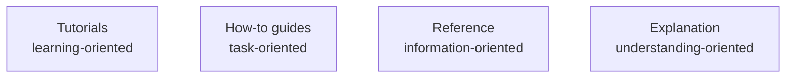
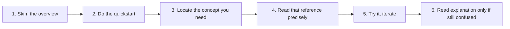
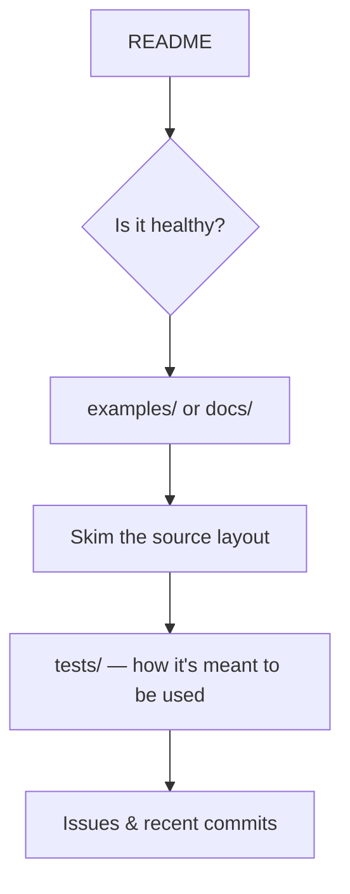
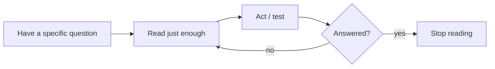

<!-- Module 00 · Lesson 7 — follows ../../../standards/. -->

# 00.7 · Reading Technical Documentation

[⬅ 00.6 Repo Workflow](00.6-github-repository-workflow.md) · [🏠 Module](../README.md) · [🗺 Roadmap](../../../ROADMAP.md) · [Next ➡](00.8-reading-research-papers.md)

> The self-sufficiency skill. Great engineers don't memorize APIs — they read documentation efficiently and find answers fast. This lesson makes you fluent at extracting signal from docs, API references, RFCs, and repositories.

| | |
|---|---|
| **Module** | `00 · Orientation & Foundations` |
| **Lesson** | `00.7` |
| **Difficulty** | ⭐⭐ |
| **Estimated study time** | 45 min read · 30 min practice |
| **Status** | 🟢 stable |

---

## 1. Learning Objectives

By the end of this lesson you will be able to:

- [ ] Read **official documentation** strategically instead of front-to-back.
- [ ] Navigate an **API reference** to find exactly what you need.
- [ ] Understand what **RFCs and specifications** are and how to skim them.
- [ ] Evaluate and learn from an unfamiliar **GitHub repository**.
- [ ] Extract **useful information fast** and know when to stop reading.

## 2. Prerequisites

- Lessons [00.1](00.1-introduction.md)–[00.6](00.6-github-repository-workflow.md).

---

## 3. Why This Topic Exists

The field moves too fast to memorize. New models, libraries, and APIs appear constantly. The engineers who thrive are not the ones who *know* the most — they're the ones who can *learn anything quickly* from primary sources. That skill is reading documentation.

Beginners fear documentation. They prefer tutorials that hold their hand, and they get stuck the moment they need something the tutorial didn't cover. **Documentation fluency is independence.** Once you can read docs comfortably, no tool can trap you.

> [!IMPORTANT]
> Tutorials teach you *a* path. Documentation teaches you *the territory*. Depend on tutorials to start, but graduate to docs to become self-sufficient — that transition is a milestone in becoming an engineer.

## 4. Problems It Solves

| Problem | Documentation fluency fixes it |
|---|---|
| "There's no tutorial for this" | You read the source of truth directly |
| Copy-pasted code you can't adapt | You understand the actual API |
| Outdated tutorial advice | Docs reflect the current version |
| Endless searching for answers | You go straight to the reference |
| Dependence on others | Self-sufficiency |

---

## 5. Documentation Is Not a Book — Read It Strategically

The #1 mistake is trying to read documentation linearly like a novel. Docs are a **reference structure**, meant to be navigated, not consumed cover-to-cover.

Most good documentation has four kinds of content (a useful framework known as *Diátaxis*):



| Type | Answers | Read it when |
|---|---|---|
| **Tutorial** | "How do I get started?" | You're brand new to the tool |
| **How-to guide** | "How do I accomplish task X?" | You have a specific goal |
| **Reference** | "What exactly does this function do?" | You need precise API details |
| **Explanation** | "Why does it work this way?" | You want deeper understanding |

> [!TIP]
> Match the doc type to your need. New to a library? Start at the **tutorial/quickstart**. Trying to do one thing? Find the **how-to**. Need a parameter's exact behavior? Go straight to the **reference**. Don't read reference material to "get started" — you'll drown.

---

## 6. A Strategic Reading Method

Here's a repeatable approach for any new tool's documentation:



1. **Skim the overview / landing page.** What is this tool *for*? What problem does it solve? (2 minutes.)
2. **Do the quickstart.** Get *something* running. This grounds everything else.
3. **Locate the concept you need.** Use the search box and the navigation, not linear reading.
4. **Read that reference precisely.** Parameters, return types, defaults, exceptions, examples.
5. **Try it and iterate.** Reading without doing doesn't stick; run it, break it, adjust.
6. **Read the explanation** only if behavior still surprises you.

> [!NOTE]
> Notice the loop is **doing-centric**. You read the *minimum* to make progress, then act. This is far faster than trying to "understand everything first."

---

## 7. Reading an API Reference

An **API reference** documents each function/class: what it takes, what it returns, and how it behaves. Learn to read the anatomy:

| Element | What to look for |
|---|---|
| **Signature** | Parameter names, types, and **defaults** |
| **Required vs optional** | Which args you *must* provide |
| **Return type** | What you get back (and its shape) |
| **Raises / errors** | What exceptions to handle |
| **Examples** | Usually the fastest way to understand usage |
| **Version notes** | "Added in", "deprecated since" — version matters |

```python
# Reading a signature — everything you need is here:
def create(
    model: str,                 # required
    messages: list[dict],       # required — the shape matters
    temperature: float = 1.0,   # optional, default shown
    max_tokens: int | None = None,
) -> Response:                  # return type
    ...
```

> [!TIP]
> **Read the examples first, the prose second.** A single worked example usually communicates an API faster than three paragraphs. Then use the reference to understand the parts of the example you don't recognize.

> [!WARNING]
> Always confirm you're reading the docs for the **version you're using**. APIs change between versions; the most common source of "the docs are wrong" is reading docs for a different version than you installed.

---

## 8. RFCs and Specifications

An **RFC** ("Request for Comments") or **specification** is a formal, authoritative document defining how something works — a protocol, a language feature, a data format (e.g., HTTP, JSON). They are dense and precise, written for implementers.

| You don't need to… | You do need to… |
|---|---|
| Read an RFC cover to cover | Know they exist as the ultimate source of truth |
| Memorize them | Skim to resolve a precise ambiguity |
| Understand every formal clause | Find the specific section that answers your question |

How to skim one: use the **table of contents**, jump to the relevant section, and read defensively — RFCs use precise words like **MUST**, **SHOULD**, **MAY** that carry exact meaning.

> [!NOTE]
> As an AI Engineer you'll rarely read RFCs daily, but knowing how to consult one (e.g., the exact rules of JSON, or an HTTP status code's meaning) resolves arguments and bugs definitively. The spec beats a Stack Overflow guess.

---

## 9. Reading a GitHub Repository

You'll constantly evaluate and learn from open-source repos — to decide whether to use a library, to understand how something works, or to debug it. Here's how to read one efficiently:



| Step | What it tells you |
|---|---|
| **README** | What it does, how to install/use, quick examples |
| **Health signals** | Recent commits, open/closed issues, stars, maintenance |
| **`examples/` & docs** | Intended usage patterns |
| **Source layout** | How the code is organized; where the core logic lives |
| **`tests/`** | The clearest, most honest examples of how the API is meant to be used |
| **Issues & PRs** | Known limitations, gotchas, and whether it's actively maintained |

> [!TIP]
> **Tests are underrated documentation.** When docs are thin, read the test suite — it shows exactly how the maintainers expect the code to be called, with real inputs and expected outputs. It never lies about the current behavior.

> [!WARNING]
> Before depending on a library, check its **health**: last commit date, issue responsiveness, and whether it has tests. An unmaintained dependency is a future liability. Evaluate the *project*, not just the code.

---

## 10. Knowing When to Stop

A subtle but crucial skill: **stop reading when you have enough to act.** Beginners either give up too early (before the quickstart works) or read forever (never starting). The sweet spot is: *read the minimum to make the next concrete step, then do it.*



> [!IMPORTANT]
> Reading is a means, not an end. The goal is a **working understanding**, not a complete one. You can always return to the docs when a new question arises — and you will.

---

## 11. Common Mistakes & Debugging

| Mistake | Better approach |
|---|---|
| Reading docs linearly like a book | Navigate by need; use search & the ToC |
| Ignoring version numbers | Match docs to your installed version |
| Skipping the quickstart | Get something running first |
| Reading prose, ignoring examples | Read examples first |
| Never reading the source/tests | Tests reveal true intended usage |
| Reading forever, never starting | Read enough to act, then act |
| Trusting a random blog over the spec | Primary sources win ties |

---

## 12. Interview Questions

**Beginner**
1. What are the four types of documentation content, and when do you use each?
2. Why should you check version numbers when reading docs?

**Intermediate**
1. You're evaluating two libraries that do the same thing. What signals in their GitHub repos would you compare?
2. Where do you look when a library's documentation is incomplete?

**Advanced**
1. Describe your process for learning a brand-new API under time pressure. How do you decide what to read and what to skip?
2. When is a specification/RFC the right source, and how do you extract an answer from one efficiently?

**System-design prompt (meta)**
- You must integrate an unfamiliar third-party AI service by tomorrow. Walk through how you'd go from zero to a working, well-understood integration using only its docs and repo. — *Follow-ups:* How do you verify behavior you're unsure about? How do you protect against the service changing?

---

## 13. Summary

| Key idea | Takeaway |
|---|---|
| Docs are a reference, not a book | Navigate by need, not linearly |
| Four content types | Tutorial, how-to, reference, explanation |
| Doing-centric loop | Read the minimum, then act |
| API references | Signature, defaults, returns, errors, examples |
| Tests = honest docs | Read them when prose is thin |
| Stop when you can act | Working understanding > complete understanding |

## 14. Cheat Sheet

```text
DOC TYPES: tutorial (start) · how-to (task) · reference (details) · explanation (why)
METHOD: overview → quickstart → find concept → read reference → try → (explain)
API REF: read EXAMPLES first · check signature/defaults/returns/raises · match VERSION
REPO: README → health (commits/issues) → examples → tests → source
RFC/SPEC: skim via ToC · MUST/SHOULD/MAY are precise · ultimate source of truth
STOP RULE: read just enough to take the next action.
```

## 15. Flashcards

- **Q:** What are the four documentation content types? — **A:** Tutorial (learning), how-to (task), reference (details), explanation (understanding).
- **Q:** Why read examples before prose in an API reference? — **A:** A worked example usually conveys usage faster than descriptive text.
- **Q:** Where do you look when docs are incomplete? — **A:** The test suite — it shows the true, current intended usage.
- **Q:** What health signals matter before depending on a repo? — **A:** Recent commits, issue responsiveness, presence of tests, active maintenance.
- **Q:** When should you stop reading docs? — **A:** When you have enough to take the next concrete action; return later as new questions arise.

## 16. Hands-on Exercises

> Full set in [`../exercises/`](../exercises/).

- [ ] **(⭐ Navigate)** Pick a library you've never used. Using *only* its docs, get its quickstart running in under 20 minutes.
- [ ] **(⭐⭐ Reference)** Find one function in that library, and from the reference alone list its required args, defaults, return type, and possible exceptions.
- [ ] **(⭐⭐ Repo)** Evaluate a popular open-source AI repo's health: last commit, open issues, test coverage presence. Would you depend on it? Why?
- [ ] **(⭐⭐⭐ Tests-as-docs)** Find a feature poorly covered in a library's prose docs and learn how to use it *from its test suite*. Write a working snippet.

## 17. Mini Project

> Create `notes/doc-reading-log.md` in your study repo. Each time you learn a new tool this year, log: the tool, where its docs live, the one example that unlocked it, and one gotcha you found. Over the year this becomes a personal map of the ecosystem.

## 18. References

- Diátaxis documentation framework (the four content types) — a useful lens for reading *and* writing docs.
- Official docs of any library you use — your primary source (see [reference standards](../../../standards/reference-standards.md)).

## 19. What's Next

You can now learn any tool from its docs. Next, a harder and higher-leverage reading skill: **how to read research papers** — the source of the ideas behind everything in AI.

➡️ **Next:** [00.8 · Reading Research Papers](00.8-reading-research-papers.md)

---

### 🔁 Revision checklist
- [ ] I can navigate docs by need instead of reading linearly
- [ ] I can extract an API's contract from its reference
- [ ] I can assess a repo's health and learn from its tests
- [ ] I started my `doc-reading-log.md`

### 🔗 Spaced-repetition callback
> Recall [00.4's "implement before import"](00.4-learning-strategy.md): documentation fluency is how you *import* well — you use libraries with understanding because you can read exactly what they do, instead of copying blindly.
