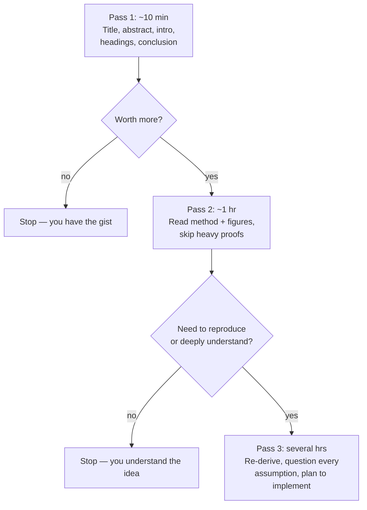
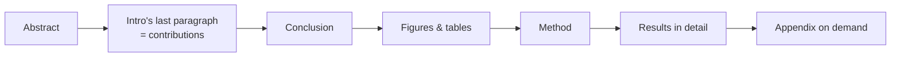
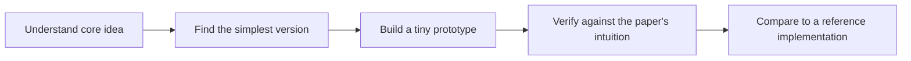

<!-- Module 00 · Lesson 8 — follows ../../../standards/. -->

# 00.8 · Reading Research Papers

[⬅ 00.7 Reading Docs](00.7-reading-technical-documentation.md) · [🏠 Module](../README.md) · [🗺 Roadmap](../../../ROADMAP.md) · [Next ➡](00.9-learning-workflow.md)

> Research papers are the source code of AI ideas. This lesson gives you a repeatable system to approach any paper, find its core contribution fast, take useful notes, and turn ideas into implementations — without drowning in math.

| | |
|---|---|
| **Module** | `00 · Orientation & Foundations` |
| **Lesson** | `00.8` |
| **Difficulty** | ⭐⭐ |
| **Estimated study time** | 50 min read |
| **Status** | 🟢 stable |

---

## 1. Learning Objectives

By the end of this lesson you will be able to:

- [ ] Approach a paper with a **three-pass method** instead of reading linearly.
- [ ] Identify a paper's **core contribution** quickly.
- [ ] Read the **sections in the most useful order**.
- [ ] Take **structured notes** that you'll actually reuse.
- [ ] Decide when and how to **implement** a paper's ideas.
- [ ] Read productively **without being blocked by unfamiliar math**.

## 2. Prerequisites

- [00.7 · Reading Technical Documentation](00.7-reading-technical-documentation.md) — same "read by need" mindset, harder material.

---

## 3. Why This Topic Exists

Every technique in this handbook — Transformers, attention, LoRA, RAG, RLHF — began as a research paper. The people who understand AI most deeply read papers, because papers are where ideas are *born*, months or years before they reach libraries and blog posts.

Beginners avoid papers because they look intimidating: dense math, unfamiliar notation, terse prose. But papers follow **predictable structures**, and you rarely need to understand every equation to extract the core idea. Learning to read them is a superpower that keeps you current for your entire career.

> [!IMPORTANT]
> You do **not** need to understand a paper completely to benefit from it. The goal is usually to grasp the **core idea, why it works, and when to use it** — not to reproduce every derivation. Aim for *useful* understanding, calibrated to your need.

## 4. Problems It Solves

| Problem | Paper-reading skill fixes it |
|---|---|
| Depending on others' summaries (often wrong/late) | Go to the primary source |
| Falling behind as the field moves | Read the ideas as they appear |
| Intimidation by math | A method to extract ideas without full derivations |
| Forgetting what you read | Structured, reusable notes |
| "How does X *actually* work?" | The authoritative answer |

---

## 5. The Anatomy of a Paper

Almost every AI paper follows the same structure. Knowing it lets you jump straight to what you need.

| Section | Contains | Priority for a first pass |
|---|---|---|
| **Title & Abstract** | The whole paper in miniature | 🔴 Read first |
| **Introduction** | Problem, motivation, contribution | 🔴 Read first |
| **Related Work** | How it differs from prior art | 🟡 Skim |
| **Method / Approach** | The core technical contribution | 🔴 The heart |
| **Experiments / Results** | Evidence it works | 🟠 Read the tables/figures |
| **Ablations** | Which parts actually matter | 🟠 Valuable |
| **Conclusion** | Summary + limitations + future work | 🟡 Skim |
| **Appendix** | Details, proofs, extra results | ⚪ On demand |

> **Illustration placeholder** — `assets/images/paper-anatomy.png`: a one-page paper diagram with sections color-coded by reading priority (abstract/intro/method in red, results in orange, related-work/conclusion in yellow, appendix grey).

---

## 6. The Three-Pass Method

The most effective, widely taught approach (popularized by S. Keshav) is to read a paper in **three increasingly deep passes**, deciding after each whether to continue.



| Pass | Time | Goal | You come away knowing… |
|---|---|---|---|
| **1** | 5–10 min | The gist | What it's about, the claim, whether to read more |
| **2** | ~1 hr | The idea | How the method works, the key results |
| **3** | Hours | Mastery | Enough to reimplement and critique it |

> [!TIP]
> **Most papers deserve only Pass 1.** You're triaging. Pass 1 tells you whether a paper is relevant enough to invest more. This is how researchers "read" hundreds of papers — they Pass-1 nearly all of them and Pass-3 very few.

---

## 7. Finding the Core Contribution

Every paper is, at heart, saying: *"Here is a problem, here is our new idea to solve it, and here is evidence it works."* Your job on Pass 1–2 is to fill in this template:

```text
Problem:      What limitation does this address?
Key idea:     What's the ONE new thing? (usually 1-2 sentences)
Why it works: The intuition behind the idea
Evidence:     What result proves it? (the headline number/figure)
Cost:         What does it require? (data, compute, tradeoffs)
```

The core contribution is usually stated explicitly in the **last paragraph of the introduction** ("In this work, we propose…" / "Our contributions are…"). Start there after the abstract.

> [!NOTE]
> If you can fill in that five-line template, you understand the paper well enough for most engineering purposes. Everything else is detail you can fetch on demand.

---

## 8. Reading Order (Not Front-to-Back)

Don't read linearly. Read in *usefulness* order:



1. **Abstract** — the whole story compressed.
2. **Introduction's contribution paragraph** — the explicit "what's new."
3. **Conclusion** — restates the idea and admits limitations.
4. **Figures and tables** — often convey the method and results faster than prose.
5. **Method** — now that you know the point, the details make sense.
6. **Results in detail** — only if you need to trust or reproduce it.
7. **Appendix** — only when you need a specific detail.

> [!TIP]
> **Figures are the fastest path to understanding.** A paper's main architecture diagram often teaches the whole idea in one glance. Study it before wading into equations.

---

## 9. Handling the Math

The math is where beginners freeze. Three rules to keep moving:

| Rule | Why |
|---|---|
| **Read for intuition first** | Understand *what* an equation does before *how* it's derived |
| **Don't let notation block you** | Look up unfamiliar symbols; skip full derivations on early passes |
| **Come back with prerequisites** | After Modules 06 (Math) and 09 (DL), re-read — it'll click |

> [!IMPORTANT]
> A paper's equations describe an idea you can often state in plain English. "Attention is a weighted average of values, where the weights come from how well each query matches each key" *is* the core of a famous equation. Chase the plain-English version; let the notation follow.

> [!WARNING]
> Do not measure your progress by "did I understand every equation?" Measure it by "can I explain the core idea and when to use it?" Full mathematical mastery comes later, after the foundations modules — and often you never need it to *use* the technique.

---

## 10. Taking Notes You'll Reuse

Notes you never revisit are wasted effort. Use a consistent structure so your notes become a searchable knowledge base. This handbook provides a [research-paper-summary template](../../../templates/research-paper-summary-template.md) — use it for every paper worth Pass 2.

A good note captures:

| Field | Example |
|---|---|
| Problem | Long-range dependencies are hard for RNNs |
| Key idea | Replace recurrence with self-attention |
| Method (in your words) | Each token attends to all others via Q/K/V |
| Results | State-of-the-art translation, more parallelizable |
| Why it matters | Foundation of all modern LLMs |
| Limitations | Quadratic cost in sequence length |
| Terms to learn | attention, positional encoding, multi-head |

> [!TIP]
> Write the note **in your own words**. Copy-pasting the abstract teaches nothing; paraphrasing forces the understanding that makes the note valuable — and it's active recall in disguise.

---

## 11. From Paper to Implementation

The deepest understanding comes from **implementing** an idea. You won't do this for most papers, but for foundational ones (you'll build a Transformer in [Module 10](../../10-NLP/README.md)), it's transformative.



- Start with the **smallest possible version** (one attention head, a toy dataset).
- Expect to be confused — implementation reveals gaps reading hid. That's the point.
- Compare against a **reference implementation** once you've tried yourself (implement-before-import from [00.4](00.4-learning-strategy.md)).

> [!NOTE]
> This connects directly to the handbook's philosophy: you'll implement foundational papers' ideas from scratch (backprop, attention, a Transformer block) *before* using the library versions. Paper-reading and implement-before-import are the same skill applied to research.

---

## 12. A Worked Example Structure (Using a Landmark Paper)

Consider the paper that introduced the Transformer, *"Attention Is All You Need"* (2017) — the foundation of modern LLMs. We won't reproduce it, but here's how you'd *approach* it with this method:

| Step | What you'd do |
|---|---|
| **Pass 1** | Abstract → "we propose a new architecture, the Transformer, based solely on attention, dispensing with recurrence." Contribution paragraph confirms it. Result: better translation, more parallel. *Worth Pass 2? Yes — it's foundational.* |
| **Pass 2** | Study **Figure 1** (the architecture diagram) — encoder/decoder stacks of attention + feed-forward. Read the attention section for intuition (Q/K/V weighted average). Skim results tables. |
| **Note** | Fill the template: problem (RNN limits), key idea (self-attention replaces recurrence), why (parallelism + long-range links), evidence (SOTA translation), cost (quadratic in length). |
| **Pass 3** (later) | After Modules 06 & 09, re-derive scaled dot-product attention and **implement a Transformer block** in Module 10. |

> [!IMPORTANT]
> Notice you extracted the paper's core value in Pass 1–2 **without** understanding every equation. Depth (Pass 3) is deferred until you have the prerequisites and a reason. This is exactly how to read papers as a busy engineer.

---

## 13. Common Mistakes & Debugging

| Mistake | Better approach |
|---|---|
| Reading front-to-back | Read by usefulness (abstract → contribution → figures → method) |
| Trying to understand every equation immediately | Chase the plain-English idea first |
| Giving up at the math | Skip derivations on early passes; return with prerequisites |
| Reading every paper deeply | Pass-1 most; Pass-3 few |
| Passive highlighting | Write notes in your own words |
| Never implementing | Build tiny versions of foundational ideas |

---

## 14. Interview Questions

**Beginner**
1. Describe the three-pass method for reading a paper.
2. Where in a paper is the core contribution usually stated explicitly?

**Intermediate**
1. How do you extract value from a paper without understanding all of its math?
2. What belongs in a reusable paper note, and why in your own words?

**Advanced**
1. You need to decide whether a new technique from a paper is worth adopting in production. What would you read, and what would you look for beyond the headline result?
2. Why are ablation studies often more informative than the headline result?

**System-design prompt (meta)**
- You're asked to evaluate five recent papers claiming to improve RAG. Design a triage process to find the one worth implementing. — *Follow-ups:* How do you avoid cherry-picked results? How do you estimate implementation cost?

---

## 15. Summary

| Key idea | Takeaway |
|---|---|
| Papers have a fixed anatomy | Jump to the section you need |
| Three-pass method | Triage; deepen only when worth it |
| Core contribution template | Problem, idea, why, evidence, cost |
| Read by usefulness | Abstract → contribution → figures → method |
| Chase plain English | Understand ideas before derivations |
| Notes in your own words | Reusable, and active recall |

## 16. Cheat Sheet

```text
ANATOMY: Abstract · Intro(+contributions) · Related · METHOD · Results · Ablations · Conclusion · Appendix
3 PASSES: (1) 10min gist → (2) 1hr idea → (3) hrs to reimplement
ORDER: abstract → intro's contribution para → conclusion → figures → method → results → appendix
CORE TEMPLATE: problem · key idea · why it works · evidence · cost
MATH: intuition first · skip derivations early · return after Modules 06/09
NOTES: own words · use the paper-summary template · list terms to learn
RULE: understand the IDEA + WHEN to use it, not every equation.
```

## 17. Flashcards

- **Q:** What are the three passes? — **A:** (1) ~10 min gist (abstract/intro/headings/conclusion), (2) ~1 hr idea (method + figures), (3) hours to reimplement/critique.
- **Q:** Where is the core contribution usually stated? — **A:** The last paragraph of the introduction ("we propose…/our contributions are…").
- **Q:** In what order should you read a paper? — **A:** Abstract → contribution paragraph → conclusion → figures → method → detailed results → appendix on demand.
- **Q:** How do you handle unfamiliar math? — **A:** Get the plain-English intuition first; skip full derivations early; return after the math/DL modules.
- **Q:** What five things capture a paper's essence? — **A:** Problem, key idea, why it works, evidence, cost/tradeoffs.
- **Q:** Why write notes in your own words? — **A:** Paraphrasing forces understanding and doubles as active recall; copied text teaches nothing.

## 18. Hands-on Exercises

> Full set in [`../exercises/`](../exercises/).

- [ ] **(⭐ Pass 1)** Pick any well-known AI paper. Do a 10-minute Pass 1 and write the 5-line core-contribution template.
- [ ] **(⭐⭐ Figures)** For the same paper, study its main figure and explain the method from the figure alone in 3 sentences.
- [ ] **(⭐⭐ Note)** Complete a full [paper-summary note](../../../templates/research-paper-summary-template.md) in your own words.
- [ ] **(⭐⭐⭐ Triage)** Skim three papers on one topic via Pass 1 and rank which deserves a Pass 2, with reasons.

## 19. Mini Project

> Start `references/paper-notes/` in your study repo. Add your first paper summary using the template. Commit to adding one paper note per phase of the handbook — by the end you'll have a personal, searchable research library.

## 20. References

- Keshav, S. *"How to Read a Paper."* (The three-pass method — short and worth reading in full.)
- Vaswani et al. *"Attention Is All You Need."* 2017. (The worked example; you'll implement its ideas in Module 10.)
- The handbook's [research-paper-summary template](../../../templates/research-paper-summary-template.md).

## 21. What's Next

You can now learn from docs *and* papers. Let's assemble every habit from this module into a concrete **daily learning workflow** you can run without thinking.

➡️ **Next:** [00.9 · The Daily Learning Workflow](00.9-learning-workflow.md)

---

### 🔁 Revision checklist
- [ ] I can run the three-pass method on any paper
- [ ] I can extract a core contribution in under 15 minutes
- [ ] I write paper notes in my own words using the template
- [ ] I started `references/paper-notes/`

### 🔗 Spaced-repetition callback
> Recall [00.7's "read enough to act"](00.7-reading-technical-documentation.md): the three-pass method is that same triage discipline applied to papers — read the minimum depth your goal requires, and go deeper only when the paper earns it.
