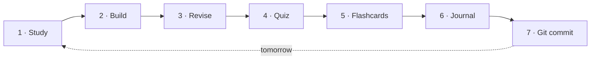
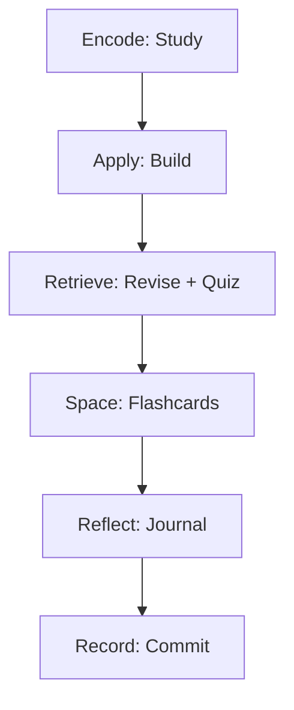
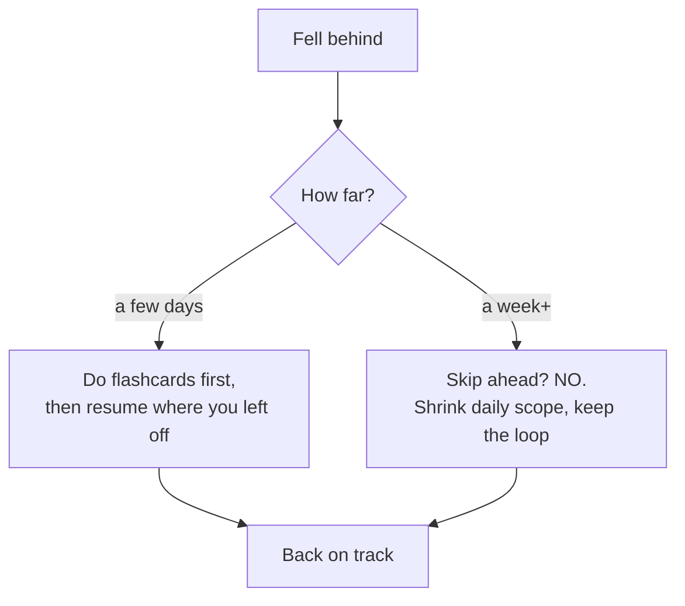

<!-- Module 00 · Lesson 9 — follows ../../../standards/. -->

# 00.9 · The Daily Learning Workflow

[⬅ 00.8 Reading Papers](00.8-reading-research-papers.md) · [🏠 Module](../README.md) · [🗺 Roadmap](../../../ROADMAP.md) · [Next ➡](00.10-ai-engineer-mindset.md)

> A concrete, repeatable daily loop — study, build, revise, quiz, flashcards, journal, commit — and *why* each step earns its place. Habits beat motivation. This is the engine that carries you through 57 weeks.

| | |
|---|---|
| **Module** | `00 · Orientation & Foundations` |
| **Lesson** | `00.9` |
| **Difficulty** | ⭐ |
| **Estimated study time** | 40 min read |
| **Status** | 🟢 stable |

---

## 1. Learning Objectives

By the end of this lesson you will be able to:

- [ ] Run a **daily learning loop** with seven deliberate steps.
- [ ] Explain **why each step matters** for retention and skill.
- [ ] Fit the loop into a realistic **weekly rhythm**.
- [ ] Handle **falling behind** without quitting.

## 2. Prerequisites

- Lessons [00.4](00.4-learning-strategy.md) (the *why*) and [00.5](00.5-development-environment.md)–[00.6](00.6-github-repository-workflow.md) (your repo).

---

## 3. Why This Topic Exists

Knowledge of *how* to learn (Lesson 00.4) is useless without a *routine* that executes it. Motivation is unreliable — it comes and goes. **Systems** are reliable: a good daily loop runs whether or not you feel inspired, and compounds silently over a year.

This lesson turns the principles of the handbook into a checklist you can run on autopilot. The goal is to remove decision-making — you shouldn't have to *decide* to do active recall; it should just be step 4 of your day.

> [!IMPORTANT]
> Amateurs rely on motivation; professionals rely on systems. A mediocre routine you actually run beats a perfect routine you don't. Build the loop, then trust it.

## 4. Problems It Solves

| Problem | The daily loop fixes it |
|---|---|
| "I don't feel motivated today" | The system runs without motivation |
| Reading without retaining | Built-in recall + spacing |
| Learning without building | A build step every day |
| No record of progress | Journaling + commits |
| Vague, drifting study sessions | A concrete 7-step structure |

---

## 5. The Daily Loop



Here is the loop, with a realistic ~2-hour budget (scale to your available time):

| # | Step | Time | Purpose |
|---|---|---|---|
| 1 | **Study** | 40 min | Learn one new lesson section, actively |
| 2 | **Build** | 30 min | Do exercises / write code that applies it |
| 3 | **Revise** | 10 min | Blank-page recall of what you just learned |
| 4 | **Quiz** | 10 min | Test yourself; find gaps |
| 5 | **Flashcards** | 10 min | Review due cards; add new ones |
| 6 | **Journal** | 10 min | Write what you learned & where you struggled |
| 7 | **Commit** | 5 min | Save the day's work to Git |

> [!NOTE]
> The steps aren't equal in glamour, but they're equal in importance. Beginners do step 1 and skip 3–7 — which is exactly why they forget. The retention steps are where learning is *locked in*.

---

## 6. Why Each Step Matters

### 1 · Study (encode)
Learn *actively* — pen in hand, explaining ideas to yourself, not passively watching. Cover one coherent chunk, not a marathon. (Recall [00.4](00.4-learning-strategy.md): recognition ≠ recall.)

### 2 · Build (apply)
Immediately apply what you studied through exercises or code. Application exposes the gaps that reading hides. **You don't truly understand something until you've used it.**

### 3 · Revise (retrieve)
Close everything and reconstruct the lesson on a blank page. This **blank-page recall** is the single highest-leverage learning act — retrieval strengthens memory far more than rereading.

### 4 · Quiz (test)
A quick self-quiz surfaces what you *think* you know but don't. Gaps found today are cheap; gaps found in an interview are expensive.

### 5 · Flashcards (space)
Review cards that are *due* (per the spaced-repetition schedule) and create new ones for today's material. This is what fights the forgetting curve over weeks and months.

### 6 · Journal (reflect)
Write a few honest sentences: what clicked, what confused you, what to revisit. Reflection consolidates learning and creates a record you can mine later. It also surfaces your weak spots for targeted review.

### 7 · Commit (record)
Commit the day's notes, code, and journal. This makes progress **visible and permanent**, builds the daily-commit habit from [00.6](00.6-github-repository-workflow.md), and grows your portfolio automatically.



> [!TIP]
> If you're ever short on time, **never cut the retrieval steps (3–5)**. Cut *new* study (step 1) before you cut recall. Retaining what you have beats piling on more you'll forget.

---

## 7. The Weekly Rhythm

The daily loop lives inside a weekly structure that adds project work and interleaved review (from [LEARNING_STRATEGY.md](../../../LEARNING_STRATEGY.md)).

| Day | Focus |
|---|---|
| Mon–Thu | Daily loop on new lessons |
| Fri | Module **project** work (build something real) |
| Sat | **Interleaved review** — mixed quiz across recent modules |
| Sun | Rest, or light flashcard catch-up + plan next week |

> [!IMPORTANT]
> Interleaving (Saturday's mixed review) is deliberately harder than reviewing one topic at a time — and that difficulty is *why* it works. It trains you to *retrieve and distinguish*, which is what real problems demand.

---

## 8. Handling Falling Behind

You *will* fall behind sometimes — illness, work, life. This is normal and not failure. What matters is your **recovery protocol**.



| Situation | Do | Don't |
|---|---|---|
| Missed a few days | Prioritize due flashcards, then resume | Try to "catch up" by cramming |
| Missed a week+ | Reduce daily scope; keep the loop alive | Quit or skip foundations to catch up |
| Lost motivation | Do the *smallest* version of the loop (15 min) | Wait to "feel like it" |

> [!TIP]
> The goal is **never a zero day**. Even 15 minutes of flashcards keeps the chain alive and the habit intact. Consistency at low intensity beats intensity followed by collapse.

> [!WARNING]
> The most dangerous response to falling behind is **skipping foundations to catch up to the "fun" modules**. That trades a short delay for a permanent handicap. Slow down; don't skip.

---

## 9. Common Mistakes & Debugging

| Mistake | Symptom | Fix |
|---|---|---|
| Only doing step 1 (study) | Forgetting everything in weeks | Always do retrieval (3–5) |
| Marathon sessions, then burnout | Inconsistent, then quitting | Shorter daily loops, sustainably |
| Skipping the build step | Can explain but can't do | Apply every day |
| No journaling | Can't see progress or weak spots | 5 honest sentences daily |
| Cramming to catch up | Stress, poor retention | Shrink scope, keep the loop |
| Passive flashcards (peeking) | Cards feel "known" but aren't | Answer *before* flipping |

---

## 10. Interview Questions

**Beginner**
1. What are the seven steps of the daily loop, and which are the retrieval steps?
2. Why is a build step included every day?

**Intermediate**
1. Why should you cut new study before cutting flashcards when short on time?
2. What is interleaving and why is its difficulty a feature, not a bug?

**Advanced**
1. Design a recovery protocol for a learner who missed two weeks. Justify each choice against retention principles.
2. How would you measure whether your learning system is actually working, beyond "it feels productive"?

**System-design prompt (meta)**
- Design a sustainable daily/weekly learning system for someone with only 5 hours per week. What do you keep, cut, and sequence? — *Follow-ups:* How do you protect retention with so little time? How do you prevent zero-weeks?

---

## 11. Summary

| Key idea | Takeaway |
|---|---|
| Systems > motivation | Run the loop regardless of how you feel |
| Seven steps | Study, build, revise, quiz, flashcards, journal, commit |
| Retrieval is king | Never skip revise/quiz/flashcards |
| Weekly rhythm | Add projects (Fri) and interleaved review (Sat) |
| No zero days | Even 15 min keeps the habit alive |
| Don't skip to catch up | Shrink scope, keep foundations |

## 12. Cheat Sheet

```text
DAILY LOOP: Study → Build → Revise → Quiz → Flashcards → Journal → Commit
  encode   apply    RETRIEVE  RETRIEVE  SPACE     reflect   record
TIME-SHORT? cut NEW STUDY before cutting retrieval.
WEEKLY: Mon–Thu lessons · Fri project · Sat interleaved review · Sun rest/plan
BEHIND? shrink scope, keep the loop. NEVER a zero day. NEVER skip foundations.
```

## 13. Flashcards

- **Q:** Name the seven steps of the daily loop. — **A:** Study, Build, Revise, Quiz, Flashcards, Journal, Commit.
- **Q:** Which steps are retrieval, and why never cut them? — **A:** Revise, Quiz, Flashcards; retrieval builds durable memory better than any amount of rereading.
- **Q:** When short on time, what do you cut first? — **A:** New study (step 1) — never the retrieval steps.
- **Q:** What is a "zero day" and why avoid it? — **A:** A day with no work at all; even 15 min of flashcards preserves the habit and the chain.
- **Q:** Worst way to respond to falling behind? — **A:** Skipping foundations to catch up to later modules — it creates a permanent gap.

## 14. Hands-on Exercises

> Full set in [`../exercises/`](../exercises/).

- [ ] **(⭐ Setup)** Write your personal version of the daily loop with realistic times, in `journal/daily-loop.md`.
- [ ] **(⭐ Run)** Execute the full 7-step loop for one real lesson today. Note which steps you were tempted to skip.
- [ ] **(⭐⭐ Weekly)** Draft your weekly rhythm and block it in a calendar.
- [ ] **(⭐⭐ Recovery)** Pre-write your "falling behind" protocol now, before you need it.

## 15. Mini Project

> Establish your **journaling habit**. Create `journal/` with a daily entry template (what I learned / where I struggled / what to revisit). Commit today's entry. Aim for one entry per study day for the rest of Module 00 — proof the system works.

## 16. References

- [LEARNING_STRATEGY.md](../../../LEARNING_STRATEGY.md) — the weekly rhythm and spaced-repetition schedule.
- James Clear. *Atomic Habits* — systems over goals, and never-miss-twice.

## 17. What's Next

You have a system for *doing*. Next, we shape how you *think* — the mindset that separates an engineer who builds and debugs from someone who merely uses AI tools.

➡️ **Next:** [00.10 · The AI Engineer Mindset](00.10-ai-engineer-mindset.md)

---

### 🔁 Revision checklist
- [ ] I wrote and ran my personal daily loop
- [ ] I have a weekly rhythm blocked in a calendar
- [ ] I pre-wrote my recovery protocol
- [ ] I started journaling and committed an entry

### 🔗 Spaced-repetition callback
> Recall [00.6's daily-commit habit](00.6-github-repository-workflow.md): step 7 of this loop *is* that habit. And step 5 (flashcards) executes the [spaced-repetition schedule from 00.4](00.4-learning-strategy.md). The loop is where all the module's abstract principles become concrete daily actions.
