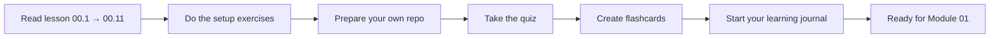

# Module 00 · Orientation & Foundations — Lessons

[⬅ Module home](../README.md) · [🗺 Roadmap](../../../ROADMAP.md) · [📚 Curriculum](../../../CURRICULUM.md)

> This is the map of Module 00. The module is delivered as a sequence of connected lessons. Read them in order — each builds the context for the next.

---

## Why this module exists

Before you learn a single machine-learning algorithm, you need a **map of the territory**, a **way of working**, and a **way of thinking**. Most people fail at learning AI Engineering not because the math is too hard, but because they wander without a map, collect tutorials without building anything, and forget 80% of what they read within a month.

This module fixes that. It gives you the vocabulary, the landscape, the career context, the tools, and the habits that everything else in this handbook depends on.

> [!IMPORTANT]
> Module 00 teaches **no machine learning**. It teaches you how to *become* an AI Engineer and how to *use this handbook*. Do not skip it — the habits you set here compound across the next year.

---

## Lessons

| # | Lesson | What it gives you |
|---|---|---|
| 00.1 | [Introduction: The Vocabulary of the Field](00.1-introduction.md) | Precise definitions of AI, AGI, ML, DL, GenAI, LLMs, and AI Engineering |
| 00.2 | [The AI Engineering Landscape](00.2-ai-engineering-landscape.md) | How every layer connects, from Python to production |
| 00.3 | [Career Roadmap & Roles](00.3-career-roadmap.md) | The roles, their daily work, skills, and growth paths |
| 00.4 | [Learning Strategy](00.4-learning-strategy.md) | Why this curriculum is built the way it is |
| 00.5 | [The Development Environment](00.5-development-environment.md) | Setting up a professional AI workstation |
| 00.6 | [GitHub Repository Workflow](00.6-github-repository-workflow.md) | How to organize, commit, branch, and version your work |
| 00.7 | [Reading Technical Documentation](00.7-reading-technical-documentation.md) | Extracting signal from docs, APIs, RFCs, and repos |
| 00.8 | [Reading Research Papers](00.8-reading-research-papers.md) | A repeatable system for papers |
| 00.9 | [The Daily Learning Workflow](00.9-learning-workflow.md) | A concrete study loop that actually sticks |
| 00.10 | [The AI Engineer Mindset](00.10-ai-engineer-mindset.md) | How to think like an engineer, not a tool user |
| 00.11 | [Recommended Resources](00.11-recommended-resources.md) | A curated, annotated resource library |
| 00.12 | [Summary, Cheat Sheet & Review](00.12-summary.md) | Consolidation, flashcards, interview prep, checklists |

### Companion artifacts
- 🏋️ [Exercises](../exercises/) — reflection, setup, Git, and reading tasks
- 🧠 [Flashcards](../flashcards/deck.md) — spaced-repetition deck
- 📝 [Quiz](../quizzes/quiz-01.md) — self-assessment with answers
- 📄 [Cheat sheet](../cheat-sheets/orientation-cheatsheet.md) — one-page reference

---

## How to work through Module 00

**Estimated time:** ~6 hours reading · ~2 hours setup · ~1 hour review.

> [!TIP]
> Don't just read Module 00 — *act* on it. By the end you should have a configured workstation, your own study repository, a journal, and a daily routine. That infrastructure is what carries you through the next 56 weeks.
