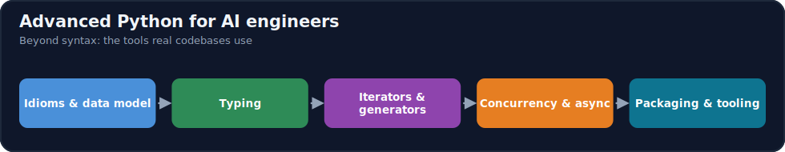

# Module 01 · Advanced Python

[⬅ 00 · Orientation](../00-Orientation/README.md) · [🏠 docs](../README.md) · [🗺 Roadmap](../../ROADMAP.md) · [02 · Computer Science ➡](../02-Computer-Science/README.md)

> Production-grade Python: typing, async, packaging, and performance.

---

## Purpose

This module covers **Advanced Python**. Production-grade Python: typing, async, packaging, and performance. It fits into the overall program as described in the [Roadmap](../../ROADMAP.md) and [Curriculum](../../CURRICULUM.md).

## What you'll learn

- Type hints and static checking at scale
- Dataclasses, Pydantic, and data validation
- Async, concurrency, and parallelism for AI workloads
- Packaging, dependency management, and profiling

## 📖 Lessons (start here)

> ✅ **This module's content is written.** Work through the lessons in order via the [lesson index](weeks/README.md).

| # | Lesson |
|---|---|
| 01.1 | [How Python Runs Your Code](weeks/01.1-python-architecture.md) |
| 01.2 | [Memory, Objects & the Data Model](weeks/01.2-memory-management.md) |
| 01.3 | [Object-Oriented Python](weeks/01.3-object-oriented-python.md) |
| 01.4 | [Functional Python](weeks/01.4-functional-python.md) |
| 01.5 | [Iterators & Generators](weeks/01.5-iterators-generators.md) |
| 01.6 | [Decorators](weeks/01.6-decorators.md) |
| 01.7 | [Context Managers](weeks/01.7-context-managers.md) |
| 01.8 | [Type Hinting](weeks/01.8-type-hinting.md) |
| 01.9 | [Error Handling & Logging](weeks/01.9-error-handling-logging.md) |
| 01.10 | [Testing](weeks/01.10-testing.md) |
| 01.11 | [Performance Optimization](weeks/01.11-performance.md) |
| 01.12 | [Async Programming](weeks/01.12-async.md) |
| 01.13 | [Packaging & Code Quality](weeks/01.13-packaging-code-quality.md) |
| 01.14 | [Reading Open-Source Code](weeks/01.14-reading-open-source.md) |
| 01.15 | [Mini Projects & Summary](weeks/01.15-projects-summary.md) |

**Companion artifacts:** [Exercises](exercises/README.md) · [Quiz](quizzes/quiz-01.md) · [Flashcards](flashcards/deck.md) · [Cheat sheet](cheat-sheets/advanced-python-cheatsheet.md)

## How this module is organized

Content is delivered week by week. Each module uses the same subfolders:

| Folder | Contents |
|---|---|
| [`weeks/`](weeks/) | Weekly lesson content, one file per week (`week-01.md`, `week-02.md`, …). |
| [`diagrams/`](diagrams/) | Mermaid sources and exported diagram assets for this module. |
| [`exercises/`](exercises/) | Hands-on practice problems with solutions. |
| [`projects/`](projects/) | Buildable projects that apply this module's skills. |
| [`quizzes/`](quizzes/) | Self-assessment question banks with answer keys. |
| [`flashcards/`](flashcards/) | Spaced-repetition Q/A decks for active recall. |
| [`cheat-sheets/`](cheat-sheets/) | One-page quick references for this module. |
| [`references/`](references/) | Paper summaries and deep-dive notes. |

## Suggested study flow

## File & naming conventions

| Item | Convention | Example |
|---|---|---|
| Weekly lesson | `week-NN.md` | `weeks/week-01.md` |
| Exercise | `exercise-NN.md` (+ `solution-NN.*`) | `exercises/exercise-01.md` |
| Project | `project-NN/` folder with `README.md` | `projects/project-01/` |
| Quiz | `quiz-NN.md` (+ `answers-NN.md`) | `quizzes/quiz-01.md` |
| Flashcards | `deck.md` | `flashcards/deck.md` |
| Diagram | `topic.mmd` / `topic.png` | `diagrams/attention.mmd` |

## Markdown conventions

This file follows the repository Markdown standards — see [CONTRIBUTING.md](../../CONTRIBUTING.md): one H1 per file, tables over prose, GitHub callouts (`> [!NOTE]`), fenced code blocks with a language, Mermaid for diagrams, and relative internal links.

## Related modules

- [Orientation](../00-Orientation/README.md)
- [Computer Science](../02-Computer-Science/README.md)

---

## Navigation

| Direction | Link |
|---|---|
| ⬆ Parent | [docs/](../README.md) |
| ⬅ Previous | [⬅ 00 · Orientation](../00-Orientation/README.md) |
| ➡ Next | [02 · Computer Science ➡](../02-Computer-Science/README.md) |
| 🗺 Roadmap | [ROADMAP.md](../../ROADMAP.md) |
| 📚 Curriculum | [CURRICULUM.md](../../CURRICULUM.md) |
| 🏠 Repo root | [README.md](../../README.md) |
