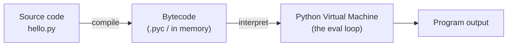
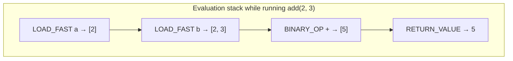
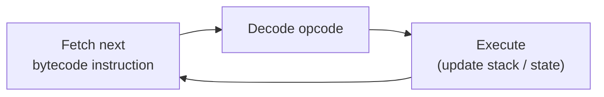
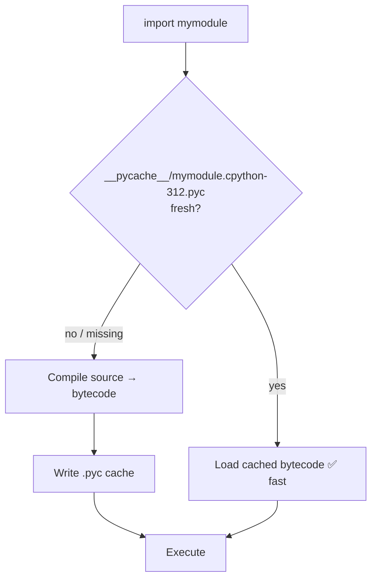
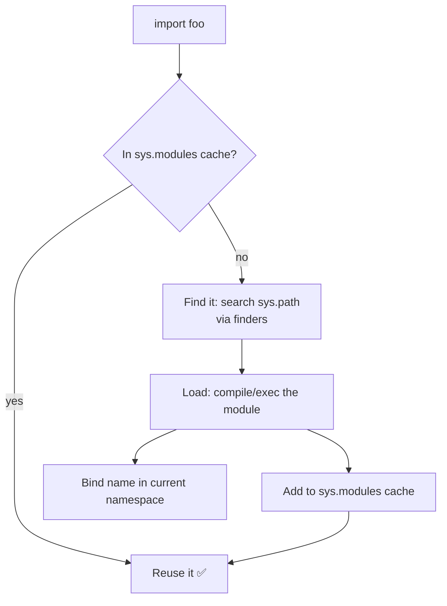

<!-- Module 01 · Lesson 1 — follows ../../../standards/. -->

# 01.1 · How Python Runs Your Code

[⬅ Module index](README.md) · [🏠 Module](../README.md) · [🗺 Roadmap](../../../ROADMAP.md) · [Next ➡](01.2-memory-management.md)

> Before you optimize or debug Python, you must know what actually happens when you press "run." This lesson opens the black box: source → bytecode → the virtual machine, plus how imports really work.

| | |
|---|---|
| **Module** | `01 · Advanced Python` |
| **Lesson** | `01.1` |
| **Difficulty** | ⭐⭐⭐ |
| **Estimated study time** | 60 min read · 30 min experiments |
| **Status** | 🟢 stable |

---

## 1. Learning Objectives

By the end of this lesson you will be able to:

- [ ] Explain the steps Python takes to execute a `.py` file.
- [ ] Distinguish **compilation** from **interpretation** and place Python correctly.
- [ ] Define **CPython, bytecode,** and the **Python Virtual Machine (PVM)**.
- [ ] Read disassembled bytecode with the `dis` module.
- [ ] Explain how the **import system** finds, loads, and caches modules.
- [ ] Reason about why `.pyc` files and `__pycache__` exist.

## 2. Prerequisites

- [Module 00](../../00-Orientation/README.md) — especially the dev environment.
- Comfortable running Python scripts and using the REPL.

---

## 3. Why This Topic Exists

Most developers treat Python as magic: you write code, it runs. That works until it doesn't — until you hit a performance wall, a confusing import error, or a `__pycache__` folder you don't understand, or you need to know *why* Python is slower than C for number-crunching (which is the entire reason NumPy and PyTorch exist).

Understanding Python's execution model turns magic into mechanism. You'll debug import errors in seconds, understand why the GIL exists (Lesson 01.11), know what "Python is interpreted" really means, and appreciate *why* AI frameworks push heavy computation out of pure Python into C/CUDA.

> [!IMPORTANT]
> You cannot deeply optimize or debug a system you treat as a black box. This lesson is the foundation for everything performance-related later — and for understanding the design of every ML framework you'll use.

## 4. Problems It Solves

| Confusion | Understanding execution resolves it |
|---|---|
| "Is Python compiled or interpreted?" | Both — source compiles to bytecode, the PVM interprets it |
| "What's `__pycache__`/`.pyc`?" | Cached bytecode to skip recompilation |
| Mysterious `ImportError` / `ModuleNotFoundError` | You know exactly how imports resolve |
| "Why is pure-Python math slow?" | The interpreter loop has per-operation overhead |
| "Which Python is running?" | CPython vs alternatives, and how to check |

---

## 5. Mental Model: A Two-Stage Pipeline

Python execution has two stages: a **compile** step (source → bytecode) and a **run** step (the virtual machine executes bytecode). This is the single most important picture in this lesson.



> **Illustration placeholder** — `assets/images/python-execution-pipeline.png`: a horizontal pipeline showing a `.py` file entering a "compiler" gear producing bytecode, feeding a "PVM" engine that emits output, with a side-cache box labeled `__pycache__` holding `.pyc` files.

| Stage | Input | Output | Who does it |
|---|---|---|---|
| **Compilation** | Source `.py` | Bytecode | The Python compiler (built into CPython) |
| **Execution** | Bytecode | Effects/output | The Python Virtual Machine (PVM) |

> [!NOTE]
> This is why "compiled vs interpreted" is a false binary for Python. It **compiles** to bytecode (like Java compiles to JVM bytecode) and then **interprets** that bytecode. It is not compiled to native machine code ahead of time like C.

---

## 6. CPython and Friends

"Python" the language is a **specification**. An **implementation** is a program that runs Python code. **CPython** — written in C — is the reference implementation and the one virtually everyone (and every AI framework) uses.

| Implementation | Written in | Notable for |
|---|---|---|
| **CPython** | C | The default; what you almost certainly run |
| **PyPy** | RPython | A JIT compiler; often much faster for pure Python |
| **Jython / IronPython** | Java / .NET | Interop with those platforms (niche) |
| **GraalPy** | Java (GraalVM) | Polyglot/JIT (niche) |

Check what you're running:

```python
import sys
import platform

print(platform.python_implementation())  # 'CPython'
print(sys.version)                        # e.g. 3.12.x ...
```

> [!IMPORTANT]
> When this handbook says "Python," it means **CPython**. Its characteristics — the bytecode format, reference counting (Lesson 01.2), and the GIL (Lesson 01.11) — are CPython implementation details, not language guarantees. This matters: the GIL is why threading behaves as it does, and it's a CPython thing.

---

## 7. Bytecode — What Python Actually Runs

When you run a module, CPython compiles each function's body into **bytecode**: a sequence of compact instructions for the virtual machine. You can *see* it with the `dis` (disassemble) module.

```python
import dis

def add(a, b):
    return a + b

dis.dis(add)
```

Output (abridged) — a stack-based instruction stream:

```text
  LOAD_FAST     a
  LOAD_FAST     b
  BINARY_OP     + (add)
  RETURN_VALUE
```

Read it as: *push `a`, push `b`, add the top two stack items, return the result.* The PVM is a **stack machine** — instructions push and pop values on an evaluation stack.



> [!TIP]
> `dis.dis()` is a real debugging and learning tool. When two pieces of code perform differently, disassembling them sometimes reveals why (e.g., extra attribute lookups). You rarely *need* it, but it demystifies the interpreter.

> [!NOTE]
> Bytecode is a **CPython implementation detail** and changes between Python versions — never rely on specific opcodes in production code. It's for understanding and diagnosis, not for building on.

---

## 8. The Python Virtual Machine (PVM)

The **PVM** is not a separate program you install — it's the **evaluation loop inside CPython** (historically a giant `switch` over opcodes in `ceval.c`). It reads bytecode instructions one by one and performs each on the evaluation stack.



This fetch-decode-execute loop is where the phrase "Python is interpreted" comes from — and it's the source of Python's per-operation overhead.

> [!IMPORTANT]
> **Why pure-Python number crunching is slow:** every arithmetic operation goes through this interpreter loop, with object boxing and dynamic dispatch each time. A C loop compiles to a few machine instructions; the equivalent Python loop runs dozens of interpreter steps per iteration. **This single fact is why NumPy, PyTorch, and every ML framework push array math down into optimized C/CUDA** — you'll rely on this constantly. (More in Lesson 01.11.)

---

## 9. `.pyc` Files and `__pycache__`

Compiling source to bytecode takes time. To avoid redoing it every run, CPython **caches** compiled bytecode in `.pyc` files inside a `__pycache__/` directory, keyed by Python version.



| Fact | Detail |
|---|---|
| **When created** | When a module is **imported** (not when a top-level script is run directly) |
| **Freshness check** | Based on source mtime/size (or hash) vs the cached `.pyc` |
| **Version-tagged** | `module.cpython-312.pyc` — different Python versions don't clash |
| **Safe to delete** | Yes — it's just a cache; it regenerates |
| **Should you commit it?** | No — `.gitignore` `__pycache__/` (already done in this repo) |

> [!WARNING]
> `.pyc` files are a *speed* optimization, not *security* — they are trivially decompiled and are **not** a way to hide or protect source code. Never treat shipping `.pyc`-only as protecting intellectual property.

---

## 10. The Import System — How `import` Really Works

Imports are where beginners hit walls. Understanding the mechanism makes import errors trivial to fix. When you write `import foo`, CPython does this:



Step by step:

1. **Cache check** — is `foo` already in `sys.modules`? If so, reuse it (imports run a module's code **only once** per process).
2. **Finding** — search each entry in `sys.path` (a list of directories) using *finders* to locate the module.
3. **Loading** — compile (if needed) and execute the module's top-level code, producing a module object.
4. **Binding** — bind the resulting object to the name in your namespace and store it in `sys.modules`.

```python
import sys

# Where Python looks for modules, in order:
for p in sys.path:
    print(p)

# Every already-imported module lives here:
print("json" in sys.modules)  # True after `import json`
```

| Concept | What it is |
|---|---|
| `sys.path` | Ordered list of locations Python searches for modules |
| `sys.modules` | Cache of already-imported modules (import-once semantics) |
| **Absolute import** | `from package.module import thing` — preferred |
| **Relative import** | `from .module import thing` — within a package |
| **Package** | A directory Python treats as importable (usually via `__init__.py`) |

> [!TIP]
> **`ModuleNotFoundError` almost always means the module's directory isn't on `sys.path`.** The fix is usually a proper package layout and installing your project in editable mode (`uv pip install -e .` / `pip install -e .`), *not* hacking `sys.path` at runtime. You'll set this up properly in Lesson 01.13.

---

## 11. Compilation vs Interpretation — The Precise Answer

Now you can answer the classic interview question correctly and completely:

| Claim | Verdict |
|---|---|
| "Python is interpreted" | ✅ Partially — the PVM interprets bytecode |
| "Python is compiled" | ✅ Partially — source is compiled to bytecode first |
| "Python compiles to machine code (like C)" | ❌ No — not ahead-of-time to native code |
| "Python is exactly like Java's model" | ⚠️ Similar — both use a VM + bytecode; details differ |

**The precise statement:** *CPython compiles source code to bytecode, which is then executed by the Python Virtual Machine (a bytecode interpreter). It is not compiled ahead-of-time to native machine code.*

---

## 12. Common Mistakes & Debugging

| Symptom | Likely cause | Fix |
|---|---|---|
| `ModuleNotFoundError` | Module dir not on `sys.path`; not installed | Proper package + editable install |
| Import works in REPL, not in script | Different working dir / `sys.path` | Use packages; avoid path hacks |
| Edits not taking effect | Stale process / cached module | Restart the process (imports run once) |
| Circular import errors | Two modules import each other at top level | Restructure; import inside functions; split modules |
| `__pycache__` committed to Git | Not ignored | `.gitignore __pycache__/` |
| "My code got slower in a loop" | Per-op interpreter overhead | Vectorize / push to C (Lesson 01.11) |

> [!WARNING]
> **Circular imports** are a frequent real-world trap: module A imports B at the top, and B imports A. Because import executes top-level code, one module sees the other half-initialized. Fixes: move the import inside the function that needs it, or restructure so the shared code lives in a third module. Understanding import-once + top-level execution is what makes this obvious.

---

## 13. Performance Notes

| Note | Implication |
|---|---|
| Per-operation interpreter overhead | Tight numeric loops in pure Python are slow — vectorize |
| Bytecode caching (`.pyc`) | Startup is faster after first import; irrelevant to hot loops |
| Import executes code | Heavy top-level work slows *every* startup — keep imports light |
| CPython is single-interpreter-loop | Motivates the GIL and the C-extension strategy (Lessons 01.11–01.12) |

## 14. Security Considerations

| Risk | Guidance |
|---|---|
| `.pyc` ≠ protection | Bytecode is easily decompiled; don't rely on it to hide code |
| Untrusted imports | Importing a module **runs its top-level code** — never import untrusted packages; vet dependencies |
| `sys.path` manipulation | Prepending attacker-controlled paths can hijack imports — avoid runtime path hacks |
| Dependency confusion | Typosquatted package names run arbitrary code on install/import — pin and verify sources |

> [!CAUTION]
> Because `import` executes code, installing or importing a malicious package is arbitrary code execution. Treat your dependency list as a trust boundary — pin versions, use lockfiles (Lesson 01.13), and vet unfamiliar packages.

---

## 15. Interview Questions

**Beginner**
1. Is Python compiled or interpreted? Explain precisely.
2. What is bytecode, and where is it cached?

**Intermediate**
1. Walk through what happens, step by step, when Python executes `import numpy`.
2. What is the difference between "Python the language" and "CPython"? Name one CPython-specific detail.

**Advanced**
1. Why is a tight numeric loop in pure Python slow, and how do frameworks like NumPy address it?
2. Explain how a circular import fails and three ways to fix it.

**System-design prompt**
- You're diagnosing slow startup in a Python service. Walk through how the import system and bytecode caching could be involved and how you'd investigate. — *Follow-ups:* How would heavy top-level code hurt you? How does editable install change things?

---

## 16. Summary

| Key idea | Takeaway |
|---|---|
| Two-stage pipeline | Source → bytecode → PVM executes it |
| CPython | The reference C implementation everyone uses |
| Bytecode | Stack-machine instructions; inspect with `dis` |
| PVM | The fetch-decode-execute loop; source of per-op overhead |
| `.pyc`/`__pycache__` | Cached bytecode; a speed optimization, not security |
| Import system | Cache → find (`sys.path`) → load → bind; runs once |
| Slow pure-Python math | Motivates NumPy/PyTorch's C/CUDA cores |

## 17. Cheat Sheet

```text
EXECUTION: source .py → (compile) bytecode → PVM interprets → output
IMPL: CPython (default) · PyPy (JIT) · Jython/IronPython (niche)
BYTECODE: stack machine · inspect: import dis; dis.dis(fn) · version-specific
PVM: fetch→decode→execute loop = per-operation overhead (why NumPy exists)
CACHE: __pycache__/mod.cpython-XY.pyc · safe to delete · gitignore it · NOT security
IMPORT: sys.modules cache → find on sys.path → load(exec top-level) → bind
  runs ONCE per process · absolute imports preferred · editable install for your pkg
COMPILED vs INTERPRETED: compiles to bytecode, interprets bytecode; NOT native AOT
```

## 18. Flashcards

- **Q:** Precisely, is Python compiled or interpreted? — **A:** CPython compiles source to bytecode, then the PVM interprets that bytecode; it's not AOT-compiled to native machine code.
- **Q:** What is the PVM? — **A:** The bytecode-interpreting evaluation loop inside CPython (fetch-decode-execute over a stack machine).
- **Q:** What's in `__pycache__`? — **A:** Cached, version-tagged bytecode (`.pyc`) to skip recompilation; a speed optimization, deletable, not security.
- **Q:** What are `sys.path` and `sys.modules`? — **A:** `sys.path` = ordered search locations for modules; `sys.modules` = cache enabling import-once semantics.
- **Q:** Why is pure-Python numeric code slow? — **A:** Per-operation interpreter overhead (boxing, dynamic dispatch) — why frameworks push math into C/CUDA.
- **Q:** How do you inspect bytecode? — **A:** `import dis; dis.dis(func)`.

## 19. Hands-on Exercises

> Full set in [`../exercises/`](../exercises/).

- [ ] **(⭐ Inspect)** Disassemble three small functions with `dis.dis`. Explain the opcodes for one of them.
- [ ] **(⭐ Explore)** Print `sys.path` and `sys.version`/`platform.python_implementation()`. Confirm you're on CPython.
- [ ] **(⭐⭐ Cache)** Create a package, import it, and find the generated `.pyc`. Delete `__pycache__`, re-import, watch it regenerate.
- [ ] **(⭐⭐⭐ Debug)** Deliberately create a circular import between two modules, observe the error, then fix it three different ways.

## 20. Mini Project

> **Bytecode explorer (CLI).** Write a small script that takes a Python file path, imports/parses it, and prints the disassembly of each top-level function using `dis`. Bonus: report the number of bytecode instructions per function. This cements how source maps to bytecode. (You'll formalize CLI structure in Lesson 01.15.)

## 21. References

- Python docs — *The import system*, *`dis` — Disassembler*, *`sys`* — the primary sources ([reference standards](../../../standards/reference-standards.md)).
- CPython source (`Python/ceval.c`) — the actual evaluation loop, for the curious.

## 22. What's Next

You know how code *runs*. Next: what your code is made of — **objects, references, and how Python manages memory**, including reference counting and garbage collection.

➡️ **Next:** [01.2 · Memory, Objects & the Data Model](01.2-memory-management.md)

---

### 🔁 Revision checklist
- [ ] I can draw the source→bytecode→PVM pipeline
- [ ] I can explain import resolution and import-once semantics
- [ ] I disassembled a function and read its opcodes
- [ ] I created and fixed a circular import

### 🔗 Spaced-repetition callback
> Recall [Module 00.5's reproducibility](../../00-Orientation/weeks/00.5-development-environment.md): understanding that `import` runs a module's top-level code and searches `sys.path` is *why* proper packaging + editable installs (Lesson 01.13) make projects reproducible instead of relying on fragile path hacks.
