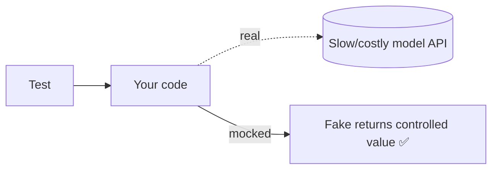

<!-- Module 01 · Lesson 10 — follows ../../../standards/. -->

# 01.10 · Testing

[⬅ 01.9 Errors & Logging](01.9-error-handling-logging.md) · [🏠 Module](../README.md) · [🗺 Roadmap](../../../ROADMAP.md) · [Next ➡](01.11-performance.md)

> Tests are what let you change code without fear. This lesson covers `pytest` (the industry standard), fixtures, mocking external services (like model APIs), parameterized tests, and coverage — plus how to test the inherently non-deterministic parts of AI systems.

| | |
|---|---|
| **Module** | `01 · Advanced Python` |
| **Lesson** | `01.10` |
| **Difficulty** | ⭐⭐⭐ |
| **Estimated study time** | 65 min read · 50 min practice |
| **Status** | 🟢 stable |

---

## 1. Learning Objectives

By the end of this lesson you will be able to:

- [ ] Write clear tests with **`pytest`** and understand the `unittest` it replaces.
- [ ] Use **fixtures** for setup/teardown and shared state.
- [ ] **Mock** external dependencies (APIs, files, models) to test in isolation.
- [ ] Write **parameterized** tests to cover many cases concisely.
- [ ] Measure and interpret **coverage** without gaming it.
- [ ] Test **non-deterministic** AI components sensibly.

## 2. Prerequisites

- [01.7 · Context Managers](01.7-context-managers.md) and [01.9 · Errors & Logging](01.9-error-handling-logging.md) (you'll test error paths).

---

## 3. Why This Topic Exists

Without tests, every change is a gamble: did I break something? You end up either afraid to touch working code or shipping regressions. **Tests are a safety net** — they let you refactor, optimize, and add features with confidence, because you'll know instantly if you broke a known-good behavior.

For AI systems this matters doubly. Pipelines have many moving parts (parsing, chunking, retrieval, prompting, post-processing), external dependencies (model APIs) that are slow/costly/flaky, and non-deterministic components. Good testing isolates the deterministic logic (which is most of your code) and stubs the unpredictable parts so your suite is fast, cheap, and reliable.

> [!IMPORTANT]
> Tests are not about proving code is perfect — they're about **catching regressions and encoding expected behavior**. A test suite is executable documentation of what your system is supposed to do, and an alarm when that changes unexpectedly.

## 4. Problems It Solves

| Problem | Testing solves it by |
|---|---|
| Fear of changing code | A safety net that flags breakage instantly |
| Regressions slipping into prod | Tests fail in CI before merge |
| Slow/costly tests hitting real APIs | Mocking external services |
| Repeating similar test logic | Parameterization |
| "Does this edge case work?" | Explicit edge-case tests |
| Unclear expected behavior | Tests document intent |

---

## 5. `unittest` vs `pytest`

Python ships with `unittest` (class-based, `assertEqual`-style). The community standard is **`pytest`** — less boilerplate, plain `assert`, powerful fixtures.

```python
# unittest (stdlib) — more ceremony
import unittest
class TestAdd(unittest.TestCase):
    def test_add(self):
        self.assertEqual(add(2, 3), 5)

# pytest — plain assert, minimal boilerplate  ✅ preferred
def test_add():
    assert add(2, 3) == 5
```

| | `unittest` | `pytest` |
|---|---|---|
| Style | Class-based, `self.assertX` | Functions, plain `assert` |
| Boilerplate | More | Less |
| Fixtures | `setUp`/`tearDown` | Flexible `@pytest.fixture` |
| Parameterization | Verbose | `@pytest.mark.parametrize` |
| Ecosystem | Built-in | Rich plugins (coverage, async, mock) |

> [!TIP]
> Use **pytest**. It runs `unittest` tests too, so you lose nothing. This handbook standardizes on pytest ([code standards](../../../standards/code-standards.md)).

---

## 6. Anatomy of a Good Test — Arrange, Act, Assert

```python
def test_top_k_returns_highest_scores():
    # Arrange — set up inputs and expected state
    scores = [0.1, 0.9, 0.5, 0.7]
    # Act — run the thing under test
    result = top_k(scores, k=2)
    # Assert — verify the outcome
    assert result == [0.9, 0.7]
```

| Principle | Meaning |
|---|---|
| **AAA structure** | Arrange, Act, Assert — clear and consistent |
| **One behavior per test** | A failing test names exactly what broke |
| **Descriptive names** | `test_top_k_rejects_negative_k` reads like a spec |
| **Fast & deterministic** | No network, no randomness, no sleeps |
| **Independent** | Tests don't depend on each other or order |

### Testing that errors are raised

```python
import pytest

def test_top_k_rejects_negative_k():
    with pytest.raises(ValueError, match="non-negative"):
        top_k([0.1], k=-1)
```

> [!IMPORTANT]
> Test the **unhappy paths**, not just the happy ones. The error handling you wrote in [01.9](01.9-error-handling-logging.md) is only trustworthy if you test that it actually raises/handles as intended. Bugs love the edges: empty inputs, `None`, boundaries, wrong types.

---

## 7. Fixtures — Reusable Setup

A **fixture** provides data or resources to tests, with setup and teardown handled cleanly (built on the context-manager ideas from [01.7](01.7-context-managers.md)).

```python
import pytest

@pytest.fixture
def sample_config():
    return {"model": "test", "temperature": 0.0}

@pytest.fixture
def temp_index(tmp_path):          # tmp_path is a built-in fixture (a temp dir)
    index_file = tmp_path / "index.json"
    index_file.write_text("{}")
    yield index_file               # <-- test runs here
    # teardown after yield (tmp_path auto-cleaned anyway)

def test_uses_config(sample_config):
    assert sample_config["temperature"] == 0.0
```

| Fixture feature | Use |
|---|---|
| `yield` in a fixture | Setup before, teardown after (like a context manager) |
| `scope="module"/"session"` | Share expensive setup across tests |
| Built-ins: `tmp_path`, `monkeypatch`, `capsys` | Temp dirs, patching, capturing output |
| `conftest.py` | Share fixtures across a test directory |

> [!TIP]
> Put shared fixtures in `conftest.py` — pytest discovers them automatically for all tests in that directory tree. Use `scope` to avoid rebuilding expensive resources (e.g., a loaded test model) per test.

---

## 8. Mocking — Testing in Isolation

**Mocking** replaces a real dependency (a model API, a database, a file system) with a controllable fake, so tests are fast, deterministic, and free. This is *essential* for AI code: you don't want your unit tests calling a paid, slow, non-deterministic model API.

```python
from unittest.mock import Mock, patch

def get_answer(client, question: str) -> str:
    response = client.complete(question)   # external call
    return response.strip()

def test_get_answer_strips_whitespace():
    fake_client = Mock()
    fake_client.complete.return_value = "  hello  "   # control the "API"
    assert get_answer(fake_client, "hi") == "hello"
    fake_client.complete.assert_called_once_with("hi")   # verify interaction
```

Patching a dependency that isn't injected:

```python
@patch("mymodule.model_api.complete")     # replace where it's USED
def test_pipeline(mock_complete):
    mock_complete.return_value = "mocked answer"
    assert run_pipeline("q") == "mocked answer"
```



| Mock tool | Use |
|---|---|
| `Mock()` | A fake object with controllable return values |
| `MagicMock()` | Mock that also supports dunder methods |
| `patch(...)` | Temporarily replace a real object (decorator/context manager) |
| `.return_value` / `.side_effect` | Control what the mock returns / raises |
| `.assert_called_with(...)` | Verify how it was called |

> [!WARNING]
> **Patch where the object is *used*, not where it's defined.** `@patch("mymodule.complete")` patches the name as imported into `mymodule`, not the original module. This "patch the reference in the namespace that looks it up" rule (a consequence of the [01.1](01.1-python-architecture.md) import model) trips up nearly everyone. Prefer **dependency injection** (pass the client in) so you can hand in a fake without patching at all.

> [!TIP]
> **Prefer dependency injection over patching.** If a function takes its `client` as an argument, testing is trivial — pass a `Mock`. Patching is for code you can't easily refactor. Designing for testability (injecting dependencies) is a hallmark of maintainable AI systems.

---

## 9. Parameterized Tests

When the same logic should hold across many inputs, `@pytest.mark.parametrize` generates one test per case — concise and each case reported separately.

```python
import pytest

@pytest.mark.parametrize("text, expected", [
    ("Hello World", ["hello", "world"]),
    ("  spaced  ", ["spaced"]),
    ("", []),
    ("MixedCASE", ["mixedcase"]),
])
def test_tokenize(text, expected):
    assert tokenize(text) == expected
```

> [!TIP]
> Parameterization is perfect for AI/data code: test a tokenizer, parser, or validator against a table of `(input, expected)` cases — including tricky edge cases (empty, unicode, whitespace). Each row fails independently, so you see exactly which case broke.

---

## 10. Coverage — Useful, But Not a Goal

**Coverage** measures which lines/branches your tests execute. It reveals *untested* code — but high coverage doesn't guarantee *good* tests.

```bash
uv add --dev pytest pytest-cov
pytest --cov=src --cov-report=term-missing
```

| Coverage tells you | Coverage does NOT tell you |
|---|---|
| Which lines never ran in tests | Whether your assertions are meaningful |
| Obvious gaps (untested modules) | Whether edge cases are covered |
| Branch coverage (if/else paths) | Whether the behavior is correct |

> [!WARNING]
> **Don't chase 100% coverage as a goal** — it's easy to game with tests that execute code but assert nothing. Aim for meaningful coverage of important logic and edge cases. 80% coverage with sharp assertions beats 100% with hollow ones. Coverage is a *flashlight for gaps*, not a scoreboard.

---

## 11. Testing Non-Deterministic AI Components

AI systems have parts that aren't deterministic (model outputs vary). You can't assert exact equality on a model's text. Strategies:

| Component | How to test |
|---|---|
| Deterministic logic (parsing, chunking, retrieval math) | Normal unit tests — this is *most* of your code |
| Calls to a model API | **Mock** the API; test your handling of its responses |
| Non-deterministic output | Assert **properties/invariants**, not exact text |
| End-to-end quality | **Evaluation** (offline eval sets, metrics) — [Module 19](../../19-Production-AI/README.md), a separate discipline |

```python
def test_summary_is_shorter_than_input():
    # Can't assert exact text; assert a PROPERTY that must hold
    summary = summarize(long_text)
    assert len(summary) < len(long_text)
    assert summary                        # non-empty
```

> [!IMPORTANT]
> Draw the line clearly: **unit tests** verify your deterministic code (mock the model); **evaluation** measures the model's output quality (a different tool, covered in [Module 19](../../19-Production-AI/README.md)). Trying to unit-test model quality with `assert output == "..."` produces flaky, useless tests. Test *your* logic; *evaluate* the model.

---

## 12. Common Mistakes & Debugging

| Mistake | Consequence | Fix |
|---|---|---|
| Tests hitting real APIs | Slow, costly, flaky suite | Mock external calls |
| Tests depending on each other/order | Mysterious failures | Make each independent |
| Only testing happy paths | Error handling untested | Test edge/error cases (`pytest.raises`) |
| Patching the wrong location | Mock has no effect | Patch where it's *used*; prefer injection |
| Asserting exact non-deterministic output | Flaky tests | Assert properties/invariants |
| Chasing 100% coverage | False confidence | Meaningful assertions on key logic |
| No assertions (just runs code) | Green but worthless | Every test asserts something real |

---

## 13. Performance Notes

| Note | Implication |
|---|---|
| Unit tests should be fast | Mock slow I/O; keep the suite < seconds where possible |
| `scope="session"` fixtures | Reuse expensive setup once |
| Mark slow/integration tests | `@pytest.mark.slow`; run separately from fast unit tests |
| Parallelize (`pytest-xdist`) | Speed up large suites |

## 14. Security Considerations

| Risk | Guidance |
|---|---|
| Real secrets in tests | Use fake keys/fixtures; never commit real credentials |
| Tests calling production systems | Isolate; mock external services |
| Test data with PII | Use synthetic data |
| Mocks hiding insecure real behavior | Also have (gated) integration tests against real deps |

> [!CAUTION]
> Never put real API keys or production credentials in test files — they get committed and leaked. Use environment variables, fake keys, or fixtures. Keep a small set of *gated* integration tests (run deliberately, not on every commit) for real-dependency confidence.

---

## 15. Interview Questions

**Beginner**
1. Why write tests at all? What do they let you do?
2. What's the AAA structure of a test?

**Intermediate**
1. Why and how do you mock an external model API in tests?
2. What does code coverage measure, and why isn't 100% the goal?

**Advanced**
1. How do you test a non-deterministic AI component in a unit test? Where does evaluation take over?
2. Explain "patch where it's used" and why dependency injection is preferable.

**System-design prompt**
- Design a test strategy for a RAG pipeline (loader, chunker, retriever, prompt builder, model call, post-processor). — *Follow-ups:* What's unit-tested vs mocked vs evaluated? How do you keep the suite fast and deterministic? Where do integration tests fit?

---

## 16. Summary

| Key idea | Takeaway |
|---|---|
| pytest | Plain `assert`, fixtures, parameterization; the standard |
| AAA + edge cases | One behavior per test; test unhappy paths |
| Fixtures | Clean, reusable setup/teardown |
| Mocking | Isolate from slow/costly/flaky external deps |
| Parameterize | Many cases, one test function |
| Coverage | A gap-finder, not a target |
| Non-determinism | Mock models; assert properties; evaluate separately |

## 17. Cheat Sheet

```text
RUN: pytest -q   ·   pytest --cov=src --cov-report=term-missing
TEST: def test_x(): assert ...   (Arrange/Act/Assert, one behavior, descriptive name)
RAISES: with pytest.raises(ValueError, match="..."): ...
FIXTURE: @pytest.fixture def f(): setup; yield val; teardown   · conftest.py to share
BUILT-INS: tmp_path · monkeypatch · capsys
MOCK: Mock(); m.method.return_value=... ; m.side_effect=Err ; m.assert_called_with(...)
PATCH: @patch("module_where_USED.name")  · prefer DEPENDENCY INJECTION
PARAM: @pytest.mark.parametrize("a,expected", [(...), (...)])
NON-DETERMINISM: mock the model · assert PROPERTIES not exact text · eval ≠ unit test
DON'T: hit real APIs · chase 100% cov · assert nothing · commit real secrets
```

## 18. Flashcards

- **Q:** Why prefer `pytest` over `unittest`? — **A:** Less boilerplate, plain `assert`, powerful fixtures/parameterization, rich plugins (and it runs `unittest` tests too).
- **Q:** What is the AAA structure? — **A:** Arrange (set up), Act (run the code under test), Assert (verify the outcome).
- **Q:** Why mock external model APIs in tests? — **A:** To keep tests fast, free, and deterministic — and to control responses (including errors).
- **Q:** "Patch where it's used" means? — **A:** Patch the name in the namespace that looks it up (where it was imported), not where it's defined.
- **Q:** Does high coverage mean good tests? — **A:** No — coverage shows executed lines, not whether assertions are meaningful; don't chase 100%.
- **Q:** How do you test non-deterministic model output? — **A:** Mock the model for unit tests and assert invariants/properties; measure real quality separately via evaluation.

## 19. Hands-on Exercises

> Full set in [`../exercises/`](../exercises/).

- [ ] **(⭐ Basic)** Write pytest tests for `top_k` covering normal, empty, and boundary inputs.
- [ ] **(⭐⭐ Raises)** Test that invalid inputs raise the right exceptions (`pytest.raises`, `match=`).
- [ ] **(⭐⭐ Fixture)** Write a fixture that creates a temp file with test data; use it in two tests.
- [ ] **(⭐⭐⭐ Mock)** Test a function that calls a "model API" by injecting/mocking the client; verify return handling *and* the call arguments. Then test the error path with `side_effect`.
- [ ] **(⭐⭐ Param)** Parameterize a tokenizer test across ≥5 cases including edge cases.
- [ ] **(⭐⭐ Coverage)** Run coverage, find an untested branch, and add a meaningful test for it.

## 20. Mini Project

> **Test the resilient API client.** Take the resilient client from [Lesson 01.9](01.9-error-handling-logging.md) and write a full pytest suite: mock the flaky API to test success, retry-then-succeed, and give-up paths; verify backoff is bounded; assert custom exceptions and logging behavior; parameterize error classifications. Report coverage and justify what you did *not* test. This is exactly how production AI code is validated.

## 21. References

- pytest documentation; `unittest.mock` docs; `pytest-cov` ([reference standards](../../../standards/reference-standards.md)).
- `hypothesis` (property-based testing) — powerful for testing invariants, for the curious.

## 22. What's Next

Correct, tested code can still be too slow or memory-hungry. Next: **performance optimization** — complexity, profiling (`cProfile`, `timeit`), caching, and the threading/multiprocessing/asyncio trade-offs (including the GIL).

➡️ **Next:** [01.11 · Performance Optimization](01.11-performance.md)

---

### 🔁 Revision checklist
- [ ] I write clear pytest tests with the AAA structure
- [ ] I use fixtures and mock external dependencies
- [ ] I parameterize and test error paths
- [ ] I read coverage as a gap-finder, not a target

### 🔗 Spaced-repetition callback
> Recall [01.8's dependency-friendly design](01.8-type-hinting.md) and [01.9's error paths](01.9-error-handling-logging.md): tests are where typing and error handling pay off — injected, typed dependencies are trivial to mock, and the custom exceptions you raised are exactly what you assert here. Design for testability and testing becomes easy.
