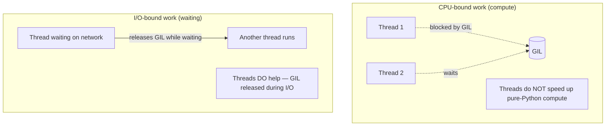
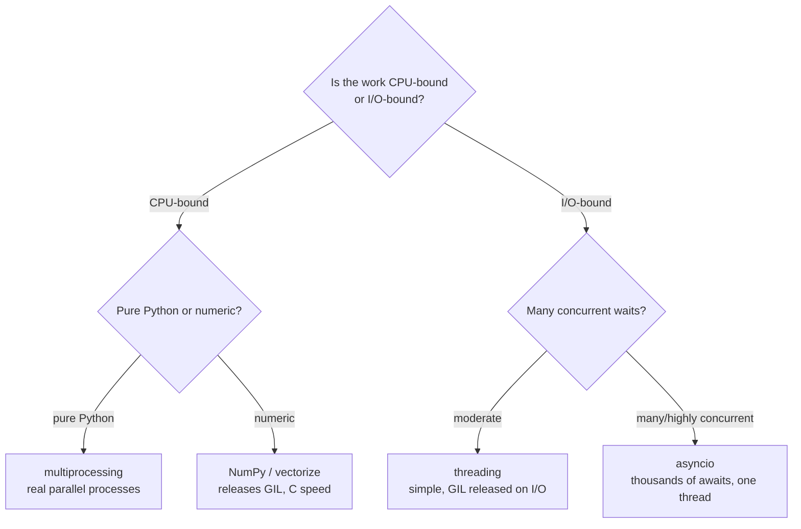

<!-- Module 01 · Lesson 11 — follows ../../../standards/. -->

# 01.11 · Performance Optimization

[⬅ 01.10 Testing](01.10-testing.md) · [🏠 Module](../README.md) · [🗺 Roadmap](../../../ROADMAP.md) · [Next ➡](01.12-async.md)

> Make it work, make it right, then make it fast — in that order, and only where it matters. This lesson covers complexity, profiling (measure before you optimize), caching, and the GIL-driven choice between threading, multiprocessing, and asyncio.

| | |
|---|---|
| **Module** | `01 · Advanced Python` |
| **Lesson** | `01.11` |
| **Difficulty** | ⭐⭐⭐⭐ |
| **Estimated study time** | 65 min read · 45 min practice |
| **Status** | 🟢 stable |

---

## 1. Learning Objectives

By the end of this lesson you will be able to:

- [ ] Reason about **time & space complexity** and pick the right data structure.
- [ ] **Profile** before optimizing with `timeit` and `cProfile`.
- [ ] Apply **caching** (`functools.cache`/`lru_cache`) correctly.
- [ ] Explain the **GIL** and its consequences.
- [ ] Choose between **threading, multiprocessing, and asyncio** for a given workload.
- [ ] Know when to reach for **NumPy/vectorization** instead of pure Python.

## 2. Prerequisites

- [01.1 · Architecture](01.1-python-architecture.md) (interpreter overhead, GIL context), [01.6 · Decorators](01.6-decorators.md) (`lru_cache`).

---

## 3. Why This Topic Exists

AI systems process large data and serve real users under latency and cost budgets. Slow code means higher bills, worse user experience, and pipelines that take hours instead of minutes. But performance work is also where engineers waste enormous effort — optimizing the wrong thing, adding complexity for no gain, or introducing bugs.

The discipline is: **measure first, optimize the bottleneck, verify the gain.** This lesson gives you the tools and the judgment to do that, plus the crucial Python-specific knowledge (the GIL) that determines which concurrency model actually helps.

> [!IMPORTANT]
> "Premature optimization is the root of all evil." Write correct, clear, tested code first ([01.10](01.10-testing.md)). Optimize only when you have a *measured* performance problem, and only the part the profiler points at. Guessing at bottlenecks is almost always wrong.

## 4. Problems It Solves

| Problem | This lesson's tools solve it by |
|---|---|
| Code too slow / too costly | Profiling to find the real bottleneck |
| Optimizing the wrong thing | Measure-first discipline |
| Recomputing expensive results | Caching/memoization |
| Threads not speeding up CPU work | Understanding the GIL |
| Wrong concurrency choice | Matching model to workload (CPU vs I/O) |
| Slow numeric loops | Vectorization (NumPy) |

---

## 5. Complexity — The First Lever

Before micro-optimizing, get the **algorithmic complexity** right. A better data structure or algorithm beats any amount of low-level tuning. (Full treatment in [Module 02 · CS](../../02-Computer-Science/README.md); here's the practical core.)

| Operation | list | dict / set |
|---|---|---|
| Membership `x in c` | O(n) — scans | **O(1)** — hash lookup |
| Lookup by key | — | **O(1)** |
| Append | O(1) amortized | — |
| Insert/delete at front | O(n) | — (use `collections.deque`: O(1)) |

```python
# ❌ O(n) membership in a loop → O(n²) overall
seen = []
for x in items:
    if x in seen:        # scans the whole list each time
        ...
    seen.append(x)

# ✅ O(1) membership with a set → O(n) overall
seen = set()
for x in items:
    if x in seen:        # hash lookup
        ...
    seen.add(x)
```

> [!IMPORTANT]
> The most common real-world Python speedup is **replacing an O(n) `in list` with an O(1) `in set`/`dict`**. Turning an accidental O(n²) into O(n) can be a 1000× win on large data — far more than any micro-optimization. Reach for the right data structure first.

---

## 6. Measure First — `timeit` and `cProfile`

> [!WARNING]
> **Never optimize based on intuition.** Humans are terrible at guessing bottlenecks. Profile, find where the time *actually* goes, fix that, then re-measure to confirm. Optimizing an unprofiled program wastes effort on code that isn't the problem.

### `timeit` — micro-benchmarks

```python
import timeit
# Compare two approaches fairly (many runs, avoids noise)
t_list = timeit.timeit("999 in data", setup="data=list(range(1000))", number=100000)
t_set  = timeit.timeit("999 in data", setup="data=set(range(1000))",  number=100000)
print(t_list, t_set)   # set membership is dramatically faster
```

### `cProfile` — find the bottleneck in a real program

```python
import cProfile, pstats

cProfile.run("run_pipeline()", "profile.out")
stats = pstats.Stats("profile.out")
stats.sort_stats("cumulative").print_stats(10)   # top 10 by cumulative time
```


| Tool | Use for |
|---|---|
| `timeit` | Comparing small snippets precisely |
| `cProfile` + `pstats` | Finding the bottleneck in a whole program |
| `line_profiler` (3rd-party) | Line-by-line timing of a hot function |
| `memory_profiler` / `tracemalloc` | Memory hotspots (from [01.2](01.2-memory-management.md)) |

> [!TIP]
> Sort `cProfile` output by **cumulative** time to find where the program spends its time overall, and by **tottime** (time *in* the function itself) to find the specific slow function. Optimize the top of the list; ignore the long tail.

---

## 7. Caching — Don't Recompute

If a pure function is called repeatedly with the same inputs, **memoize** it ([01.6](01.6-decorators.md)).

```python
import functools

@functools.cache                       # unbounded memo (3.9+); or lru_cache(maxsize=…)
def embed_query(text: str) -> tuple[float, ...]:
    return expensive_embedding(text)   # identical text → cached result

@functools.lru_cache(maxsize=10_000)   # bounded — evicts least-recently-used
def tokenize_cached(text: str) -> tuple[str, ...]:
    ...
```

| Tool | Behavior |
|---|---|
| `functools.cache` | Unbounded memoization (careful — can grow forever) |
| `functools.lru_cache(maxsize=N)` | Bounded; evicts least-recently-used |
| External cache (Redis, disk) | Cross-process/persistent (later modules) |

> [!WARNING]
> Two caching hazards from earlier lessons resurface: (1) **only cache pure functions** ([01.6](01.6-decorators.md)) — caching impure/time-dependent functions returns stale results; (2) **unbounded `@cache` is a memory leak** ([01.2](01.2-memory-management.md)) — in a long-running service, prefer `lru_cache(maxsize=…)`. Also: arguments must be **hashable** (no lists/dicts as cache keys).

---

## 8. The GIL — The Most Important Python Performance Fact

CPython has a **Global Interpreter Lock (GIL)**: only **one thread executes Python bytecode at a time**, even on a multi-core machine. This single fact determines your concurrency strategy.



| Implication | Detail |
|---|---|
| Threads **don't** parallelize CPU-bound Python | The GIL serializes bytecode execution |
| Threads **do** help I/O-bound work | The GIL is released while waiting on I/O |
| For CPU parallelism, use **processes** | Each process has its own interpreter + GIL |
| C extensions (NumPy) release the GIL | Heavy math runs in parallel *inside* the library |

> [!IMPORTANT]
> **The GIL is why "just add threads" often doesn't speed up Python.** For CPU-bound work (parsing millions of items, pure-Python math) threads give ~no speedup — use multiprocessing or push the work into a C-backed library (NumPy). For I/O-bound work (API calls, file/network) threads *and* asyncio work great because the waiting time overlaps. (Note: recent Python has experimental free-threaded/"no-GIL" builds, but assume the GIL in production today.)

---

## 9. Choosing a Concurrency Model

The decision flows almost entirely from **CPU-bound vs I/O-bound**.



| Model | Best for | Mechanism | Cost |
|---|---|---|---|
| **threading** | I/O-bound, moderate concurrency | OS threads; GIL released on I/O | Shared memory → race conditions; GIL limits CPU |
| **multiprocessing** | CPU-bound pure Python | Separate processes, own GILs | Memory per process; data serialization overhead |
| **asyncio** | I/O-bound, high concurrency | Single thread, cooperative `await` | Requires async-aware libraries; different mental model |
| **NumPy/vectorize** | Numeric CPU-bound | C loops that release the GIL | Must express work as array ops |

> [!IMPORTANT]
> **AI Engineering is dominated by I/O-bound work** — calling model APIs, reading data, hitting vector databases. That's why **asyncio** (Lesson 01.12) is so prevalent: you can have thousands of in-flight model API calls on one thread, overlapping all that waiting. CPU-heavy numeric work, meanwhile, is handled by GPU/NumPy/PyTorch, not Python threads.

---

## 10. Vectorization — Escape the Interpreter

Recall from [01.1](01.1-python-architecture.md) that per-operation interpreter overhead makes pure-Python numeric loops slow. **Vectorization** (NumPy) expresses the loop as a single array operation executed in optimized C, releasing the GIL.

```python
import numpy as np

# ❌ Pure Python — interpreter overhead per element
result = [x * 2 + 1 for x in big_list]        # slow for millions of elements

# ✅ Vectorized — one C-level operation over the whole array
arr = np.array(big_list)
result = arr * 2 + 1                            # ~10-100× faster, uses SIMD
```

| Pure Python loop | NumPy vectorized |
|---|---|
| Per-element interpreter overhead | One C loop over contiguous memory |
| Slow for large numeric data | Fast (SIMD, cache-friendly) |
| Flexible (any objects) | Numeric arrays |

> [!TIP]
> For numeric work over large data, **vectorize before you parallelize**. A vectorized NumPy operation is often faster than multiprocessed pure Python *and* simpler. You'll go deep on this in [Module 07 · Data Analysis](../../07-Data-Analysis/README.md); it's the bridge to why PyTorch tensors exist.

---

## 11. Common Mistakes & Debugging

| Mistake | Consequence | Fix |
|---|---|---|
| Optimizing without profiling | Wasted effort on non-bottlenecks | Profile first |
| Threads for CPU-bound work | No speedup (GIL) | multiprocessing / NumPy |
| Unbounded `@cache` in a service | Memory leak | `lru_cache(maxsize=…)` |
| Caching impure functions | Stale results | Cache pure functions only |
| `in list` on the hot path | Accidental O(n²) | Use a `set`/`dict` |
| Pure-Python numeric loops | Slow | Vectorize with NumPy |
| Micro-optimizing readable code | Complexity, bugs, no real gain | Optimize measured hotspots only |

---

## 12. Performance Notes (Meta)

| Note | Implication |
|---|---|
| Algorithmic wins dominate | O(n) vs O(n²) beats any constant-factor tuning |
| Measure, change one thing, re-measure | Attribute gains correctly |
| Readability has value | Don't trade it away for tiny, unmeasured gains |
| Most latency in AI apps is I/O | Concurrency (async) > CPU tuning for API-bound work |

## 13. Security Considerations

| Risk | Guidance |
|---|---|
| Unbounded caches | Memory-exhaustion DoS — cap sizes |
| Cache keyed by untrusted input | Attacker can bloat the cache — bound & validate |
| Multiprocessing + `pickle` | Data passed between processes is pickled — never unpickle untrusted data ([01.3](01.3-object-oriented-python.md)) |
| Resource exhaustion via unbounded concurrency | Cap concurrent tasks/threads/processes |

> [!CAUTION]
> Concurrency without limits is a self-inflicted DoS: launching unbounded threads/processes/tasks can exhaust memory, file descriptors, or downstream rate limits. Always bound concurrency (pools, semaphores) — you'll do this with `asyncio.Semaphore` in [01.12](01.12-async.md).

---

## 14. Interview Questions

**Beginner**
1. What is the GIL, and what does it mean for threading?
2. Why profile before optimizing?

**Intermediate**
1. When do threads help in Python, and when do they not?
2. Compare threading, multiprocessing, and asyncio — which for CPU-bound vs I/O-bound?

**Advanced**
1. Why can replacing a list with a set produce a 1000× speedup? Give the complexity analysis.
2. How does NumPy achieve speedups the GIL would otherwise prevent?

**System-design prompt**
- A pipeline makes 10,000 calls to a model API and then does heavy numeric post-processing. How do you make it fast? — *Follow-ups:* Which concurrency model for the API calls? For the numeric part? How do you bound concurrency and cost?

---

## 15. Summary

| Key idea | Takeaway |
|---|---|
| Complexity first | Right data structure beats micro-tuning |
| Measure first | `timeit`/`cProfile`; never guess |
| Cache pure functions | `lru_cache(maxsize=…)`, hashable args |
| The GIL | One thread runs Python bytecode at a time |
| Concurrency choice | CPU→processes/NumPy; I/O→threads/asyncio |
| Vectorize | NumPy escapes interpreter overhead + GIL |

## 16. Cheat Sheet

```text
ORDER: make it work → right → (measure) → fast, only where it matters
COMPLEXITY: in list = O(n) → use set/dict = O(1) ; deque for front ops
MEASURE: timeit (snippets) · cProfile+pstats (programs, sort by cumulative/tottime)
CACHE: @lru_cache(maxsize=N) pure fns, hashable args (unbounded @cache = leak risk)
GIL: 1 thread runs Python bytecode at a time (CPython)
  CPU-bound pure Python → multiprocessing ; numeric → NumPy (releases GIL)
  I/O-bound → threading (moderate) or asyncio (massive concurrency)
VECTORIZE: np arrays + array ops → C speed, no per-element interpreter cost
BOUND concurrency (pools/semaphores) — unbounded = DoS
```

## 17. Flashcards

- **Q:** What is the GIL and its consequence? — **A:** CPython's Global Interpreter Lock lets only one thread run Python bytecode at a time, so threads don't parallelize CPU-bound Python.
- **Q:** Threads help which workload? — **A:** I/O-bound (the GIL is released while waiting on I/O); not CPU-bound pure Python.
- **Q:** CPU-bound pure Python: what concurrency? — **A:** multiprocessing (separate processes/GILs) or push math into NumPy (C, releases GIL).
- **Q:** Why profile before optimizing? — **A:** Intuition about bottlenecks is usually wrong; profile, fix the measured hotspot, re-measure.
- **Q:** Biggest common Python speedup? — **A:** Replacing O(n) `in list` with O(1) `in set/dict`, turning O(n²) into O(n).
- **Q:** Caching pitfalls? — **A:** Only cache pure functions; bound size (`maxsize`) to avoid leaks; args must be hashable.

## 18. Hands-on Exercises

> Full set in [`../exercises/`](../exercises/).

- [ ] **(⭐ Complexity)** Benchmark `in list` vs `in set` for membership over 100k items with `timeit`. Report the ratio.
- [ ] **(⭐⭐ Profile)** Profile a deliberately slow pipeline with `cProfile`; identify and fix the top hotspot; re-measure.
- [ ] **(⭐⭐ Cache)** Add `lru_cache` to a recursive/expensive pure function; measure the speedup; then show the unbounded-cache memory risk.
- [ ] **(⭐⭐⭐ GIL)** Demonstrate that threads don't speed up a CPU-bound loop but do speed up an I/O-bound one (simulate I/O with `time.sleep`).
- [ ] **(⭐⭐⭐ Vectorize)** Rewrite a numeric Python loop in NumPy; compare timings on 10M elements.

## 19. Mini Project

> **Profile-guided optimizer.** Take a deliberately slow data-processing script (provided in the exercise), profile it with `cProfile`, and produce a short report: the top 3 bottlenecks, the fix for each (data-structure change, caching, vectorization), and before/after `timeit` numbers. The deliverable is the *methodology*, not just a faster script — this is how real optimization work is done and communicated.

## 20. References

- Python docs — *`timeit`*, *`cProfile`/`profile`*, *`functools`*, *`multiprocessing`*, *`threading`* ([reference standards](../../../standards/reference-standards.md)).
- NumPy documentation — vectorization and broadcasting.
- Talks/articles on the CPython GIL (and the free-threading effort) for depth.

## 21. What's Next

The dominant AI workload — many concurrent API calls — is I/O-bound, and **asyncio** is the tool built for it. Next we go deep on the event loop, `async`/`await`, tasks, and why AI SDKs are async-first.

➡️ **Next:** [01.12 · Async Programming](01.12-async.md)

---

### 🔁 Revision checklist
- [ ] I profile before optimizing (`timeit`/`cProfile`)
- [ ] I can explain the GIL and pick the right concurrency model
- [ ] I cache pure functions with bounded size
- [ ] I vectorized a numeric loop with NumPy

### 🔗 Spaced-repetition callback
> Recall [01.1's interpreter overhead](01.1-python-architecture.md): the GIL and per-operation cost are the *same* CPython design showing up as performance limits — and the *same* reason NumPy/PyTorch push computation into C/CUDA. And [01.2's unbounded-cache leak](01.2-memory-management.md) is why `lru_cache` needs `maxsize`.
