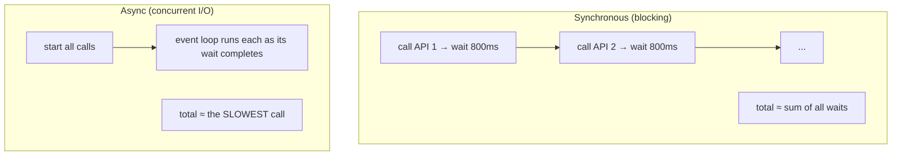
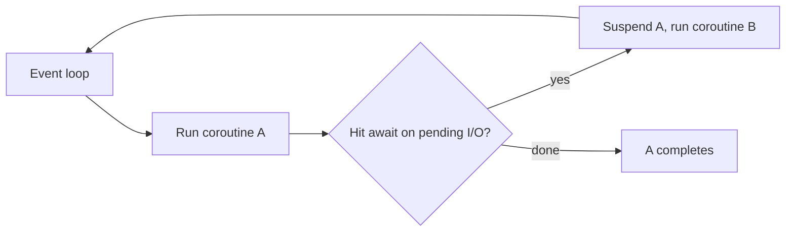
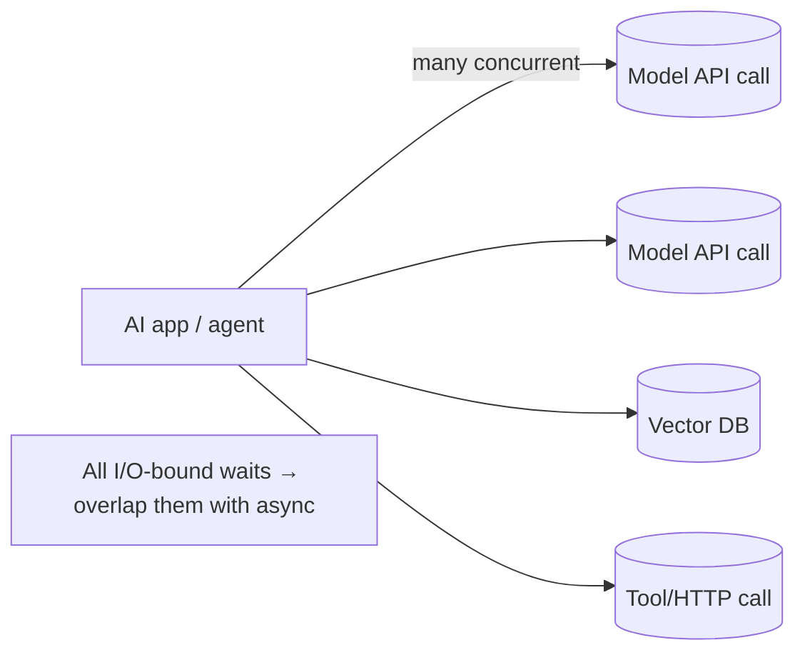

<!-- Module 01 · Lesson 12 — follows ../../../standards/. -->

# 01.12 · Async Programming

[⬅ 01.11 Performance](01.11-performance.md) · [🏠 Module](../README.md) · [🗺 Roadmap](../../../ROADMAP.md) · [Next ➡](01.13-packaging-code-quality.md)

> `asyncio` lets one thread juggle thousands of concurrent I/O operations by *cooperatively* switching whenever code waits. It's the reason AI SDKs are async-first: while one model API call is in flight, hundreds of others can be too.

| | |
|---|---|
| **Module** | `01 · Advanced Python` |
| **Lesson** | `01.12` |
| **Difficulty** | ⭐⭐⭐⭐ |
| **Estimated study time** | 65 min read · 45 min practice |
| **Status** | 🟢 stable |

---

## 1. Learning Objectives

By the end of this lesson you will be able to:

- [ ] Explain the **event loop** and cooperative multitasking.
- [ ] Write **coroutines** with `async def` and `await`.
- [ ] Run coroutines concurrently with **tasks** and `asyncio.gather`.
- [ ] Bound concurrency with a **semaphore**.
- [ ] Avoid the cardinal sin: **blocking the event loop**.
- [ ] Explain **why AI APIs and SDKs are async-first**.

## 2. Prerequisites

- [01.11 · Performance](01.11-performance.md) — the GIL, and CPU-bound vs I/O-bound.
- [01.5 · Iterators & Generators](01.5-iterators-generators.md) — coroutines are conceptually pausable functions.

---

## 3. Why This Topic Exists

An AI application's time is dominated by **waiting** — for model API responses, database queries, HTTP calls. A synchronous program waits idly: call the API, block for 800 ms doing nothing, then continue. If you need 1,000 such calls, that's ~13 minutes of mostly *waiting*.

`asyncio` fills that idle time. While one call waits, the event loop runs other work. Those same 1,000 calls can complete in the time of the slowest few — seconds, not minutes. Since AI Engineering is overwhelmingly I/O-bound ([01.11](01.11-performance.md)), async is a core skill, and virtually every modern model SDK, web framework, and DB client offers an async API.

> [!IMPORTANT]
> Async's superpower is **overlapping waiting**, not doing more compute. It shines for **I/O-bound concurrency** — many things waiting at once. It does *nothing* for CPU-bound work (that's still multiprocessing/NumPy). Match the tool to the workload.

## 4. Problems It Solves

| Problem | asyncio solves it by |
|---|---|
| 1,000 API calls take forever sequentially | Overlapping the waits — near-slowest-call time |
| Threads are heavy / GIL-limited for scale | One thread handling thousands of awaits |
| A server blocked while waiting on I/O | Handling other requests during the wait |
| Complex callback spaghetti | Linear-looking `async`/`await` code |

---

## 5. Mental Model: One Chef, Many Dishes

Synchronous = one chef who starts a dish, stands and watches the oven for 30 minutes, then starts the next. Async = one chef who puts a dish in the oven and, *while it bakes*, preps the next dish. Same chef (one thread), far more throughput — because the oven-waiting (I/O) overlaps.



> [!IMPORTANT]
> **Concurrency ≠ parallelism.** asyncio gives *concurrency* on a single thread (tasks take turns at `await` points), not CPU *parallelism*. That's exactly right for I/O: the CPU isn't the bottleneck — the waiting is.

---

## 6. The Event Loop & Cooperative Multitasking

The **event loop** is the scheduler at asyncio's heart. It runs one coroutine until it hits an `await` on something not ready (an I/O wait), then *suspends* it and runs another ready coroutine. When the awaited result arrives, it resumes the first.



| Term | Meaning |
|---|---|
| **Event loop** | The scheduler that runs/suspends/resumes coroutines |
| **Cooperative** | Tasks yield control *voluntarily* at `await` — no preemption |
| **`await` point** | Where a coroutine can pause and hand control back |

> [!WARNING]
> **Cooperative** is the crucial word: a task keeps the loop until it hits `await`. If a coroutine does heavy CPU work or a *blocking* call without `await`ing, it **freezes the entire loop** — every other task stalls. This is the #1 asyncio bug (§10).

---

## 7. Coroutines: `async def` and `await`

An `async def` function is a **coroutine**. Calling it doesn't run it — it returns a coroutine object you must `await` (or schedule). `await` suspends until the awaited awaitable completes.

```python
import asyncio

async def fetch(url: str) -> str:
    print(f"start {url}")
    await asyncio.sleep(1)          # simulates I/O wait — yields to the loop
    print(f"done {url}")
    return f"result of {url}"

async def main() -> None:
    result = await fetch("a")       # await runs it and waits for the result
    print(result)

asyncio.run(main())                 # the entry point that starts the event loop
```

| Rule | Detail |
|---|---|
| `async def` → coroutine | Calling it returns a coroutine object |
| Must `await` (or schedule) it | Otherwise it never runs (a common bug) |
| `await` only inside `async def` | `SyntaxError` otherwise |
| `asyncio.run(main())` | Starts the loop and runs the top-level coroutine |

> [!NOTE]
> A coroutine is conceptually a pausable function — the same "suspend and resume" idea as generators ([01.5](01.5-iterators-generators.md)), which is historically how coroutines were built. `await` is the suspension point.

---

## 8. Running Things Concurrently — Tasks & `gather`

Awaiting one coroutine at a time is still sequential. To get concurrency, schedule multiple coroutines as **tasks** and await them together.

```python
import asyncio

async def fetch(url: str) -> str:
    await asyncio.sleep(1)
    return f"result of {url}"

async def main() -> None:
    urls = ["a", "b", "c", "d"]
    # Run ALL concurrently; total ≈ 1s, not 4s
    results = await asyncio.gather(*(fetch(u) for u in urls))
    print(results)

asyncio.run(main())
```

```mermaid
sequenceDiagram
    participant Loop
    participant A as fetch(a)
    participant B as fetch(b)
    Loop->>A: start
    A-->>Loop: await sleep (suspend)
    Loop->>B: start
    B-->>Loop: await sleep (suspend)
    Note over Loop: both waiting concurrently (~1s total)
    A-->>Loop: resume, return
    B-->>Loop: resume, return
```

| Tool | Use |
|---|---|
| `asyncio.gather(*coros)` | Run many concurrently, collect all results |
| `asyncio.create_task(coro)` | Schedule a coroutine to run concurrently now |
| `asyncio.TaskGroup()` (3.11+) | Structured concurrency with clean error handling |
| `asyncio.as_completed(...)` | Process results as each finishes |
| `asyncio.wait_for(coro, timeout)` | Bound how long you'll wait |

> [!TIP]
> `asyncio.gather` is the workhorse for AI code: fan out N model API calls and await them all concurrently. In Python 3.11+, `TaskGroup` is preferred for robustness — if one task fails, it cancels the siblings and propagates cleanly (structured concurrency).

---

## 9. Bounding Concurrency with a Semaphore

Firing 10,000 API calls at once will blow past rate limits, exhaust memory/sockets, and get you throttled. **Bound** concurrency with a semaphore (echoing the "cap concurrency" warning from [01.11](01.11-performance.md)).

```python
import asyncio

async def fetch_limited(url: str, sem: asyncio.Semaphore) -> str:
    async with sem:                      # at most N run this block at once
        await asyncio.sleep(1)
        return f"result of {url}"

async def main(urls: list[str]) -> list[str]:
    sem = asyncio.Semaphore(10)          # cap: 10 concurrent in-flight calls
    return await asyncio.gather(*(fetch_limited(u, sem) for u in urls))
```

> [!IMPORTANT]
> **Always bound concurrency for external calls.** A semaphore caps in-flight requests to respect rate limits, control cost, and avoid resource exhaustion. Unbounded `gather` over thousands of calls is a classic way to DoS yourself and get rate-limited. This pattern — semaphore + gather — is the backbone of concurrent LLM batch processing you'll use in later modules.

---

## 10. The Cardinal Sin: Blocking the Event Loop

Because scheduling is cooperative, a single blocking call stalls *everything*.

```python
# ❌ Blocks the entire event loop — all other tasks freeze for 5s
async def bad():
    time.sleep(5)                        # synchronous, blocking!
    requests.get(url)                    # synchronous HTTP — blocks the loop

# ✅ Use async equivalents that yield to the loop
async def good():
    await asyncio.sleep(5)               # non-blocking
    await async_http_client.get(url)     # async HTTP (e.g., httpx/aiohttp)

# ✅ For unavoidable blocking/CPU work, offload to a thread/process pool
async def offloaded():
    result = await asyncio.to_thread(cpu_or_blocking_function, arg)
```

| Blocking (freezes loop) | Async-friendly |
|---|---|
| `time.sleep()` | `await asyncio.sleep()` |
| `requests.get()` | `await httpx.AsyncClient().get()` |
| Sync DB driver | Async DB driver |
| Heavy CPU loop | `await asyncio.to_thread(...)` / process pool |

> [!WARNING]
> **Never call blocking functions inside a coroutine without offloading them.** A synchronous `requests.get()` or a CPU-heavy loop inside `async def` blocks the whole event loop, destroying all concurrency — the most common and most confusing async bug ("why is my async code slow?"). Use async libraries, or `asyncio.to_thread` for unavoidable blocking calls.

---

## 11. Why AI APIs Are Async-First



| AI scenario | Why async fits |
|---|---|
| Batch-processing many prompts | Fan out concurrent API calls; finish in ~slowest-call time |
| An agent making many tool/model calls | Overlap independent calls |
| A serving endpoint under load | Handle many requests while each awaits the model |
| RAG: retrieve + rerank + generate | Concurrent I/O to DB and model |

> [!IMPORTANT]
> Model SDKs, web frameworks (FastAPI), vector DB clients, and HTTP libraries all offer **async** interfaces precisely because AI workloads are I/O-bound and highly concurrent. Fluency in `async`/`await` is not optional for building responsive, cost-effective AI systems — you'll use it directly from [Module 11 (LLMs)](../../11-LLMs/README.md) onward.

---

## 12. Common Mistakes & Debugging

| Mistake | Consequence | Fix |
|---|---|---|
| Forgetting to `await` a coroutine | It never runs; get a warning | `await` or schedule it |
| Blocking call inside `async def` | Freezes the whole loop | Use async libs / `to_thread` |
| Unbounded `gather` over many calls | Rate limits, resource exhaustion | Bound with a semaphore |
| Using async for CPU-bound work | No speedup | Multiprocessing / NumPy |
| Mixing sync and async carelessly | Deadlocks/confusion | Keep boundaries clear; `asyncio.run` at the top |
| Not handling task exceptions | Silent failures | `TaskGroup` / check `gather` results |

---

## 13. Performance Notes

| Note | Implication |
|---|---|
| Async excels at I/O concurrency | Thousands of concurrent waits on one thread |
| Zero benefit for CPU-bound | Still need processes/NumPy |
| Lower overhead than threads at scale | No per-connection OS thread |
| Bounded concurrency | Semaphore prevents overload and respects rate limits |
| One blocking call kills throughput | Keep the loop free |

## 14. Security Considerations

| Risk | Guidance |
|---|---|
| Unbounded concurrent requests | Self-DoS / triggering rate limits — bound with semaphores |
| No timeouts | A hung remote call ties up a task forever — use `wait_for`/timeouts |
| Resource exhaustion (sockets/FDs) | Cap concurrency; reuse client sessions |
| Unhandled task exceptions | Silent failures hide security-relevant errors — use `TaskGroup` |

> [!CAUTION]
> Always set **timeouts** on external async calls (`asyncio.wait_for`, client timeouts). Without them, a single unresponsive remote service can pile up hung tasks until you exhaust resources — a denial-of-service on yourself.

---

## 15. Interview Questions

**Beginner**
1. What's the difference between concurrency and parallelism? Which does asyncio provide?
2. What does `await` do?

**Intermediate**
1. Why does a blocking call inside a coroutine hurt so much?
2. How do you run many API calls concurrently and bound the concurrency?

**Advanced**
1. Why is asyncio a better fit than threads for 10,000 concurrent I/O waits?
2. When is asyncio the *wrong* tool, and what do you use instead?

**System-design prompt**
- Design a service that processes a batch of 50,000 prompts against a rate-limited model API as fast as possible. — *Follow-ups:* How do you bound concurrency? Handle failures/timeouts/retries? Avoid blocking the loop? What if post-processing is CPU-heavy?

---

## 16. Summary

| Key idea | Takeaway |
|---|---|
| Event loop | Cooperative scheduler; runs/suspends coroutines at `await` |
| Coroutines | `async def` + `await`; must be awaited/scheduled |
| Concurrency | `gather`/`TaskGroup` overlap I/O waits |
| Bound it | Semaphore caps in-flight calls |
| Never block the loop | Use async libs or `to_thread` |
| AI is I/O-bound | Async is the right tool; SDKs are async-first |

## 17. Cheat Sheet

```text
CONCEPT: single-thread CONCURRENCY (not parallelism); overlaps I/O WAITS
DEFINE: async def coro(): ... ; await something   (await only inside async def)
RUN TOP: asyncio.run(main())
CONCURRENT: await asyncio.gather(*coros)  ·  create_task(coro)  ·  TaskGroup() (3.11+)
BOUND: sem = asyncio.Semaphore(N); async with sem: ...   (cap external calls)
TIMEOUT: await asyncio.wait_for(coro, timeout=…)
NEVER BLOCK: no time.sleep/requests inside async → use asyncio.sleep / async HTTP
  unavoidable blocking/CPU → await asyncio.to_thread(fn, arg)
USE FOR: I/O-bound (API/DB/HTTP) ; NOT CPU-bound (→ multiprocessing/NumPy)
```

## 18. Flashcards

- **Q:** Concurrency vs parallelism — which is asyncio? — **A:** Concurrency (tasks take turns on one thread at `await` points), not CPU parallelism.
- **Q:** What does the event loop do at an `await` on pending I/O? — **A:** Suspends that coroutine and runs another ready one, resuming the first when its result is ready.
- **Q:** Why is a blocking call in a coroutine so bad? — **A:** Scheduling is cooperative — a blocking call never yields, freezing the entire loop and all tasks.
- **Q:** How do you run many coroutines concurrently? — **A:** `asyncio.gather(*coros)` or a `TaskGroup`; schedule with `create_task`.
- **Q:** How do you bound concurrency for external calls? — **A:** An `asyncio.Semaphore(N)` via `async with sem:` to cap in-flight requests.
- **Q:** When is asyncio the wrong tool? — **A:** For CPU-bound work — it gives no speedup; use multiprocessing or NumPy.

## 19. Hands-on Exercises

> Full set in [`../exercises/`](../exercises/).

- [ ] **(⭐ Basic)** Write two coroutines with `asyncio.sleep`; run them with `gather` and confirm total time ≈ the longest, not the sum.
- [ ] **(⭐⭐ Fan-out)** Simulate 100 "API calls" concurrently; compare wall-clock time vs a sequential version.
- [ ] **(⭐⭐ Semaphore)** Add a semaphore to cap concurrency at 10; observe the effect on timing and "rate limits."
- [ ] **(⭐⭐⭐ Debug)** Introduce a `time.sleep()` in a coroutine, observe the loop freeze, then fix it with `asyncio.sleep`/`to_thread`.
- [ ] **(⭐⭐⭐ Robust)** Use `TaskGroup` (or `gather(return_exceptions=True)`) plus `wait_for` timeouts so one failing/hung call doesn't sink the batch.

## 20. Mini Project

> **Async API client (the module's showcase project, v2).** Turn the resilient client from [Lesson 01.9](01.9-error-handling-logging.md) into an **async** batch processor: given N prompts, call a simulated async "model API" concurrently, bounded by a semaphore, with per-call timeout, retry-with-backoff, structured logging, and graceful handling of partial failures. Include an architecture diagram and folder structure. This is the real shape of production LLM batch code — you'll reuse it constantly.

## 21. References

- Python docs — *`asyncio`* (event loop, tasks, `gather`, `TaskGroup`, semaphores) ([reference standards](../../../standards/reference-standards.md)).
- `httpx` / `aiohttp` (async HTTP), and async model-provider SDKs.
- "Concurrency vs parallelism" primers, for depth.

## 22. What's Next

Your code is fast and concurrent. Now make it **shippable and consistently high-quality** with proper packaging (`pyproject.toml`, uv/poetry) and the automated quality tools (Ruff, Black, isort, mypy, pre-commit) that keep a codebase clean at scale.

➡️ **Next:** [01.13 · Packaging & Code Quality](01.13-packaging-code-quality.md)

---

### 🔁 Revision checklist
- [ ] I can write and run concurrent coroutines with `gather`
- [ ] I bound concurrency with a semaphore
- [ ] I never block the event loop (async libs / `to_thread`)
- [ ] I understand why AI SDKs are async-first

### 🔗 Spaced-repetition callback
> Recall [01.11's decision tree](01.11-performance.md): async is the "I/O-bound, high concurrency" branch. And [01.9's retry](01.9-error-handling-logging.md) + [01.8's validation](01.8-type-hinting.md) plug straight into the async client here — resilience patterns don't change, they just become `await`-ed.
