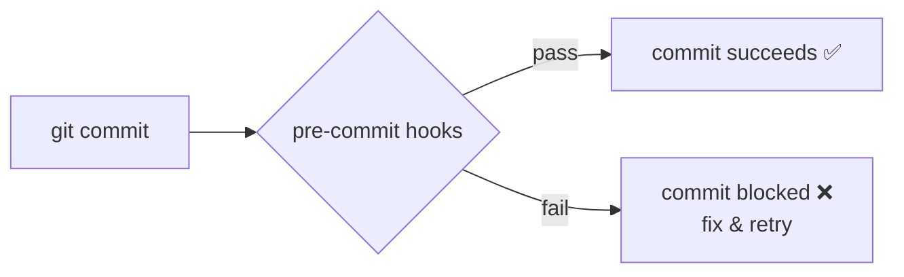

<!-- Module 01 · Lesson 13 — follows ../../../standards/. -->

# 01.13 · Packaging & Code Quality

[⬅ 01.12 Async](01.12-async.md) · [🏠 Module](../README.md) · [🗺 Roadmap](../../../ROADMAP.md) · [Next ➡](01.14-reading-open-source.md)

> Turn a folder of scripts into a real, installable, reproducible project — and keep its quality automatically high. This lesson covers `pyproject.toml`, uv/poetry, project layout, and the tooling (Ruff, Black, isort, mypy, pre-commit) that professional teams rely on.

| | |
|---|---|
| **Module** | `01 · Advanced Python` |
| **Lesson** | `01.13` |
| **Difficulty** | ⭐⭐⭐ |
| **Estimated study time** | 55 min read · 40 min setup |
| **Status** | 🟢 stable |

---

## 1. Learning Objectives

By the end of this lesson you will be able to:

- [ ] Structure a Python project the standard `src/` way.
- [ ] Configure a project with **`pyproject.toml`** (the single source of truth).
- [ ] Manage dependencies with **uv** (or poetry/pip) and a **lockfile**.
- [ ] Install your project in **editable** mode and understand why.
- [ ] Enforce style/quality with **Ruff, Black, isort, mypy**.
- [ ] Automate checks with **pre-commit hooks**.

## 2. Prerequisites

- [Module 00.5–00.6](../../00-Orientation/weeks/00.5-development-environment.md) (environments, Git) and [01.1](01.1-python-architecture.md) (the import system).

---

## 3. Why This Topic Exists

A pile of `.py` files that only runs from one directory on one machine is not a project — it's a liability. **Packaging** turns your code into something installable, importable, reproducible, and shareable. **Code quality tooling** keeps it consistently clean as it (and your team) grows, so review focuses on logic instead of style, and bugs are caught automatically.

This is the concrete, professional version of the reproducibility and workflow ideas from [Module 00](../../00-Orientation/README.md). Every serious AI project — and every framework you'll read in [Lesson 01.14](01.14-reading-open-source.md) — is structured this way.

> [!IMPORTANT]
> The finish line: someone can `git clone` your project, run one install command, and have an identical, working environment — with formatting/linting/typing enforced automatically. That's the difference between a script and software.

## 4. Problems It Solves

| Problem | Packaging + quality tooling solve it by |
|---|---|
| "Works only in my folder" | Installable package + proper imports |
| "Works on my machine" | Declared deps + lockfile |
| Import errors between modules | `src/` layout + editable install |
| Style debates in code review | Auto-formatting (Ruff/Black) |
| Inconsistent imports | isort |
| Type bugs slipping in | mypy in CI/pre-commit |
| Broken code committed | pre-commit hooks gate every commit |

---

## 5. Standard Project Layout (`src/` layout)

```text
my-ai-project/
├── pyproject.toml          # metadata, deps, tool config — single source of truth
├── README.md
├── .gitignore
├── uv.lock                 # (or poetry.lock) — exact pinned versions
├── src/
│   └── my_ai_project/      # the importable package
│       ├── __init__.py
│       ├── client.py
│       └── pipeline.py
├── tests/                  # pytest suite (Lesson 01.10)
│   └── test_pipeline.py
└── .pre-commit-config.yaml # automated quality gates
```

| Choice | Why |
|---|---|
| **`src/` layout** | Prevents accidentally importing the package from the repo root instead of the installed version — catches packaging bugs early |
| `__init__.py` | Marks the directory as a package (defines the import namespace) |
| `tests/` separate | Tests aren't shipped with the package |
| `pyproject.toml` at root | The one config file to rule them all |

> [!TIP]
> Prefer the **`src/` layout** for anything real. It forces you to *install* your package to import it, which means your tests exercise the same code your users install — surfacing packaging mistakes that a flat layout hides.

---

## 6. `pyproject.toml` — The Single Source of Truth

Modern Python consolidates project metadata, dependencies, and tool configuration into one standardized file ([PEP 518/621](https://peps.python.org/pep-0621/)).

```toml
[project]
name = "my-ai-project"
version = "0.1.0"
description = "A production AI service"
requires-python = ">=3.11"
dependencies = [
    "pydantic>=2.0",
    "httpx>=0.27",
]

[project.optional-dependencies]
dev = ["pytest>=8", "mypy>=1.10", "ruff>=0.5", "pre-commit>=3"]

[project.scripts]
myai = "my_ai_project.cli:main"      # creates a `myai` command on install

[build-system]
requires = ["hatchling"]
build-backend = "hatchling.build"

[tool.ruff]
line-length = 88

[tool.mypy]
strict = true
```

| Section | Purpose |
|---|---|
| `[project]` | Name, version, Python requirement, runtime deps |
| `[project.optional-dependencies]` | Dev/test/docs extras (`pip install .[dev]`) |
| `[project.scripts]` | Console entry points (CLI commands) |
| `[build-system]` | How the package is built |
| `[tool.*]` | Configuration for Ruff, mypy, pytest, etc. — all in one place |

> [!NOTE]
> `pyproject.toml` replaced the old scatter of `setup.py`, `setup.cfg`, `requirements.txt`, and per-tool config files. One file, standardized, tool-agnostic. This is what you'll see in every modern repo.

---

## 7. Dependency Management: uv, poetry, pip

Recall from [Module 00.5](../../00-Orientation/weeks/00.5-development-environment.md): a package manager **resolves**, **locks**, and **installs** dependencies reproducibly.

```bash
# uv (recommended: fast, manages Python + venv + deps)
uv init my-ai-project
uv add pydantic httpx           # runtime deps
uv add --dev pytest ruff mypy   # dev deps
uv run pytest                    # run inside the managed env
uv sync                          # recreate the exact env from the lockfile
```

| Tool | Notes |
|---|---|
| **uv** | Very fast; manages Python versions, venvs, deps, lockfile — this handbook's default |
| **poetry** | Mature, popular; great resolver; `poetry.lock` |
| **pip + venv** | Always available; use with `pyproject.toml`; weaker locking without extra tools |

> [!IMPORTANT]
> **Commit the lockfile (`uv.lock`/`poetry.lock`); never commit `.venv/`.** The lockfile pins *exact* versions of every dependency (including transitive ones) so everyone — and CI, and production — builds the identical environment. This is reproducibility ([00.5](../../00-Orientation/weeks/00.5-development-environment.md)) made concrete.

### Editable install — the fix for import errors

```bash
uv pip install -e .        # or: pip install -e .
```

An **editable install** links your package into the environment so `import my_ai_project` works from anywhere *and* reflects your live edits. This — not `sys.path` hacks ([01.1](01.1-python-architecture.md)) — is the correct fix for "my modules can't import each other."

---

## 8. Code Quality Tooling

Automated tools enforce consistency so humans don't have to. Each has a distinct job (recall the formatter/linter/type-checker distinction from [00.5](../../00-Orientation/weeks/00.5-development-environment.md)).


| Tool | Job | Answers |
|---|---|---|
| **PEP 8** | The style *standard* (not a tool) | "What is idiomatic Python style?" |
| **Black** | Opinionated auto-formatter | "Format my code consistently" |
| **isort** | Sorts/groups imports | "Order my imports" |
| **Ruff** | Ultra-fast linter **+ formatter + import sorting** | "Find bugs/smells; format; sort imports" |
| **mypy** | Static type checker | "Do the types line up?" ([01.8](01.8-type-hinting.md)) |

> [!TIP]
> **Ruff has largely consolidated this stack** — it lints, formats (Black-compatible), and sorts imports (isort-compatible), extremely fast, configured in `pyproject.toml`. Many modern projects use **Ruff + mypy** and drop separate Black/isort. Know all the names (you'll see them in older repos), but you can standardize on Ruff.

```bash
ruff format .        # format (replaces Black)
ruff check . --fix   # lint + sort imports + autofix (replaces isort + flake8)
mypy src/            # type-check
```

### Why these matter professionally

| Benefit | Explanation |
|---|---|
| No style debates | The formatter decides; reviews focus on logic |
| Smaller diffs | Consistent formatting = clean, reviewable diffs |
| Bugs caught early | Linter + types find issues before runtime |
| Faster onboarding | New contributors match the style automatically |
| Consistent codebase | Reads like one author, even with many contributors |

---

## 9. Pre-commit Hooks — Automate the Gate

**pre-commit** runs your quality checks automatically on every `git commit`, so bad code never even enters history. It's the enforcement mechanism that makes the tools above reliable (nobody has to *remember* to run them).

```yaml
# .pre-commit-config.yaml
repos:
  - repo: https://github.com/astral-sh/ruff-pre-commit
    rev: v0.6.0
    hooks:
      - id: ruff          # lint + autofix
      - id: ruff-format   # format
  - repo: https://github.com/pre-commit/mirrors-mypy
    rev: v1.11.0
    hooks:
      - id: mypy
```

```bash
uv add --dev pre-commit
pre-commit install          # activate the git hook (do this once)
# now every `git commit` runs the hooks; commit is blocked if they fail
```



> [!IMPORTANT]
> Pre-commit hooks + the same checks in **CI** ([Module 16 · MLOps](../../16-MLOps/README.md)) form a two-layer net: hooks catch issues locally (fast feedback), CI guarantees they can't be bypassed. Together they keep the whole codebase clean automatically — the mechanical backbone of the "maintainable code" mindset from [Module 00.10](../../00-Orientation/weeks/00.10-ai-engineer-mindset.md).

---

## 10. Common Mistakes & Debugging

| Mistake | Consequence | Fix |
|---|---|---|
| Flat layout, no install | Import errors; tests pass but package is broken | `src/` layout + editable install |
| `sys.path` hacks | Fragile, non-reproducible imports | Install the package (`-e .`) |
| Not committing the lockfile | Non-reproducible envs | Commit `uv.lock`/`poetry.lock` |
| Committing `.venv/` | Bloated, broken repo | `.gitignore` it |
| Formatting by hand | Style debates, noisy diffs | Ruff/Black auto-format |
| Tools not enforced | Inconsistent codebase | pre-commit + CI |
| Multiple overlapping formatters | Tools fighting | Standardize on Ruff |

---

## 11. Performance Notes

| Note | Implication |
|---|---|
| Ruff is Rust-fast | Lint/format huge codebases in milliseconds — no excuse to skip |
| uv is very fast | Installs/resolves far quicker than pip — faster CI |
| Editable install | No perf cost; dev convenience |
| pre-commit runs only on changed files | Fast local feedback |

## 12. Security Considerations

| Risk | Guidance |
|---|---|
| Dependency confusion / typosquatting | Verify package names/sources; pin & lock ([01.1](01.1-python-architecture.md)) |
| Unpinned deps | Supply-chain drift; a bad update breaks/attacks you | Lockfile pins exact versions |
| Malicious packages run on install | Installing executes code — vet new deps | Review before adding |
| Secrets in `pyproject.toml`/config | Leak on publish | Keep secrets in env/`.env`, never in committed config |
| Outdated deps with CVEs | Known vulnerabilities | Audit (`pip-audit`/`uv`), update regularly |

> [!CAUTION]
> Your dependency list is a **supply-chain trust boundary**. A pinned lockfile protects against surprise updates, but you must still *vet* new dependencies (installing them runs their code — [01.1](01.1-python-architecture.md)) and periodically audit for known vulnerabilities. Add dependencies deliberately, not casually.

---

## 13. Interview Questions

**Beginner**
1. What is `pyproject.toml`, and what did it replace?
2. Why commit the lockfile but not `.venv/`?

**Intermediate**
1. Why use a `src/` layout and an editable install?
2. What's the difference between a formatter, a linter, and a type checker? Name a tool for each.

**Advanced**
1. How do pre-commit hooks and CI complement each other?
2. How do you keep a project's dependencies reproducible *and* secure over time?

**System-design prompt**
- Set up a new AI project so any engineer can clone it and be productive in minutes, with quality enforced automatically. — *Follow-ups:* What's in `pyproject.toml`? How do you enforce format/lint/type checks? How do you keep environments identical across dev, CI, and prod?

---

## 14. Summary

| Key idea | Takeaway |
|---|---|
| `src/` layout | Import the installed package; catch packaging bugs |
| `pyproject.toml` | One file: metadata, deps, tool config |
| Lockfile | Commit it; exact reproducible environments |
| Editable install | The right fix for inter-module imports |
| Ruff (+mypy) | Format, lint, sort imports, type-check |
| pre-commit + CI | Automated, unbypassable quality gates |

## 15. Cheat Sheet

```text
LAYOUT: src/pkg/__init__.py · tests/ · pyproject.toml · README · .gitignore · lockfile
PYPROJECT: [project] deps · [optional-dependencies] dev · [project.scripts] cli · [tool.*] config
UV: uv init · uv add X · uv add --dev X · uv run … · uv sync (rebuild from lock)
INSTALL EDITABLE: uv pip install -e .   (fixes inter-module imports; no sys.path hacks)
COMMIT: pyproject.toml + lockfile   IGNORE: .venv/
QUALITY: ruff format (Black-style) · ruff check --fix (lint+isort) · mypy src/
PRE-COMMIT: .pre-commit-config.yaml → pre-commit install → runs on every commit
SECURITY: lock+pin · vet new deps (install runs code) · audit CVEs · secrets in env not config
```

## 16. Flashcards

- **Q:** What is `pyproject.toml` and what did it replace? — **A:** The standardized single config for metadata, dependencies, and tool settings; it replaced `setup.py`/`setup.cfg`/`requirements.txt`/scattered configs.
- **Q:** Why the `src/` layout? — **A:** It forces installing the package to import it, so tests run the same code users install — catching packaging bugs.
- **Q:** Commit vs ignore for reproducibility? — **A:** Commit `pyproject.toml` + lockfile; ignore `.venv/`.
- **Q:** Correct fix for inter-module import errors? — **A:** An editable install (`pip install -e .`), not `sys.path` hacks.
- **Q:** What does Ruff consolidate? — **A:** Linting, formatting (Black-compatible), and import sorting (isort-compatible) — fast, one tool.
- **Q:** What do pre-commit hooks do? — **A:** Run quality checks automatically on every commit, blocking commits that fail — enforcing the tools reliably.

## 17. Hands-on Exercises

> Full set in [`../exercises/`](../exercises/).

- [ ] **(⭐ Setup)** Create a `src/`-layout project with `pyproject.toml`; install it editable; import your package from a REPL elsewhere.
- [ ] **(⭐ Deps)** Add runtime and dev dependencies with uv; inspect the lockfile; run `uv sync` to rebuild.
- [ ] **(⭐⭐ Quality)** Configure Ruff + mypy in `pyproject.toml`; format, lint, and type-check a messy file until clean.
- [ ] **(⭐⭐ Entry point)** Add a `[project.scripts]` console command and run it after install.
- [ ] **(⭐⭐⭐ pre-commit)** Add `.pre-commit-config.yaml` with Ruff + mypy; install hooks; try to commit failing code and watch it get blocked.

## 18. Mini Project

> **Package the module's showcase project.** Take the async API client from [Lesson 01.12](01.12-async.md) and turn it into a proper installable package: `src/` layout, complete `pyproject.toml` (deps, dev extras, a CLI entry point), lockfile, Ruff + mypy config, a `tests/` suite, and pre-commit hooks. Deliverable: a repo someone can clone, `uv sync`, and run — clean and reproducible. This is the packaging you'll apply to every future project.

## 19. References

- Python Packaging User Guide; PEP 517/518/621 ([reference standards](../../../standards/reference-standards.md)).
- Docs for **uv**, **poetry**, **Ruff**, **mypy**, **pre-commit**.
- PEP 8 — the style guide the formatters implement.

## 20. What's Next

You can build professional projects. The final skill of this module is *reading* others' projects: navigating a large, unfamiliar codebase (a framework, an open-source AI library) confidently.

➡️ **Next:** [01.14 · Reading Open-Source Code](01.14-reading-open-source.md)

---

### 🔁 Revision checklist
- [ ] I structured a project with `src/` + `pyproject.toml`
- [ ] I commit the lockfile and use editable installs
- [ ] I enforce quality with Ruff + mypy
- [ ] I set up pre-commit hooks

### 🔗 Spaced-repetition callback
> Recall [01.1's import system](01.1-python-architecture.md): the editable install is *why* `import my_pkg` works without path hacks. And this whole lesson operationalizes [Module 00.5–00.6](../../00-Orientation/weeks/00.5-development-environment.md) — reproducibility and Git workflow become concrete tooling here.
