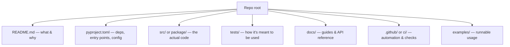
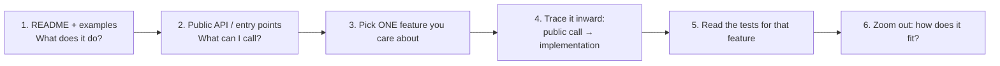

<!-- Module 01 · Lesson 14 — follows ../../../standards/. -->

# 01.14 · Reading Open-Source Code

[⬅ 01.13 Packaging & Quality](01.13-packaging-code-quality.md) · [🏠 Module](../README.md) · [🗺 Roadmap](../../../ROADMAP.md) · [Next ➡](01.15-projects-summary.md)

> Reading code is a skill you can train. This lesson gives you a repeatable method to navigate a large, unfamiliar Python project — the frameworks and AI libraries you'll depend on — and to actually understand how they work.

| | |
|---|---|
| **Module** | `01 · Advanced Python` |
| **Lesson** | `01.14` |
| **Difficulty** | ⭐⭐⭐ |
| **Estimated study time** | 50 min read · 40 min practice |
| **Status** | 🟢 stable |

---

## 1. Learning Objectives

By the end of this lesson you will be able to:

- [ ] Map the standard **anatomy of a mature Python project** (source, tests, config, docs, CI, packaging).
- [ ] **Navigate** an unfamiliar repo efficiently — top-down and by tracing.
- [ ] Use **tests as documentation** of true behavior.
- [ ] Use tools (grep, "go to definition", `git`) to trace code paths.
- [ ] Read AI framework code (e.g., PyTorch-style) with confidence.

## 2. Prerequisites

- All of Module 01 so far — you'll recognize the patterns (OOP, decorators, packaging) in the wild.
- [Module 00.7](../../00-Orientation/weeks/00.7-reading-technical-documentation.md) — reading docs (this is its harder sibling: reading *code*).

---

## 3. Why This Topic Exists

A stated objective of this module is to **read and understand open-source AI codebases**. You'll rely on frameworks (PyTorch, transformers, FastAPI, vector DB clients); to use them well, debug them, extend them, and learn from them, you must be able to *read* them. Documentation is often incomplete or lags the code — the source is the ultimate truth.

Reading code is also how you *grow*. The fastest way to learn advanced patterns is to read how expert engineers structure real systems. Every framework in this handbook is a masterclass — if you can read it.

> [!IMPORTANT]
> You will spend far more of your career **reading** code than writing it. Treat it as a first-class skill with a method — not something you brute-force. A systematic reader understands a 50k-line project in an afternoon; an unsystematic one gives up.

## 4. Problems It Solves

| Problem | This method solves it by |
|---|---|
| "I'm lost in this huge repo" | A top-down navigation map |
| Docs don't explain the behavior I see | Reading the source & tests directly |
| Can't tell how a feature is implemented | Tracing from public API inward |
| Fear of large/foreign codebases | A repeatable, calm approach |
| Can't extend/debug a dependency | Understanding its internals |

---

## 5. Anatomy of a Mature Python Project

Thanks to [Lesson 01.13](01.13-packaging-code-quality.md), you already know the layout — now use it as a **map**. Almost every serious repo has these, and knowing where things live lets you orient instantly.



| Area | What it tells you | Read it to… |
|---|---|---|
| **README** | Purpose, install, quick usage | Orient in 2 minutes |
| **`pyproject.toml`** | Dependencies, entry points, tool config | See what it's built on and its CLI/API surface |
| **`src/`/package** | The implementation | Understand *how* it works |
| **`tests/`** | Executable behavior spec | See *intended* usage & edge cases |
| **`docs/`** | Concepts & API | Get the mental model |
| **`examples/`** | Runnable usage | Copy a working starting point |
| **CI config** | How they build/test/lint | Understand their quality bar & how to contribute |

---

## 6. The Navigation Method — Top-Down + Trace

Don't read a repo file-by-file alphabetically. Navigate **top-down from the public API**, then **trace** the specific path you care about.



1. **README + examples** — what the project does and how it's used. Run an example.
2. **Find the public API** — what users import and call (often re-exported in the top `__init__.py`). This is the surface; the rest is detail.
3. **Pick one feature** — don't try to understand everything. Choose the *one* thing relevant to your task.
4. **Trace it inward** — from the public call, follow the code into the implementation ("go to definition" repeatedly). Keep a mental (or written) breadcrumb trail.
5. **Read that feature's tests** — they show real inputs/outputs and edge cases, confirming your understanding.
6. **Zoom out** — see how that piece fits the larger design.

> [!TIP]
> **Trace one path, ignore the rest.** A large framework has thousands of files; you need the ~10 on the path of your feature. Following a single call from public API to implementation teaches you more than skimming 100 files. Resist the urge to "understand it all."

---

## 7. Tests Are the Best Documentation

Recall from [Module 00.7](../../00-Orientation/weeks/00.7-reading-technical-documentation.md): when prose docs are thin or stale, **tests reveal the truth**. They're executable, current (they must pass in CI), and show real usage with concrete inputs and expected outputs — including the edge cases the docs gloss over.

```python
# A test tells you EXACTLY how the API is meant to be called and what it returns:
def test_retriever_returns_top_k():
    store = VectorStore()
    store.add(["a", "b", "c"])
    results = store.search("query", k=2)
    assert len(results) == 2          # ← the contract, in code
```

> [!IMPORTANT]
> When you can't figure out how to use a function from the docs, **search the tests** for its name. You'll find working examples with real arguments and asserted behavior. This single habit unblocks you constantly when working with under-documented libraries.

---

## 8. Tools for Tracing Code

| Tool / action | Use |
|---|---|
| **"Go to definition"** (IDE) | Jump from a call to its implementation instantly |
| **"Find all references"** | See everywhere a function/class is used |
| **grep / ripgrep** (or the Grep tool) | Search the codebase for a name, string, or pattern |
| **`git blame` / `git log`** | See when/why a line changed, and the commit message explaining it |
| **`git log -p <file>`** | Read a file's evolution to understand its intent |
| **Breakpoints / `pdb`** | Step through a real execution to see the path taken |
| **Reading `__init__.py`** | Discover the public API (what's re-exported) |

> [!TIP]
> Two power moves: (1) **set a breakpoint** in a call and step through — seeing the *actual* execution path removes all guesswork; (2) **`git blame` a confusing line** and read the commit message — the "why" is often right there in history. Recognizing the patterns from this module (decorators, context managers, dunders, dataclasses) makes the code legible: you'll see `@` and know it's a wrapper, see `__call__` and know how `model(x)` works.

---

## 9. Reading AI Framework Code Specifically

AI frameworks lean heavily on the exact patterns you learned this module — which is why you can now read them.

| You'll see | You learned it in | It means |
|---|---|---|
| `class Net(nn.Module)` + `super().__init__()` | [01.3 OOP](01.3-object-oriented-python.md) | Inheritance to plug into the framework |
| `model(x)` running a forward pass | [01.3 dunders](01.3-object-oriented-python.md) | `__call__` |
| `len(dataset)`, `dataset[i]` | [01.3 dunders](01.3-object-oriented-python.md) | `__len__`/`__getitem__` |
| `@torch.no_grad()`, `with ...:` | [01.7 context managers](01.7-context-managers.md) | Set-and-restore state |
| `@register`, `@cache`, `@property` | [01.6 decorators](01.6-decorators.md) | Wrappers adding behavior |
| `yield` in a data loader | [01.5 generators](01.5-iterators-generators.md) | Lazy streaming |
| `async def` clients | [01.12 async](01.12-async.md) | Concurrent I/O |
| Type hints & Pydantic models | [01.8 typing](01.8-type-hinting.md) | The API contract |

> [!IMPORTANT]
> This is the payoff of the whole module: the "magic" in AI frameworks is *the patterns you now know*. When you open PyTorch or an LLM SDK, you're not seeing alien code — you're seeing dunders, decorators, context managers, generators, and typed classes assembled skillfully. You can read it.

> **Illustration placeholder** — `assets/images/reading-framework-patterns.png`: a snippet of framework code with callouts pointing to `class(nn.Module)`, `__call__`, `@decorator`, `with no_grad()`, and `yield`, each labeled with the Module 01 lesson that explains it.

---

## 10. A Practical Reading Session (Worked Structure)

Suppose you want to understand how a library's `Client.chat()` works:

| Step | Action |
|---|---|
| 1 | Read the README's quickstart; run it |
| 2 | Find `Client` in the top `__init__.py` (public API) |
| 3 | "Go to definition" on `Client.chat` |
| 4 | Trace what it calls — request building, the HTTP/async call, response parsing (spot the Pydantic model, [01.8](01.8-type-hinting.md)) |
| 5 | Read `tests/test_client.py` for `chat` — see real inputs/mocked responses ([01.10](01.10-testing.md)) |
| 6 | `git blame` any confusing bit; read the commit message |
| 7 | Summarize the flow in your own words (a note) |

> [!TIP]
> End every reading session by **writing a short note** ("`Client.chat` builds a request, validates the response with `ChatResponse`, retries on 429…") — the same "notes in your own words" discipline from [Module 00.8](../../00-Orientation/weeks/00.8-reading-research-papers.md). It turns fleeting understanding into durable knowledge.

---

## 11. Common Mistakes & Debugging

| Mistake | Consequence | Fix |
|---|---|---|
| Reading files alphabetically | Overwhelm, no understanding | Trace one feature top-down |
| Trying to understand everything | Analysis paralysis | Focus on the one path you need |
| Ignoring the tests | Missing the clearest usage examples | Read tests for the feature |
| Not running anything | Shallow, theoretical understanding | Run examples; set breakpoints |
| Skipping the README/`pyproject.toml` | Missing the map & entry points | Start there |
| Not taking notes | Understanding evaporates | Summarize in your own words |

---

## 12. Performance / Practical Notes

| Note | Implication |
|---|---|
| Reading is fastest with an IDE | "Go to definition"/"find references" save hours |
| Big repos → trace, don't skim | Depth on one path beats breadth on many |
| Tests + git history | The two richest, most honest sources |
| Recognizing patterns speeds reading | Module 01's patterns make frameworks legible |

## 13. Security Considerations

| Risk | Guidance |
|---|---|
| Evaluating a dependency's trustworthiness | Read for red flags: `eval`/`exec`, `pickle` of untrusted data, network calls on import |
| Copying code you don't understand | Understand before adopting — it may carry bugs/vulns |
| Running unfamiliar example code | Read it first; run in an isolated env |
| Supply-chain assessment | Check maintenance, tests, and issue history ([00.7](../../00-Orientation/weeks/00.7-reading-technical-documentation.md)) |

> [!CAUTION]
> When evaluating a dependency, *read* enough of it to spot danger signs — code that `exec`s input, unpickles untrusted data, or makes network calls at import time. Reading source is part of supply-chain security, not just learning.

---

## 14. Interview Questions

**Beginner**
1. Where do you start when opening an unfamiliar Python repo?
2. Why are tests useful when learning a codebase?

**Intermediate**
1. Describe your method for tracing how a specific feature is implemented.
2. What tools do you use to navigate code, and how does `git blame` help?

**Advanced**
1. How do the patterns from this module (dunders, decorators, context managers) help you read a framework like PyTorch?
2. How does reading source contribute to evaluating a dependency's security and quality?

**System-design prompt (meta)**
- You must add a feature to a large open-source library you've never seen, by tomorrow. Walk through how you'd understand the relevant part and implement the change safely. — *Follow-ups:* How do you verify your change? How do you match their conventions and pass their CI?

---

## 15. Summary

| Key idea | Takeaway |
|---|---|
| Anatomy as a map | README, pyproject, src, tests, docs, CI |
| Top-down + trace | From public API inward, one feature at a time |
| Tests = truth | The clearest, current usage examples |
| Tools | Go-to-definition, grep, `git blame`, breakpoints |
| Patterns make it legible | Module 01's patterns *are* the framework "magic" |
| Take notes | Summarize in your own words |

## 16. Cheat Sheet

```text
MAP: README (what) · pyproject.toml (deps/entry points) · src/ (how) · tests/ (usage) · docs/ · CI
METHOD: README+examples → public API (__init__) → pick ONE feature → trace inward → read its tests → zoom out
TESTS: search tests for a function's name to see real usage & contracts
TOOLS: go-to-definition · find-references · grep/ripgrep · git blame/log · breakpoints/pdb
RECOGNIZE (Module 01 patterns): class(Base)+super · __call__/__len__/__getitem__ · @decorator · with ctx · yield · async def · type hints/Pydantic
RULE: trace ONE path; ignore the rest. Take notes in your own words.
SECURITY: scan for eval/exec, pickle of untrusted data, import-time network calls
```

## 17. Flashcards

- **Q:** Where do you start reading an unfamiliar repo? — **A:** README + examples, then `pyproject.toml` and the public API (top `__init__.py`) — orient before diving in.
- **Q:** What's the core navigation method? — **A:** Top-down from the public API, then trace ONE feature inward; read that feature's tests.
- **Q:** Why read tests when learning a library? — **A:** They're executable, current usage examples showing real inputs/outputs and edge cases — the truest documentation.
- **Q:** Two git commands that aid reading? — **A:** `git blame` (who/why changed a line → commit message) and `git log -p <file>` (a file's evolution).
- **Q:** Why can you now read AI frameworks? — **A:** Their "magic" is Module 01's patterns — dunders, decorators, context managers, generators, typed classes — assembled skillfully.

## 18. Hands-on Exercises

> Full set in [`../exercises/`](../exercises/).

- [ ] **(⭐ Orient)** Pick a well-known Python library. In 15 minutes, from README + `pyproject.toml` + `__init__.py`, write what it does and its main public API.
- [ ] **(⭐⭐ Trace)** Choose one public function and trace it to its implementation using go-to-definition. Diagram the call path.
- [ ] **(⭐⭐ Tests-as-docs)** For that function, find its tests and write a working usage snippet based solely on them.
- [ ] **(⭐⭐ Git)** `git blame` a non-obvious line in that library; read the commit message; explain why the line exists.
- [ ] **(⭐⭐⭐ Patterns)** In a small AI library (e.g., a minimal GPT/transformer implementation), identify and label at least five Module 01 patterns (dunders, decorators, context managers, generators, typing).

## 19. Mini Project

> **Codebase reading report.** Choose a real open-source AI-related library (e.g., a minimal transformer, an LLM client SDK, or a small web framework). Produce a `notes/codebase-<name>.md` report: its anatomy (map), the public API, a traced call path for one feature (with a diagram), how you'd extend it, five patterns you recognized, and any security red flags. This report — done well — is portfolio-worthy and proves you can onboard to any codebase.

## 20. References

- [Module 00.7 · Reading Technical Documentation](../../00-Orientation/weeks/00.7-reading-technical-documentation.md) — the doc-reading sibling of this lesson.
- `karpathy/nanoGPT` and similar minimal implementations — ideal, readable AI code to practice on.
- Git documentation — `blame`, `log`, `bisect` for code archaeology.

## 21. What's Next

You've mastered the pieces. The final lesson consolidates everything into **progressively harder projects** and a full module review — cheat sheet, flashcards, interview prep, and readiness for Module 02.

➡️ **Next:** [01.15 · Mini Projects & Summary](01.15-projects-summary.md)

---

### 🔁 Revision checklist
- [ ] I can map a repo's anatomy and find its public API
- [ ] I trace one feature from API to implementation
- [ ] I use tests and `git blame` to understand code
- [ ] I recognized Module 01 patterns in real framework code

### 🔗 Spaced-repetition callback
> This lesson retrieves the *entire module*: every pattern (01.3 dunders, 01.6 decorators, 01.7 context managers, 01.5 generators, 01.8 typing, 01.12 async) reappears as something you now *recognize in the wild*. Reading real code is the ultimate spaced-repetition test of Module 01.
