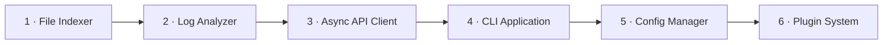
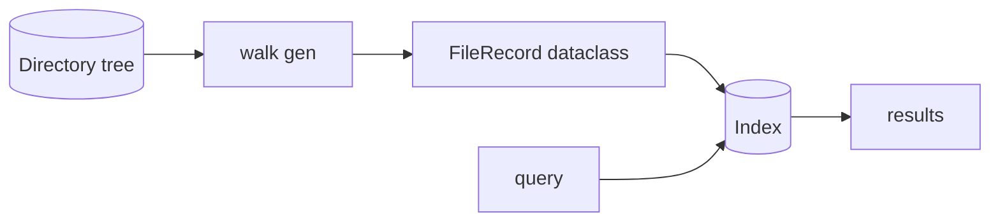
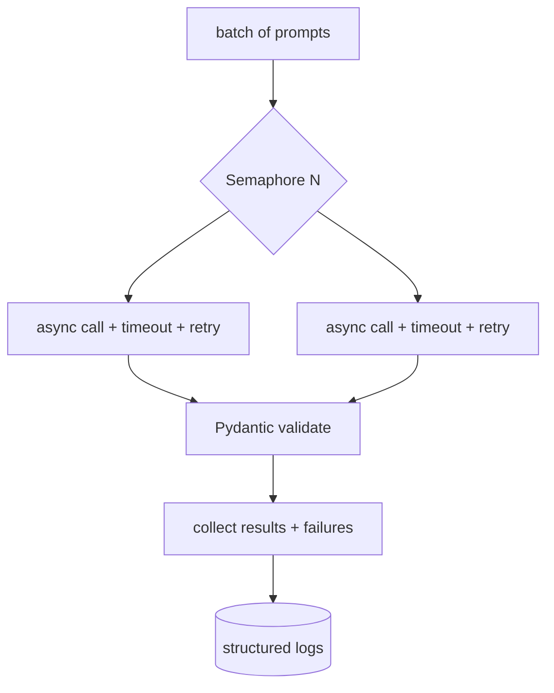
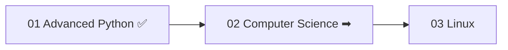

<!-- Module 01 · Lesson 15 — projects + module consolidation. Follows ../../../standards/. -->

# 01.15 · Mini Projects & Module Summary

[⬅ 01.14 Reading Open Source](01.14-reading-open-source.md) · [🏠 Module](../README.md) · [🗺 Roadmap](../../../ROADMAP.md) · [Next module ➡](../../02-Computer-Science/README.md)

> Six progressively harder projects that fuse everything in this module, followed by full consolidation: one-page summary, master cheat sheet, flashcards, interview prep, and your readiness check for Module 02.

| | |
|---|---|
| **Module** | `01 · Advanced Python` |
| **Lesson** | `01.15` |
| **Difficulty** | ⭐⭐⭐⭐ |
| **Estimated study time** | project time varies · 45 min review |
| **Status** | 🟢 stable |

---

## Part A — Mini Projects

Each project applies multiple lessons. They ramp in difficulty, and every one should follow the [project standards](../../../standards/project-standards.md): goal, requirements, architecture diagram, milestones, testing, and packaging ([01.13](01.13-packaging-code-quality.md)). Build them in your study repo.



| # | Project | Primarily exercises | Difficulty |
|---|---|---|:--:|
| 1 | File Indexing Tool | generators, OOP, os/pathlib, testing | ⭐⭐ |
| 2 | Log Analyzer | generators, regex, error handling, CLI | ⭐⭐⭐ |
| 3 | Async API Client | async, retries, typing, testing | ⭐⭐⭐⭐ |
| 4 | CLI Application | packaging, entry points, error handling | ⭐⭐⭐ |
| 5 | Configuration Manager | Pydantic, typing, context managers | ⭐⭐⭐ |
| 6 | Plugin System | decorators, protocols, dynamic import | ⭐⭐⭐⭐⭐ |

---

### Project 1 · File Indexing Tool ⭐⭐

**Goal:** Walk a directory tree and build a searchable index of files (path, size, modified time, hash), streaming to handle huge trees without loading everything into memory.

```text
file-indexer/
├── pyproject.toml
├── src/file_indexer/
│   ├── __init__.py
│   ├── walker.py      # generator: yields file records lazily
│   ├── index.py       # build/query the index (dataclasses)
│   └── hashing.py     # content hashing
└── tests/
```



| Requirement | Lesson |
|---|---|
| Stream files with a **generator** (constant memory) | [01.5](01.5-iterators-generators.md) |
| Represent records with **dataclasses** | [01.3](01.3-object-oriented-python.md) |
| **Type-hint** everything; mypy-clean | [01.8](01.8-type-hinting.md) |
| **Tests** for walking, hashing, querying | [01.10](01.10-testing.md) |
| Packaged with `pyproject.toml` | [01.13](01.13-packaging-code-quality.md) |

**Stretch:** detect duplicate files by hash; add a `--since` filter.

---

### Project 2 · Log Analyzer ⭐⭐⭐

**Goal:** Extend the streaming analyzer from [01.5](01.5-iterators-generators.md) into a full tool: parse large logs lazily, aggregate stats (counts per level, error rates, top messages), and report — with robust error handling for malformed lines.

| Requirement | Lesson |
|---|---|
| Lazy **generator pipeline** (read → parse → filter → aggregate) | [01.5](01.5-iterators-generators.md) |
| **Structured logging** + graceful handling of bad lines | [01.9](01.9-error-handling-logging.md) |
| A **timing** context manager / decorator for the run | [01.6](01.6-decorators.md)/[01.7](01.7-context-managers.md) |
| **Parameterized tests** over sample logs | [01.10](01.10-testing.md) |

**Stretch:** stream from stdin; output JSON; detect anomaly spikes.

---

### Project 3 · Async API Client ⭐⭐⭐⭐ (the flagship)

**Goal:** The production-shaped client built across [01.9](01.9-error-handling-logging.md) → [01.12](01.12-async.md): concurrently call a (simulated) model API for a batch of inputs, bounded by a semaphore, with per-call timeout, retry+backoff, Pydantic-validated responses, structured logging, and graceful partial-failure handling.



| Requirement | Lesson |
|---|---|
| **Async** concurrency with `gather`/`TaskGroup` | [01.12](01.12-async.md) |
| **Bounded** concurrency (semaphore) + timeouts | [01.12](01.12-async.md) |
| **Retry + backoff**, transient-vs-permanent classification | [01.9](01.9-error-handling-logging.md) |
| **Pydantic** response validation | [01.8](01.8-type-hinting.md) |
| **Mocked** tests for success/retry/give-up | [01.10](01.10-testing.md) |

**Stretch:** rate-limit token bucket; progress bar; cost accounting per call.

> [!IMPORTANT]
> This project is the closest thing in Module 01 to real AI-Engineering code. You will reuse this exact pattern — concurrent, bounded, resilient, validated API calls — throughout [Modules 11–19](../../11-LLMs/README.md). Build it well.

---

### Project 4 · CLI Application ⭐⭐⭐

**Goal:** Wrap one of the above tools (e.g., the log analyzer) in a proper command-line interface with subcommands, arguments, help text, and a `[project.scripts]` entry point so it installs as a real command.

| Requirement | Lesson |
|---|---|
| **Entry point** via `pyproject.toml` | [01.13](01.13-packaging-code-quality.md) |
| Clean **error handling** + exit codes | [01.9](01.9-error-handling-logging.md) |
| **Typed** argument parsing (argparse/typer) | [01.8](01.8-type-hinting.md) |
| **Tests** for command parsing & behavior | [01.10](01.10-testing.md) |

**Stretch:** `--verbose` logging levels; config file support (feeds Project 5).

---

### Project 5 · Configuration Manager ⭐⭐⭐

**Goal:** A reusable config system that loads settings from files + environment, validates them with Pydantic, and exposes a typed config object — with a context manager for temporary overrides (great for tests).

| Requirement | Lesson |
|---|---|
| **Pydantic** models with validation & defaults | [01.8](01.8-type-hinting.md) |
| **Layered** sources (defaults → file → env) | [01.9](01.9-error-handling-logging.md) |
| A **context manager** for temporary overrides | [01.7](01.7-context-managers.md) |
| Never leak secrets; env for sensitive values | [01.9](01.9-error-handling-logging.md) |

**Stretch:** hot-reload on file change; schema export.

---

### Project 6 · Plugin System ⭐⭐⭐⭐⭐ (capstone of the module)

**Goal:** A framework where plugins register themselves via a **decorator** and conform to a **Protocol**, discovered and loaded dynamically — the pattern behind extensible ML tooling (registries of models, losses, tools).


| Requirement | Lesson |
|---|---|
| **Decorator-based** registration into a registry | [01.6](01.6-decorators.md) + [01.4](01.4-functional-python.md) |
| **Protocol** defining the plugin interface | [01.8](01.8-type-hinting.md) |
| **Dynamic import** / discovery | [01.1](01.1-python-architecture.md) |
| Safe error handling for bad plugins | [01.9](01.9-error-handling-logging.md) |
| Full **tests** (including a fake plugin) | [01.10](01.10-testing.md) |

**Stretch:** entry-point-based plugin discovery (`importlib.metadata`); sandboxing untrusted plugins.

> [!IMPORTANT]
> The registry-plus-Protocol pattern *is* how real frameworks expose extensibility (optimizers, layers, tools, agent skills). Nail this and you'll recognize — and be able to build — the extension mechanisms in most AI libraries.

---

## Part B — Module Consolidation

### One-page summary of Module 01

| Lesson | The one thing to remember |
|---|---|
| **01.1 Architecture** | Source → bytecode → PVM; per-op overhead is why NumPy/PyTorch exist |
| **01.2 Memory** | Names bind to objects; aliasing, mutable-default trap, refcount + cyclic GC |
| **01.3 OOP** | Four pillars; prefer composition; dataclasses, properties, dunders |
| **01.4 Functional** | First-class functions, closures (capture by reference), `partial`, registries |
| **01.5 Iterators/Generators** | Lazy evaluation → constant memory over huge data |
| **01.6 Decorators** | `@dec`=`f=dec(f)`; `wraps`; logging/timing/caching/retry |
| **01.7 Context Managers** | `with` = guaranteed cleanup; `__enter__`/`__exit__`; `no_grad()` |
| **01.8 Typing** | Hints (static/mypy) + Pydantic (runtime, validate LLM output) |
| **01.9 Errors & Logging** | Specific excepts, custom+chain, retry, structured logs |
| **01.10 Testing** | pytest, fixtures, mock external deps, assert properties for AI |
| **01.11 Performance** | Measure first; complexity; the GIL; cache; vectorize |
| **01.12 Async** | Overlap I/O waits; `gather`+semaphore; never block the loop |
| **01.13 Packaging & Quality** | `src/`+`pyproject.toml`+lockfile; Ruff+mypy+pre-commit |
| **01.14 Reading Open Source** | Trace one feature; tests = truth; recognize the patterns |

> [!IMPORTANT]
> The through-line of Module 01: **you now understand Python deeply enough to build production-quality systems and read the frameworks the rest of the handbook uses.** The recurring themes — the object model, laziness, wrapping behavior, resilience, and I/O concurrency — reappear in every later module.

### Master cheat sheet

> The full one-pager lives at [`../cheat-sheets/advanced-python-cheatsheet.md`](../cheat-sheets/advanced-python-cheatsheet.md).

### Flashcards

> The complete deck (all 14 lessons) is in [`../flashcards/deck.md`](../flashcards/deck.md). Review on the [spaced-repetition schedule](../../../LEARNING_STRATEGY.md).

### Module interview questions (consolidated)

**Beginner**
1. Is Python compiled or interpreted? What is the GIL?
2. `==` vs `is`; mutable vs immutable — give examples.
3. What does `@decorator` desugar to?

**Intermediate**
1. Explain generators and lazy evaluation with a memory comparison.
2. When do you use threading vs multiprocessing vs asyncio?
3. Static type hints vs Pydantic — different jobs?

**Advanced**
1. Design a resilient, concurrent client for a rate-limited model API (async + semaphore + retry + timeout + validation).
2. Why is pure-Python numeric code slow, and what are the two escapes (NumPy, multiprocessing)?
3. Walk through diagnosing a memory leak in a long-running AI service.

**System-design prompt**
- Architect a Python package that batch-processes prompts against an LLM API: concurrent, bounded, resilient, validated, tested, packaged, and observable. — *Follow-ups:* Where does each Module 01 skill appear? How do you keep it maintainable and reproducible?

---

## Part C — Readiness Check & What's Next

### Module 01 mastery checklist (from memory)

- [ ] Explain source→bytecode→PVM and the import system
- [ ] Predict aliasing; avoid the mutable-default bug; explain refcount + GC
- [ ] Use OOP idiomatically (composition, dataclasses, properties, dunders)
- [ ] Write closures, decorators (incl. with args), and context managers
- [ ] Stream large data with generators; explain the memory win
- [ ] Type-hint code, pass mypy, validate data with Pydantic
- [ ] Handle errors robustly (custom exceptions, retry, structured logging)
- [ ] Write pytest suites with fixtures, mocks, and parameterization
- [ ] Profile, then optimize; explain the GIL and pick a concurrency model
- [ ] Write concurrent async I/O with bounded concurrency
- [ ] Package a project (`src/` + `pyproject.toml` + lockfile) with Ruff/mypy/pre-commit
- [ ] Navigate and understand an unfamiliar codebase

> [!TIP]
> Any box you can't tick from memory → revisit that lesson's summary and flashcards before Module 02. These are load-bearing skills; the rest of the handbook assumes them.

### Glossary additions

Module 01 terms added to [GLOSSARY.md](../../../GLOSSARY.md): bytecode, PVM, GIL, reference counting, closure, decorator, context manager, generator/lazy evaluation, coroutine/event loop, type hint, Protocol, Pydantic, memoization, vectorization, editable install, lockfile, pre-commit.

### Next module preview — 02 · Computer Science

You can write excellent Python; next you'll get rigorous about **what's efficient**: complexity analysis, core data structures, and algorithmic patterns — the foundation for ML performance and interviews.



> [!IMPORTANT]
> Module 02 makes the "complexity" and "data structures" instincts from [01.11](01.11-performance.md) precise and complete. You've *seen* why `set` beats `list` for membership; next you'll know exactly why, and when to reach for each structure.

➡️ **Begin:** [Module 02 · Computer Science](../../02-Computer-Science/README.md)

---

### 🔁 Final revision checklist
- [ ] I completed the mastery checklist from memory
- [ ] I built at least the flagship Async API Client project (Project 3)
- [ ] I added Module 01 terms to my flashcards
- [ ] My study repo has these projects, packaged and tested
- [ ] I'm ready for Module 02

### 🔗 Spaced-repetition callback
> These six projects retrieve the *entire module* at once — the flagship async client alone touches typing, errors, retries, async, testing, and packaging. Building them is the ultimate active-recall exercise for Module 01 ([Module 00.9](../../00-Orientation/weeks/00.9-learning-workflow.md)).
