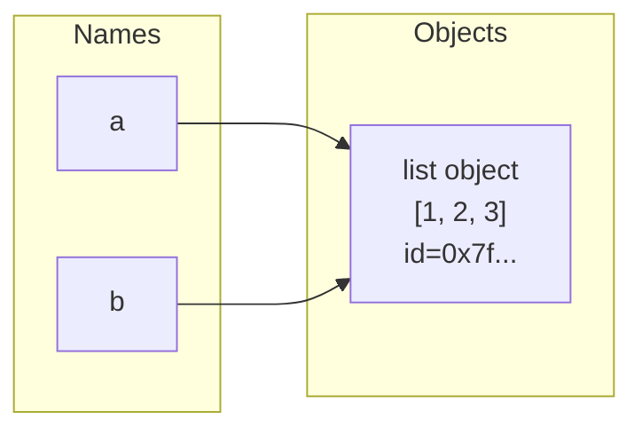
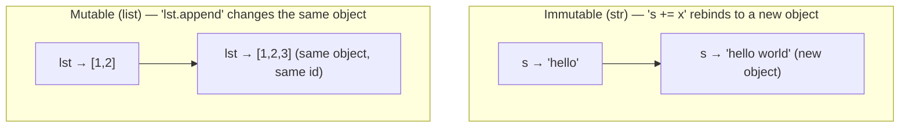
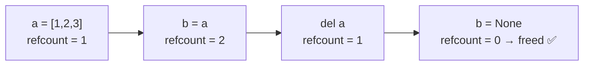
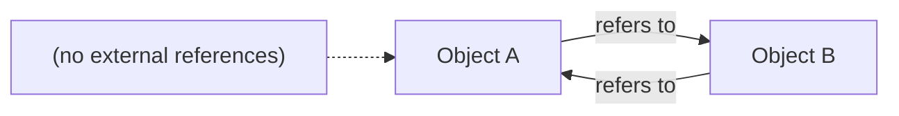
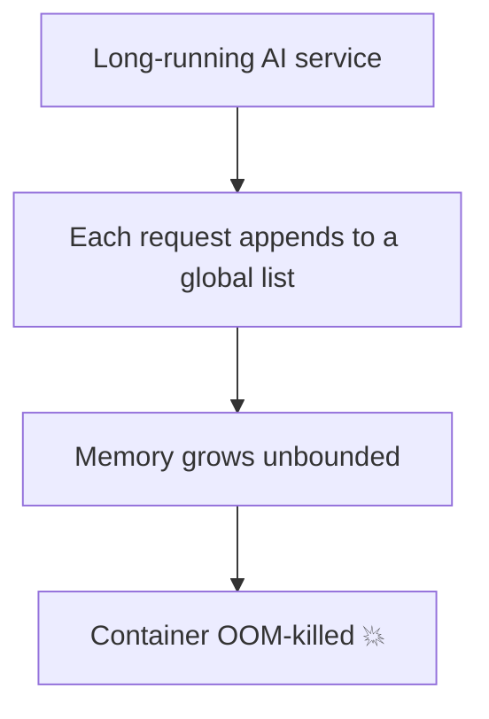

<!-- Module 01 · Lesson 2 — follows ../../../standards/. -->

# 01.2 · Memory, Objects & the Data Model

[⬅ 01.1 Architecture](01.1-python-architecture.md) · [🏠 Module](../README.md) · [🗺 Roadmap](../../../ROADMAP.md) · [Next ➡](01.3-object-oriented-python.md)

> In Python, *everything is an object*, and variables are names bound to objects — not boxes holding values. Internalize this and a whole class of bugs (mutable defaults, aliasing, surprising `==` vs `is`) disappears.

| | |
|---|---|
| **Module** | `01 · Advanced Python` |
| **Lesson** | `01.2` |
| **Difficulty** | ⭐⭐⭐ |
| **Estimated study time** | 60 min read · 30 min experiments |
| **Status** | 🟢 stable |

---

## 1. Learning Objectives

By the end of this lesson you will be able to:

- [ ] Explain the difference between a **name (reference)** and an **object**.
- [ ] Use **identity (`is`)** vs **equality (`==`)** correctly.
- [ ] Distinguish **mutable** from **immutable** types and predict aliasing behavior.
- [ ] Explain **reference counting** and CPython's **cyclic garbage collector**.
- [ ] Recognize and prevent **memory leaks** and **circular references**.
- [ ] Avoid the infamous **mutable default argument** bug.

## 2. Prerequisites

- [01.1 · How Python Runs Your Code](01.1-python-architecture.md).

---

## 3. Why This Topic Exists

Python hides memory management, which is a blessing — until it causes bugs you can't explain. Why did modifying one list change "another" list? Why did every call to my function accumulate old data? Why is my long-running ML service's memory climbing until it crashes? Every one of these traces back to Python's object-and-reference model.

For AI Engineers this is acute: you process large datasets and tensors, run long-lived services, and pass big objects between functions. Misunderstanding references leads to accidental data corruption; misunderstanding leaks leads to services that die at 3 a.m.

> [!IMPORTANT]
> "In Python, everything is an object, and variables are names bound to objects." If you truly absorb that one sentence, most memory-related confusion evaporates. This lesson makes it concrete.

## 4. Problems It Solves

| Bug / confusion | Root cause understood here |
|---|---|
| "I changed one list and another changed too" | Aliasing — two names, one object |
| Mutable default argument accumulating data | Default evaluated once, shared across calls |
| `a == b` True but `a is b` False (or vice versa) | Equality vs identity |
| Service memory climbing over time | Leaks: lingering references / cycles |
| Copying didn't help | Shallow vs deep copy |

---

## 5. Mental Model: Names, Objects, and Bindings

A variable is a **name** (a label) bound to an **object** (data living somewhere in memory). Assignment binds a name to an object; it does **not** copy the object.



```python
a = [1, 2, 3]
b = a            # b is bound to the SAME object, not a copy
b.append(4)
print(a)         # [1, 2, 3, 4]  ← a "changed" because a and b name one object
```

> **Illustration placeholder** — `assets/images/names-vs-objects.png`: two labels ("a", "b") as luggage tags tied to a single suitcase (the list object), contrasted with a copy where each tag ties to its own suitcase.

> [!IMPORTANT]
> Assignment (`b = a`) **binds a name**; it never copies. Two names bound to one mutable object see each other's changes. This is *aliasing*, and it's the source of countless bugs — and, when understood, a powerful feature.

---

## 6. Identity, Equality, and `id()`

Every object has three intrinsic properties:

| Property | Question it answers | How to check |
|---|---|---|
| **Identity** | "Is it the *same* object?" | `a is b` / `id(a) == id(b)` |
| **Type** | "What kind of object?" | `type(a)` |
| **Value** | "Are the contents equal?" | `a == b` |

```python
a = [1, 2, 3]
b = [1, 2, 3]
print(a == b)   # True  — same contents
print(a is b)   # False — different objects
print(id(a), id(b))  # different ids
```

> [!WARNING]
> **Use `==` for value comparison and `is` only for identity** — specifically `is None`, `is True`, `is False`. A classic bug is `if x is 1000:` — it may work for small integers (which CPython caches) and fail for large ones. Never use `is` to compare values; the caching that makes it *sometimes* work is a CPython implementation detail.

### The small-integer / interning trap

```python
x = 256; y = 256
print(x is y)   # True  — CPython caches small ints (-5..256)
x = 257; y = 257
print(x is y)   # often False — outside the cache
```

This is exactly why `is` for values is a bug waiting to happen. Rely on `==`.

---

## 7. Mutability vs Immutability

Objects are either **mutable** (can change in place) or **immutable** (cannot — "changing" one creates a new object).

| Immutable | Mutable |
|---|---|
| `int`, `float`, `bool`, `complex` | `list` |
| `str` | `dict` |
| `tuple` | `set` |
| `frozenset` | `bytearray` |
| `bytes` | most custom class instances |

```python
s = "hello"
print(id(s))
s += " world"     # creates a NEW string object
print(id(s))      # different id — the original was not modified

lst = [1, 2]
print(id(lst))
lst.append(3)     # modifies IN PLACE
print(id(lst))    # same id
```



> [!IMPORTANT]
> Mutability determines whether aliasing bites you. Sharing an *immutable* object is always safe (it can't change). Sharing a *mutable* object means every alias sees every change — sometimes intended, often a bug.

---

## 8. The Mutable Default Argument Trap

This is the single most famous Python gotcha, and it flows directly from the model above. Default argument values are evaluated **once**, when the function is defined — not on each call.

```python
# ❌ BUG: the default list is created ONCE and shared across all calls
def add_item(item, bucket=[]):
    bucket.append(item)
    return bucket

print(add_item("a"))  # ['a']
print(add_item("b"))  # ['a', 'b']  ← the SAME list persists!

# ✅ FIX: use None as a sentinel, create a fresh object each call
def add_item(item, bucket=None):
    if bucket is None:
        bucket = []
    bucket.append(item)
    return bucket
```

> [!WARNING]
> **Never use a mutable object (`[]`, `{}`, `set()`) as a default argument.** Use `None` and create the object inside the function. This bug is common in AI code where defaults like `config={}` or `history=[]` silently accumulate state across calls — a nightmare in a long-running service.

---

## 9. Copying: Assignment vs Shallow vs Deep

Because assignment doesn't copy, you sometimes need explicit copies — and must know shallow from deep.

| Operation | What it does |
|---|---|
| `b = a` | New name, **same** object (no copy) |
| `b = a.copy()` / `list(a)` / `a[:]` | **Shallow** copy — new outer object, **shared** inner objects |
| `copy.deepcopy(a)` | **Deep** copy — recursively copies everything |

```python
import copy
a = [[1, 2], [3, 4]]
shallow = a.copy()
shallow[0].append(99)
print(a)        # [[1, 2, 99], [3, 4]]  ← inner list was shared!

deep = copy.deepcopy(a)
deep[0].append(0)
print(a)        # unchanged — deep copy is fully independent
```

> [!TIP]
> Deep copies are correct but can be **expensive** for large nested structures (and impossible/undesirable for things like open files or tensors). Reach for `deepcopy` deliberately, not reflexively — in ML code, copying a large array/tensor can blow your memory budget.

---

## 10. Reference Counting — CPython's Primary Memory Manager

CPython frees memory primarily via **reference counting**: each object tracks how many references point to it. When the count hits zero, the object is immediately deallocated.



```python
import sys
a = [1, 2, 3]
print(sys.getrefcount(a))  # note: getrefcount adds one temporary reference
b = a
print(sys.getrefcount(a))  # increased by 1
del b
print(sys.getrefcount(a))  # back down
```

| Property | Detail |
|---|---|
| **Deterministic** | Objects freed *immediately* when refcount hits 0 |
| **Simple & prompt** | No waiting for a GC pass |
| **Overhead** | Every ref change updates a counter (a cost of CPython) |
| **Weakness** | Cannot free **reference cycles** on its own → needs a cyclic GC |

> [!NOTE]
> Reference counting is a **CPython** detail (PyPy uses different GC). It's why CPython reclaims most memory promptly, and why the `with` statement / context managers (Lesson 01.7) are still important for *non-memory* resources (files, sockets) that refcounting doesn't handle deterministically enough on all implementations.

---

## 11. Circular References and the Cyclic Garbage Collector

Reference counting alone can't reclaim objects that reference **each other** — their counts never reach zero even when nothing else uses them.



```python
a = {}
b = {}
a["b"] = b     # a → b
b["a"] = a     # b → a  → a cycle
del a, b       # external refs gone, but the two objects still reference each other
# refcounts are still 1 each → refcounting can't free them
```

To handle this, CPython adds a **generational cyclic garbage collector** (the `gc` module) that periodically detects and collects unreachable cycles.

| Aspect | Detail |
|---|---|
| **Purpose** | Reclaim objects trapped in reference cycles |
| **Generational** | Young objects checked more often (most die young) |
| **Runs** | Automatically at thresholds; can trigger via `gc.collect()` |
| **Control** | `gc.disable()`/`enable()`, `gc.collect()`, `gc.get_stats()` |

> [!TIP]
> You rarely touch `gc` directly. Two legitimate uses: calling `gc.collect()` to force a cleanup at a known-safe point, and (advanced) temporarily disabling GC in a tight, allocation-heavy section for a speed boost — carefully, and re-enabling after.

---

## 12. Memory Leaks in Python

Python has GC, so "leaks" here usually mean **unintended references that keep objects alive**, not classic C-style leaks. Memory grows because something still points at data you thought was gone.

| Leak pattern | Why it holds memory | Fix |
|---|---|---|
| **Global/module-level caches** growing forever | Nothing ever evicts entries | Bound the cache (LRU, TTL); evict |
| **Accumulating in a list/dict** in a loop | You keep appending, never clearing | Process in chunks; clear; stream |
| **Closures/callbacks** capturing big objects | The reference lives as long as the callback | Drop references; use `weakref` |
| **`__del__` on objects in cycles** | Can hinder collection | Avoid `__del__`; use context managers |
| **Unbounded logging/history in a service** | State grows per request | Cap size; use ring buffers |



> [!WARNING]
> The most common real leak in AI/ML services: **an unbounded cache or growing global collection** in a long-running process (an API server, a training loop logging every batch). It works in tests (short-lived) and dies in production (long-lived). Always bound anything that grows per-request or per-iteration. Use `functools.lru_cache(maxsize=...)` (Lesson 01.11), `weakref`, or explicit eviction.

### Diagnosing leaks

| Tool | Use |
|---|---|
| `tracemalloc` (stdlib) | Snapshot & diff allocations to find growth |
| `sys.getrefcount` / `gc.get_objects` | Inspect what's alive and referencing what |
| `objgraph` (3rd-party) | Visualize reference chains keeping objects alive |
| Memory profilers | Track RSS over time in a running service |

---

## 13. Common Mistakes & Debugging

| Symptom | Cause | Fix |
|---|---|---|
| Two variables change together | Aliasing a mutable object | Copy when you need independence |
| Function "remembers" old data | Mutable default argument | Use `None` sentinel |
| `is` comparison flaky | Using `is` for value equality | Use `==`; reserve `is` for `None`/singletons |
| Shallow copy didn't isolate nested data | Shared inner objects | `copy.deepcopy` (mind the cost) |
| Service RSS climbs over hours | Unbounded reference growth | Bound caches; stream; `tracemalloc` |
| Object not freed when expected | Lingering reference or cycle | Drop refs; `weakref`; `gc.collect()` |

---

## 14. Performance Notes

| Note | Implication |
|---|---|
| Refcounting is prompt but has per-op cost | Millions of tiny objects are costly; prefer arrays (NumPy) |
| `deepcopy` is expensive | Avoid on large tensors/arrays; copy views intentionally |
| GC pauses possible in cycle-heavy code | Reduce cycles; consider tuning `gc` in hot paths |
| Interning small ints/strings | CPython reuses them — a memory win, but never rely on `is` |

## 15. Security Considerations

| Risk | Guidance |
|---|---|
| Sensitive data lingering in memory | You can't guarantee prompt wipe; minimize copies, drop refs early |
| Unbounded input buffering | Attackers can force memory exhaustion (DoS) — cap sizes |
| Deep copies of untrusted nested data | Can be huge/deeply nested — bound depth/size |

> [!CAUTION]
> Never assume secrets (keys, tokens) are erased from memory just because a variable went out of scope — Python won't zero the bytes. For high-security needs, minimize how long secrets live and how many copies exist; treat memory hygiene as a defense-in-depth measure, not a guarantee.

---

## 16. Interview Questions

**Beginner**
1. What's the difference between `==` and `is`? When do you use each?
2. Name three mutable and three immutable built-in types.

**Intermediate**
1. Explain the mutable-default-argument bug and how to fix it.
2. What is the difference between a shallow and a deep copy? Give an example where it matters.

**Advanced**
1. How does CPython manage memory, and why is a cyclic garbage collector needed on top of reference counting?
2. A long-running ML service's memory grows steadily. Walk through how you'd diagnose and fix it.

**System-design prompt**
- Design a request handler for a long-lived AI API that keeps a bounded per-user history without leaking memory over weeks of uptime. — *Follow-ups:* How do you bound growth? How would you detect a leak in production?

---

## 17. Summary

| Key idea | Takeaway |
|---|---|
| Names bind to objects | Assignment never copies |
| `==` vs `is` | Value vs identity; `is` only for `None`/singletons |
| Mutability | Determines whether aliasing bites |
| Mutable defaults | Evaluated once — never use `[]`/`{}` as defaults |
| Reference counting | Prompt frees; can't handle cycles |
| Cyclic GC | Collects unreachable reference cycles |
| Leaks in Python | Unintended references; bound anything that grows |

## 18. Cheat Sheet

```text
MODEL: variables are NAMES bound to OBJECTS; assignment never copies
IDENTITY: a is b (same object) · a == b (same value) · id(a)
  use `is` ONLY for None/True/False. Never `is` for value equality.
MUTABLE: list, dict, set, bytearray, most instances
IMMUTABLE: int, float, bool, str, tuple, frozenset, bytes
DEFAULT-ARG BUG: def f(x, bucket=None): bucket = [] if bucket is None else bucket
COPY: b=a (alias) · a.copy()/a[:] (shallow, shares inner) · copy.deepcopy (full, costly)
MEMORY: refcounting frees at count 0 · cyclic GC (gc module) frees cycles
LEAKS: unbounded caches/globals/closures → bound them (lru_cache maxsize, weakref, evict)
DIAGNOSE: tracemalloc · gc · objgraph
```

## 19. Flashcards

- **Q:** What does `b = a` do in Python? — **A:** Binds name `b` to the same object as `a` — no copy. Mutating via one is visible via the other (aliasing).
- **Q:** When may you use `is`? — **A:** Only for identity checks against singletons (`is None`, `is True/False`), never for value equality.
- **Q:** Why avoid mutable default arguments? — **A:** The default is created once at definition and shared across calls, silently accumulating state; use a `None` sentinel.
- **Q:** Shallow vs deep copy? — **A:** Shallow copies the outer object but shares inner objects; deep copies recursively — correct but potentially expensive.
- **Q:** How does CPython free memory, and why isn't refcounting enough? — **A:** Reference counting frees at count 0; a cyclic GC is needed because cycles keep counts above 0 even when unreachable.
- **Q:** What does a "memory leak" usually mean in Python? — **A:** Unintended lingering references (e.g., unbounded caches/globals) keeping objects alive; not classic C leaks.

## 20. Hands-on Exercises

> Full set in [`../exercises/`](../exercises/).

- [ ] **(⭐ Observe)** Demonstrate aliasing: bind two names to one list, mutate via one, show both change. Then break it with a copy.
- [ ] **(⭐⭐ Debug)** Reproduce the mutable-default bug, then fix it with a sentinel. Explain why the fix works.
- [ ] **(⭐⭐ Copy)** Show a case where shallow copy fails but deep copy succeeds. Measure the time cost of deep-copying a large nested structure.
- [ ] **(⭐⭐⭐ Leak hunt)** Write a function that leaks via a growing global cache. Detect the growth with `tracemalloc`, then fix it with a bounded cache.

## 21. Mini Project

> **Reference & memory visualizer.** Build a small tool that, given a few variables, prints their `id`, type, refcount, and whether they alias each other — plus a `tracemalloc`-based "top allocations" report for a code snippet. This makes the invisible object model visible, and is genuinely useful for debugging.

## 22. References

- Python docs — *Data model*, *`copy`*, *`gc`*, *`tracemalloc`*, *`weakref`* ([reference standards](../../../standards/reference-standards.md)).
- Python Language Reference — objects, values, and types.

## 23. What's Next

You understand what objects *are* and how they live and die. Now let's structure them well with **object-oriented Python** — classes, inheritance vs composition, dataclasses, properties, and magic methods.

➡️ **Next:** [01.3 · Object-Oriented Python](01.3-object-oriented-python.md)

---

### 🔁 Revision checklist
- [ ] I can explain names vs objects and predict aliasing
- [ ] I use `==` vs `is` correctly
- [ ] I can spot and fix the mutable-default bug
- [ ] I diagnosed a simulated leak with `tracemalloc`

### 🔗 Spaced-repetition callback
> Recall [01.1's "everything runs through the interpreter"](01.1-python-architecture.md): millions of small Python objects each carry refcount and type overhead — another reason ML frameworks store data in compact C arrays (NumPy/tensors) instead of Python lists of objects. Memory model and performance are two views of the same design.
