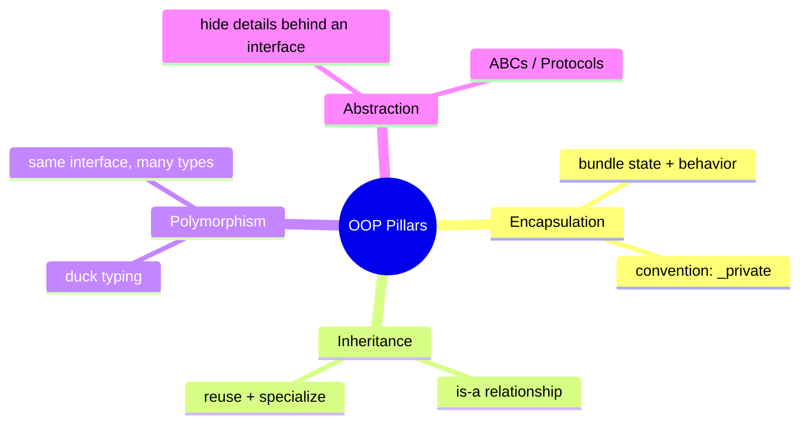
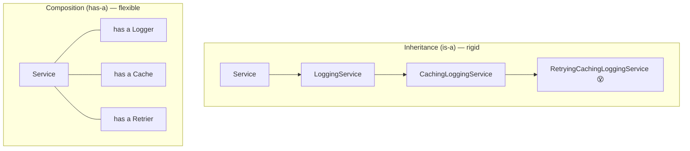

<!-- Module 01 · Lesson 3 — follows ../../../standards/. -->

# 01.3 · Object-Oriented Python

[⬅ 01.2 Memory](01.2-memory-management.md) · [🏠 Module](../README.md) · [🗺 Roadmap](../../../ROADMAP.md) · [Next ➡](01.4-functional-python.md)

> OOP done the *Pythonic* way — not Java-in-Python. You'll learn the four pillars, when to prefer composition over inheritance, and the Python-specific tools (dataclasses, properties, magic methods) that make classes clean and powerful.

| | |
|---|---|
| **Module** | `01 · Advanced Python` |
| **Lesson** | `01.3` |
| **Difficulty** | ⭐⭐⭐ |
| **Estimated study time** | 70 min read · 40 min practice |
| **Status** | 🟢 stable |

---

## 1. Learning Objectives

By the end of this lesson you will be able to:

- [ ] Apply the four OOP pillars — **encapsulation, inheritance, polymorphism, abstraction** — Pythonically.
- [ ] Choose **composition over inheritance** when appropriate, and explain why.
- [ ] Use **dataclasses** to eliminate boilerplate.
- [ ] Use **properties** for computed/validated attributes.
- [ ] Implement key **magic (dunder) methods** to integrate with Python's data model.
- [ ] Recognize these patterns in real AI framework code (e.g. `nn.Module`).

## 2. Prerequisites

- [01.2 · Memory, Objects & the Data Model](01.2-memory-management.md) — instances are objects; `self` is a reference.

---

## 3. Why This Topic Exists

AI codebases are deeply object-oriented. A PyTorch model subclasses `nn.Module`; datasets subclass `Dataset`; pipelines are objects composed of components. To *read* these frameworks (a core module objective) and to *write* maintainable systems, you need fluent, idiomatic OOP.

But Python OOP is not Java OOP. Python favors simplicity, duck typing, and composition. Writing Java-style Python (getters/setters everywhere, deep inheritance trees, interfaces for everything) produces ugly, un-Pythonic code. This lesson teaches the *Python* way.

> [!IMPORTANT]
> Classes are a tool for **bundling state with the behavior that operates on it**, and for modeling "is-a"/"has-a" relationships. Use them when they clarify; don't force everything into classes. Some problems are better served by plain functions (Lesson 01.4).

## 4. Problems It Solves

| Problem | OOP (done right) helps by |
|---|---|
| Scattered state + functions | Bundling data with its behavior |
| Repeated boilerplate (`__init__`, `__repr__`, `__eq__`) | Dataclasses generate it |
| Fragile attribute access | Properties add validation/computation transparently |
| Rigid deep inheritance | Composition assembles behavior flexibly |
| Objects that don't "feel" native | Magic methods integrate with `len()`, `[]`, `+`, `with`, etc. |

---

## 5. Classes and Objects — A Quick, Precise Recap

A **class** is a blueprint; an **object/instance** is a concrete thing built from it. `self` is a reference to the instance the method is operating on.

```python
class Embedding:
    """A named vector — a tiny domain object."""

    def __init__(self, name: str, vector: list[float]) -> None:
        self.name = name          # instance attribute (per-object state)
        self.vector = vector

    def dimension(self) -> int:   # method: behavior bound to the object
        return len(self.vector)

e = Embedding("cat", [0.1, 0.2, 0.3])
print(e.dimension())              # 3
```

| Term | Meaning |
|---|---|
| **Class attribute** | Shared by all instances (defined in class body) |
| **Instance attribute** | Per-object (usually set in `__init__` via `self`) |
| **Method** | A function defined in a class; first param is `self` |
| **`__init__`** | The initializer, run when you construct an instance |

> [!WARNING]
> **Class attributes that are mutable are shared across instances** — the same trap as mutable defaults ([01.2](01.2-memory-management.md)). `class C: items = []` gives *every* instance the *same* list. Put per-instance mutable state in `__init__` (`self.items = []`), not the class body.

---

## 6. The Four Pillars, Pythonically



### Encapsulation — bundling and (soft) privacy

Encapsulation means keeping an object's data and the methods that manage it together, and controlling access. Python has **no true private attributes** — it uses conventions:

| Convention | Meaning |
|---|---|
| `name` | Public |
| `_name` | "Internal" — a hint: don't touch from outside |
| `__name` | Name-mangled to `_ClassName__name` — avoids subclass clashes (not security) |

```python
class Model:
    def __init__(self):
        self._weights = None      # "internal, please don't poke"
```

> [!NOTE]
> Python trusts developers ("we're all adults here"). Leading underscore is a **convention**, not enforcement. Don't write Java-style `get_x()/set_x()` boilerplate — use **properties** (§9) when you actually need validation or computation.

### Inheritance — "is-a", reuse and specialize

```python
class Animal:
    def speak(self) -> str:
        raise NotImplementedError

class Dog(Animal):            # Dog IS-A Animal
    def speak(self) -> str:
        return "Woof"

class Cat(Animal):
    def speak(self) -> str:
        return "Meow"
```

Use `super()` to call the parent's implementation:

```python
class TimedModel(Model):
    def __init__(self, name: str):
        super().__init__()       # run the parent initializer
        self.name = name
```

> [!TIP]
> Real example: in PyTorch you write `class Net(nn.Module): ...` and call `super().__init__()` — inheritance is how your model plugs into the framework's machinery. You'll do this in [Module 09](../../09-Deep-Learning/README.md).

### Polymorphism — duck typing

"If it walks like a duck and quacks like a duck, it's a duck." Python doesn't care about an object's *type*, only whether it supports the *operations* you use.

```python
def make_it_speak(animal) -> str:
    return animal.speak()        # works for ANY object with .speak()

make_it_speak(Dog())  # "Woof"
make_it_speak(Cat())  # "Meow"
```

> [!IMPORTANT]
> **Duck typing** is central to Pythonic design: you program to *behavior*, not to a class hierarchy. This is why Python needs far fewer interfaces than Java. When you *do* want to formalize an expected interface, use **Protocols** (Lesson 01.8) — structural typing that checks shape without inheritance.

### Abstraction — hide details behind an interface

Abstraction exposes *what* an object does while hiding *how*. Python offers **Abstract Base Classes (ABCs)** to define interfaces that subclasses must implement:

```python
from abc import ABC, abstractmethod

class Retriever(ABC):
    @abstractmethod
    def search(self, query: str, k: int) -> list[str]:
        ...

class VectorRetriever(Retriever):
    def search(self, query: str, k: int) -> list[str]:
        return ["doc1", "doc2"]   # real impl elsewhere

# Retriever() → TypeError: can't instantiate an abstract class
```

| Tool | Use when |
|---|---|
| **ABC** (`abc`) | You want to *enforce* a set of methods on subclasses (nominal) |
| **Protocol** (typing) | You want structural typing without forcing inheritance (Lesson 01.8) |

---

## 7. Composition over Inheritance

Inheritance models "is-a." **Composition** models "has-a" — building objects out of other objects. The industry lesson, learned repeatedly: **prefer composition**; deep inheritance trees become rigid and fragile.



```python
# ❌ Inheritance explosion: a class per feature combination
# ✅ Composition: assemble behavior from parts
class Pipeline:
    def __init__(self, retriever, ranker, generator):
        self.retriever = retriever   # has-a
        self.ranker = ranker         # has-a
        self.generator = generator   # has-a

    def run(self, query: str) -> str:
        docs = self.retriever.search(query, k=5)
        ranked = self.ranker.rank(query, docs)
        return self.generator.generate(query, ranked)
```

| Prefer inheritance when | Prefer composition when |
|---|---|
| A genuine "is-a" and stable hierarchy | Behavior is assembled from interchangeable parts |
| You extend a framework base (`nn.Module`) | You'd otherwise need many feature combinations |
| Subtypes are true substitutes (Liskov) | You want to swap implementations at runtime |

> [!TIP]
> A RAG pipeline (Module 13) is naturally **composition**: a retriever + a ranker + a generator, each swappable. Reach for inheritance mainly to plug into a framework's base class or to model a clean, shallow "is-a".

---

## 8. Dataclasses — Kill the Boilerplate

Writing `__init__`, `__repr__`, and `__eq__` by hand for data-holding classes is tedious and error-prone. **`@dataclass`** generates them.

```python
from dataclasses import dataclass, field

@dataclass
class ModelConfig:
    name: str
    temperature: float = 0.7
    max_tokens: int = 1024
    stop: list[str] = field(default_factory=list)  # avoids mutable-default bug!

cfg = ModelConfig("gpt-x", temperature=0.2)
print(cfg)            # ModelConfig(name='gpt-x', temperature=0.2, ...) — free __repr__
print(cfg == ModelConfig("gpt-x", temperature=0.2))  # True — free __eq__
```

| Feature | How |
|---|---|
| Auto `__init__`/`__repr__`/`__eq__` | Just decorate with `@dataclass` |
| Defaults | `field: type = default` |
| Mutable defaults (safe) | `field(default_factory=list)` |
| Immutability | `@dataclass(frozen=True)` → hashable, read-only |
| Ordering | `@dataclass(order=True)` |

> [!IMPORTANT]
> Dataclasses are the go-to for **configuration and structured data** in AI code. `field(default_factory=...)` is the sanctioned fix for the mutable-default trap from [01.2](01.2-memory-management.md). For validation and parsing (e.g., LLM output), you'll use **Pydantic** (Lesson 01.8), which extends this idea with runtime validation.

---

## 9. Properties — Computed & Validated Attributes

A **property** lets a method behave like an attribute — great for computed values or validation, without changing how callers use the object.

```python
class Temperature:
    def __init__(self, celsius: float):
        self._celsius = celsius

    @property
    def celsius(self) -> float:
        return self._celsius

    @celsius.setter
    def celsius(self, value: float) -> None:
        if value < -273.15:
            raise ValueError("below absolute zero")
        self._celsius = value

    @property
    def fahrenheit(self) -> float:      # computed, read-only
        return self._celsius * 9 / 5 + 32

t = Temperature(25)
print(t.fahrenheit)   # 77.0 — looks like an attribute, runs code
t.celsius = -300      # ValueError — validation on assignment
```

> [!TIP]
> Properties let you **start simple (a plain attribute) and add validation/computation later without breaking callers** — they keep using `obj.celsius`. This is the Pythonic answer to getters/setters: add them only when you need behavior, not preemptively.

---

## 10. Magic (Dunder) Methods — Integrate with the Data Model

**Dunder** ("double underscore") methods let your objects work with Python's built-in syntax and functions. This is how you make a class *feel native*.

| Method | Enables | Example use |
|---|---|---|
| `__init__` | Construction | `Obj(...)` |
| `__repr__` | Debug string | `repr(obj)`, REPL display |
| `__str__` | User string | `str(obj)`, `print(obj)` |
| `__eq__`, `__hash__` | Equality, use in sets/dict keys | `a == b`, `{obj}` |
| `__len__` | `len(obj)` | container-like objects |
| `__getitem__`/`__setitem__` | Indexing `obj[i]` | datasets, sequences |
| `__iter__`/`__next__` | Iteration (Lesson 01.5) | `for x in obj` |
| `__call__` | Make instance callable `obj()` | function-like objects, layers |
| `__enter__`/`__exit__` | `with obj:` (Lesson 01.7) | resource management |
| `__add__`, `__mul__`, ... | Operators `+`, `*` | vectors/tensors |

```python
class Vector:
    def __init__(self, data: list[float]):
        self.data = data
    def __len__(self) -> int:
        return len(self.data)
    def __getitem__(self, i: int) -> float:
        return self.data[i]
    def __add__(self, other: "Vector") -> "Vector":
        return Vector([a + b for a, b in zip(self.data, other.data)])
    def __repr__(self) -> str:
        return f"Vector({self.data})"

v = Vector([1, 2]) + Vector([3, 4])
print(len(v), v[0], v)     # 2 4 Vector([4, 6])
```

> [!IMPORTANT]
> Real frameworks lean on dunders heavily. A PyTorch `Dataset` implements `__len__` and `__getitem__` so `len(ds)` and `ds[i]` work; an `nn.Module` implements `__call__` so `model(x)` runs the forward pass. Recognizing dunders is a big part of *reading* AI code (a module objective).

> [!WARNING]
> Always implement `__repr__` for your classes — an unhelpful default (`<Foo object at 0x...>`) makes debugging and logging miserable. Make `__repr__` unambiguous (ideally reconstructable); `__str__` is for human-friendly output.

---

## 11. Where This Appears in AI Codebases

| Pattern | Real-world appearance |
|---|---|
| Inheritance from a base | `class Net(nn.Module)`, `class MyDataset(Dataset)` |
| `__call__` | Models/layers invoked as `model(x)` |
| `__len__`/`__getitem__` | Datasets and samplers |
| Dataclasses | Configs, training args, structured records |
| Composition | Pipelines: retriever + ranker + generator |
| ABC/Protocol | Pluggable interfaces (retrievers, tokenizers) |

> **Illustration placeholder** — `assets/images/pytorch-module-composition.png`: a diagram of an `nn.Module` composed of child modules (layers), each itself a module, illustrating composition + a shared `__call__` interface.

---

## 12. Common Mistakes & Debugging

| Mistake | Consequence | Fix |
|---|---|---|
| Mutable class attribute for per-instance state | Shared state across instances | Set it in `__init__` |
| Deep inheritance hierarchies | Rigid, fragile code | Prefer composition |
| Java-style getters/setters everywhere | Un-Pythonic boilerplate | Plain attributes; properties when needed |
| No `__repr__` | Unreadable debug/logs | Add a clear `__repr__` |
| Forgetting `super().__init__()` | Parent not initialized (e.g., broken `nn.Module`) | Always call it in overridden `__init__` |
| Overriding `__eq__` but not `__hash__` | Object unusable in sets/dicts | Define both (or use frozen dataclass) |

---

## 13. Performance Notes

| Note | Implication |
|---|---|
| Attribute access goes through lookups | Hot paths: minimize attribute chains; consider `__slots__` |
| `__slots__` | Declaring `__slots__` skips per-instance `__dict__` → less memory, faster access for many small objects |
| Millions of tiny objects | Prefer arrays/dataclasses over deep object graphs |
| Property = method call | Slightly slower than a raw attribute; fine unless in a tight loop |

```python
class Point:
    __slots__ = ("x", "y")   # no per-instance __dict__ → big memory savings at scale
    def __init__(self, x, y): self.x, self.y = x, y
```

## 14. Security Considerations

| Risk | Guidance |
|---|---|
| "Private" isn't private | `_`/`__` are conventions; never rely on them to hide secrets |
| `__reduce__`/pickling custom objects | Unpickling untrusted data runs code — never unpickle untrusted input |
| Overly permissive `__setattr__` | Can allow injection of unexpected state — validate |

> [!CAUTION]
> Do not use `pickle` to load objects from untrusted sources — deserialization can execute arbitrary code via `__reduce__`. For untrusted data use safe formats (JSON) or vetted serializers. (Relevant when loading model artifacts from unknown sources.)

---

## 15. Interview Questions

**Beginner**
1. What are the four pillars of OOP? Give a one-line Python example of each.
2. What's the difference between a class attribute and an instance attribute?

**Intermediate**
1. Why prefer composition over inheritance? Give a concrete example.
2. What problem do dataclasses solve, and how do they avoid the mutable-default bug?

**Advanced**
1. Explain duck typing and how Protocols relate to it.
2. How do `__call__`, `__len__`, and `__getitem__` let your objects integrate with Python and frameworks like PyTorch?

**System-design prompt**
- Design the class structure for a pluggable RAG pipeline (swappable retriever, ranker, generator). — *Follow-ups:* Where do you use composition vs inheritance? How do you define the component interfaces (ABC vs Protocol)?

---

## 16. Summary

| Key idea | Takeaway |
|---|---|
| Four pillars | Encapsulation, inheritance, polymorphism, abstraction — Pythonically |
| Duck typing | Program to behavior, not class hierarchy |
| Composition > inheritance | Assemble behavior; keep hierarchies shallow |
| Dataclasses | Free `__init__`/`__repr__`/`__eq__`; safe defaults |
| Properties | Attribute syntax with validation/computation |
| Magic methods | Make objects feel native; how frameworks work |

## 17. Cheat Sheet

```text
PILLARS: encapsulation · inheritance (is-a) · polymorphism (duck) · abstraction (ABC/Protocol)
PRIVACY: _internal (hint) · __mangled (avoid clashes) — conventions, not enforcement
INHERIT: super().__init__() ALWAYS · shallow trees
COMPOSE (prefer): object HAS other objects; swap parts (retriever+ranker+generator)
DATACLASS: @dataclass · defaults · field(default_factory=list) · frozen=True (immutable)
PROPERTY: @property (get) + @x.setter (validate) → attribute syntax, method behavior
DUNDERS: __init__ __repr__ __eq__ __len__ __getitem__ __iter__ __call__ __enter__/__exit__ __add__
PERF: __slots__ for many small objects (no __dict__)
SECURITY: never pickle-load untrusted data
```

## 18. Flashcards

- **Q:** Why prefer composition over inheritance? — **A:** Deep inheritance is rigid; composition assembles swappable behavior ("has-a"), avoiding class explosions.
- **Q:** How do you avoid the mutable-default bug in a dataclass? — **A:** `field(default_factory=list)` instead of `= []`.
- **Q:** What is duck typing? — **A:** Caring about whether an object supports the operations you use, not its type/class.
- **Q:** What does a property give you? — **A:** Attribute-style access backed by a method — enabling computation/validation without changing callers.
- **Q:** Which dunders make an object dataset-like and callable? — **A:** `__len__` + `__getitem__` (indexing/length) and `__call__` (invoke like a function, e.g. `model(x)`).
- **Q:** Is `_x`/`__x` real privacy? — **A:** No — conventions/name-mangling, not enforcement or security.

## 19. Hands-on Exercises

> Full set in [`../exercises/`](../exercises/).

- [ ] **(⭐ Build)** Create a `dataclass` config with a safe mutable default; show `__repr__`/`__eq__` work for free.
- [ ] **(⭐⭐ Properties)** Add a validated `property` (e.g., non-negative) and a computed read-only property.
- [ ] **(⭐⭐ Dunders)** Implement a `Vector` class with `__add__`, `__len__`, `__getitem__`, and a good `__repr__`.
- [ ] **(⭐⭐⭐ Refactor)** Take a deep inheritance hierarchy (given in the exercise) and refactor it into composition. Explain the improvement.
- [ ] **(⭐⭐⭐ Interface)** Define a `Retriever` ABC and two implementations; write a function that works with any retriever (polymorphism).

## 20. Mini Project

> **Pluggable pipeline framework.** Build a small `Pipeline` that composes swappable components (each a class with a common interface via ABC or Protocol) — e.g., `Loader → Transformer → Writer`. Include a diagram and folder structure. This mirrors how real AI pipelines (and RAG systems) are built, and you'll reuse the pattern in later modules.

## 21. References

- Python docs — *`dataclasses`*, *`abc`*, *`property`*, *Data model (special methods)* ([reference standards](../../../standards/reference-standards.md)).
- PyTorch `nn.Module` source/docs — a masterclass in composition + `__call__`.

## 22. What's Next

You can model with objects. Now the complementary paradigm: **functional Python** — first-class functions, closures, and higher-order functions, which pervade AI code (transforms, callbacks, decorators).

➡️ **Next:** [01.4 · Functional Python](01.4-functional-python.md)

---

### 🔁 Revision checklist
- [ ] I can apply all four pillars idiomatically
- [ ] I choose composition vs inheritance deliberately
- [ ] I use dataclasses and properties correctly
- [ ] I implemented a class with useful dunders

### 🔗 Spaced-repetition callback
> Recall [01.2's mutable-default trap](01.2-memory-management.md): it reappears here as the mutable *class attribute* trap and is solved in dataclasses with `field(default_factory=...)`. One memory-model insight, three faces — reinforce it now.
