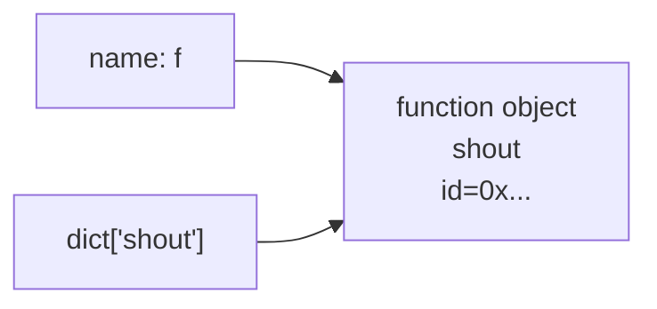
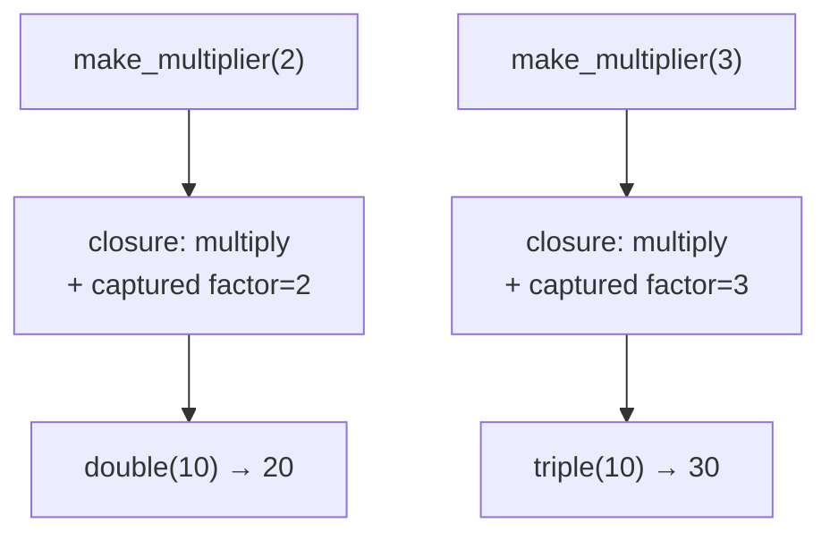

<!-- Module 01 · Lesson 4 — follows ../../../standards/. -->

# 01.4 · Functional Python

[⬅ 01.3 OOP](01.3-object-oriented-python.md) · [🏠 Module](../README.md) · [🗺 Roadmap](../../../ROADMAP.md) · [Next ➡](01.5-iterators-generators.md)

> Functions are first-class objects in Python — you can pass them, return them, and store them. This unlocks closures, higher-order functions, and the map/filter/reduce style that pervades data and AI code (transforms, callbacks, hooks).

| | |
|---|---|
| **Module** | `01 · Advanced Python` |
| **Lesson** | `01.4` |
| **Difficulty** | ⭐⭐⭐ |
| **Estimated study time** | 55 min read · 30 min practice |
| **Status** | 🟢 stable |

---

## 1. Learning Objectives

By the end of this lesson you will be able to:

- [ ] Treat functions as **first-class objects** — pass, return, and store them.
- [ ] Write and reason about **closures** and explain what they capture.
- [ ] Use **higher-order functions**, `lambda`, `map`, `filter`, and `reduce` idiomatically.
- [ ] Use `functools.partial` to specialize functions.
- [ ] Recognize functional patterns in AI codebases (transform pipelines, callbacks, key functions).

## 2. Prerequisites

- [01.3 · Object-Oriented Python](01.3-object-oriented-python.md) — functions are objects too (they even have attributes).

---

## 3. Why This Topic Exists

Data and AI work is full of *transformations*: apply this function to every row, filter these examples, sort by that key, register this callback to run each epoch. Functional programming is the natural style for expressing "apply behavior to data," and Python supports it well.

You'll also *see* it constantly: `dataset.map(tokenize)`, sort `key=` functions, PyTorch hooks, and — crucially — decorators (Lesson 01.6) are built entirely on functions-returning-functions. Understanding closures and higher-order functions is the prerequisite for decorators to make sense.

> [!IMPORTANT]
> Python is **multi-paradigm**: use OOP to model entities, functional style to express transformations, and mix freely. The goal isn't "pure functional programming" — it's picking the clearer tool per problem.

## 4. Problems It Solves

| Problem | Functional tools help by |
|---|---|
| Repeating the same transform over data | `map`/comprehensions apply it uniformly |
| Passing behavior into a function | First-class functions & callbacks |
| Configuring a function once, reusing it | `partial` and closures |
| Custom sorting/grouping | `key=` functions |
| Building decorators (Lesson 01.6) | Closures + higher-order functions |

---

## 5. First-Class Functions

In Python a function is an ordinary object: it has a type, an identity, attributes, and can be assigned to names, stored in data structures, passed as arguments, and returned.

```python
def shout(text: str) -> str:
    return text.upper() + "!"

# Assign to a variable — it's just an object
f = shout
print(f("hi"))              # HI!

# Store in a data structure
ops = {"shout": shout, "len": len}
print(ops["shout"]("yo"))   # YO!

# Functions have attributes
print(shout.__name__)       # 'shout'
```



> [!NOTE]
> This is the same names-vs-objects model from [01.2](01.2-memory-management.md): `f = shout` binds another name to the one function object. Functions are objects — that's the whole foundation of decorators.

---

## 6. Higher-Order Functions

A **higher-order function** takes a function as an argument and/or returns a function. You already use them: `sorted`, `map`, `filter`, `max`, `min` all accept a `key` or transform function.

```python
words = ["banana", "apple", "cherry"]

# Function passed as an argument (key=)
print(sorted(words, key=len))          # ['apple', 'banana', 'cherry'] by length
print(max(words, key=len))             # 'banana'

def apply_twice(func, value):          # takes a function
    return func(func(value))

print(apply_twice(lambda x: x + 3, 10))  # 16
```

| Built-in HOF | Does |
|---|---|
| `sorted(it, key=f)` | Sort by `f(item)` |
| `max/min(it, key=f)` | Extremum by `f(item)` |
| `map(f, it)` | Apply `f` to each item (lazy) |
| `filter(f, it)` | Keep items where `f(item)` is truthy (lazy) |
| `functools.reduce(f, it)` | Fold items into one value |

---

## 7. Lambdas — Small Anonymous Functions

`lambda` creates a small, unnamed function inline. It's an expression, so it's handy where a function is expected briefly (like a `key=`).

```python
sorted(data, key=lambda row: row["score"])       # sort by a dict field
list(map(lambda x: x * 2, [1, 2, 3]))             # [2, 4, 6]
```

| Use `lambda` when | Use `def` when |
|---|---|
| A tiny one-liner passed inline | Any real logic or multiple lines |
| It reads clearly (`key=lambda p: p.age`) | You'd want a name, docstring, or reuse |

> [!WARNING]
> Don't overuse `lambda`. If it's more than a trivial expression, or you assign it to a name (`f = lambda x: ...`), just use `def` — it's more readable and gives a proper `__name__` for tracebacks. PEP 8 explicitly discourages `name = lambda`.

---

## 8. map, filter, reduce — and Their Pythonic Alternatives

```python
from functools import reduce

nums = [1, 2, 3, 4, 5]
list(map(lambda x: x**2, nums))               # [1, 4, 9, 16, 25]
list(filter(lambda x: x % 2 == 0, nums))      # [2, 4]
reduce(lambda acc, x: acc + x, nums, 0)       # 15 (sum via fold)
```

Python often prefers **comprehensions** over `map`/`filter` for readability:

| Functional | Pythonic comprehension |
|---|---|
| `map(lambda x: x**2, nums)` | `[x**2 for x in nums]` |
| `filter(lambda x: x%2==0, nums)` | `[x for x in nums if x%2==0]` |
| `map(f, filter(g, nums))` | `[f(x) for x in nums if g(x)]` |

> [!TIP]
> Prefer **comprehensions** for map/filter — they're clearer to most Python developers. Keep `map`/`filter` for when you're passing an *existing named function* (`map(tokenize, docs)`) where a comprehension would add noise. Note `map`/`filter` are **lazy** (return iterators) — you'll appreciate why in [01.5](01.5-iterators-generators.md).

> [!NOTE]
> `reduce` is not built-in (it's in `functools`) by deliberate design — Guido considered it less readable than a loop or a comprehension for most cases. Use it for genuine folds (e.g., composing functions, running products); reach for `sum`/`math.prod`/a loop otherwise.

---

## 9. Closures — Functions That Remember

A **closure** is a function that captures variables from the enclosing scope where it was defined. The inner function "remembers" those variables even after the outer function has returned.

```python
def make_multiplier(factor: int):
    def multiply(x: int) -> int:
        return x * factor          # captures `factor` from the enclosing scope
    return multiply

double = make_multiplier(2)
triple = make_multiplier(3)
print(double(10), triple(10))      # 20 30
print(double.__closure__[0].cell_contents)  # 2 — the captured value
```



| Term | Meaning |
|---|---|
| **Free variable** | A variable used but not defined in the function (`factor`) |
| **Capture** | The closure keeps a reference to the enclosing binding |
| **`nonlocal`** | Keyword to *rebind* an enclosing variable from the inner function |

> [!WARNING]
> **Closures capture variables by reference, not by value.** A classic bug: creating closures in a loop that all capture the same loop variable.
> ```python
> funcs = [lambda: i for i in range(3)]
> print([f() for f in funcs])   # [2, 2, 2] — all see the FINAL i!
> # Fix: bind per-iteration via a default arg
> funcs = [lambda i=i: i for i in range(3)]
> print([f() for f in funcs])   # [0, 1, 2]
> ```
> This bites people building lists of callbacks/handlers. Remember the [01.2](01.2-memory-management.md) reference model — the closure holds the *name*, not a snapshot.

> [!IMPORTANT]
> Closures are the mechanism behind **decorators** (Lesson 01.6): a decorator is a function that returns an inner function which closes over the original function. If closures click now, decorators will be easy.

---

## 10. `functools.partial` — Pre-Filling Arguments

`partial` produces a new function with some arguments already fixed — a clean way to specialize a general function.

```python
from functools import partial

def connect(host: str, port: int, timeout: float) -> str:
    return f"{host}:{port} (t={timeout})"

# Fix host & timeout; caller only supplies port
local = partial(connect, "localhost", timeout=5.0)
print(local(8080))     # localhost:8080 (t=5.0)

int2 = partial(int, base=2)
print(int2("1010"))    # 10 — parse binary
```

| Alternative | When |
|---|---|
| `partial(f, x)` | Fix arguments of an existing function cleanly |
| A closure/lambda | When you also need extra logic |

> [!TIP]
> `partial` shines for **callbacks and configuration**: register `partial(log, level="DEBUG")` as a handler, or build a family of specialized functions (`to_binary = partial(int, base=2)`). It's more introspectable than an equivalent lambda.

---

## 11. Where This Appears in AI Codebases

| Functional pattern | Real-world appearance |
|---|---|
| `map`-style transforms | `dataset.map(tokenize)` in data pipelines |
| `key=` functions | Sorting/grouping examples, top-k selection |
| Closures | Decorators, callback factories, per-config functions |
| `partial` | Pre-configuring model/API calls, callbacks |
| Callbacks/hooks | Training loop hooks (`on_epoch_end`), PyTorch forward/backward hooks |
| First-class functions | Registries (`{"relu": relu, "gelu": gelu}`), dispatch tables |

```python
# A dispatch table (registry) — first-class functions in action
ACTIVATIONS = {"relu": lambda x: max(0, x), "identity": lambda x: x}
def apply_activation(name: str, x: float) -> float:
    return ACTIVATIONS[name](x)
```

> [!NOTE]
> Registries like `ACTIVATIONS` above are everywhere in ML frameworks (optimizers, losses, layers looked up by name). They're just dicts mapping strings to functions/classes — first-class objects at work.

---

## 12. Common Mistakes & Debugging

| Mistake | Consequence | Fix |
|---|---|---|
| Loop-variable capture in closures | All closures see the final value | Bind via default arg (`i=i`) |
| `name = lambda: ...` | Poor tracebacks, un-Pythonic | Use `def` |
| Overusing `map/filter/reduce` | Less readable than comprehensions | Prefer comprehensions; reserve for named funcs/folds |
| Forgetting `map`/`filter` are lazy | "Nothing happened" (iterator unconsumed) | Wrap in `list()` or iterate |
| Mutating captured mutable state unexpectedly | Shared-state bugs | Be explicit; prefer returning new values |

---

## 13. Performance Notes

| Note | Implication |
|---|---|
| `map`/`filter`/generators are lazy | Memory-efficient over large data — no intermediate list |
| Comprehensions vs `map` | Comparable speed; choose for readability |
| `lambda` in a hot loop | Function-call overhead per item — vectorize with NumPy for big numeric data |
| `partial` | Negligible overhead; more introspectable than lambda |

## 14. Security Considerations

| Risk | Guidance |
|---|---|
| Functions from untrusted sources | Never `eval`/`exec` user input to build functions |
| Dispatch tables keyed by user input | Whitelist keys; a missing/attacker key shouldn't call arbitrary code |
| Callbacks capturing secrets | Closures keep captured values alive — avoid capturing secrets long-term |

> [!CAUTION]
> Never build callables from untrusted strings via `eval`/`exec`. If you need name-based dispatch (e.g., a user picks an "activation"), map allowed names to functions in a **whitelist dict** and reject anything not present.

---

## 15. Interview Questions

**Beginner**
1. What does "functions are first-class" mean in Python?
2. When should you use a `lambda` vs a `def`?

**Intermediate**
1. What is a closure, and what does it capture?
2. Explain the loop-variable closure bug and how to fix it.

**Advanced**
1. How do closures underpin decorators?
2. Compare `map`/`filter`/`reduce` with comprehensions — when is each preferable?

**System-design prompt**
- Design a plugin/callback system where users register handlers to run at pipeline stages. — *Follow-ups:* How do you pass configuration to handlers (partial/closures)? How do you keep it safe from arbitrary code?

---

## 16. Summary

| Key idea | Takeaway |
|---|---|
| First-class functions | Pass, return, store functions like any object |
| Higher-order functions | Take/return functions (`sorted(key=)`, `map`) |
| Lambdas | Tiny inline functions; don't overuse |
| map/filter/reduce | Lazy; prefer comprehensions for readability |
| Closures | Capture enclosing variables (by reference!) |
| `partial` | Pre-fill arguments to specialize functions |

## 17. Cheat Sheet

```text
FIRST-CLASS: f = func · d["k"] = func · pass/return functions
HOF: sorted(it, key=f) · max/min(key=f) · map(f,it) · filter(f,it) · reduce(f,it,init)
LAMBDA: lambda x: expr  (inline only; never `name = lambda`)
COMPREHENSION > map/filter for readability: [f(x) for x in it if g(x)]
CLOSURE: inner fn captures enclosing vars BY REFERENCE
  loop bug: [lambda: i for i in range(3)] → all 2; fix: lambda i=i: i
PARTIAL: partial(f, fixed_arg, kw=val) → specialized function
LAZY: map/filter return iterators → wrap in list() to materialize
REGISTRY: {"relu": relu, ...} dispatch table = first-class funcs
```

## 18. Flashcards

- **Q:** What is a closure? — **A:** A function that captures (by reference) variables from its enclosing scope and remembers them after that scope returns.
- **Q:** Why do closures in a loop often all return the last value? — **A:** They capture the variable by reference, not its value; fix with a per-iteration default arg (`i=i`).
- **Q:** `lambda` vs `def`? — **A:** `lambda` for tiny inline expressions; `def` for anything with real logic, a name, or reuse.
- **Q:** What does `functools.partial` do? — **A:** Returns a new function with some arguments pre-filled, specializing a general function.
- **Q:** Are `map`/`filter` eager or lazy? — **A:** Lazy — they return iterators; materialize with `list()`.
- **Q:** How do closures relate to decorators? — **A:** A decorator returns an inner function that closes over the decorated function — decorators are closures + higher-order functions.

## 19. Hands-on Exercises

> Full set in [`../exercises/`](../exercises/).

- [ ] **(⭐ HOF)** Sort a list of dicts by two different keys using `key=` functions.
- [ ] **(⭐⭐ Closure)** Write `make_counter()` returning a function that increments a private count each call (use `nonlocal`).
- [ ] **(⭐⭐ Debug)** Reproduce the loop-closure bug with a list of lambdas, then fix it. Explain why.
- [ ] **(⭐⭐ Partial)** Use `partial` to build `to_binary`, `to_hex` from `int`. Compare with lambda equivalents.
- [ ] **(⭐⭐⭐ Registry)** Build a function registry with a decorator that registers handlers by name into a dict (foreshadows decorators + dispatch).

## 20. Mini Project

> **Text-transform pipeline (functional).** Build a pipeline that composes a list of transform functions (lowercase, strip, tokenize, remove-stopwords) applied in sequence to text. Support registering new transforms by name (registry) and pre-configuring them with `partial`. Include a diagram of the compose flow. This is the functional twin of the OOP pipeline from [01.3](01.3-object-oriented-python.md) — compare them.

## 21. References

- Python docs — *`functools`*, *Functional Programming HOWTO* ([reference standards](../../../standards/reference-standards.md)).
- PEP 8 — guidance on `lambda` and readability.

## 22. What's Next

Functions that produce values one at a time, lazily, are the bridge to efficient data handling. Next: **iterators and generators** — how `for` really works, and how to process huge datasets without exhausting memory.

➡️ **Next:** [01.5 · Iterators & Generators](01.5-iterators-generators.md)

---

### 🔁 Revision checklist
- [ ] I can pass, return, and store functions fluently
- [ ] I can write a closure and explain what it captures
- [ ] I can reproduce and fix the loop-closure bug
- [ ] I used `partial` and a function registry

### 🔗 Spaced-repetition callback
> Recall [01.2's reference model](01.2-memory-management.md): the loop-closure bug is *the same* aliasing idea — the closure holds the name `i`, not a copy of its value. And the dispatch-table registry is the [01.3 polymorphism](01.3-object-oriented-python.md) idea expressed with functions instead of classes.
