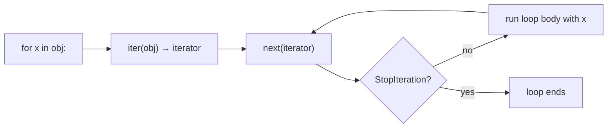
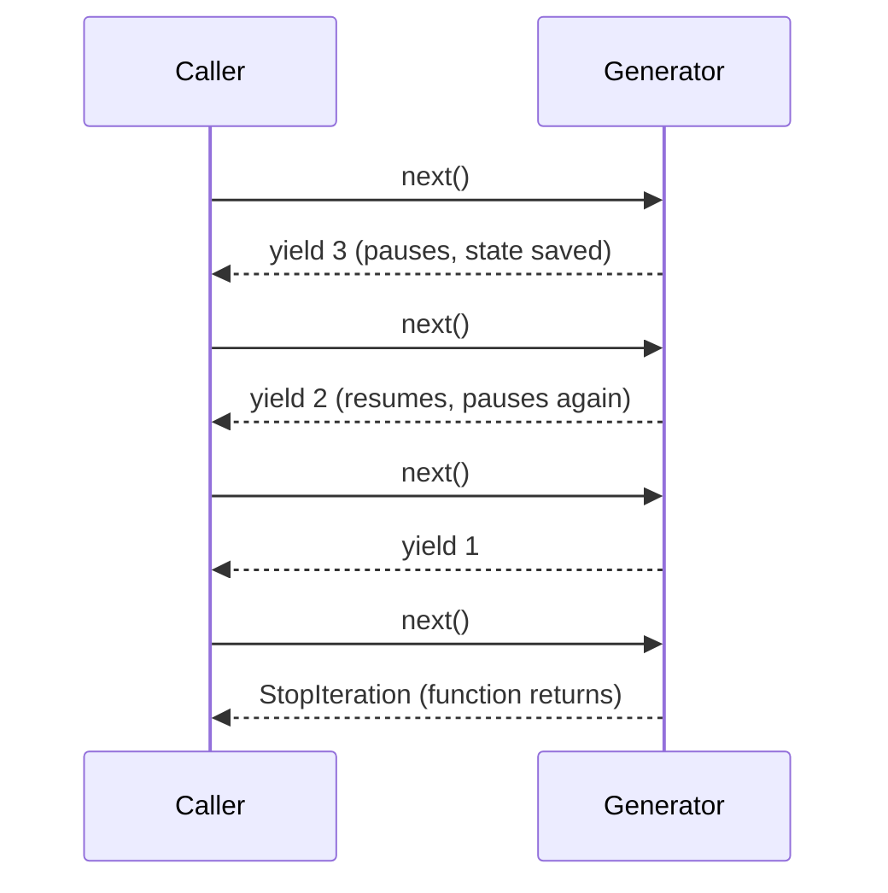
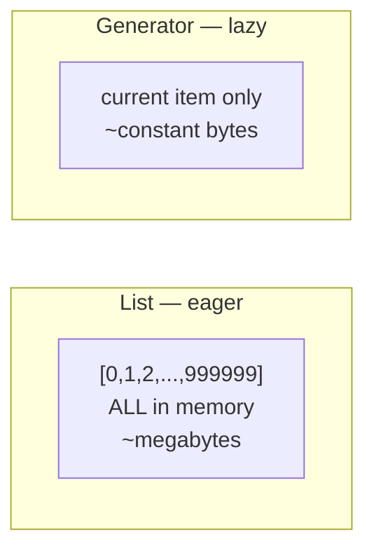
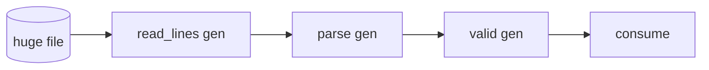

<!-- Module 01 · Lesson 5 — follows ../../../standards/. -->

# 01.5 · Iterators & Generators

[⬅ 01.4 Functional](01.4-functional-python.md) · [🏠 Module](../README.md) · [🗺 Roadmap](../../../ROADMAP.md) · [Next ➡](01.6-decorators.md)

> How `for` really works, and how to process datasets far larger than memory. Generators and lazy evaluation are the difference between an ML pipeline that streams 100 GB comfortably and one that crashes trying to load it all.

| | |
|---|---|
| **Module** | `01 · Advanced Python` |
| **Lesson** | `01.5` |
| **Difficulty** | ⭐⭐⭐ |
| **Estimated study time** | 55 min read · 30 min benchmarks |
| **Status** | 🟢 stable |

---

## 1. Learning Objectives

By the end of this lesson you will be able to:

- [ ] Explain the **iterator protocol** (`__iter__`/`__next__`) and how `for` uses it.
- [ ] Write **generator functions** with `yield` and **generator expressions**.
- [ ] Explain **lazy evaluation** and its memory advantage over lists.
- [ ] **Benchmark** and articulate the memory difference (list vs generator).
- [ ] Use `itertools` for efficient, composable pipelines.
- [ ] Recognize where streaming matters in AI data loading.

## 2. Prerequisites

- [01.4 · Functional Python](01.4-functional-python.md) — `map`/`filter` are lazy iterators.

---

## 3. Why This Topic Exists

AI works with big data — datasets, log files, token streams — often larger than RAM. If you load everything into a list, you run out of memory. **Generators** let you process data one item at a time, computing values on demand rather than all upfront. This is *the* technique for scalable data pipelines.

It's also foundational: `for` loops, comprehensions, `map`/`filter`, file reading, and framework `DataLoader`s all rest on the iterator protocol. Understanding it turns "magic" `for` loops into something you can build and debug.

> [!IMPORTANT]
> **Lazy evaluation** — computing values only when needed — is how you handle data that doesn't fit in memory. Master generators and you can process a 100 GB file on a laptop, one line at a time, with constant memory.

## 4. Problems It Solves

| Problem | Iterators/generators solve it by |
|---|---|
| Dataset larger than RAM | Streaming one item at a time (constant memory) |
| Wasted work computing values you never use | Computing lazily, on demand |
| Building your own iterable objects | The iterator protocol |
| Infinite/unbounded sequences | Generators that never "finish" |
| Chaining transforms efficiently | `itertools` + generator composition |

---

## 5. The Iterator Protocol — How `for` Works

A `for` loop is syntactic sugar over two methods:

- **`__iter__`** returns an *iterator* (an object with `__next__`).
- **`__next__`** returns the next item, or raises `StopIteration` when exhausted.



```python
# What `for` does under the hood:
it = iter([10, 20, 30])   # calls __iter__ → an iterator
print(next(it))           # 10   (calls __next__)
print(next(it))           # 20
print(next(it))           # 30
# next(it) → raises StopIteration
```

| Term | Meaning |
|---|---|
| **Iterable** | Anything you can loop over (`list`, `str`, `dict`, files, …) — has `__iter__` |
| **Iterator** | The stateful cursor produced by `iter()` — has `__next__` |
| **`StopIteration`** | The signal that iteration is done (handled invisibly by `for`) |

### Building an iterator by hand

```python
class Countdown:
    def __init__(self, start: int):
        self.current = start
    def __iter__(self):
        return self                      # this object is its own iterator
    def __next__(self) -> int:
        if self.current <= 0:
            raise StopIteration
        self.current -= 1
        return self.current + 1

for n in Countdown(3):
    print(n)                             # 3, 2, 1
```

> [!NOTE]
> Writing `__iter__`/`__next__` by hand is verbose and easy to get wrong (state management, `StopIteration`). **Generators** do all of this for you — which is exactly why they exist.

---

## 6. Generators with `yield`

A **generator function** uses `yield` instead of `return`. Calling it returns a **generator object** (an iterator) that runs the body lazily — pausing at each `yield` and resuming on the next `next()`.

```python
def countdown(start: int):
    while start > 0:
        yield start          # pause here, hand back a value, remember position
        start -= 1

for n in countdown(3):
    print(n)                 # 3, 2, 1
```



Key insight: the function **suspends** at `yield`, keeping its local state, and **resumes** exactly there on the next call. It's a pausable function.

| `return` | `yield` |
|---|---|
| Ends the function, gives one value | Pauses the function, gives one value, can resume |
| Runs eagerly to completion | Runs lazily, on demand |
| Function returns a value | Function returns a generator object |

> [!TIP]
> The mental model: a generator is a function you can **pause and resume**, producing a stream of values over time instead of one value at the end. State between `yield`s is preserved automatically — no manual `__next__` bookkeeping.

---

## 7. Generator Expressions

Like a list comprehension, but lazy — use parentheses instead of brackets. It produces items on demand rather than building a list.

```python
squares_list = [x**2 for x in range(1_000_000)]   # builds a 1M-element LIST in memory
squares_gen  = (x**2 for x in range(1_000_000))   # a generator — computes on demand

total = sum(x**2 for x in range(1_000_000))       # streams; no giant list built
```

| Form | Memory | Reusable? |
|---|---|---|
| `[... ]` list comp | Holds all items at once | Yes (it's a list) |
| `(... )` generator expr | One item at a time | **No** — exhausted after one pass |

> [!WARNING]
> A generator is **single-use** — once consumed, it's empty. Iterating it again yields nothing. If you need the data twice, materialize it (`list(gen)`) or recreate the generator. A subtle bug: `g = (…); print(sum(g)); print(max(g))` — the second call sees an empty generator.

---

## 8. Lazy Evaluation & the Memory Benchmark

The headline benefit: a generator uses **roughly constant memory** regardless of how many items it will produce, while a list scales linearly.

```python
import sys

nums_list = [x for x in range(1_000_000)]     # a real list of 1M ints
nums_gen  = (x for x in range(1_000_000))     # a generator

print(sys.getsizeof(nums_list))  # ~8+ MB (the list container; ints extra)
print(sys.getsizeof(nums_gen))   # ~200 bytes — constant, regardless of count!
```



> **Illustration placeholder** — `assets/images/list-vs-generator-memory.png`: a bar chart — "list" memory rising linearly with N, "generator" a flat near-zero line — plus a conveyor-belt metaphor (generator = items arriving one at a time; list = a full warehouse).

### A realistic benchmark to run

| Approach | Peak memory | Notes |
|---|---|---|
| `sum([x**2 for x in range(10**7)])` | High (builds full list) | Materializes 10M items |
| `sum(x**2 for x in range(10**7))` | ~Constant | Streams; same result |

> [!IMPORTANT]
> **Streaming a large file** is the canonical AI example:
> ```python
> # ❌ Loads the ENTIRE file into memory
> lines = open("huge.log").readlines()
> # ✅ Streams one line at a time — constant memory, any file size
> with open("huge.log") as f:
>     for line in f:            # a file object is a lazy iterator of lines!
>         process(line)
> ```
> A file object is itself a lazy line iterator. This pattern processes arbitrarily large logs/datasets on a laptop. You'll use exactly this style in data-heavy modules.

> [!NOTE]
> Lazy ≠ always faster. Generators save *memory* and avoid *wasted computation*, but per-item they can be marginally slower than a tight vectorized operation. For heavy numeric work you'll still vectorize with NumPy (Lesson 01.11) — but for streaming/IO-bound pipelines, generators are the right tool.

---

## 9. `itertools` — The Lazy Toolbox

The `itertools` module provides fast, memory-efficient building blocks that compose generators into pipelines.

| Tool | Does | Example |
|---|---|---|
| `islice(it, n)` | Take first n (lazily) | Peek at a stream |
| `chain(a, b)` | Concatenate iterables | Merge sources |
| `count(start, step)` | Infinite counter | Endless IDs |
| `cycle(it)` | Repeat forever | Round-robin |
| `groupby(it, key)` | Group consecutive items | Aggregate sorted data |
| `takewhile`/`dropwhile` | Conditional slicing | Stop/skip on predicate |
| `batched(it, n)` *(3.12+)* | Fixed-size chunks | Mini-batches |

```python
from itertools import islice, chain, count

# Take the first 5 squares from an INFINITE generator — no memory blowup
first5 = list(islice((x**2 for x in count()), 5))   # [0, 1, 4, 9, 16]
```

> [!TIP]
> Chaining generators + `itertools` builds **streaming pipelines**: read → filter → transform → batch, each stage lazy, constant memory end-to-end. This is precisely how scalable data loaders are structured.

---

## 10. Generators as Pipelines (AI Data Loading)

```python
def read_lines(path):
    with open(path) as f:
        for line in f:
            yield line.rstrip("\n")

def parse(lines):
    for line in lines:
        yield line.split(",")

def valid(rows):
    for row in rows:
        if len(row) == 3:
            yield row

# Composed lazy pipeline — processes any file size in constant memory
pipeline = valid(parse(read_lines("data.csv")))
for record in pipeline:
    handle(record)
```



> [!IMPORTANT]
> This is the shape of a real data-loading pipeline (and conceptually how PyTorch's `DataLoader` streams batches). Each stage pulls one item from the previous — **nothing is fully materialized**. Internalize this pattern; you'll reuse it constantly in data and training code.

---

## 11. Common Mistakes & Debugging

| Mistake | Consequence | Fix |
|---|---|---|
| Reusing an exhausted generator | Empty results on 2nd pass | Recreate it, or `list()` if you need multiple passes |
| `list()`-ing a huge/infinite generator | Memory blowup / hang | Keep it lazy; use `islice` to bound |
| Expecting `len()` on a generator | `TypeError` (no length) | Count by consuming, or track separately |
| Building a list just to loop once | Wasted memory | Use a generator expression |
| Side effects inside a generator not running | Lazy — body runs only when consumed | Consume it (iterate / `list`) |

> [!WARNING]
> Generators are **lazy**, so code inside them (including side effects like logging or writes) doesn't run until you consume the generator. "My function didn't do anything" often means you created a generator and never iterated it.

---

## 12. Performance Notes

| Note | Implication |
|---|---|
| Constant memory | Enables datasets larger than RAM |
| Avoids intermediate lists | Lower peak memory across pipeline stages |
| Per-item overhead exists | For heavy numeric math, vectorize (NumPy) instead |
| Single-pass | If you need multiple passes, that's a cost trade-off |
| `itertools` in C | Faster than equivalent Python loops |

## 13. Security Considerations

| Risk | Guidance |
|---|---|
| Unbounded generators from untrusted input | An attacker-fed infinite/huge stream can exhaust CPU/time — bound with `islice`/limits |
| Lazy resource holding | A paused generator over a file keeps it open — ensure cleanup (`with`, Lesson 01.7) |
| `list()` on attacker-controlled size | Memory-exhaustion DoS — cap sizes before materializing |

> [!CAUTION]
> Never `list()` a generator whose length is controlled by untrusted input without a cap — it's a memory-exhaustion DoS. Bound it (`islice(gen, MAX)`) and reject oversized inputs.

---

## 14. Interview Questions

**Beginner**
1. What's the difference between an iterable and an iterator?
2. What does `yield` do, and how is it different from `return`?

**Intermediate**
1. Compare the memory usage of a list comprehension vs a generator expression, with numbers.
2. Why can't you iterate a generator twice? How do you work around it?

**Advanced**
1. Build a streaming pipeline of three generators and explain why nothing is fully materialized.
2. When is lazy evaluation *not* the right choice? (Multiple passes; heavy numeric work.)

**System-design prompt**
- Design a data loader that reads a 200 GB dataset, filters and transforms it, and yields mini-batches — on a machine with 16 GB RAM. — *Follow-ups:* Where does memory stay bounded? How do you avoid re-reading? How do you shuffle without loading everything?

---

## 15. Summary

| Key idea | Takeaway |
|---|---|
| Iterator protocol | `__iter__`/`__next__`; `for` uses them |
| Generators (`yield`) | Pausable functions producing values lazily |
| Generator expressions | Lazy comprehensions `( ... )` |
| Lazy evaluation | ~Constant memory; process data > RAM |
| Single-use | Generators exhaust after one pass |
| `itertools` | Composable, C-speed lazy building blocks |

## 16. Cheat Sheet

```text
ITERABLE has __iter__ → gives an ITERATOR (has __next__, raises StopIteration)
for x in obj  ==  it=iter(obj); while: x=next(it) until StopIteration
GENERATOR FN: use `yield` → returns a lazy, pausable iterator
GEN EXPR: (x*x for x in it)   vs list [x*x for x in it]
LAZY WIN: sys.getsizeof(gen) ~200B regardless of N ; list scales with N
FILES: `for line in f:` streams — file is a lazy line iterator
SINGLE-USE: generators exhaust after one pass → recreate or list() to reuse
ITERTOOLS: islice · chain · count · cycle · groupby · takewhile · batched(3.12+)
SECURITY: cap/islice untrusted-sized streams before list()
```

## 17. Flashcards

- **Q:** Iterable vs iterator? — **A:** Iterable has `__iter__` (can be looped); iterator has `__next__` and is the stateful cursor from `iter()`.
- **Q:** What does `yield` do? — **A:** Pauses a generator function, returns a value, and preserves local state so it can resume on the next `next()`.
- **Q:** Memory: list comp vs generator expr? — **A:** List holds all items (memory ∝ N); generator holds one at a time (~constant memory).
- **Q:** Why can't you loop a generator twice? — **A:** It's single-use/stateful — once exhausted it yields nothing; recreate or `list()` it.
- **Q:** How do you stream a huge file? — **A:** `for line in open_file:` — a file object is a lazy iterator of lines (constant memory).
- **Q:** When is lazy NOT ideal? — **A:** When you need multiple passes, or for heavy numeric work better served by vectorization.

## 18. Hands-on Exercises

> Full set in [`../exercises/`](../exercises/).

- [ ] **(⭐ Protocol)** Implement an iterator class (e.g., `Fibonacci`) with `__iter__`/`__next__`. Then rewrite it as a 3-line generator.
- [ ] **(⭐⭐ Benchmark)** Measure `sys.getsizeof` and peak memory for a 10M list comp vs generator expr computing the same sum. Report the difference.
- [ ] **(⭐⭐ Stream)** Write a generator that yields lines from a large file matching a pattern; process it with constant memory.
- [ ] **(⭐⭐⭐ Pipeline)** Compose 3+ generators (read → parse → filter → batch) into a lazy pipeline. Prove nothing is fully materialized (e.g., works on an infinite source with `islice`).
- [ ] **(⭐⭐ Debug)** Reproduce the "generator exhausted on second pass" bug and fix it two ways.

## 19. Mini Project

> **Streaming log analyzer (v1).** Build a generator-based pipeline that reads a large log file lazily, parses each line, filters by level/pattern, and produces aggregate stats (counts per level, top messages) — all in constant memory. Include a pipeline diagram. You'll extend this into a full CLI in [Lesson 01.15](01.15-projects-summary.md).

## 20. References

- Python docs — *`itertools`*, *Generators*, *Iterator types* ([reference standards](../../../standards/reference-standards.md)).
- PyTorch `DataLoader`/`IterableDataset` docs — real-world streaming iteration.

## 21. What's Next

You can produce and stream values lazily. Next: **decorators** — functions that wrap other functions to add behavior (logging, timing, caching). They're built directly on the closures from [01.4](01.4-functional-python.md).

➡️ **Next:** [01.6 · Decorators](01.6-decorators.md)

---

### 🔁 Revision checklist
- [ ] I can explain the iterator protocol and build one
- [ ] I can write generator functions and expressions
- [ ] I benchmarked list vs generator memory
- [ ] I built a lazy multi-stage pipeline

### 🔗 Spaced-repetition callback
> Recall [01.2's memory model](01.2-memory-management.md): a list of a million Python ints is a million objects; a generator holds *one at a time*. Generators are the pragmatic answer to the same "objects are expensive" reality that pushes ML data into compact arrays. Same problem, complementary tools.
