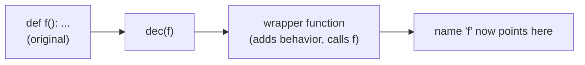
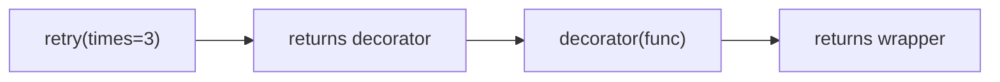
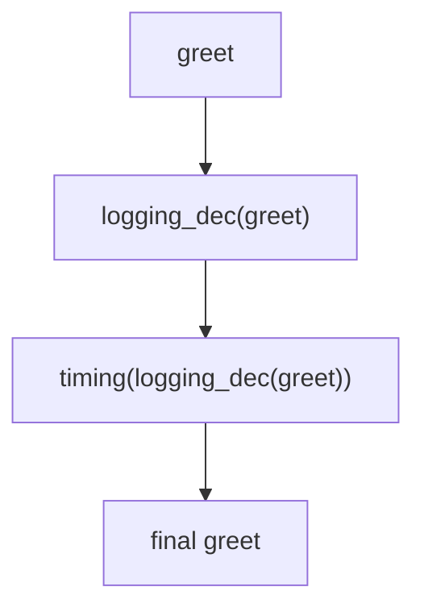

<!-- Module 01 · Lesson 6 — follows ../../../standards/. -->

# 01.6 · Decorators

[⬅ 01.5 Iterators & Generators](01.5-iterators-generators.md) · [🏠 Module](../README.md) · [🗺 Roadmap](../../../ROADMAP.md) · [Next ➡](01.7-context-managers.md)

> A decorator wraps a function to add behavior — logging, timing, caching, retries, auth — without touching the function's code. They're everywhere in AI frameworks (`@torch.no_grad()`, `@app.get(...)`, `@cache`), and they're just closures with sugar.

| | |
|---|---|
| **Module** | `01 · Advanced Python` |
| **Lesson** | `01.6` |
| **Difficulty** | ⭐⭐⭐⭐ |
| **Estimated study time** | 60 min read · 40 min practice |
| **Status** | 🟢 stable |

---

## 1. Learning Objectives

By the end of this lesson you will be able to:

- [ ] Explain what `@decorator` desugars to and why it works.
- [ ] Write **function decorators**, including ones that **take arguments**.
- [ ] Preserve metadata with `functools.wraps`.
- [ ] Stack (**nest**) decorators and reason about their order.
- [ ] Use built-in decorators (`@property`, `@staticmethod`, `@classmethod`, `@cache`).
- [ ] Implement practical decorators: **logging, timing, caching, retry, auth**.

## 2. Prerequisites

- [01.4 · Functional Python](01.4-functional-python.md) — closures and higher-order functions (essential).

---

## 3. Why This Topic Exists

Cross-cutting concerns — logging, timing, caching, retries, access control — apply to *many* functions. Copy-pasting that logic into each function is repetitive and error-prone. **Decorators** let you write the behavior once and apply it declaratively with `@name`, keeping the wrapped function clean.

They're not optional knowledge for an AI Engineer: web frameworks (`@app.post`), caching (`@lru_cache`), PyTorch (`@torch.no_grad()`), test frameworks (`@pytest.fixture`, `@pytest.mark.parametrize`), and countless libraries expose their features *as* decorators. You must be able to read and write them.

> [!IMPORTANT]
> A decorator is just **a function that takes a function and returns a (usually enhanced) function**. `@dec` above `def f` is nothing more than `f = dec(f)`. Everything else is detail. If closures ([01.4](01.4-functional-python.md)) made sense, you already understand the core.

## 4. Problems It Solves

| Problem | Decorators solve it by |
|---|---|
| Same logging/timing pasted in many functions | Write once, apply with `@` |
| Adding behavior without editing a function | Wrapping it transparently |
| Caching expensive results | `@cache`/`@lru_cache` |
| Retrying flaky calls (e.g., model APIs) | A `@retry` decorator |
| Enforcing auth/permissions | An `@require_auth` decorator |

---

## 5. Mental Model: `@dec` == `f = dec(f)`



```python
def announce(func):
    def wrapper(*args, **kwargs):
        print(f"calling {func.__name__}")
        return func(*args, **kwargs)
    return wrapper

@announce                 # exactly equivalent to: greet = announce(greet)
def greet(name):
    return f"hi {name}"

print(greet("sam"))       # prints "calling greet", returns "hi sam"
```

The pieces:

| Piece | Role |
|---|---|
| `announce` | The **decorator** — takes a function, returns a new one |
| `wrapper` | The **closure** that adds behavior and calls the original |
| `*args, **kwargs` | Forward *any* arguments so the wrapper works on any function |
| `return func(...)` | Call the original and pass its result through |

> [!IMPORTANT]
> The wrapper must accept `*args, **kwargs` and return the original's result — otherwise it only works for specific signatures and swallows return values. This is the #1 decorator bug.

---

## 6. Preserving Metadata with `functools.wraps`

Wrapping replaces the original function object, so `greet.__name__` becomes `"wrapper"` and its docstring is lost — breaking introspection, debugging, and docs. `functools.wraps` copies the metadata across.

```python
import functools

def announce(func):
    @functools.wraps(func)          # ← copies __name__, __doc__, etc. from func
    def wrapper(*args, **kwargs):
        return func(*args, **kwargs)
    return wrapper

@announce
def greet(name):
    """Greet someone."""
    return f"hi {name}"

print(greet.__name__)   # 'greet'  (without wraps: 'wrapper')
print(greet.__doc__)    # 'Greet someone.'
```

> [!WARNING]
> **Always use `@functools.wraps(func)` on your wrapper.** Without it you break tracebacks, `help()`, docs, and tools that rely on `__name__`/`__doc__` — and those bugs are maddening to diagnose. Treat it as mandatory boilerplate.

---

## 7. Decorators That Take Arguments

To pass configuration (e.g., `@retry(times=3)`), you add **one more layer**: a function that takes the arguments and *returns a decorator*.



```python
import functools

def retry(times: int):                      # 1) takes the config
    def decorator(func):                    # 2) the actual decorator
        @functools.wraps(func)
        def wrapper(*args, **kwargs):       # 3) the wrapper
            last = None
            for attempt in range(1, times + 1):
                try:
                    return func(*args, **kwargs)
                except Exception as exc:
                    last = exc
            raise last
        return wrapper
    return decorator

@retry(times=3)                             # retry(3) → decorator → wraps flaky
def flaky():
    ...
```

> [!TIP]
> The three-layer structure (`config → decorator → wrapper`) looks intimidating but is mechanical: outer takes args, middle takes the function, inner does the work. Read it inside-out. `@retry(times=3)` calls `retry(3)` *first*, which returns the real decorator.

---

## 8. Stacking (Nesting) Decorators

You can apply multiple decorators; they wrap **bottom-up** (nearest the function first) and execute **top-down** at call time.

```python
@timing        # applied second (outer) → runs first at call time
@logging_dec   # applied first (inner)  → wraps greet directly
def greet(name): ...

# Equivalent to: greet = timing(logging_dec(greet))
```



> [!WARNING]
> **Order matters.** `@timing` then `@logging` measures time *including* logging; swapping them changes what's measured/logged. When stacking, think about which concern should be outermost. A common convention: put cross-cutting infra (timing, auth) outside, and behavior-modifying ones closer to the function.

---

## 9. Built-in and Standard Decorators

You'll use these constantly:

| Decorator | Purpose |
|---|---|
| `@property` | Method as computed attribute (Lesson 01.3) |
| `@staticmethod` | Method with no `self`/`cls` — a namespaced function |
| `@classmethod` | Method receiving the class (`cls`) — alt constructors |
| `@functools.cache` / `@lru_cache(maxsize=…)` | Memoize results (Lesson 01.11) |
| `@functools.wraps` | Preserve wrapped metadata (this lesson) |
| `@dataclass` | Generate class boilerplate (Lesson 01.3) |
| `@abstractmethod` | Mark required methods on an ABC (Lesson 01.3) |

```python
class Model:
    @staticmethod
    def default_config() -> dict:      # no self — utility grouped on the class
        return {"temperature": 0.7}

    @classmethod
    def from_name(cls, name: str) -> "Model":  # alternative constructor
        m = cls(); m.name = name; return m
```

> [!NOTE]
> `@classmethod` is the Pythonic way to provide **alternative constructors** (`Model.from_name(...)`, `datetime.fromtimestamp(...)`). You'll recognize this pattern throughout libraries.

---

## 10. Practical Decorators (The Big Four + Auth)

### Timing

```python
import functools, time

def timed(func):
    @functools.wraps(func)
    def wrapper(*args, **kwargs):
        start = time.perf_counter()
        try:
            return func(*args, **kwargs)
        finally:
            elapsed = time.perf_counter() - start
            print(f"{func.__name__} took {elapsed:.4f}s")
    return wrapper
```

### Logging

```python
import functools, logging
logger = logging.getLogger(__name__)

def log_calls(func):
    @functools.wraps(func)
    def wrapper(*args, **kwargs):
        logger.debug("call %s args=%s kwargs=%s", func.__name__, args, kwargs)
        result = func(*args, **kwargs)
        logger.debug("%s -> %r", func.__name__, result)
        return result
    return wrapper
```

### Caching (memoization)

```python
import functools

@functools.lru_cache(maxsize=1024)     # remembers recent results
def embed(text: str) -> tuple[float, ...]:
    ...                                # expensive call; identical inputs return cached
```

### Retry with backoff (great for model/API calls)

```python
import functools, time

def retry(times: int = 3, delay: float = 0.5, backoff: float = 2.0):
    def decorator(func):
        @functools.wraps(func)
        def wrapper(*args, **kwargs):
            wait, last = delay, None
            for _ in range(times):
                try:
                    return func(*args, **kwargs)
                except Exception as exc:        # narrow to specific errors in real code
                    last = exc
                    time.sleep(wait)
                    wait *= backoff
            raise last
        return wrapper
    return decorator
```

### Auth / access control

```python
import functools

class AuthError(Exception): ...

def require_role(role: str):
    def decorator(func):
        @functools.wraps(func)
        def wrapper(user, *args, **kwargs):
            if role not in getattr(user, "roles", ()):
                raise AuthError(f"needs role {role}")
            return func(user, *args, **kwargs)
        return wrapper
    return decorator
```

> [!IMPORTANT]
> A **retry decorator on model/API calls** is standard in AI Engineering — network calls to hosted models are flaky and rate-limited. You'll refine this (with jitter and specific exception types) in [Lesson 01.9](01.9-error-handling-logging.md) and use it against real APIs in [Module 11+](../../11-LLMs/README.md).

---

## 11. Class Decorators (Briefly)

Decorators can also wrap **classes** — `@dataclass` is the famous example. A class decorator takes a class and returns a (modified) class.

```python
def add_repr(cls):
    cls.__repr__ = lambda self: f"{cls.__name__}({vars(self)})"
    return cls

@add_repr
class Point:
    def __init__(self, x, y): self.x, self.y = x, y
```

> [!NOTE]
> You'll mostly *use* class decorators (`@dataclass`, `@functools.total_ordering`) rather than write them. Recognizing them as "class in, class out" is enough for now.

---

## 12. Common Mistakes & Debugging

| Mistake | Consequence | Fix |
|---|---|---|
| Forgetting `@functools.wraps` | Lost name/doc; broken tracebacks & tools | Always add it |
| Wrapper doesn't `return` the result | Silently drops return values | `return func(*args, **kwargs)` |
| Wrapper signature too narrow | Fails for functions with other args | Use `*args, **kwargs` |
| Wrong stacking order | Wrong thing measured/logged | Think about outer vs inner |
| Caching a function with side effects | Stale/incorrect behavior | Only cache pure functions |
| `lru_cache` on unhashable args | `TypeError` | Cache only hashable inputs |

> [!WARNING]
> **Only memoize pure functions** (same input → same output, no side effects). Caching a function that reads changing state, mutates something, or depends on time returns stale/wrong results. This is a frequent, sneaky bug — the cache "works" until the underlying data changes.

---

## 13. Performance Notes

| Note | Implication |
|---|---|
| Wrapping adds a call layer | Negligible for most; avoid on ultra-hot inner loops |
| `lru_cache`/`cache` | Huge speedups for repeated pure calls; watch memory (`maxsize`) |
| Decorator runs at import | Heavy work in the decorator body slows startup |
| Stacked decorators | Each adds a frame; keep stacks reasonable |

## 14. Security Considerations

| Risk | Guidance |
|---|---|
| Auth decorators as the *only* gate | Ensure they can't be bypassed; test them |
| Logging decorators leaking secrets | Never log full args if they contain keys/PII — redact |
| Unbounded caches | Memory-exhaustion DoS — set `maxsize`; cache keys from untrusted input carefully |
| Caching sensitive results | Cached values persist in memory — consider what's stored |

> [!CAUTION]
> A logging decorator that dumps all `args`/`kwargs` will happily log API keys, passwords, and PII. Redact sensitive fields, or log only what's safe. This is a real, common leak.

---

## 15. Interview Questions

**Beginner**
1. What does `@decorator` above a function actually do?
2. Why do we use `functools.wraps`?

**Intermediate**
1. Write a decorator that takes an argument (e.g., `@retry(times=3)`). Explain the three layers.
2. Explain the order of execution when two decorators are stacked.

**Advanced**
1. When is it unsafe to cache a function? Give an example.
2. How would you design a retry decorator suitable for flaky LLM API calls (exceptions, backoff, jitter, giving up)?

**System-design prompt**
- Design a set of decorators to add observability (logging, timing, metrics) and resilience (retry, timeout, caching) to all outbound model API calls in a service. — *Follow-ups:* What order do you stack them? How do you avoid leaking secrets in logs? How do you bound the cache?

---

## 16. Summary

| Key idea | Takeaway |
|---|---|
| `@dec` == `f = dec(f)` | A decorator takes a function, returns an enhanced one |
| Built on closures | The wrapper closes over the original function |
| `functools.wraps` | Mandatory — preserves metadata |
| Args → 3 layers | `config → decorator → wrapper` |
| Stacking | Bottom-up wrapping; order matters |
| Practical uses | Logging, timing, caching, retry, auth |

## 17. Cheat Sheet

```text
CORE: @dec over def f  ==  f = dec(f)
SHAPE:
  def dec(func):
      @functools.wraps(func)          # ALWAYS
      def wrapper(*args, **kwargs):    # forward everything
          ... ; return func(*args, **kwargs)   # RETURN result
      return wrapper
WITH ARGS (3 layers): def deco(cfg): def dec(func): def wrapper(...): ...
STACK: @a \n @b \n def f  ==  f = a(b(f))  (b inner, a outer)
BUILTINS: @property @staticmethod @classmethod @lru_cache/@cache @wraps @dataclass @abstractmethod
USES: timing · logging · caching(pure only!) · retry(backoff) · auth
PITFALLS: missing wraps · not returning · narrow signature · caching impure/side-effect fns
SECURITY: redact secrets in logging decorators · bound cache maxsize
```

## 18. Flashcards

- **Q:** What is `@dec` equivalent to? — **A:** `f = dec(f)` — rebinding the name to the decorator's returned function.
- **Q:** Why use `functools.wraps`? — **A:** To copy the wrapped function's metadata (`__name__`, `__doc__`) so introspection, tracebacks, and docs still work.
- **Q:** How do you make a decorator that takes arguments? — **A:** Three layers: a function taking the args that returns a decorator that returns the wrapper.
- **Q:** In `@a` over `@b` over `f`, what's the equivalent call? — **A:** `f = a(b(f))` — `b` wraps first (inner), `a` outermost.
- **Q:** When is caching a function unsafe? — **A:** When it isn't pure — side effects, changing external state, or time-dependence make cached results wrong/stale.
- **Q:** Why must a wrapper use `*args, **kwargs` and `return`? — **A:** To work for any signature and to pass through the original's return value.

## 19. Hands-on Exercises

> Full set in [`../exercises/`](../exercises/).

- [ ] **(⭐ Basic)** Write a `@timed` decorator (with `wraps`) and apply it to a function.
- [ ] **(⭐⭐ Args)** Write `@repeat(n)` that calls the function n times; explain the three layers.
- [ ] **(⭐⭐ Cache)** Compare a recursive `fib` with and without `@lru_cache`; measure the speedup.
- [ ] **(⭐⭐⭐ Retry)** Implement `@retry` with exponential backoff that only catches specified exception types and re-raises after N tries.
- [ ] **(⭐⭐⭐ Debug)** Given a decorator missing `wraps` and not returning results, diagnose both bugs from the symptoms and fix them.
- [ ] **(⭐⭐⭐ Stack)** Stack `@timed` and `@log_calls` two ways; observe and explain the difference.

## 20. Mini Project

> **Observability decorator toolkit.** Build a small module of reusable decorators — `@timed`, `@log_calls` (with secret redaction), `@retry(...)`, and `@cached` — each production-quality (uses `wraps`, forwards args, handles errors). Write tests (foreshadowing [01.10](01.10-testing.md)) and a README showing correct stacking order. You'll reuse this toolkit when calling model APIs later.

## 21. References

- Python docs — *`functools`* (`wraps`, `lru_cache`, `cache`), *Descriptor/decorator patterns* ([reference standards](../../../standards/reference-standards.md)).
- `PEP 318` (decorators) — the original rationale, for the curious.

## 22. What's Next

Decorators add behavior *around a call*. **Context managers** add behavior *around a block* — guaranteeing setup/cleanup (files, connections, GPU state). Next up, and closely related.

➡️ **Next:** [01.7 · Context Managers](01.7-context-managers.md)

---

### 🔁 Revision checklist
- [ ] I can explain `@dec` as `f = dec(f)`
- [ ] I always use `functools.wraps`
- [ ] I can write an argument-taking decorator
- [ ] I built timing/logging/caching/retry decorators

### 🔗 Spaced-repetition callback
> Recall [01.4's closures](01.4-functional-python.md): a decorator's `wrapper` is a closure over `func`. And [01.2's "cache that grows unbounded is a leak"](01.2-memory-management.md) is exactly why `lru_cache` takes a `maxsize`. Decorators tie together the last three lessons.
