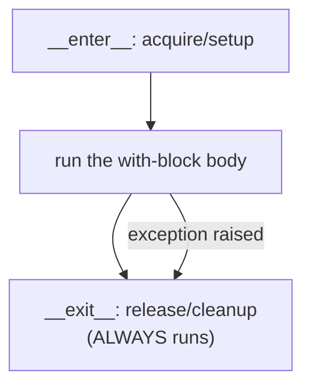
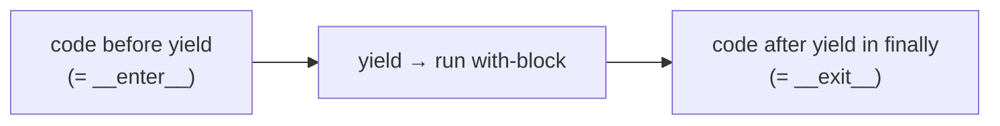

<!-- Module 01 · Lesson 7 — follows ../../../standards/. -->

# 01.7 · Context Managers

[⬅ 01.6 Decorators](01.6-decorators.md) · [🏠 Module](../README.md) · [🗺 Roadmap](../../../ROADMAP.md) · [Next ➡](01.8-type-hinting.md)

> The `with` statement guarantees setup and cleanup happen — even when errors strike. Context managers are how you avoid leaked files, unclosed connections, and dangling GPU/model state. AI code relies on them heavily.

| | |
|---|---|
| **Module** | `01 · Advanced Python` |
| **Lesson** | `01.7` |
| **Difficulty** | ⭐⭐⭐ |
| **Estimated study time** | 45 min read · 30 min practice |
| **Status** | 🟢 stable |

---

## 1. Learning Objectives

By the end of this lesson you will be able to:

- [ ] Explain what the **`with`** statement guarantees and why.
- [ ] Implement a context manager via **`__enter__`/`__exit__`**.
- [ ] Implement one more simply with **`@contextlib.contextmanager`**.
- [ ] Handle errors and cleanup correctly in `__exit__`.
- [ ] Use multiple context managers and `contextlib` helpers.
- [ ] Recognize why AI code (files, sessions, GPU state, timers) depends on them.

## 2. Prerequisites

- [01.5 · Iterators & Generators](01.5-iterators-generators.md) — the `@contextmanager` helper uses a generator.

---

## 3. Why This Topic Exists

Resources must be released: files closed, network/database connections returned, locks freed, temporary state restored. If you rely on remembering to clean up manually, you *will* forget — especially when an exception jumps out of the middle of your code. Leaked resources cause file-descriptor exhaustion, connection-pool starvation, and corrupted data.

The `with` statement makes cleanup **automatic and exception-safe**. In AI code this is pervasive: opening dataset files, managing model/inference sessions, toggling gradient state (`torch.no_grad()`), timing blocks, acquiring GPU resources, and handling temporary directories.

> [!IMPORTANT]
> `with` guarantees the cleanup step runs **whether the block succeeds, returns, or raises**. That guarantee — not brevity — is the whole point. It's the structured, reliable way to manage anything that must be released.

## 4. Problems It Solves

| Problem | Context managers solve it by |
|---|---|
| Forgetting to close files/connections | Automatic cleanup on block exit |
| Leaks when an exception skips your cleanup | Cleanup runs even on error |
| Repetitive try/finally boilerplate | `with` encapsulates it |
| Temporarily changing state and restoring it | Enter sets, exit restores |
| Managing several resources at once | Multiple/`ExitStack` context managers |

---

## 5. Mental Model: Guaranteed Setup → Body → Teardown



```python
# The problem it replaces (verbose, easy to get wrong):
f = open("data.txt")
try:
    data = f.read()
finally:
    f.close()               # must remember; must handle exceptions

# The with statement — same guarantee, clean:
with open("data.txt") as f:
    data = f.read()
# f is guaranteed closed here, even if read() raised
```

> [!NOTE]
> `with` is essentially structured `try/finally`. `__enter__` runs at the top (its return value is bound by `as`), and `__exit__` runs at the bottom **no matter how the block ends**.

---

## 6. The Protocol: `__enter__` and `__exit__`

Any object implementing these two dunders is a context manager.

```python
class Timer:
    def __enter__(self):
        import time
        self.start = time.perf_counter()
        return self                      # value bound to `as`

    def __exit__(self, exc_type, exc_value, traceback) -> bool:
        import time
        self.elapsed = time.perf_counter() - self.start
        print(f"block took {self.elapsed:.4f}s")
        return False                     # do NOT suppress exceptions

with Timer() as t:
    sum(range(1_000_000))
# prints elapsed; t.elapsed available afterward
```

| `__exit__` parameter | Meaning |
|---|---|
| `exc_type` | Exception class if the block raised, else `None` |
| `exc_value` | The exception instance, else `None` |
| `traceback` | The traceback, else `None` |
| **Return value** | `True` = **suppress** the exception; falsy = let it propagate |

> [!WARNING]
> Returning `True` from `__exit__` **swallows the exception** — the `with` block "succeeds" even though it failed. Almost always return `False` (or nothing). Suppress only when you deliberately mean to (rare), or you'll hide real errors — a nasty, silent bug.

---

## 7. The Easier Way: `@contextlib.contextmanager`

Writing a class for a simple context manager is heavy. `contextlib.contextmanager` turns a **generator** into one: everything before `yield` is setup, everything after is teardown.

```python
import contextlib, time

@contextlib.contextmanager
def timer(label: str):
    start = time.perf_counter()
    try:
        yield                            # <-- the with-block runs here
    finally:
        print(f"{label}: {time.perf_counter() - start:.4f}s")

with timer("training step"):
    train_one_step()
```



| Class-based | `@contextmanager` |
|---|---|
| `__enter__`/`__exit__` methods | A single generator function |
| More control (exc handling, reuse) | Concise; great for simple setup/teardown |
| Verbose | Put teardown in `finally` for safety |

> [!IMPORTANT]
> Put the teardown in a **`finally`** block inside the generator. Otherwise, if the `with`-block raises, the exception propagates *through* the `yield` and your cleanup after it is skipped — reintroducing the leak you were preventing.

---

## 8. Multiple Context Managers & `contextlib` Helpers

```python
# Manage several resources at once
with open("in.txt") as src, open("out.txt", "w") as dst:
    dst.write(src.read())
```

Handy `contextlib` tools:

| Tool | Use |
|---|---|
| `contextlib.suppress(Error)` | Ignore a specific exception cleanly (replaces empty `try/except pass`) |
| `contextlib.closing(obj)` | Ensure `obj.close()` is called for non-`with` objects |
| `contextlib.ExitStack()` | Manage a **dynamic** number of context managers |
| `contextlib.redirect_stdout(f)` | Temporarily redirect output |

```python
from contextlib import ExitStack

def open_all(paths):
    with ExitStack() as stack:
        files = [stack.enter_context(open(p)) for p in paths]
        # all files open here; all guaranteed closed on exit — even if one open() fails
        return [f.readline() for f in files]
```

> [!TIP]
> `ExitStack` is the answer when you don't know how many resources you'll manage until runtime (e.g., open N shards, acquire M locks). It guarantees each entered context is exited in reverse order.

---

## 9. Why AI Projects Rely on Context Managers

| AI use case | Context manager |
|---|---|
| Reading/writing datasets & checkpoints | `with open(...)` (and streaming, [01.5](01.5-iterators-generators.md)) |
| Disabling gradient tracking for inference | `with torch.no_grad():` |
| Managing DB / HTTP / model sessions | `with client.session() as s:` |
| Temp files/dirs during preprocessing | `with tempfile.TemporaryDirectory() as d:` |
| Timing training/inference blocks | a `timer()` context manager |
| Acquiring locks in concurrent code | `with lock:` |
| Restoring config/random state | enter sets, exit restores |

```python
# The canonical AI example — inference without building the gradient graph:
import torch
with torch.no_grad():          # __enter__ disables grad; __exit__ restores it
    predictions = model(inputs)
# gradient tracking restored here, guaranteed, even if model(...) raised
```

> [!IMPORTANT]
> `torch.no_grad()` is a context manager you'll use in nearly every inference path ([Module 09+](../../09-Deep-Learning/README.md)). It **temporarily changes global state and guarantees restoration** — the "set-and-restore" pattern is a core reason AI code leans on `with`. Recognizing it as an ordinary context manager demystifies a lot of framework code.

---

## 10. Common Mistakes & Debugging

| Mistake | Consequence | Fix |
|---|---|---|
| Manual open/close without `with` | Leaked file descriptors on error | Use `with` |
| Returning `True` from `__exit__` accidentally | Exceptions silently swallowed | Return `False`/nothing |
| No `finally` in `@contextmanager` generator | Cleanup skipped on exceptions | Wrap teardown in `finally` |
| Doing heavy work in `__enter__` that can fail | Partial setup, unclear state | Keep `__enter__` minimal; use `ExitStack` |
| Using `with` on something that isn't a CM | `AttributeError`/`TypeError` | Wrap with `closing()` or add the protocol |

> [!WARNING]
> The classic leak: looping and opening files without `with` (or without closing), then hitting file-descriptor limits after thousands of iterations — common in data-processing scripts. Always `with open(...)`, or use `ExitStack` for dynamic sets.

---

## 11. Performance Notes

| Note | Implication |
|---|---|
| `with` overhead is negligible | Don't avoid it for "speed"; correctness wins |
| Prompt resource release | Frees file descriptors/connections quickly (doesn't wait for GC) |
| `no_grad()` for inference | Skips building the autograd graph → less memory & faster |
| `ExitStack` | Cheap; enables clean dynamic resource management |

## 12. Security Considerations

| Risk | Guidance |
|---|---|
| Leaked file handles/connections | Resource exhaustion (DoS) — always use `with` |
| Temp files with sensitive data | Use `tempfile` (secure perms) + guaranteed cleanup via `with` |
| Suppressing exceptions in `__exit__` | Can hide security-relevant failures — don't suppress blindly |
| Cleanup that itself fails | Ensure teardown is robust; log failures |

> [!CAUTION]
> Use `tempfile.TemporaryDirectory()`/`NamedTemporaryFile` (which create files with safe permissions and clean up via `with`) rather than hand-rolling temp paths in shared directories — the latter risks race conditions and information leaks.

---

## 13. Interview Questions

**Beginner**
1. What does the `with` statement guarantee, and why is that useful?
2. Which two methods define a context manager?

**Intermediate**
1. Implement a context manager two ways: class-based and with `@contextmanager`.
2. What does returning `True` from `__exit__` do, and why is it dangerous?

**Advanced**
1. When would you use `ExitStack`? Give a concrete AI example.
2. Explain why `torch.no_grad()` is a context manager and what it guarantees.

**System-design prompt**
- Design resource management for a service that, per request, opens several files, acquires a model session, and writes output — all of which must be released even on failure. — *Follow-ups:* How do you handle a dynamic number of resources? How do you avoid FD exhaustion under load?

---

## 14. Summary

| Key idea | Takeaway |
|---|---|
| `with` = guaranteed cleanup | Runs on success, return, or exception |
| Protocol | `__enter__` (setup) / `__exit__` (teardown) |
| `@contextmanager` | Generator: pre-`yield` setup, post-`yield` teardown (in `finally`) |
| `__exit__` return | `True` suppresses exceptions — almost never do this |
| `ExitStack` | Manage a dynamic number of resources |
| AI reliance | Files, sessions, `no_grad`, temp dirs, timers, locks |

## 15. Cheat Sheet

```text
WITH: with cm as x:  →  __enter__ (returns x) ; body ; __exit__ (ALWAYS runs)
CLASS CM: def __enter__(self): setup; return val
          def __exit__(self, et, ev, tb): cleanup; return False  # don't suppress
GENERATOR CM:
  @contextlib.contextmanager
  def cm():
      setup
      try: yield value
      finally: cleanup            # teardown MUST be in finally
MULTI: with open(a) as x, open(b) as y: ...
DYNAMIC: with ExitStack() as s: s.enter_context(open(p)) for p in paths
HELPERS: suppress(Err) · closing(obj) · redirect_stdout · TemporaryDirectory
AI: torch.no_grad() · sessions · temp dirs · timers · locks
PITFALL: returning True from __exit__ hides exceptions
```

## 16. Flashcards

- **Q:** What does `with` guarantee? — **A:** That `__exit__` (cleanup) runs whether the block succeeds, returns, or raises.
- **Q:** Which methods define a context manager? — **A:** `__enter__` (setup, returns the `as` value) and `__exit__` (teardown).
- **Q:** How does `@contextlib.contextmanager` split setup/teardown? — **A:** Code before `yield` is setup; code after (in a `finally`) is teardown.
- **Q:** What does returning `True` from `__exit__` do? — **A:** Suppresses any exception from the block — dangerous; almost always return `False`.
- **Q:** When do you use `ExitStack`? — **A:** When managing a dynamic/unknown number of context managers, all guaranteed to be exited.
- **Q:** Why is `torch.no_grad()` a context manager? — **A:** It temporarily disables gradient tracking and guarantees it's restored on block exit.

## 17. Hands-on Exercises

> Full set in [`../exercises/`](../exercises/).

- [ ] **(⭐ Basic)** Write a `Timer` context manager (class-based) that prints elapsed time; store it on the instance.
- [ ] **(⭐⭐ Generator)** Rewrite `Timer` using `@contextmanager`. Put teardown in `finally` and prove it runs on exceptions.
- [ ] **(⭐⭐ State)** Write a context manager that temporarily changes an env var / global and restores it on exit.
- [ ] **(⭐⭐⭐ ExitStack)** Open a runtime-determined list of files with `ExitStack`; ensure all close even if one open fails.
- [ ] **(⭐⭐ Debug)** Given a `@contextmanager` without `finally`, show how an exception skips cleanup, then fix it.

## 18. Mini Project

> **Managed resource toolkit.** Build a small library of context managers useful in AI work: `timer(label)`, `temporary_directory()`, `suppress_and_log(*errors)`, and `changed_setting(obj, **overrides)` (set-and-restore). Include tests proving cleanup runs on exceptions, and a diagram of enter/exit flow. Pairs naturally with the decorator toolkit from [01.6](01.6-decorators.md).

## 19. References

- Python docs — *`contextlib`*, *`with` statement*, *`tempfile`* ([reference standards](../../../standards/reference-standards.md)).
- PyTorch docs — `torch.no_grad`/`inference_mode` as context managers.

## 20. What's Next

Your code is well-structured and resource-safe. Now make it **self-documenting and statically checkable** with **type hints** — essential for large AI codebases and for validating LLM I/O.

➡️ **Next:** [01.8 · Type Hinting](01.8-type-hinting.md)

---

### 🔁 Revision checklist
- [ ] I can implement a context manager both ways
- [ ] I know why teardown goes in `finally` for `@contextmanager`
- [ ] I understand `__exit__`'s return value and exception suppression
- [ ] I used `ExitStack` for dynamic resources

### 🔗 Spaced-repetition callback
> Recall [01.6's decorators](01.6-decorators.md): both decorators and context managers add "before/after" behavior — decorators *around a call*, context managers *around a block*. And [01.5's generators](01.5-iterators-generators.md) power `@contextmanager`. The pieces of this module keep composing.
