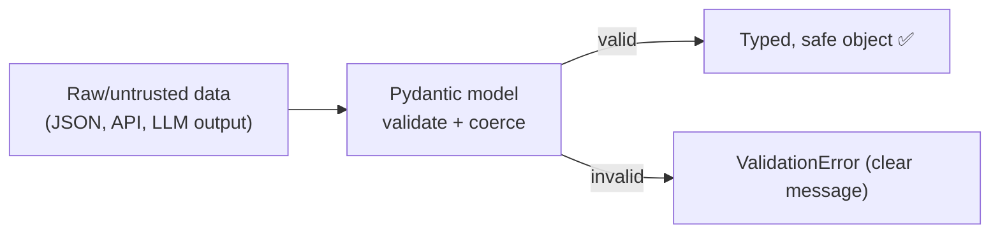
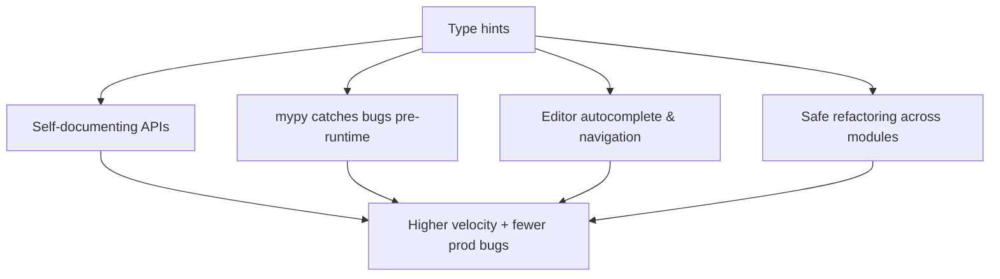

<!-- Module 01 · Lesson 8 — follows ../../../standards/. -->

# 01.8 · Type Hinting

[⬅ 01.7 Context Managers](01.7-context-managers.md) · [🏠 Module](../README.md) · [🗺 Roadmap](../../../ROADMAP.md) · [Next ➡](01.9-error-handling-logging.md)

> Type hints turn Python's dynamism into a safety net: they document intent, catch whole classes of bugs before runtime, and make large AI codebases navigable. Plus Pydantic — the tool you'll use to validate LLM inputs and outputs.

| | |
|---|---|
| **Module** | `01 · Advanced Python` |
| **Lesson** | `01.8` |
| **Difficulty** | ⭐⭐⭐ |
| **Estimated study time** | 65 min read · 40 min practice |
| **Status** | 🟢 stable |

---

## 1. Learning Objectives

By the end of this lesson you will be able to:

- [ ] Annotate functions and variables with the `typing` system.
- [ ] Use `Optional`, `Union` (`|`), `Literal`, `Callable`, generics, and `Annotated`.
- [ ] Define structural interfaces with **`Protocol`** and typed dicts with **`TypedDict`**.
- [ ] Run **mypy** to catch type errors statically.
- [ ] Use **Pydantic** to validate structured data and LLM I/O at runtime.
- [ ] Explain why static typing pays off most in large AI codebases.

## 2. Prerequisites

- [01.3 · OOP](01.3-object-oriented-python.md) (classes, duck typing) and [01.4 · Functional](01.4-functional-python.md) (`Callable`).

---

## 3. Why This Topic Exists

Python is dynamically typed — a variable can hold anything, and errors surface only at runtime, often deep in production. In a small script that's fine. In a large AI codebase — many modules, many contributors, data flowing through pipelines — untyped code becomes a guessing game: *what does this function actually take and return?*

Type hints fix this. They're **optional annotations** that document intent and let a **static type checker** (mypy) catch mismatches *before* you run the code. They don't change runtime behavior (Python ignores them at execution) but they dramatically improve reliability, editor autocomplete, and readability. And with **Pydantic**, the same type annotations become *runtime validation* — indispensable for parsing untrusted or LLM-generated data.

> [!IMPORTANT]
> Type hints are the cheapest reliability upgrade available. They catch "passed a `str` where an `int` was expected" and "forgot this can be `None`" at edit time — the exact bugs that cause 2 a.m. incidents. In this handbook, all example code is type-hinted ([code standards](../../../standards/code-standards.md)).

## 4. Problems It Solves

| Problem | Type hints solve it by |
|---|---|
| "What does this function take/return?" | Self-documenting signatures |
| `None`-related crashes (`AttributeError`) | `Optional`/`|` forces you to handle `None` |
| Wrong-type bugs found only at runtime | mypy catches them statically |
| Poor editor autocomplete | Types power IDE IntelliSense |
| Unvalidated external/LLM data | Pydantic validates at the boundary |
| Refactoring fear in big codebases | Types catch broken call sites |

---

## 5. The Basics

```python
def tokenize(text: str, lowercase: bool = True) -> list[str]:
    if lowercase:
        text = text.lower()
    return text.split()

count: int = 0
ratios: dict[str, float] = {}
```

- Parameters: `name: type`. Return: `-> type`. Variables: `name: type = value`.
- Built-in generics work directly (Python 3.9+): `list[str]`, `dict[str, int]`, `tuple[int, ...]`, `set[str]`.

> [!NOTE]
> **Type hints do not run.** Python does not enforce them at runtime — `tokenize(123)` won't raise *because of* the hint. Their value comes from the **static checker** (mypy) and your editor. (Pydantic, §11, adds *opt-in* runtime enforcement.)

---

## 6. Optional, Union, and the `|` Operator

Real code often has values that may be missing or may be one of several types.

```python
# Modern syntax (Python 3.10+): use |
def find_user(uid: int) -> str | None:        # returns a name OR None
    ...

def parse(value: str) -> int | float:         # returns an int or a float
    ...

# Older/equivalent typing forms:
from typing import Optional, Union
def find_user(uid: int) -> Optional[str]: ...        # == str | None
def parse(value: str) -> Union[int, float]: ...      # == int | float
```

| Annotation | Meaning |
|---|---|
| `T \| None` / `Optional[T]` | A `T` or `None` |
| `A \| B` / `Union[A, B]` | Either type |
| `Any` | Opt out of checking (use sparingly) |

> [!WARNING]
> **`Optional[T]` means `T | None`, not "optional argument."** It's about the *value* possibly being `None`, not whether the parameter has a default. And once a value is `T | None`, mypy forces you to handle the `None` case before using it as a `T` — which is exactly the bug-prevention you want.

```python
def greet(name: str | None) -> str:
    # return name.upper()   # mypy error: name could be None
    if name is None:
        return "hello, stranger"
    return name.upper()      # here mypy knows name is str
```

---

## 7. Literal, Callable, and Annotated

| Tool | Purpose | Example |
|---|---|---|
| `Literal[...]` | Restrict to exact values | `mode: Literal["train", "eval"]` |
| `Callable[[Args], Return]` | Type a function argument | `Callable[[str], int]` |
| `Annotated[T, meta]` | Attach metadata to a type | `Annotated[int, "seconds"]` |
| `Final` | Mark a constant | `MAX: Final = 100` |

```python
from typing import Literal, Callable

def set_mode(mode: Literal["train", "eval", "predict"]) -> None:
    ...
# set_mode("trian")  → mypy error: not a valid literal (catches typos!)

def apply(fn: Callable[[float], float], x: float) -> float:
    return fn(x)
```

> [!TIP]
> `Literal` is fantastic for the string "enums" that pervade ML APIs — `mode`, `reduction="mean"`, `dtype="float16"`. It turns a typo into a static error instead of a runtime surprise. `Annotated` is what advanced tools (including Pydantic and FastAPI) use to attach validation/metadata to a type.

---

## 8. Generics — Types That Take Types

Generics let you write code that's type-safe across many element types (like `list[T]`).

```python
from typing import TypeVar

T = TypeVar("T")

def first(items: list[T]) -> T | None:      # returns the same type it received
    return items[0] if items else None

reveal = first([1, 2, 3])        # inferred as int | None
reveal2 = first(["a", "b"])      # inferred as str | None
```

Modern syntax (Python 3.12+) is even cleaner:

```python
def first[T](items: list[T]) -> T | None:   # PEP 695 type-parameter syntax
    return items[0] if items else None
```

> [!NOTE]
> You'll *use* generics constantly (every `list[X]`, `dict[K, V]`) and occasionally *write* your own for reusable, type-preserving utilities (caches, containers, pipelines). Generic containers keep type information flowing through your code so the checker stays useful.

---

## 9. Protocols — Structural Typing (Duck Typing, Checked)

Recall duck typing from [01.3](01.3-object-oriented-python.md): you care about behavior, not class. A **`Protocol`** formalizes that — it defines a *shape*, and any object with matching methods satisfies it, **without inheriting** anything.

```python
from typing import Protocol

class Retriever(Protocol):
    def search(self, query: str, k: int) -> list[str]: ...

def run(retriever: Retriever, q: str) -> list[str]:
    return retriever.search(q, k=5)

class VectorStore:                      # does NOT inherit Retriever
    def search(self, query: str, k: int) -> list[str]:
        return ["doc"]

run(VectorStore(), "hi")                # ✅ type-checks — it matches the shape
```

| ABC (nominal) | Protocol (structural) |
|---|---|
| Must **inherit** the base | Just needs the **right methods** |
| Explicit "is-a" contract | Implicit "quacks-like" contract |
| Good for frameworks you control | Great for typing duck-typed interfaces |

> [!IMPORTANT]
> Protocols are the type-system expression of Python's duck typing. They let you type a "thing with a `.search()` method" without forcing every implementation into an inheritance hierarchy — perfect for pluggable AI components (retrievers, tokenizers, model clients).

---

## 10. TypedDict — Typing Dictionary Shapes

Lots of AI data is dict-shaped (JSON configs, API payloads, records). `TypedDict` types the *keys and value types* of a dict.

```python
from typing import TypedDict

class Message(TypedDict):
    role: str
    content: str

msg: Message = {"role": "user", "content": "hello"}
# {"role": "user"}  → mypy error: missing 'content'
```

> [!TIP]
> `TypedDict` documents the "chat message" / payload shapes you pass to model APIs, catching missing/misspelled keys statically. When you also need **runtime validation and parsing**, reach for Pydantic (next) — TypedDict is static-only.

---

## 11. Pydantic — Types That Validate at Runtime

Type hints are static. **Pydantic** uses the *same annotations* to **validate and parse data at runtime**, raising clear errors on bad input. It is the workhorse for handling external data — config, API requests, and especially **LLM outputs**.

```python
from pydantic import BaseModel, Field

class ModelConfig(BaseModel):
    name: str
    temperature: float = Field(default=0.7, ge=0.0, le=2.0)  # validated range
    max_tokens: int = Field(default=1024, gt=0)

cfg = ModelConfig(name="x", temperature="0.2")   # coerces "0.2" → 0.2
# ModelConfig(name="x", temperature=5)  → ValidationError: temperature <= 2.0
```



| Feature | Why it matters for AI |
|---|---|
| Validation + coercion | Trust data crossing your boundary |
| Clear error messages | Debug bad payloads fast |
| JSON Schema generation | Structured-output / function-calling schemas |
| Nested models | Complex request/response shapes |

> [!IMPORTANT]
> **Validating LLM output is a core AI-Engineering task.** Models return text you *hope* is valid JSON of a certain shape. Define a Pydantic model for the expected structure and parse the output through it — you get a typed object or a precise error to retry on. You'll do exactly this in [Module 12 (Prompt Engineering)](../../12-Prompt-Engineering/README.md) and [Module 14 (Agents)](../../14-AI-Agents/README.md). Pydantic also underpins FastAPI request/response models ([Module 16](../../16-MLOps/README.md)).

> [!WARNING]
> Don't confuse the two roles: **type hints + mypy = static (compile-time) checks; Pydantic = runtime validation.** Hints alone will *not* stop bad data at runtime. Use hints everywhere for developer safety, and Pydantic at trust boundaries (external input, LLM output) for runtime enforcement.

---

## 12. Running mypy

```bash
uv add --dev mypy
mypy src/                 # type-check your package
```

```python
def add(a: int, b: int) -> int:
    return a + b

add("1", "2")             # mypy: Argument 1 to "add" has incompatible type "str"
```

| Practice | Why |
|---|---|
| Run mypy in CI | Catches type regressions on every change |
| Start lenient, tighten over time | `--strict` on new code; ease into legacy |
| Avoid `Any` and `# type: ignore` | They silence the checker — use sparingly, with a reason |

> [!TIP]
> Adopt typing **incrementally**. You don't need 100% coverage on day one. Type new code and public interfaces first; mypy checks what's annotated and leaves the rest. Even partial typing catches real bugs.

---

## 13. Why Static Typing Pays Off in Large AI Codebases



| In a small script | In a large AI codebase |
|---|---|
| Types feel like overhead | Types are essential navigation & safety |
| You remember every function | Nobody remembers 50k lines |
| Bugs are local | Bugs hide across module boundaries |
| Refactoring is quick | Refactoring is scary without a checker |

> [!IMPORTANT]
> The value of types scales with codebase size and team size. AI systems get big fast (data pipelines + models + serving + orchestration). Types are what let you refactor confidently and onboard others — a direct multiplier on the "maintainable code" mindset from [Module 00.10](../../00-Orientation/weeks/00.10-ai-engineer-mindset.md).

---

## 14. Common Mistakes & Debugging

| Mistake | Consequence | Fix |
|---|---|---|
| Thinking hints enforce at runtime | Bad data still crashes | Use Pydantic at boundaries |
| Overusing `Any` | Disables checking silently | Annotate precisely; justify any `Any` |
| Ignoring mypy errors with blanket `# type: ignore` | Hides real bugs | Fix, or ignore narrowly with a reason |
| Not handling `None` from `Optional` | `AttributeError` at runtime | Narrow with `if x is None` |
| Wrong `Callable` signature | Misleading types | Match `Callable[[args], ret]` exactly |
| Mutable default with a type hint | Still the [01.2](01.2-memory-management.md) bug | `field(default_factory=...)` / `None` |

---

## 15. Performance Notes

| Note | Implication |
|---|---|
| Hints are runtime no-ops | Zero runtime cost (ignored by the interpreter) |
| Pydantic validation has cost | Validate at boundaries, not in hot inner loops |
| Pydantic v2 core is in Rust | Fast, but still avoid per-element validation of huge arrays |
| mypy runs at dev/CI time | No production impact |

## 16. Security Considerations

| Risk | Guidance |
|---|---|
| Trusting external/LLM data because it "has a type hint" | Hints don't validate — use Pydantic to enforce |
| Over-permissive models accepting extra fields | Configure strictness; reject unexpected input |
| Coercion surprises | Understand Pydantic's coercion rules; use strict types where needed |
| Injection via unvalidated fields | Validate/normalize all boundary data before use |

> [!CAUTION]
> Every byte crossing a trust boundary — HTTP request, file, and especially **LLM output used to drive actions/tool calls** — must be *validated*, not merely *annotated*. Treat LLM output as untrusted input: parse it through a strict Pydantic model before acting on it.

---

## 17. Interview Questions

**Beginner**
1. Do type hints change runtime behavior? What are they for?
2. What does `str | None` (or `Optional[str]`) mean?

**Intermediate**
1. Difference between a `Protocol` and an ABC? When use each?
2. How do type hints relate to Pydantic — static vs runtime?

**Advanced**
1. How would you validate and safely consume JSON output from an LLM?
2. Why does the value of static typing grow with codebase and team size?

**System-design prompt**
- Design the typing/validation strategy for a service that ingests external API requests and LLM-generated tool calls. — *Follow-ups:* Where do you use mypy vs Pydantic? How do you handle invalid LLM output gracefully?

---

## 18. Summary

| Key idea | Takeaway |
|---|---|
| Hints document + enable static checks | No runtime effect; mypy catches bugs early |
| `Optional`/`\|` | Forces you to handle `None` |
| `Literal`/`Callable`/generics | Precise, expressive types |
| `Protocol` | Structural typing = checked duck typing |
| `TypedDict` | Types dict shapes (static) |
| Pydantic | Runtime validation for external/LLM data |

## 19. Cheat Sheet

```text
BASICS: def f(x: int, s: str = "a") -> list[str]: ...   ; y: dict[str, int] = {}
NONE:   T | None  (==Optional[T]) → mypy forces you to handle None
UNION:  A | B  (==Union[A, B])   ;  Any = opt out (avoid)
LITERAL: mode: Literal["train","eval"]   (typo → static error)
CALLABLE: Callable[[float], float]
GENERICS: TypeVar("T"); def first(x: list[T]) -> T | None   (3.12: def first[T](...))
PROTOCOL: structural interface — matches by SHAPE, no inheritance
TYPEDDICT: typed dict keys/values (static only)
PYDANTIC: BaseModel + Field(ge=,le=,gt=) → RUNTIME validate/coerce; validate LLM output!
HINTS = static (mypy) ; PYDANTIC = runtime. Different jobs.
TOOL: mypy src/  (run in CI; adopt incrementally)
```

## 20. Flashcards

- **Q:** Do type hints run at runtime? — **A:** No — Python ignores them at execution; they're for static checkers (mypy) and editors. (Pydantic adds opt-in runtime checks.)
- **Q:** What does `Optional[T]` mean? — **A:** `T | None` — the value may be `None`; it does *not* mean "optional argument."
- **Q:** Protocol vs ABC? — **A:** Protocol matches by structure (methods present, no inheritance); ABC requires explicit inheritance.
- **Q:** What is `Literal` good for? — **A:** Restricting a value to specific constants (e.g., `mode` strings), turning typos into static errors.
- **Q:** Static hints vs Pydantic? — **A:** Hints = compile-time checks (mypy); Pydantic = runtime validation/coercion of data.
- **Q:** How do you handle LLM JSON output safely? — **A:** Parse it through a strict Pydantic model; get a typed object or a clear ValidationError to retry on.

## 21. Hands-on Exercises

> Full set in [`../exercises/`](../exercises/).

- [ ] **(⭐ Annotate)** Fully type-hint an untyped function; run mypy and fix what it flags.
- [ ] **(⭐⭐ None)** Write a function returning `T | None` and let mypy force you to handle the `None` at the call site.
- [ ] **(⭐⭐ Literal/Protocol)** Add a `Literal` mode parameter and define a `Protocol` for a component; type-check an implementation that doesn't inherit it.
- [ ] **(⭐⭐⭐ Pydantic)** Model an LLM "structured response" with Pydantic (with field validation). Feed it valid and invalid JSON; handle the `ValidationError`.
- [ ] **(⭐⭐ Debug)** Given code with `Any` hiding a bug, remove `Any`, add precise types, and let mypy surface the bug.

## 22. Mini Project

> **Typed config + LLM-output validator.** Build a module with (a) a Pydantic `AppConfig` loaded/validated from JSON with sensible constraints, and (b) an `LLMResponse` model that parses model output into a typed object, retrying/erroring clearly on invalid data. Fully typed; mypy-clean; tested. This is a direct dress rehearsal for real LLM app code.

## 23. References

- Python docs — *`typing`*, *`typing.Protocol`*, *`TypedDict`*; mypy documentation ([reference standards](../../../standards/reference-standards.md)).
- Pydantic documentation — models, fields, validation.
- PEPs 484, 561, 604, 695 (typing evolution), for the curious.

## 24. What's Next

Typed, structured code still fails — networks drop, files vanish, models error. Next: **error handling and logging** — building resilient code that fails gracefully and tells you what happened.

➡️ **Next:** [01.9 · Error Handling & Logging](01.9-error-handling-logging.md)

---

### 🔁 Revision checklist
- [ ] I annotate functions and handle `Optional` correctly
- [ ] I can define and use a `Protocol`
- [ ] I validate external/LLM data with Pydantic
- [ ] My code passes mypy

### 🔗 Spaced-repetition callback
> Recall [01.3's duck typing](01.3-object-oriented-python.md): `Protocol` is duck typing made checkable. And the [01.2 mutable-default bug](01.2-memory-management.md) survives even with type hints — a reminder that types document but don't validate; only runtime tools (Pydantic) enforce.
