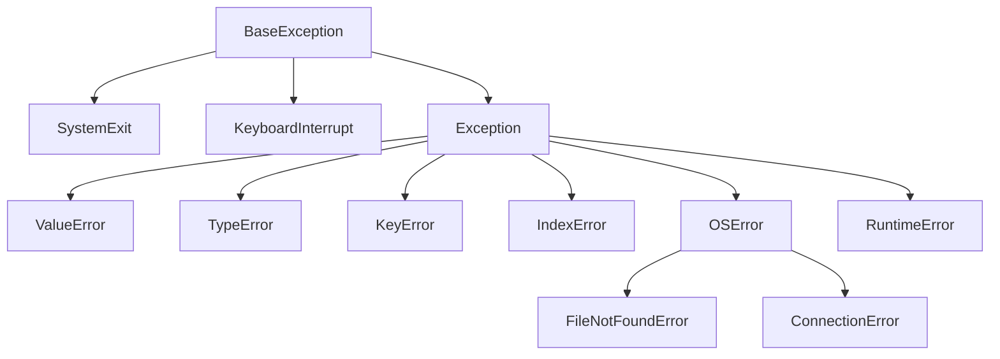
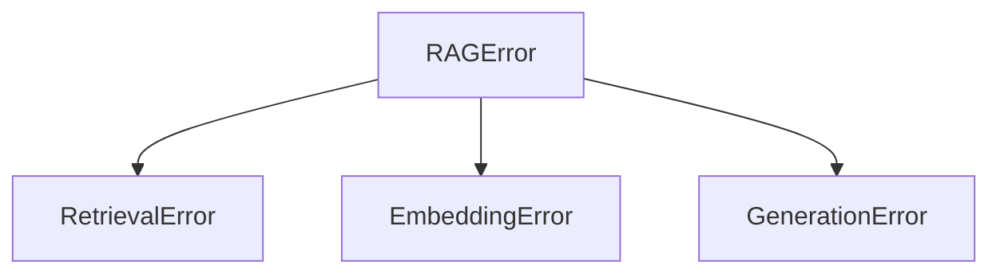
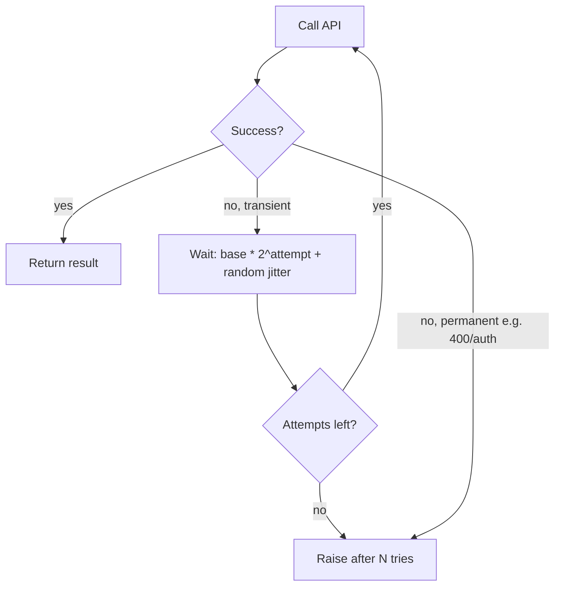

<!-- Module 01 · Lesson 9 — follows ../../../standards/. -->

# 01.9 · Error Handling & Logging

[⬅ 01.8 Type Hinting](01.8-type-hinting.md) · [🏠 Module](../README.md) · [🗺 Roadmap](../../../ROADMAP.md) · [Next ➡](01.10-testing.md)

> Production AI systems fail constantly — flaky APIs, malformed data, rate limits. This lesson is about failing *well*: a clean exception hierarchy, custom exceptions, retry strategies, defensive programming, and logging that lets you debug production without a debugger.

| | |
|---|---|
| **Module** | `01 · Advanced Python` |
| **Lesson** | `01.9` |
| **Difficulty** | ⭐⭐⭐ |
| **Estimated study time** | 60 min read · 40 min practice |
| **Status** | 🟢 stable |

---

## 1. Learning Objectives

By the end of this lesson you will be able to:

- [ ] Navigate Python's **exception hierarchy** and catch at the right level.
- [ ] Design and raise **custom exceptions** with context.
- [ ] Apply **retry strategies** (backoff + jitter) for flaky external calls.
- [ ] Write **defensive** code that validates assumptions and fails fast.
- [ ] Configure the **`logging`** module properly (levels, handlers, formatters).
- [ ] Produce **structured logs** suitable for production observability.

## 2. Prerequisites

- [01.6 · Decorators](01.6-decorators.md) (retry decorator) and [01.8 · Type Hinting](01.8-type-hinting.md) (validation).

---

## 3. Why This Topic Exists

In a notebook, an unhandled exception is a minor annoyance. In a production AI service handling thousands of requests, a single unhandled error can crash a worker, drop a user's request, or corrupt data — and if you have no logs, you're debugging blind. AI systems are *especially* failure-prone: they depend on external model APIs (network, rate limits, timeouts), consume messy real-world data, and run long enough to hit every edge case.

Handling errors well and logging thoughtfully is what separates a demo from a service. It's the concrete implementation of the "measure results / debugging" mindset from [Module 00.10](../../00-Orientation/weeks/00.10-ai-engineer-mindset.md).

> [!IMPORTANT]
> The goal is not to prevent all failures (impossible) but to **fail gracefully, recover when possible, and always leave a trace**. A system that fails loudly and legibly is far better than one that fails silently or crashes opaquely.

## 4. Problems It Solves

| Problem | This lesson's tools solve it by |
|---|---|
| One error crashes the whole service | Catching at the right boundary |
| Flaky API calls fail randomly | Retry with backoff + jitter |
| Silent corruption from bad data | Defensive checks; fail fast |
| "It broke in prod but I have no idea why" | Structured, leveled logging |
| Swallowed errors hiding real bugs | Never bare-`except`; log + re-raise |
| Vague errors (`KeyError` with no context) | Custom exceptions carrying context |

---

## 5. The Exception Hierarchy

All exceptions derive from `BaseException`. You almost always work with `Exception` and its subclasses.



| Rule | Why |
|---|---|
| Catch `Exception`, **not** `BaseException` | `BaseException` includes `KeyboardInterrupt`/`SystemExit` — catching them breaks Ctrl-C and clean shutdown |
| Catch the **most specific** exception you can handle | Broad catches hide bugs you didn't mean to swallow |
| Let exceptions you can't handle **propagate** | Don't pretend to handle what you can't |

```python
# ❌ Too broad — hides real bugs, catches things you can't handle
try:
    result = risky()
except Exception:
    result = None

# ✅ Specific — handle what you understand, let the rest propagate
try:
    result = risky()
except (ConnectionError, TimeoutError) as exc:
    logger.warning("network issue, using fallback: %s", exc)
    result = fallback()
```

> [!WARNING]
> **Never write a bare `except:` (or `except BaseException`).** A bare except catches *everything* — including `KeyboardInterrupt` and `SystemExit` — turning Ctrl-C into a no-op and hiding programming errors. At minimum use `except Exception`, and prefer specific types.

---

## 6. Custom Exceptions

Built-in exceptions are generic. Custom exceptions give errors **meaning and context**, and let callers catch *your* errors specifically.

```python
class RAGError(Exception):
    """Base class for all errors in this RAG system."""

class RetrievalError(RAGError):
    """Raised when document retrieval fails."""

class EmbeddingError(RAGError):
    def __init__(self, text: str, cause: str) -> None:
        super().__init__(f"failed to embed text ({len(text)} chars): {cause}")
        self.text = text
        self.cause = cause
```



> [!TIP]
> Define a **base exception per subsystem** (`RAGError`) and specific subclasses. Callers can then `except RAGError` to catch anything from your component, or a specific subclass for targeted handling. Attach useful attributes (`self.text`, request IDs) so logs and handlers have context.

### Chaining exceptions with `raise ... from`

```python
try:
    response = client.embed(text)
except ConnectionError as exc:
    raise EmbeddingError(text, "network") from exc   # preserves the original cause
```

> [!IMPORTANT]
> Use `raise NewError(...) from original` to **preserve the causal chain**. The traceback shows both your high-level error *and* the underlying cause — invaluable for debugging. Losing the original exception (`raise NewError()` with no `from`) throws away the most useful clue.

---

## 7. Retry Strategies for Flaky Calls

External calls — especially to hosted model APIs — fail transiently: network blips, rate limits (HTTP 429), timeouts. The right response is often to **retry with exponential backoff and jitter**, giving up after a bounded number of attempts.



```python
import time, random, logging
logger = logging.getLogger(__name__)

class TransientError(Exception): ...

def call_with_retry(fn, *, retries: int = 4, base: float = 0.5, cap: float = 8.0):
    for attempt in range(retries):
        try:
            return fn()
        except TransientError as exc:
            if attempt == retries - 1:
                logger.error("giving up after %d attempts: %s", retries, exc)
                raise
            # exponential backoff with full jitter
            delay = min(cap, base * (2 ** attempt)) * random.uniform(0.5, 1.0)
            logger.warning("attempt %d failed (%s); retrying in %.2fs", attempt + 1, exc, delay)
            time.sleep(delay)
```

| Concept | Why it matters |
|---|---|
| **Exponential backoff** | Waits grow (0.5s, 1s, 2s…) to avoid hammering a struggling service |
| **Jitter** | Randomization prevents synchronized retry storms ("thundering herd") |
| **Cap** | Bounds the maximum wait |
| **Retry only transient errors** | Retrying a 400/auth error is pointless and harmful |
| **Bounded attempts** | Never retry forever — fail with a clear error |

> [!WARNING]
> **Only retry idempotent, transient failures.** Retrying a request that *did* succeed but whose response was lost can double-charge or duplicate side effects. Retrying a *permanent* error (bad input, auth failure) just wastes time and money. Classify errors before retrying. (This is the production-grade version of the retry decorator from [01.6](01.6-decorators.md); real libraries like `tenacity` implement it robustly.)

---

## 8. Defensive Programming

Defensive programming means validating assumptions and failing fast with clear errors, rather than letting bad state propagate into a confusing crash later.

```python
def top_k(scores: list[float], k: int) -> list[float]:
    if k < 0:
        raise ValueError(f"k must be non-negative, got {k}")
    if k > len(scores):
        raise ValueError(f"k={k} exceeds number of scores ({len(scores)})")
    return sorted(scores, reverse=True)[:k]
```

| Technique | Example |
|---|---|
| **Validate inputs at the boundary** | Check types/ranges on entry (Pydantic, [01.8](01.8-type-hinting.md)) |
| **Fail fast** | Raise immediately on invalid state, near the cause |
| **Guard clauses** | Early `raise`/`return` instead of deep nesting |
| **Assertions for invariants** | `assert` for "can't happen" developer checks |
| **`else`/`finally`** | `else` runs if no exception; `finally` always runs (cleanup) |

```python
try:
    data = load(path)
except FileNotFoundError:
    logger.error("missing input: %s", path)
    raise
else:
    process(data)          # only if load succeeded
finally:
    cleanup()              # always
```

> [!CAUTION]
> **Never use `assert` for validating untrusted input or enforcing runtime security checks.** Python's `-O` flag strips all `assert` statements, so `assert user.is_admin` would silently vanish in optimized runs. Use `assert` only for internal "this should be impossible" invariants; use explicit `if ...: raise` for real validation.

> [!TIP]
> **Fail fast, near the source.** An error raised the moment bad data appears is trivial to debug; the same bad data crashing three functions later is a mystery. Validate at boundaries and raise immediately.

---

## 9. Logging — Why `print` Doesn't Cut It

`print()` is fine for a quick script. Production needs the **`logging`** module: severity levels, configurable destinations, structured output, and the ability to turn verbosity up/down without code changes.

| `print` | `logging` |
|---|---|
| Always on, no levels | Levels: filter by severity |
| Only stdout | Files, stdout, network, multiple handlers |
| No metadata | Timestamps, module, level, line, context |
| Can't disable per-module | Fine-grained control |

### Levels


| Level | Use for |
|---|---|
| `DEBUG` | Detailed diagnostic info (dev/troubleshooting) |
| `INFO` | Normal, expected events ("request handled") |
| `WARNING` | Something unexpected but handled (retry, fallback) |
| `ERROR` | A failure of an operation (request failed) |
| `CRITICAL` | The app/service itself is in danger |

### Basic configuration

```python
import logging

logging.basicConfig(
    level=logging.INFO,
    format="%(asctime)s %(levelname)s %(name)s %(message)s",
)
logger = logging.getLogger(__name__)      # per-module logger — the convention

logger.info("service started")
logger.warning("rate limited, backing off")
logger.error("request failed", exc_info=True)   # includes the traceback
```

> [!IMPORTANT]
> **Get a logger per module with `logging.getLogger(__name__)`** and configure logging **once** at your application's entry point — never in library code. Libraries should log to their named logger and let the *application* decide handlers/levels. Use lazy `%`-formatting (`logger.info("x=%s", x)`), not f-strings, so the string is only built if that level is enabled.

---

## 10. Structured Logging for Production

Human-readable text logs are hard to search at scale. **Structured logging** emits machine-parseable records (usually JSON) with consistent fields — so you can filter, aggregate, and trace in a log platform.

```python
# Conceptual: attach structured context to each log record
logger.info(
    "llm_call_complete",
    extra={"request_id": rid, "model": "x", "latency_ms": 812, "tokens": 431},
)
# → {"time": ..., "level": "INFO", "msg": "llm_call_complete",
#    "request_id": "...", "model": "x", "latency_ms": 812, "tokens": 431}
```

| Practice | Benefit |
|---|---|
| Emit JSON with consistent fields | Queryable in log systems |
| Include a **correlation/request ID** | Trace one request across components |
| Log key metrics (latency, tokens, cost) | Observability of AI-specific concerns |
| Standardize field names | Aggregation across services |

> [!TIP]
> Structured logs are the foundation of the **observability** you'll build in [Module 19 (Production AI)](../../19-Production-AI/README.md). For AI systems, log model name, latency, token counts, and a request ID on every model call — these become your cost and performance dashboards. Libraries like `structlog` make this ergonomic.

---

## 11. Best Practices (Errors + Logging)

| Do | Don't |
|---|---|
| Catch specific exceptions you can handle | Bare `except:` / broad `except Exception: pass` |
| `raise ... from` to preserve cause | Swallow the original error |
| Log at the right level, with context | `print()` in production |
| Retry only transient, idempotent failures | Retry everything (or forever) |
| Validate inputs at boundaries | Trust external/LLM data |
| Log exceptions with `exc_info=True` | Log just `str(exc)` and lose the traceback |
| Redact secrets/PII in logs | Log full requests containing keys |

> [!CAUTION]
> **Never log secrets or PII** (API keys, tokens, passwords, personal data). Logs are widely accessible and long-lived. Redact or omit sensitive fields — a leaked credential in logs is a real, common incident. (Same warning as the logging decorator in [01.6](01.6-decorators.md).)

---

## 12. Common Mistakes & Debugging

| Mistake | Consequence | Fix |
|---|---|---|
| Bare `except:` | Hides bugs; breaks Ctrl-C | `except SpecificError` |
| `except Exception: pass` | Silent failures | Log + handle or re-raise |
| Losing the original cause | Hard-to-debug tracebacks | `raise New() from exc` |
| Retrying permanent errors | Wasted time/money | Classify before retrying |
| `assert` for validation | Vanishes under `-O` | Use `if ...: raise` |
| `print` debugging in prod | No control, no metadata | Use `logging` |
| f-strings in log calls | Builds string even if filtered | Lazy `%` args |

---

## 13. Performance Notes

| Note | Implication |
|---|---|
| Logging has cost | Guard expensive debug logs; use lazy formatting |
| Exceptions for control flow | Slow if in hot loops — prefer checks for expected cases |
| Retries add latency | Backoff caps and attempt limits bound worst case |
| Structured logging serialization | JSON-encode efficiently; sample high-volume logs |

## 14. Security Considerations

| Risk | Guidance |
|---|---|
| Secrets/PII in logs | Redact; never log credentials or user data |
| Verbose errors leaking internals to users | Log details internally; return generic messages externally |
| `assert` for auth checks | Stripped by `-O`; use explicit checks |
| Retrying non-idempotent calls | Can duplicate side effects — ensure idempotency |
| Error messages echoing untrusted input | Sanitize before logging/returning |

> [!CAUTION]
> Don't leak internal details (stack traces, file paths, queries) to end users in error responses — attackers use them for reconnaissance. Log the details internally; return a generic, safe message and a correlation ID the user can quote to support.

---

## 15. Interview Questions

**Beginner**
1. Why is a bare `except:` dangerous?
2. What are the logging levels, and when do you use each?

**Intermediate**
1. Why use `raise ... from`? What does it preserve?
2. Design a retry strategy for a flaky model API. What do you retry, and how do you back off?

**Advanced**
1. When should you *not* retry a failed request?
2. Why is `assert` unsuitable for validating untrusted input?

**System-design prompt**
- Design error handling and observability for a service that calls an external LLM API under load. — *Follow-ups:* How do you distinguish transient vs permanent failures? What do you log per request? How do you avoid leaking secrets or duplicating non-idempotent calls?

---

## 16. Summary

| Key idea | Takeaway |
|---|---|
| Exception hierarchy | Catch specific `Exception` subclasses; never `BaseException`/bare |
| Custom exceptions | Give errors meaning + context; chain with `from` |
| Retries | Backoff + jitter, bounded, transient/idempotent only |
| Defensive programming | Validate at boundaries; fail fast; `assert` for invariants only |
| Logging > print | Levels, per-module loggers, configure once |
| Structured logging | JSON + request IDs + metrics → observability |

## 17. Cheat Sheet

```text
CATCH: except SpecificError as e  (NEVER bare except / BaseException)
CUSTOM: class MyError(Exception) hierarchy per subsystem
CHAIN: raise MyError(...) from original_exc   (keeps the cause)
RETRY: transient + idempotent only · exp backoff base*2^n · + jitter · cap · bounded attempts
DEFENSIVE: validate at boundary · fail fast · guard clauses · assert = invariants ONLY (dies under -O)
try/except/else/finally: else=on success · finally=always (cleanup)
LOGGING: logger = logging.getLogger(__name__) · configure ONCE at entry point
  levels: DEBUG<INFO<WARNING<ERROR<CRITICAL · logger.error(..., exc_info=True)
  lazy args: logger.info("x=%s", x)  (not f-string)
STRUCTURED: JSON + request_id + latency/tokens/cost  → observability
SECURITY: never log secrets/PII · don't leak internals to users
```

## 18. Flashcards

- **Q:** Why never use a bare `except:`? — **A:** It catches everything, including `KeyboardInterrupt`/`SystemExit`, breaking Ctrl-C/shutdown and hiding bugs.
- **Q:** What does `raise NewError(...) from exc` do? — **A:** Chains exceptions, preserving the original cause in the traceback for debugging.
- **Q:** What must be true to safely retry a failed call? — **A:** The failure is transient and the operation is idempotent; retries are backed-off, jittered, and bounded.
- **Q:** Why not use `assert` for input validation? — **A:** `python -O` strips asserts, so the check silently disappears; use `if ...: raise` instead.
- **Q:** How should you get a logger, and where configure logging? — **A:** `logging.getLogger(__name__)` per module; configure handlers/levels once at the app entry point, not in libraries.
- **Q:** What is structured logging and why? — **A:** Emitting machine-parseable records (JSON + fields like request_id/latency) so logs are queryable — the basis of observability.

## 19. Hands-on Exercises

> Full set in [`../exercises/`](../exercises/).

- [ ] **(⭐ Hierarchy)** Replace a bare `except` with specific handling; explain what each catch handles and what propagates.
- [ ] **(⭐⭐ Custom)** Build a small exception hierarchy for a subsystem; chain a low-level error into a high-level one with `from`.
- [ ] **(⭐⭐⭐ Retry)** Implement `call_with_retry` with exponential backoff + jitter that retries only a `TransientError` and gives up after N tries. Test both paths.
- [ ] **(⭐⭐ Logging)** Configure `logging` with a formatter; log at each level; log an exception with `exc_info=True`. Switch levels without changing call sites.
- [ ] **(⭐⭐⭐ Structured)** Emit JSON logs with a request ID and latency for a simulated model call; show how you'd query them.

## 20. Mini Project

> **Resilient API client (v1).** Build a client wrapper around a simulated flaky "model API" that: validates inputs (Pydantic), classifies errors (transient vs permanent), retries transient ones with backoff+jitter, raises clear custom exceptions, and logs structured records (request_id, latency, outcome) — redacting secrets. Tested for success, retry-then-succeed, and give-up paths. This becomes the backbone of the **async API client** in [Lesson 01.15](01.15-projects-summary.md) and real model calls in later modules.

## 21. References

- Python docs — *`logging`*, *`logging.config`*, *Errors and Exceptions*, *Built-in Exceptions* ([reference standards](../../../standards/reference-standards.md)).
- `tenacity` (retries) and `structlog` (structured logging) — battle-tested libraries embodying these patterns.

## 22. What's Next

Resilient code still needs proof it works. Next: **testing** — `pytest`, fixtures, mocking (including external APIs), parameterization, and coverage — so you can change code fearlessly.

➡️ **Next:** [01.10 · Testing](01.10-testing.md)

---

### 🔁 Revision checklist
- [ ] I catch specific exceptions and never write bare `except`
- [ ] I design custom exceptions and chain with `from`
- [ ] I can implement bounded retry with backoff + jitter
- [ ] I configure `logging` properly and log structured records

### 🔗 Spaced-repetition callback
> Recall the [01.6 retry decorator](01.6-decorators.md) and [01.8 Pydantic validation](01.8-type-hinting.md): this lesson combines them into production resilience — validate at the boundary, retry transient failures, and log what happened. Three lessons converging on one real client.
