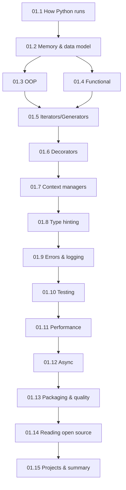

# Module 01 · Advanced Python for AI Engineering — Lessons

[⬅ Module home](../README.md) · [🗺 Roadmap](../../../ROADMAP.md) · [📚 Curriculum](../../../CURRICULUM.md)

> This is the map of Module 01. You know Python basics; this module makes you a **professional Python engineer** — someone who understands how Python works internally, writes production-quality code, debugs and optimizes it, and can read the AI/ML frameworks the rest of the handbook depends on.

---

## Who this module is for

You already know variables, loops, functions, and basic syntax (if not, that's outside this handbook's scope). We **do not reteach** those. Instead, we go under the hood and up to production standards.

> [!IMPORTANT]
> The gap between "can write a Python script" and "can engineer a Python system" is exactly this module. Every later module — PyTorch, LLM orchestration, RAG, serving — assumes the Python maturity built here.

---

## Lessons

| # | Lesson | Topics (from the module spec) |
|---|---|---|
| 01.1 | [How Python Runs Your Code](01.1-python-architecture.md) | Python architecture, CPython, bytecode, the PVM, compilation vs interpretation, the import system |
| 01.2 | [Memory, Objects & the Data Model](01.2-memory-management.md) | Objects, references, identity, mutability, reference counting, GC, circular refs, memory leaks |
| 01.3 | [Object-Oriented Python](01.3-object-oriented-python.md) | Classes, encapsulation, inheritance, composition, polymorphism, abstraction, dataclasses, properties, magic methods |
| 01.4 | [Functional Python](01.4-functional-python.md) | First-class functions, closures, higher-order functions, lambdas, map/filter/reduce, partials |
| 01.5 | [Iterators & Generators](01.5-iterators-generators.md) | Iterator protocol, `yield`, generator expressions, lazy evaluation, memory benchmarks |
| 01.6 | [Decorators](01.6-decorators.md) | Function & class decorators, nesting, built-ins; logging/auth/timing/caching |
| 01.7 | [Context Managers](01.7-context-managers.md) | `with`, `__enter__`/`__exit__`, `contextlib`, why AI code relies on them |
| 01.8 | [Type Hinting](01.8-type-hinting.md) | `typing`, generics, protocols, `TypedDict`, `Callable`, `Optional`, `Union`, `Literal`, `Annotated` |
| 01.9 | [Error Handling & Logging](01.9-error-handling-logging.md) | Exception hierarchy, custom exceptions, retries, defensive programming, structured/production logging |
| 01.10 | [Testing](01.10-testing.md) | `unittest`, `pytest`, fixtures, mocking, parameterization, coverage |
| 01.11 | [Performance Optimization](01.11-performance.md) | Complexity, profiling (`cProfile`, `timeit`), `functools.cache`, threading/multiprocessing/asyncio trade-offs |
| 01.12 | [Async Programming](01.12-async.md) | Event loop, `async`/`await`, tasks, coroutines, async IO, and why AI APIs use it |
| 01.13 | [Packaging & Code Quality](01.13-packaging-code-quality.md) | Project structure, `pyproject.toml`, pip/poetry/uv; PEP 8, Ruff, Black, isort, mypy, pre-commit |
| 01.14 | [Reading Open-Source Code](01.14-reading-open-source.md) | Navigating a mature Python project: layout, tests, config, docs, CI, packaging |
| 01.15 | [Mini Projects & Summary](01.15-projects-summary.md) | Six progressive projects + module consolidation, cheat sheet, review |

### Companion artifacts
- 🏋️ [Exercises](../exercises/) — coding, debugging, refactoring, and design tasks
- 🧠 [Flashcards](../flashcards/deck.md) — spaced-repetition deck
- 📝 [Quiz](../quizzes/quiz-01.md) — self-assessment with answers
- 📄 [Cheat sheet](../cheat-sheets/advanced-python-cheatsheet.md) — one-page reference

---

## How the lessons build

**Estimated time:** ~12 hours reading · ~10 hours projects · ~2 hours review (per the [Roadmap](../../../ROADMAP.md)).

> [!TIP]
> Type every code example yourself and run it. This module is full of behavior you only *believe* once you've watched it happen — reference counting, generator laziness, the GIL's effect on threads. Reading about them is not the same as seeing them.
