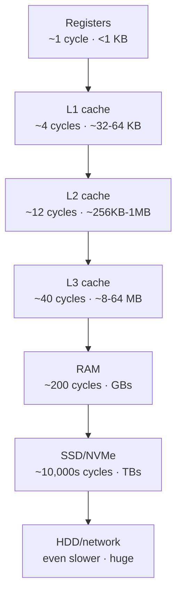
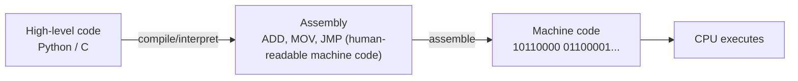
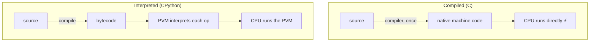

<!-- Module 02 · Lesson 1 — follows ../../../standards/. -->

# 02.1 · How Computers Actually Work

[⬅ Module index](README.md) · [🏠 Module](../README.md) · [🗺 Roadmap](../../../ROADMAP.md) · [Next ➡](02.2-memory.md)

> Everything an AI system does — every matrix multiply, every token generated — eventually runs as machine instructions moving data through a memory hierarchy. Understanding that hardware reality explains *why* Python is slow, why GPUs exist, and why "cache-friendly" code can be 100× faster.

| | |
|---|---|
| **Module** | `02 · Computer Science Foundations` |
| **Lesson** | `02.1` |
| **Difficulty** | ⭐⭐⭐ |
| **Estimated study time** | 60 min read |
| **Status** | 🟢 stable |

---

## 1. Learning Objectives

By the end of this lesson you will be able to:

- [ ] Describe the **CPU–memory–storage hierarchy** and the huge speed gaps between levels.
- [ ] Explain the **fetch–decode–execute** instruction cycle.
- [ ] Distinguish **registers, L1/L2/L3 cache, RAM,** and **storage** by speed and size.
- [ ] Explain **machine code, assembly, compilers,** and **interpreters**.
- [ ] Connect these to *why Python behaves the way it does* and *why AI uses GPUs*.

## 2. Prerequisites

- [Module 01.1 · How Python Runs Your Code](../../01-Advanced-Python/weeks/01.1-python-architecture.md) — bytecode & the PVM. This lesson goes one level deeper: to the silicon.

---

## 3. Why This Topic Exists

As a software developer you can build a lot without knowing what a CPU cache is. But in AI Engineering, performance is money and latency: a training run costs thousands of dollars of GPU time; an inference endpoint must answer in milliseconds. The difference between naive and hardware-aware code can be *orders of magnitude*.

More fundamentally, the entire architecture of modern AI — why we use GPUs, why data is stored in contiguous arrays, why "memory bandwidth" is the bottleneck for LLM inference — only makes sense once you understand how hardware actually moves and computes data. This lesson is the bedrock.

> [!IMPORTANT]
> The single most important hardware fact for an AI Engineer: **computation is cheap; moving data is expensive.** Modern chips can do arithmetic far faster than they can fetch the numbers to operate on. Almost every performance technique — caching, batching, keeping tensors on the GPU — is about *reducing data movement*.

## 4. Problems It Solves

| Question this lesson answers | Why it matters for AI |
|---|---|
| Why is pure-Python math slow? | Explains the need for NumPy/PyTorch |
| Why do we use GPUs? | Massive parallelism for matrix math |
| Why does contiguous memory matter? | Cache locality → speed for tensors |
| Why is LLM inference "memory-bandwidth bound"? | The bottleneck is moving weights, not computing |
| Why does batching help? | Amortizes data movement over more compute |

---

## 5. Mental Model: The Memory Hierarchy as a Kitchen

Imagine a chef (the CPU) cooking:

- **Registers** = the few ingredients in the chef's hands — instant access, tiny.
- **L1/L2/L3 cache** = the countertop — very fast, small.
- **RAM** = the pantry across the room — slower, larger.
- **Storage (SSD/HDD)** = the grocery store across town — huge, very slow.

The chef works fast, but if every ingredient requires a trip to the store, the meal takes forever. Fast cooking means keeping what you need *close*. That's caching, and it's the whole game.



> **Illustration placeholder** — `assets/images/memory-hierarchy-pyramid.png`: a pyramid with registers at the tiny fast top and storage at the huge slow bottom, each level annotated with approximate latency (in CPU cycles and nanoseconds) and capacity, visually conveying that each step down is ~10× slower and ~10× bigger.

> [!IMPORTANT]
> The latency gaps are enormous and non-intuitive. If a register access were **1 second**, an L1 hit is a few seconds, RAM is ~**4 minutes**, an SSD read is ~**day(s)**, and a network fetch is ~**months**. This is why "just read it from disk" or "fetch it over the network" inside a hot loop destroys performance.

---

## 6. The CPU and the Instruction Cycle

The **CPU (Central Processing Unit)** executes instructions. At its core it repeats a simple loop billions of times per second:


| Stage | What happens |
|---|---|
| **Fetch** | Read the next instruction (address held in the *program counter*) |
| **Decode** | Interpret the instruction's opcode and operands |
| **Execute** | The **ALU** (Arithmetic Logic Unit) computes, or data is moved |
| **Write-back** | Store the result in a register or memory |

Key CPU components:

| Component | Role |
|---|---|
| **ALU** | Does arithmetic and logic (add, multiply, compare) |
| **Registers** | A handful of tiny, instant storage slots the CPU computes on |
| **Program counter** | Holds the address of the next instruction |
| **Control unit** | Orchestrates fetch/decode/execute |
| **Clock** | Ticks billions of times/sec (GHz); each tick advances work |
| **Cores** | Independent execution units → true parallelism (multiple cores) |

> [!NOTE]
> Modern CPUs are far more sophisticated than this loop suggests — they use **pipelining** (overlapping stages), **out-of-order execution**, **branch prediction**, and **SIMD** (Single Instruction, Multiple Data — one instruction operating on many numbers at once). SIMD is a small taste of the massive parallelism GPUs take to the extreme, and it's how NumPy gets much of its speed.

---

## 7. Registers, Cache, RAM, Storage — The Numbers

The whole hierarchy exists because fast memory is expensive and small; cheap memory is large and slow. Hardware bridges the gap by keeping *likely-needed* data in faster levels.

| Level | Typical latency | Typical size | Volatile? | Analogy |
|---|---|---|---|---|
| **Registers** | ~1 cycle | < 1 KB | Yes | In your hands |
| **L1 cache** | ~4 cycles | 32–64 KB/core | Yes | Countertop |
| **L2 cache** | ~10–12 cycles | 256 KB–1 MB | Yes | Kitchen shelf |
| **L3 cache** | ~40 cycles | 8–64 MB shared | Yes | Kitchen closet |
| **RAM (DRAM)** | ~200 cycles | 8 GB–1 TB+ | Yes | Pantry |
| **SSD/NVMe** | ~10⁴–10⁵ cycles | 256 GB–many TB | **No** | Grocery store |
| **HDD / network** | Much slower | Huge | No | Another city |

- **Volatile** memory (registers, cache, RAM) loses its contents when power is cut. **Non-volatile** storage (SSD/HDD) persists — which is why models and datasets live on disk and are *loaded* into RAM/VRAM to use.
- When the CPU needs data, it checks L1 → L2 → L3 → RAM. A **cache hit** (found in cache) is fast; a **cache miss** (must go to RAM) stalls the CPU for ~200 cycles.

> [!IMPORTANT]
> **Cache lines:** memory is moved in fixed chunks (typically 64 bytes), not single values. So accessing one array element pulls its *neighbors* into cache too. This is why iterating a **contiguous array** in order is dramatically faster than hopping around a linked structure — the neighbors you'll need next are already cached. This single fact is why NumPy/tensors store data contiguously (Lesson 02.2, 02.3).

---

## 8. Machine Code, Assembly, and the Translation Chain

The CPU only understands **machine code** — raw binary instructions specific to its architecture (e.g., x86-64, ARM). Humans don't write that; we work up a ladder of abstraction.



| Level | Example | Who reads it |
|---|---|---|
| **High-level language** | Python, C, Rust | Humans (productive) |
| **Assembly** | `MOV`, `ADD`, `JMP` | Humans (rarely), 1:1 with machine code |
| **Machine code** | binary opcodes | The CPU |

- **Assembly** is a human-readable, near-1:1 representation of machine code (one mnemonic per instruction). You'll almost never write it, but knowing it exists demystifies "what the CPU actually does."

---

## 9. Compilers vs Interpreters — and Why Python Is Slow

There are two broad ways to get from high-level code to execution:

| | Compiler | Interpreter |
|---|---|---|
| When translated | **Ahead of time**, once | **At runtime**, per execution |
| Output | Native machine code | Executes directly (or via bytecode) |
| Speed | Fast (runs as native code) | Slower (translation overhead each run) |
| Examples | C, Rust, Go | Python, Ruby (classic) |



Recall from [Module 01.1](../../01-Advanced-Python/weeks/01.1-python-architecture.md): CPython compiles to **bytecode**, then the **PVM interprets** it. That interpretation layer — plus Python's dynamic typing and everything-is-an-object model — means each simple operation runs *many* native instructions instead of one.

> [!IMPORTANT]
> **This is the hardware-level reason pure-Python numeric loops are slow.** Adding two numbers in C is roughly one machine instruction on data already in registers. The "same" addition in Python involves interpreting bytecode, unboxing two heap objects, dynamic dispatch, allocating a result object, and refcounting — dozens of instructions and cache-unfriendly pointer chasing. Multiply by millions of elements and you see why **NumPy/PyTorch push array math into compiled C/CUDA** operating on contiguous memory. Python orchestrates; the fast languages compute.

---

## 10. Why AI Uses GPUs (The Hardware Payoff)

A **CPU** has a few powerful cores optimized for *latency* — doing one complex task quickly. A **GPU** has thousands of simpler cores optimized for *throughput* — doing the *same* simple operation on *massive* amounts of data in parallel.

| | CPU | GPU |
|---|---|---|
| Cores | Few (4–64), complex | Thousands, simple |
| Optimized for | Latency, branching logic | Throughput, parallel math |
| Best at | General logic, control flow | Large matrix/vector operations |
| AI role | Orchestration, data prep | Training & inference (the math) |

Neural networks are, at their core, enormous **matrix multiplications** — the *exact* workload GPUs excel at (the same operation across millions of numbers). Add specialized memory (high-bandwidth VRAM) and units for matrix math (e.g., tensor cores), and you get the hardware that makes modern AI feasible.

> [!IMPORTANT]
> **LLM inference is often "memory-bandwidth bound":** generating each token requires reading the model's billions of weights from GPU memory, and the bottleneck is *moving* those weights, not multiplying them. This is a direct consequence of §3's rule (data movement > computation) — and it's why quantization (smaller weights = less data to move) speeds up inference. You'll meet this again in [Module 11 (LLMs)](../../11-LLMs/README.md) and [Module 17 (Cloud/GPUs)](../../17-Cloud/README.md).

> **Illustration placeholder** — `assets/images/cpu-vs-gpu.png`: side-by-side — a CPU with a few large "smart" cores vs a GPU with a grid of thousands of small cores; arrows showing one big matrix operation fanned out across the GPU grid in parallel.

---

## 11. Common Mistakes & Misconceptions

| Mistake / myth | Reality |
|---|---|
| "The CPU clock speed is all that matters" | Memory access often dominates; cache misses stall even fast CPUs |
| "More RAM always = faster" | Only if you were memory-*limited*; latency/bandwidth still bound compute |
| "Python is slow because it's a bad language" | It's slow for tight numeric loops due to interpretation + object model; it's *fast* as an orchestrator of compiled libraries |
| "GPUs are just faster CPUs" | Different design — throughput/parallel, not latency/general |
| "Data layout doesn't matter" | Contiguous, cache-friendly layout can be 10–100× faster |

> [!WARNING]
> The most common performance mistake beginners make in AI code is **doing numeric work element-by-element in Python** (fighting the hardware) instead of expressing it as bulk array/tensor operations (working *with* the hardware). The entire NumPy/PyTorch design exists to keep computation in fast, contiguous, compiled kernels.

---

## 12. Performance Considerations

| Principle | Practical takeaway |
|---|---|
| Data movement dominates | Minimize copies; keep data where it's computed (e.g., on the GPU) |
| Cache locality | Prefer contiguous arrays; iterate in memory order |
| Batching | Amortize fixed data-movement cost over more compute |
| Vectorization/SIMD | Let NumPy/PyTorch use wide instructions and kernels |
| Right hardware | GPU for parallel math; CPU for control/orchestration |

## 13. Security Considerations

| Risk | Note |
|---|---|
| Side-channel attacks (Spectre/Meltdown) | Cache/speculative-execution leaks — mitigated at OS/hardware level; relevant on shared cloud hosts |
| Sensitive data in RAM/VRAM | Not zeroed on free; minimize lifetime of secrets ([Module 01.2](../../01-Advanced-Python/weeks/01.2-memory-management.md)) |
| Shared-tenant GPUs | Residual data in VRAM between tenants — a cloud isolation concern |

> [!NOTE]
> You won't defend against Spectre in application code, but be aware that on **shared cloud hardware** (common for AI workloads), micro-architectural side channels and un-zeroed memory are real isolation concerns — a reason managed providers isolate tenants carefully.

---

## 14. Interview Questions

**Beginner**
1. Describe the memory hierarchy from registers to storage. How do speed and size change?
2. What are the stages of the instruction cycle?

**Intermediate**
1. Why is a cache miss expensive, and what is a cache line?
2. Explain, at the hardware level, why pure-Python numeric loops are slow.

**Advanced**
1. Why are GPUs suited to neural networks but not to general branching logic?
2. What does it mean for LLM inference to be "memory-bandwidth bound," and how does quantization help?

**System-design prompt**
- You must speed up a data pipeline doing heavy element-wise math in Python. Explain, from hardware principles, what you'd change and why. — *Follow-ups:* Where does cache locality come in? When would you move work to a GPU?

---

## 15. Summary

| Key idea | Takeaway |
|---|---|
| Memory hierarchy | Each level down is ~10× slower, ~10× bigger |
| Data movement dominates | Compute is cheap; fetching data is expensive |
| Instruction cycle | Fetch → decode → execute → write-back |
| Cache lines | Access pulls neighbors → contiguous data wins |
| Compiled vs interpreted | Interpretation + object model = slow Python loops |
| GPUs | Thousands of cores for parallel matrix math = AI |

## 16. Cheat Sheet

```text
HIERARCHY (fast→slow, small→big): registers → L1 → L2 → L3 → RAM → SSD → HDD/network
  each step ≈ 10× slower & bigger · volatile (regs/cache/RAM) vs non-volatile (SSD/HDD)
RULE: computation is CHEAP; moving DATA is EXPENSIVE
CYCLE: fetch → decode → execute (ALU) → write-back ; clock=GHz ; cores=parallelism
CACHE LINE ≈ 64B → contiguous, in-order access = fast (cache locality)
TRANSLATION: high-level → assembly → machine code (CPU)
COMPILED (C, native, fast) vs INTERPRETED (Python: bytecode + PVM, slower loops)
WHY PYTHON SLOW: interpretation + dynamic objects + pointer chasing → use NumPy/PyTorch (C/CUDA)
GPU: 1000s simple cores, throughput/parallel → matrix math = neural nets
LLM inference often MEMORY-BANDWIDTH bound → quantization moves less data = faster
```

## 17. Flashcards

- **Q:** What's the single most important hardware fact for performance? — **A:** Computation is cheap; moving data is expensive — most optimization reduces data movement.
- **Q:** Order the memory hierarchy by speed. — **A:** Registers → L1 → L2 → L3 cache → RAM → SSD → HDD/network (each ~10× slower & bigger).
- **Q:** What is a cache line and why does it matter? — **A:** Memory moves in ~64-byte chunks, so accessing one element caches its neighbors — contiguous, in-order access is far faster.
- **Q:** Why are pure-Python numeric loops slow (hardware view)? — **A:** Interpretation + heap objects + dynamic dispatch + pointer chasing means dozens of instructions and cache misses per operation.
- **Q:** Why do neural networks use GPUs? — **A:** They're huge parallel matrix multiplications, matching GPUs' thousands of throughput-oriented cores.
- **Q:** What does "memory-bandwidth bound" mean for LLM inference? — **A:** The bottleneck is reading the model's weights from memory each step, not the arithmetic — so smaller weights (quantization) speed it up.

## 18. Hands-on Exercises

> Full set in [`../exercises/`](../exercises/).

- [ ] **(⭐ Conceptual)** Draw the memory hierarchy with approximate latencies; explain a cache miss.
- [ ] **(⭐⭐ Coding)** Benchmark summing a Python list vs a NumPy array of 10M floats; explain the gap using this lesson.
- [ ] **(⭐⭐ Coding)** Measure the time to access array elements sequentially vs in random order (large array); relate the difference to cache locality.
- [ ] **(⭐⭐⭐ Conceptual)** Explain, from hardware, why batching inputs to a model improves throughput.

## 19. Mini Project

> **Latency-numbers explainer.** Build a small script/notebook that empirically measures and visualizes relative timings a developer can feel: a register-ish operation, an in-cache array sum, an out-of-cache (large) array sum, a disk read, and (optionally) a network request — then presents them as a "latency numbers every engineer should know" table/chart with your measured ratios. The deliverable teaches the hierarchy through *your own* numbers.

## 20. References

- "Latency Numbers Every Programmer Should Know" (Jeff Dean) — the canonical intuition table ([reference standards](../../../standards/reference-standards.md)).
- Patterson & Hennessy, *Computer Organization and Design* — the standard text, for depth.
- Ulrich Drepper, *What Every Programmer Should Know About Memory* — deep dive on caches.

## 21. What's Next

You know the hardware. Next we zoom into how programs use memory — **the stack, the heap, allocation, fragmentation, and garbage collection** — and how those shape AI workloads.

➡️ **Next:** [02.2 · Memory](02.2-memory.md)

---

### 🔁 Revision checklist
- [ ] I can draw the memory hierarchy with rough latencies
- [ ] I can explain the instruction cycle and cache lines
- [ ] I can explain why Python loops are slow at the hardware level
- [ ] I can explain why AI uses GPUs

### 🔗 Spaced-repetition callback
> Recall [Module 01.1](../../01-Advanced-Python/weeks/01.1-python-architecture.md): the PVM interpreting bytecode is the *software* layer; this lesson is the *hardware* layer beneath it. Together they fully explain "why Python is slow for numeric loops" — and why every ML framework escapes to compiled, contiguous, GPU-friendly kernels.
