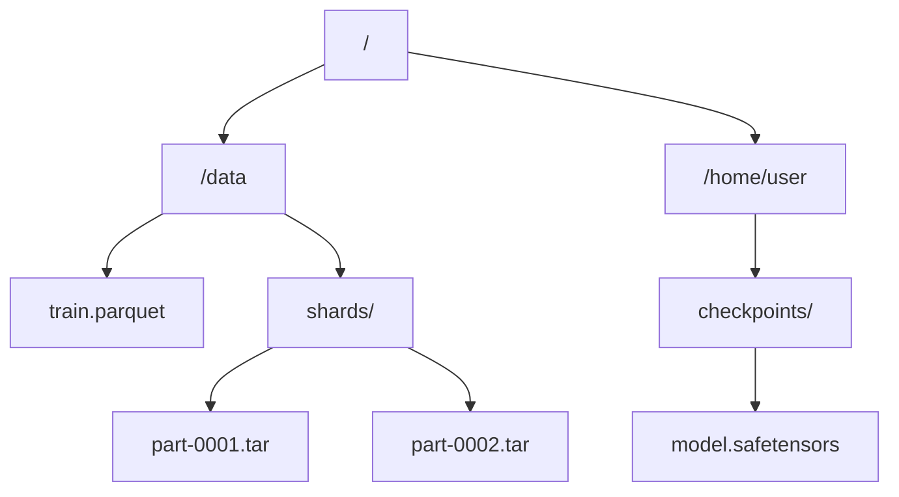
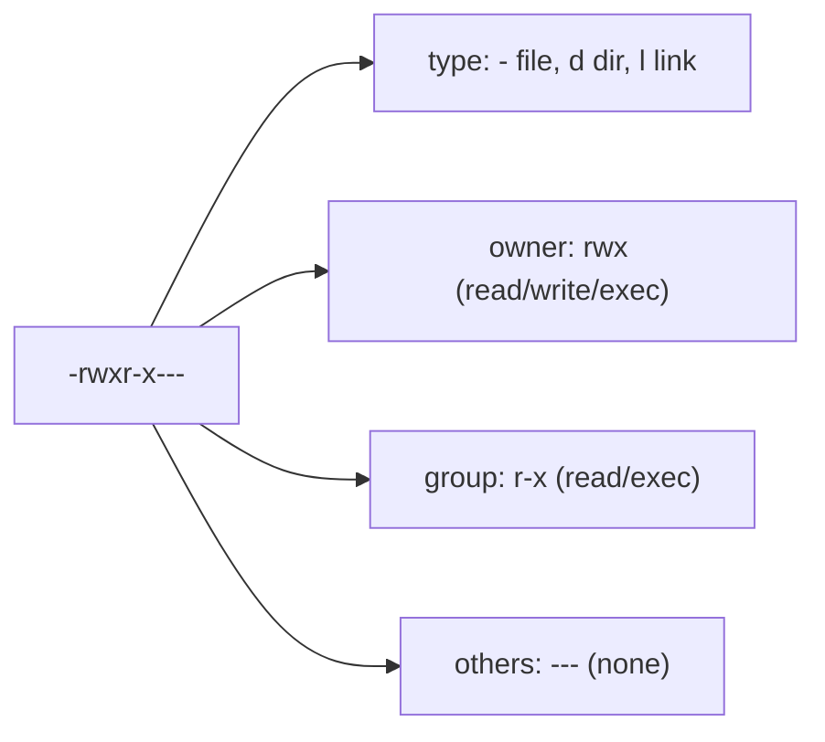
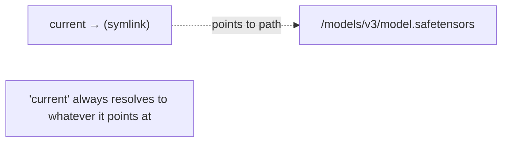
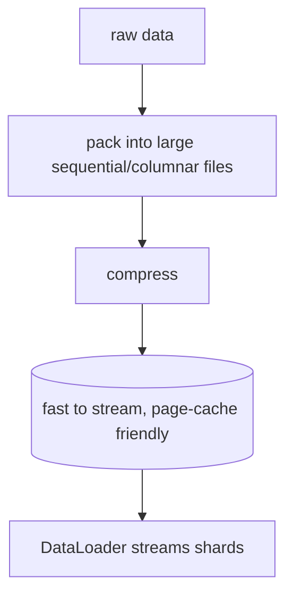

<!-- Module 02 · Lesson 10 — follows ../../../standards/. -->

# 02.10 · File Systems

[⬅ 02.9 Serialization](02.9-serialization.md) · [🏠 Module](../README.md) · [🗺 Roadmap](../../../ROADMAP.md) · [Next ➡](02.11-system-design-basics.md)

> Datasets, model checkpoints, and logs all live as files. How the filesystem organizes them — directories, permissions, symlinks, compression, and binary vs text — determines how fast your data loads and how safely your artifacts are stored.

| | |
|---|---|
| **Module** | `02 · Computer Science Foundations` |
| **Lesson** | `02.10` |
| **Difficulty** | ⭐⭐ |
| **Estimated study time** | 50 min read |
| **Status** | 🟢 stable |

---

## 1. Learning Objectives

By the end of this lesson you will be able to:

- [ ] Explain **files, directories, paths,** and file **metadata**.
- [ ] Read and reason about Unix **permissions**.
- [ ] Explain **symbolic (and hard) links** and where they're used.
- [ ] Distinguish **binary vs text** files and why it matters.
- [ ] Explain **compression** trade-offs.
- [ ] Apply this to how **datasets and model artifacts** are stored and managed.

## 2. Prerequisites

- [02.6 Operating Systems](02.6-operating-systems.md) (filesystem basics, inodes) & [02.9 Serialization](02.9-serialization.md) (what gets written).
- [Module 01.5 Generators](../../01-Advanced-Python/weeks/01.5-iterators-generators.md) (streaming files).

---

## 3. Why This Topic Exists

AI runs on data, and data lives in files. Every dataset you load, every checkpoint you save, every log you write is a filesystem operation — and file I/O is *frequently the bottleneck* in training and data pipelines ([02.6](02.6-operating-systems.md)). Reading a million tiny files is slow; a corrupted or non-durable checkpoint loses days of training; wrong permissions leak sensitive data or break a deploy.

Understanding the filesystem lets you store data for fast access, save artifacts safely, manage large files without exhausting disk, and debug the "file not found / permission denied / disk full" errors that plague real systems. Much of this connects to [Module 03 · Linux](../../03-Linux/README.md), where you'll use these hands-on.

> [!IMPORTANT]
> A recurring AI-performance lesson: **how data is laid out on disk matters as much as the algorithm reading it.** Millions of small files are slow to read (per-file OS overhead); the same data packed into large sequential files (Parquet, sharded archives) reads far faster and warms the page cache ([02.6](02.6-operating-systems.md)). Dataset *storage format* is a first-class engineering decision.

## 4. Problems It Solves

| Problem | Filesystem knowledge solves it by |
|---|---|
| Slow dataset loading | Understanding small-file overhead & formats |
| "Permission denied" on deploy | Reading/setting permissions |
| Lost training on crash | Durable, atomic checkpoint writes |
| Disk full mid-run | Managing space, compression, cleanup |
| Corrupted file reads | Binary vs text, encoding awareness |
| Managing many model versions | Symlinks, organization |

---

## 5. Mental Model: A Tree of Named Bytes

A filesystem is a **hierarchical tree** ([02.3 trees](02.3-data-structures.md)): directories contain files and other directories, rooted at `/` (Unix) or a drive (Windows). Each **file** is a named sequence of bytes plus metadata; the OS tracks where its data blocks physically live ([02.6](02.6-operating-systems.md) inodes).



| Concept | Meaning |
|---|---|
| **File** | Named byte sequence + metadata (size, times, permissions) |
| **Directory** | A node containing files/subdirectories |
| **Path** | Location: absolute (`/data/x`) or relative (`./x`, `../x`) |
| **Inode** (Unix) | Metadata + data-block pointers for a file ([02.6](02.6-operating-systems.md)) |
| **Mount** | Attaching a storage device/filesystem into the tree |

> [!TIP]
> Prefer **`pathlib`** over string manipulation for paths in Python — `Path("data") / "train.csv"` handles OS differences (`/` vs `\`) and is cleaner than `os.path.join`. Use **absolute paths** in production configs to avoid "works from this directory only" bugs (recall [Module 01.1's](../../01-Advanced-Python/weeks/01.1-python-architecture.md) import-path lessons).

---

## 6. Permissions

Unix permissions control **who** can do **what** to a file. Every file has an owner, a group, and three permission sets (owner / group / others), each with read (`r`), write (`w`), execute (`x`).



| Symbolic | Octal | Meaning |
|---|:--:|---|
| `rwx` | 7 | read + write + execute |
| `rw-` | 6 | read + write |
| `r-x` | 5 | read + execute |
| `r--` | 4 | read only |
| `---` | 0 | no access |

So `chmod 750 file` = owner `rwx`(7), group `r-x`(5), others `---`(0). For a **directory**, `x` means "can enter/traverse it," and `r` means "can list its contents."

> [!IMPORTANT]
> Permissions are a common source of production failures and security issues. **"Permission denied"** on deploy usually means a service user lacks read/execute on a path. Conversely, **overly permissive** files (world-writable configs, `chmod 777`) are a security risk. Principle of least privilege ([02.6](02.6-operating-systems.md)): grant the minimum access needed. **Secrets files should be readable only by their owner** (`chmod 600`), never world-readable — a `.env` at `644` leaks keys to any user on the box.

> [!NOTE]
> Windows uses ACLs (Access Control Lists) rather than Unix `rwx`, but the *concept* — who can read/write/execute — is the same. Most AI infrastructure (servers, containers, cloud) runs Linux, so Unix permissions are what you'll deal with day to day.

---

## 7. Links — Symbolic and Hard

A **link** lets multiple names point to file data. Two kinds:

| | Symbolic (soft) link | Hard link |
|---|---|---|
| Points to | A **path** (name) | The **inode** (data itself) |
| Across filesystems | ✅ Yes | ❌ No |
| If target deleted | Becomes dangling (broken) | Data survives until all links gone |
| Directories | ✅ Can link | ❌ Usually not |
| Analogy | A shortcut/pointer | A second true name for the same data |



> [!IMPORTANT]
> **AI use of symlinks:** the classic pattern is a `current` symlink pointing at the active model/version directory — swapping the symlink atomically switches which model is served, enabling instant rollout/rollback without moving gigabytes. Many tools (model registries, virtual environments, package managers, dataset caches) use symlinks to share large files without duplicating them. Recognize a `->` in a file listing as a link, and know a broken symlink (dangling target) is a common "file not found" cause.

---

## 8. Binary vs Text Files

Every file is bytes; the distinction is how they're *interpreted*.

| | Text file | Binary file |
|---|---|---|
| Content | Human-readable characters (encoded, e.g., UTF-8) | Arbitrary bytes (not meant to be read as text) |
| Examples | `.py`, `.csv`, `.json`, `.md`, `.yaml` | `.safetensors`, `.png`, `.parquet`, `.pkl`, executables |
| Open in Python | `open(path, "r", encoding="utf-8")` | `open(path, "rb")` |
| Editable by hand | ✅ | ❌ (needs a program) |

> [!WARNING]
> **Two classic bugs:** (1) **Encoding** — text files have a character encoding (almost always use **UTF-8**); reading a UTF-8 file as a different encoding produces mojibake or `UnicodeDecodeError`. Always specify `encoding="utf-8"` explicitly. (2) **Mode** — opening a binary file (image, model, parquet) in text mode (`"r"`) corrupts it or crashes; use `"rb"`/`"wb"`. Line-ending differences (`\n` vs `\r\n`) also bite cross-platform — handle in text mode / normalize.

> [!IMPORTANT]
> **AI relevance:** model weights and efficient dataset formats are **binary** (compact, fast, [02.9](02.9-serialization.md)); configs, code, and small metadata are **text** (readable, diffable in Git — [Module 04](../../04-Git/README.md)). Knowing which is which prevents corruption and guides format choices.

---

## 9. Compression

**Compression** shrinks file size by encoding data more efficiently — trading CPU time (to compress/decompress) for space and I/O.

| Type | Meaning | Example |
|---|---|---|
| **Lossless** | Exact original recovered | `.gz`, `.zip`, `.zst`, `.parquet` (columnar) |
| **Lossy** | Approximate; smaller | `.jpg`, `.mp3` (media only) |

```mermaid
flowchart LR
    BIG["large file"] -->|compress (CPU)| SMALL["smaller file"] -->|store/transfer| SMALL
    SMALL -->|decompress (CPU)| BIG2["original (lossless) / approx (lossy)"]
```

| Trade-off | Detail |
|---|---|
| ✅ Less disk & network | Cheaper storage; faster transfer |
| ✅ Sometimes faster reads | Less I/O can beat the decompress cost when I/O-bound |
| ❌ CPU cost | Compress/decompress takes time |
| ❌ Not always worth it | Already-compressed or tiny data gains little |

> [!IMPORTANT]
> **AI relevance:** datasets are often stored compressed (and columnar, like **Parquet**) — since data loading is frequently **I/O-bound** ([02.6](02.6-operating-systems.md)), reading less data from disk can *speed up* pipelines despite decompression cost. Model weights may be compressed for distribution. Use **lossless** for data/models (never corrupt training data); **lossy** only for media where approximation is acceptable. `zstandard`/`gzip` are common; Parquet compresses per-column for both size and query speed.

---

## 10. How Datasets and Artifacts Are Stored

| Need | Storage approach |
|---|---|
| Large tabular data | **Parquet** (columnar, compressed, fast queries) |
| Many samples for training | **Sharded archives** (WebDataset/TAR shards) — sequential reads |
| Model weights | **safetensors** (safe, [02.9](02.9-serialization.md)) / framework formats |
| Checkpoints | Written **atomically** & durably (survive crashes) |
| Metadata/config | Text (JSON/YAML) — diffable, human-readable |
| Huge/shared files | Object storage (S3/GCS) — beyond local FS ([Module 17](../../17-Cloud/README.md)) |



> [!IMPORTANT]
> **Atomic, durable writes for checkpoints:** a training run that crashes mid-write to `model.safetensors` can leave a *corrupt* file — losing everything. The safe pattern: write to a **temporary file**, `fsync`/flush it, then **atomically rename** it into place (rename is atomic on most filesystems). Many frameworks do this for you; know the principle so you don't hand-roll a fragile save. Losing a week of GPU training to a torn checkpoint is a real, expensive mistake.

> [!NOTE]
> Beyond a single machine, AI data usually lives in **object storage** (S3, GCS, Azure Blob) — a flat namespace of "objects" accessed over HTTP ([02.7](02.7-networking.md)), not a POSIX filesystem. It scales infinitely and is durable, but has higher latency and different semantics (no true directories, eventual consistency historically). You'll work with it in [Module 17 · Cloud](../../17-Cloud/README.md); for now, know that "the filesystem" in production is often object storage.

---

## 11. Common Mistakes & Debugging

| Symptom | Cause | Fix |
|---|---|---|
| `UnicodeDecodeError` | Wrong/assumed text encoding | `encoding="utf-8"` explicitly |
| Corrupted model/image | Opened binary in text mode | Use `"rb"`/`"wb"` |
| "Permission denied" | Service user lacks access | Set correct permissions/ownership |
| Slow dataset loading | Millions of small files | Pack into sequential/columnar formats |
| Torn/corrupt checkpoint | Crash mid-write | Atomic write (temp + rename + fsync) |
| Disk full mid-run | Unmanaged space/logs/checkpoints | Compression, rotation, cleanup |
| Broken symlink → not found | Target moved/deleted | Fix/repoint the link |
| Path works locally, not in prod | Relative path / cwd assumption | Absolute paths; `pathlib` |

> [!TIP]
> Filesystem debugging tools ([Module 03 · Linux](../../03-Linux/README.md)): `ls -la` (files + permissions + links), `df -h` (disk space — check when "disk full"), `du -sh` (directory sizes — find what's eating space), `file` (identify file type), `stat` (full metadata), `ln -s` (make symlinks), `chmod`/`chown` (permissions/ownership). "Disk full" and "permission denied" are among the most common production incidents.

## 12. Performance Considerations

| Principle | Takeaway |
|---|---|
| Sequential > random I/O | Large files stream fast; small files thrash |
| Page cache warms | Repeat reads are fast ([02.6](02.6-operating-systems.md)) |
| Compression trades CPU for I/O | Often a net win when I/O-bound |
| Fewer, bigger files | Amortize per-file overhead |
| Columnar (Parquet) | Read only needed columns |

## 13. Security Considerations

| Risk | Guidance |
|---|---|
| World-readable secrets | `chmod 600` secret files; never commit them ([Module 01.6/01.9](../../01-Advanced-Python/weeks/01.6-decorators.md)) |
| Overly permissive files (`777`) | Least privilege; restrict write access |
| Path traversal (`../../etc/passwd`) | Sanitize/validate user-supplied paths |
| Symlink attacks (TOCTOU) | Untrusted symlinks can redirect writes — validate targets |
| Untrusted archives (zip/tar bombs) | Decompression can exhaust disk/memory — limit sizes; validate paths on extract |
| Sensitive data at rest | Encrypt if required; control access |

> [!CAUTION]
> **Path traversal** is a classic web/AI vulnerability: if user input builds a file path, an attacker can supply `../../secret` to read outside the intended directory. Always validate/normalize paths (resolve and check they stay within an allowed base) before opening files from untrusted input. Similarly, extracting untrusted archives can overwrite files via malicious paths or exhaust disk ("zip bombs") — validate entries and cap sizes.

---

## 14. Interview Questions

**Beginner**
1. What does `chmod 640` mean for owner, group, and others?
2. What's the difference between a text file and a binary file? Why open a model in `"rb"`?

**Intermediate**
1. Symbolic vs hard link — differences and an AI use case for symlinks.
2. Why is reading millions of small files slow, and how do you fix it?

**Advanced**
1. How do you write a model checkpoint durably so a crash can't corrupt it?
2. What is path traversal, and how do you prevent it when serving files based on user input?

**System-design prompt**
- Design the storage layout for a training dataset (100M samples) and model checkpoints. — *Follow-ups:* File format & sharding? Compression? Atomic checkpoint writes? Where does object storage fit? How do you manage disk space and permissions?

---

## 15. Summary

| Key idea | Takeaway |
|---|---|
| Filesystem = tree of named bytes | Files + metadata in a directory hierarchy |
| Permissions | owner/group/other × rwx; least privilege; `600` secrets |
| Links | Symlinks point to paths (atomic version swaps); hard links to data |
| Binary vs text | Use `"rb"` for models; `encoding="utf-8"` for text |
| Compression | Trade CPU for space/I/O; lossless for data/models |
| Storage for AI | Sequential/columnar formats; atomic durable checkpoints; object storage |

## 16. Cheat Sheet

```text
TREE: / → dirs → files (named bytes + metadata/inode) · use pathlib · absolute paths in prod
PERMISSIONS (owner/group/other × rwx): 7=rwx 6=rw- 5=r-x 4=r--; dir x=enter, r=list
  secrets → chmod 600 (owner only) · avoid 777 · least privilege
LINKS: symlink → path (dangling if target gone; atomic version swap 'current →') ; hard link → inode
BINARY vs TEXT: model/parquet/img = "rb"/"wb" ; code/json/csv = "r" + encoding="utf-8"
COMPRESSION: lossless(gz/zst/parquet) for data/models ; lossy(jpg/mp3) media only ; CPU↔space/IO
STORAGE (AI): Parquet(columnar) · sharded archives(sequential) · safetensors(weights)
  CHECKPOINTS: write temp → fsync → atomic rename (crash-safe)
  object storage (S3/GCS) at scale (HTTP, not POSIX)
DEBUG: ls -la · df -h(space) · du -sh(sizes) · file · stat · chmod/chown · ln -s
SECURITY: 600 secrets · validate user paths (path traversal ../) · untrusted archive/symlink risks
```

## 17. Flashcards

- **Q:** What does `chmod 750` grant? — **A:** Owner rwx(7), group r-x(5), others none(0).
- **Q:** Symbolic vs hard link? — **A:** Symlink points to a path (breaks if target deleted; works across filesystems); hard link points to the inode/data itself (same-filesystem, data survives until all links gone).
- **Q:** Why open a model file with `"rb"`? — **A:** It's binary — text mode would corrupt it via encoding/line-ending translation.
- **Q:** Why pack a dataset into large sequential files? — **A:** Millions of small files incur per-file overhead and random I/O; large sequential/columnar files stream fast and use the page cache.
- **Q:** How do you write a crash-safe checkpoint? — **A:** Write to a temp file, flush/fsync, then atomically rename it into place.
- **Q:** What is path traversal and its fix? — **A:** Untrusted input like `../../secret` escaping the intended directory; validate/normalize paths and confine them to an allowed base.

## 18. Hands-on Exercises

> Full set in [`../exercises/`](../exercises/).

- [ ] **(⭐ Conceptual)** Decode 5 permission strings/octals (e.g., `-rw-r-----`, `755`); state who can do what.
- [ ] **(⭐⭐ Coding)** Trigger a `UnicodeDecodeError` by reading a file with the wrong encoding; fix with UTF-8. Read a binary file two ways and observe corruption in text mode.
- [ ] **(⭐⭐ Coding)** Implement an atomic write (temp file → rename); prove a simulated crash mid-write leaves the original intact.
- [ ] **(⭐⭐ Coding)** Compress a dataset with gzip/zstd; compare size and read time vs uncompressed.
- [ ] **(⭐⭐⭐ Security)** Write a "safe open" that rejects path-traversal attempts outside a base directory.

## 19. Mini Project

> **URL shortener — core logic (this module's showcase, v6).** Build the storage core of a URL shortener: a persistent key→URL store using a file-backed structure (JSON/append log), with atomic durable writes, a hash-based short-code generator ([02.3](02.3-data-structures.md)), and collision handling. Include safe path handling and a small CLI. Focus on the *data & storage engineering* (not the web layer, which reuses [02.7's HTTP server](02.7-networking.md)). Include an architecture diagram and folder structure.

## 20. References

- *Operating Systems: Three Easy Pieces* — persistence/filesystem chapters (free online) ([reference standards](../../../standards/reference-standards.md)).
- Python docs — *`pathlib`*, *`os`*, *`shutil`*, *`gzip`*/*`zipfile`*, *`open`* (modes/encoding).
- Apache Parquet & `safetensors` documentation.

## 21. What's Next

You understand storage. Next we zoom out to whole-system design: **scalability, availability, reliability, fault tolerance, scaling strategies, and caching** — using simple AI service examples.

➡️ **Next:** [02.11 · System Design Basics](02.11-system-design-basics.md)

---

### 🔁 Revision checklist
- [ ] I can read/set Unix permissions and secure secret files
- [ ] I know symlink vs hard link and the atomic-version-swap pattern
- [ ] I open binary vs text correctly and specify encoding
- [ ] I can write a crash-safe checkpoint and prevent path traversal

### 🔗 Spaced-repetition callback
> Recall [02.6's page cache & small-file I/O](02.6-operating-systems.md) and [02.9's safetensors](02.9-serialization.md): this lesson is where they become concrete storage decisions. Data layout (sequential/columnar) exploits the page cache; safe binary formats store the serialized artifacts. Storage is memory, OS, and serialization meeting on disk.
