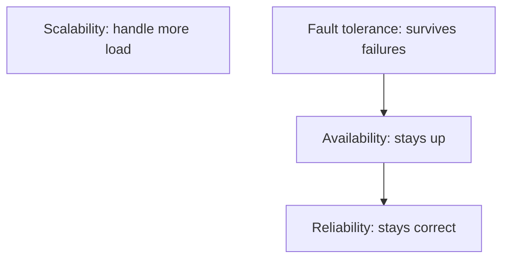
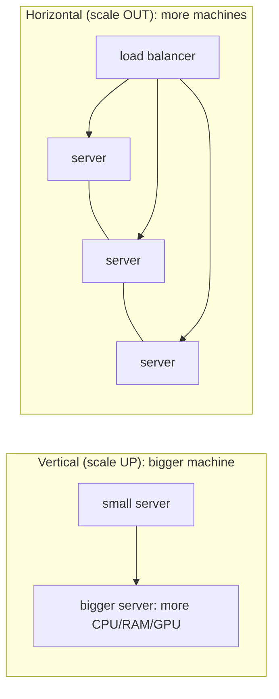
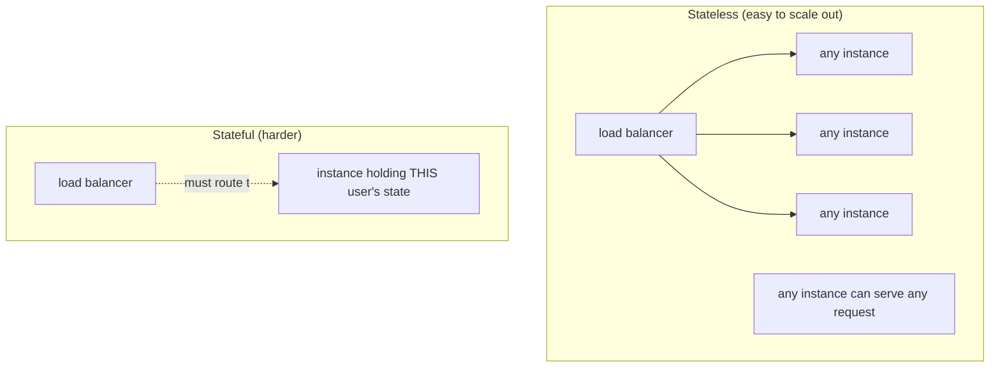
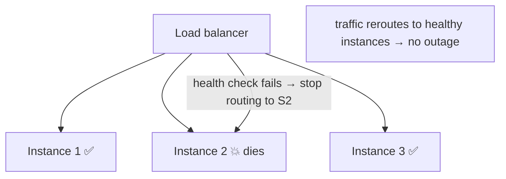
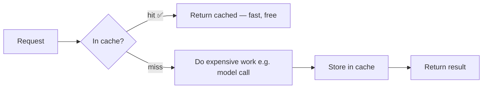
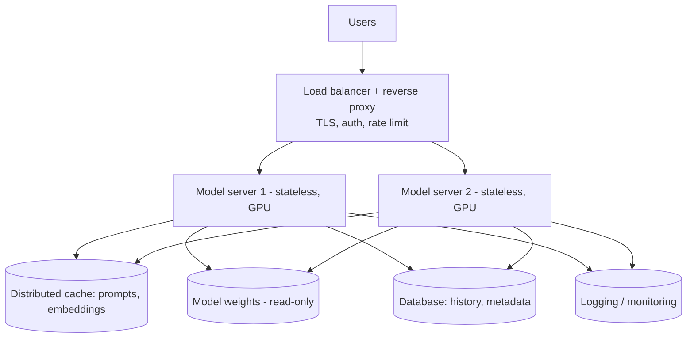

<!-- Module 02 · Lesson 11 — follows ../../../standards/. -->

# 02.11 · System Design Basics

[⬅ 02.10 File Systems](02.10-file-systems.md) · [🏠 Module](../README.md) · [🗺 Roadmap](../../../ROADMAP.md) · [Next ➡](02.12-debugging.md)

> How individual components combine into systems that stay fast, up, and correct under real load. Scalability, availability, reliability, fault tolerance, scaling strategies, and caching — the vocabulary and trade-offs you'll use to design every AI service.

| | |
|---|---|
| **Module** | `02 · Computer Science Foundations` |
| **Lesson** | `02.11` |
| **Difficulty** | ⭐⭐⭐ |
| **Estimated study time** | 60 min read |
| **Status** | 🟢 stable |

---

## 1. Learning Objectives

By the end of this lesson you will be able to:

- [ ] Define **scalability, availability, reliability,** and **fault tolerance** precisely.
- [ ] Compare **horizontal vs vertical scaling** and when to use each.
- [ ] Explain **caching** and its role at every layer.
- [ ] Reason about **stateless vs stateful** services and why it matters for scaling.
- [ ] Apply these to a simple **AI service** design.

## 2. Prerequisites

- [02.7 Networking](02.7-networking.md) (load balancers), [02.8 Concurrency](02.8-concurrency.md), [02.6 OS](02.6-operating-systems.md).
- This is a *primer*; the full treatment is [Module 18 · System Design](../../18-System-Design/README.md).

---

## 3. Why This Topic Exists

A model that answers one request on your laptop is a demo. A *service* that answers a million requests a day, stays up when a server dies, and doesn't bankrupt you on GPU costs is engineering — and that's the AI Engineer's job ([Module 00.4](../../00-Orientation/weeks/00.4-learning-strategy.md): production is first-class). System design is how you get from demo to service.

These fundamentals — scaling, availability, caching — appear in every architecture discussion, every design interview ([Module 20](../../20-Interview-Preparation/README.md)), and every "why did production fall over?" post-mortem. This lesson gives you the shared vocabulary and the core trade-offs; [Module 18](../../18-System-Design/README.md) goes deep on designing AI systems specifically.

> [!IMPORTANT]
> System design is fundamentally about **trade-offs under constraints** — there's no "correct" design, only designs appropriate for specific requirements (traffic, latency, budget, consistency needs). The skill is reasoning about the trade-offs out loud, not memorizing architectures. Every choice here (scale up vs out, cache vs fresh, consistency vs availability) is a trade-off.

## 4. Problems It Solves

| Problem | System design solves it by |
|---|---|
| Service can't handle growing traffic | Scaling strategies |
| One server dies → outage | Redundancy, fault tolerance |
| Slow, repeated expensive work | Caching |
| GPU costs exploding | Caching, right-sizing, batching |
| Can't reason about a proposed architecture | A shared vocabulary of properties |

---

## 5. The Four Properties (Distinguished)

These words are used loosely; use them precisely.

| Property | Question | Example failure |
|---|---|---|
| **Scalability** | Can it handle more load by adding resources? | Slows to a crawl at 10× traffic |
| **Availability** | Is it up and responding? (uptime %) | Returns errors / is down |
| **Reliability** | Does it work *correctly*, consistently? | Up, but returns wrong answers |
| **Fault tolerance** | Does it survive component failures? | One server dies → whole system down |



> [!NOTE]
> **Availability** is often quoted in "nines": 99.9% ("three nines") ≈ 8.7 hours of downtime/year; 99.99% ≈ 52 minutes; 99.999% ≈ 5 minutes. Each extra nine costs dramatically more engineering. A service can be *available* (up) but *unreliable* (returning wrong results) — for AI, "reliably correct" also means grounded, safe outputs ([Module 19](../../19-Production-AI/README.md)), not just HTTP 200s.

---

## 6. Scaling: Vertical vs Horizontal

To handle more load, you either make a machine bigger (**vertical**) or add more machines (**horizontal**).



| | Vertical (scale up) | Horizontal (scale out) |
|---|---|---|
| Method | Bigger machine | More machines |
| Ceiling | Hardware limits (finite) | Effectively unlimited |
| Complexity | Simple (one box) | Complex (LB, coordination) |
| Fault tolerance | ❌ Single point of failure | ✅ Survive individual failures |
| Cost curve | Expensive at the top end | Linear-ish; commodity hardware |
| Requires | — | Statelessness (usually) |

> [!IMPORTANT]
> **Horizontal scaling is how real systems scale and stay available** — you can't buy an infinitely large machine, and one machine is a single point of failure. But it usually requires **stateless** services (§7) and a **load balancer** ([02.7](02.7-networking.md)) to distribute traffic. For AI, horizontal scaling means running **multiple GPU-backed model-server instances** behind a load balancer — the standard serving architecture ([Module 16](../../16-MLOps/README.md)). Vertical scaling still matters for AI (a bigger GPU/more VRAM to fit a larger model), but you scale *out* for throughput and availability.

---

## 7. Stateless vs Stateful (The Key to Scaling)

A **stateless** service keeps no per-client memory between requests — each request is self-contained, so *any* instance can handle it. A **stateful** service remembers things (sessions, in-memory data), tying a client to a specific instance.



> [!IMPORTANT]
> **Statelessness is the enabler of horizontal scaling.** If every instance is interchangeable, the load balancer can send any request anywhere, add/remove instances freely, and survive failures. So the design rule: **push state out of the service** into shared stores — databases, caches (Redis), object storage. For AI: a model server should be stateless (the model weights are read-only; conversation history lives in a database or is sent with each request). Stateful needs (like streaming a response over a WebSocket, [02.7](02.7-networking.md)) require sticky sessions and complicate scaling.

---

## 8. Fault Tolerance and Redundancy

**Fault tolerance** = the system keeps working when parts fail (and parts *will* fail — disks die, networks drop, instances crash). The core technique is **redundancy**: no single point of failure.



| Technique | Purpose |
|---|---|
| **Redundancy** | Multiple instances → survive individual failures |
| **Health checks** | Detect and route around unhealthy instances ([02.7](02.7-networking.md)) |
| **Failover** | Automatically switch to a backup |
| **Graceful degradation** | Reduced service beats total failure (e.g., serve a cached/smaller-model answer) |
| **Retries + timeouts** | Survive transient failures ([Module 01.9](../../01-Advanced-Python/weeks/01.9-error-handling-logging.md)) |
| **Circuit breakers** | Stop hammering a failing dependency |

> [!IMPORTANT]
> **Design for failure, not against it.** Assume every component *will* fail and ensure the system degrades gracefully instead of collapsing. For AI services: if the primary model is down/overloaded, fall back to a cache, a smaller model, or a clear error — never a hang. This connects directly to the resilience patterns (retries, timeouts, circuit breakers) from [Module 01.9](../../01-Advanced-Python/weeks/01.9-error-handling-logging.md) and [01.12](../../01-Advanced-Python/weeks/01.12-async.md).

---

## 9. Caching — The Universal Optimization

**Caching** stores the results of expensive work so repeated requests are served fast and cheap. It's the single highest-leverage optimization in most systems — and *especially* for AI, where the "expensive work" (a model call) costs real money and latency.



Caching happens at **every layer**:

| Cache layer | Example |
|---|---|
| CPU cache | Hardware ([02.1](02.1-how-computers-work.md)) |
| In-process | `functools.lru_cache` ([Module 01.6](../../01-Advanced-Python/weeks/01.6-decorators.md)) |
| Distributed cache | Redis/Memcached (shared across instances) |
| CDN | Cache static content near users |
| Page cache | OS caches file reads ([02.6](02.6-operating-systems.md)) |

| Key concept | Meaning |
|---|---|
| **Hit / miss** | Found in cache / not found |
| **Eviction policy** | What to remove when full (LRU, [Module 01.6](../../01-Advanced-Python/weeks/01.6-decorators.md)) |
| **TTL** | Time-to-live before an entry expires |
| **Cache invalidation** | Removing stale entries (famously hard) |

> [!IMPORTANT]
> **AI-specific caching wins:** cache **identical prompts** (same input → same output for temperature 0), cache **embeddings** (embedding the same text is deterministic and re-embedding is wasteful), and cache **retrieval results**. A cached response is ~free and instant vs a paid, ~second-long model call — caching can cut cost and latency dramatically. Providers also offer **prompt caching** (reusing the processed prefix of a prompt). Caching is a first-class AI cost/latency lever ([Module 19](../../19-Production-AI/README.md)).

> [!WARNING]
> "There are only two hard things in CS: cache invalidation and naming things." **Stale caches serve wrong data.** Use TTLs and careful invalidation; never cache non-deterministic results you need to be fresh; and remember bounded size to avoid the memory leak from [02.2](02.2-memory.md)/[Module 01.6](../../01-Advanced-Python/weeks/01.6-decorators.md).

---

## 10. Putting It Together — A Simple AI Service



Reading the design against this lesson:

| Requirement | How this design meets it |
|---|---|
| **Scalable** | Stateless servers + load balancer → add instances |
| **Available** | Redundant instances + health checks |
| **Fault-tolerant** | One instance dies → others serve |
| **Fast/cheap** | Cache for repeated prompts/embeddings |
| **Stateless** | State pushed to cache/DB |
| **Secure** | TLS/auth/rate-limit at the proxy ([02.7](02.7-networking.md)) |

> [!TIP]
> This is the *skeleton* of nearly every production AI service. You'll flesh it out — autoscaling, queues, batching, observability, multi-region — in [Module 16 (MLOps)](../../16-MLOps/README.md), [Module 18 (System Design)](../../18-System-Design/README.md), and [Module 19 (Production AI)](../../19-Production-AI/README.md). Being able to draw and justify it is a core interview and on-the-job skill.

---

## 11. Common Mistakes & Debugging

| Mistake | Consequence | Fix |
|---|---|---|
| Stateful service you try to scale out | Can't distribute; sticky-session pain | Make it stateless; externalize state |
| Single instance (no redundancy) | One failure = outage | Run ≥ 2 behind a load balancer |
| No caching for repeated expensive calls | High cost & latency | Cache prompts/embeddings/results |
| Stale cache serving wrong data | Correctness bugs | TTLs + invalidation; don't cache volatile data |
| Vertical scaling only | Hits a ceiling; SPOF | Scale horizontally |
| No graceful degradation | Total failure under stress | Fallbacks (cache/smaller model/error) |
| Ignoring cost | Budget blowup | Cache, batch, right-size |

## 12. Performance Considerations

| Principle | Takeaway |
|---|---|
| Cache aggressively | Biggest latency/cost win, especially for AI |
| Stateless + horizontal | Scale throughput and availability |
| Batch where possible | Amortize per-call overhead ([02.1](02.1-how-computers-work.md)) |
| Locate compute near data/users | Latency ∝ distance ([02.7](02.7-networking.md)) |
| Measure before scaling | Don't add machines to fix a code bottleneck ([Module 01.11](../../01-Advanced-Python/weeks/01.11-performance.md)) |

## 13. Security Considerations

| Risk | Guidance |
|---|---|
| Unauthenticated expensive endpoints | Auth + rate limiting at the gateway ([02.7](02.7-networking.md)) |
| Cache poisoning | Validate before caching; scope keys carefully |
| Sensitive data in shared caches | Don't cache secrets/PII; scope per-user |
| DoS via unthrottled requests | Rate limits, quotas, autoscaling caps |
| Single points of failure as attack targets | Redundancy also improves resilience to attacks |

> [!CAUTION]
> An unauthenticated, unthrottled AI endpoint is both a **cost** risk (attackers rack up your GPU/API bill) and a **security** risk. Rate limiting, authentication, and quotas at the edge ([02.7](02.7-networking.md)) are non-negotiable for any public model service. Never cache sensitive/per-user data in a shared cache without proper key scoping.

---

## 14. Interview Questions

**Beginner**
1. Difference between availability and reliability?
2. Horizontal vs vertical scaling — trade-offs?

**Intermediate**
1. Why is statelessness important for horizontal scaling? How do you make a service stateless?
2. Where would you add caching in an AI service, and what would you cache?

**Advanced**
1. Design for failure: how do you make a model service fault-tolerant and gracefully degrade?
2. What are the risks of caching, and how do you handle invalidation and staleness?

**System-design prompt**
- Design a scalable, available, cost-efficient API that serves an LLM to many users. — *Follow-ups:* How do you scale (horizontal + stateless)? Where's caching (prompts/embeddings)? How do you handle instance failure and traffic spikes? How do you control cost?

---

## 15. Summary

| Key idea | Takeaway |
|---|---|
| Four properties | Scalability, availability, reliability, fault tolerance |
| Scale out > up | Horizontal scaling for throughput + availability |
| Stateless enables scaling | Push state to shared stores |
| Design for failure | Redundancy, health checks, graceful degradation |
| Cache everywhere | Biggest cost/latency win, esp. for AI |
| Trade-offs, not answers | Reason about constraints |

## 16. Cheat Sheet

```text
PROPERTIES: scalability(more load) · availability(up %) · reliability(correct) · fault tolerance(survive failures)
  "nines": 99.9%=8.7h/yr down · 99.99%=52min · 99.999%=5min
SCALING: vertical(bigger box, ceiling+SPOF) vs HORIZONTAL(more boxes+LB, unlimited+HA) → prefer OUT
STATELESS = key to scaling: any instance serves any request → push state to DB/cache/object storage
  AI: model server stateless (weights read-only; history in DB/request)
FAULT TOLERANCE: redundancy(no SPOF) · health checks · failover · graceful degradation · retries/timeouts/circuit breakers
  → design FOR failure (assume components die)
CACHING (biggest win): hit/miss · TTL · eviction(LRU) · invalidation(hard!)
  AI: cache identical prompts, embeddings, retrieval → huge cost/latency savings ; bound size
SKELETON: users → LB/proxy(TLS/auth/rate-limit) → stateless GPU servers → cache + DB + model + logs
SECURITY: auth+rate-limit endpoints (cost+abuse) · don't cache secrets/PII in shared cache
```

## 17. Flashcards

- **Q:** Availability vs reliability? — **A:** Availability = the system is up/responding (uptime); reliability = it responds *correctly*. A service can be up but wrong.
- **Q:** Horizontal vs vertical scaling? — **A:** Vertical = bigger machine (simple, but ceiling + single point of failure); horizontal = more machines behind a load balancer (unlimited, fault-tolerant, needs statelessness).
- **Q:** Why is statelessness key to scaling? — **A:** If instances hold no per-client state, any instance can serve any request, so you can add/remove/replace instances freely — push state to shared stores.
- **Q:** What does "design for failure" mean? — **A:** Assume components will fail; use redundancy, health checks, and graceful degradation so the system survives instead of collapsing.
- **Q:** Top AI caching wins? — **A:** Cache identical prompts (temp 0), embeddings, and retrieval results — replacing paid, slow model calls with free, instant hits.
- **Q:** Why is cache invalidation hard/risky? — **A:** Stale cache entries serve wrong data; you need TTLs and careful invalidation, and must not cache volatile results.

## 18. Hands-on Exercises

> Full set in [`../exercises/`](../exercises/).

- [ ] **(⭐ Conceptual)** Classify five failures as availability, reliability, scalability, or fault-tolerance problems.
- [ ] **(⭐⭐ Design)** Sketch how to make a given stateful service stateless; identify where state moves.
- [ ] **(⭐⭐ Coding)** Add a caching layer (in-memory + TTL) in front of a simulated expensive "model call"; measure hit-rate and latency savings.
- [ ] **(⭐⭐⭐ Design)** Draw a fault-tolerant, horizontally-scaled AI service and annotate how it meets each of the four properties.

## 19. Mini Project

> **In-memory cache (this module's showcase, v7).** Build a caching layer usable in front of expensive functions/"model calls": support TTL expiry, LRU eviction (bounded size — reuse the [02.8 LRU cache](02.8-concurrency.md)), hit/miss metrics, and a decorator interface ([Module 01.6](../../01-Advanced-Python/weeks/01.6-decorators.md)). Demonstrate cost/latency savings on a simulated workload with repeated inputs. Include an architecture diagram. This is the single most impactful component in AI cost engineering.

## 20. References

- Kleppmann, *Designing Data-Intensive Applications* — the definitive systems text ([reference standards](../../../standards/reference-standards.md)).
- *System Design Primer* (github.com/donnemartin/system-design-primer) — excellent free overview.
- [Module 18 · System Design](../../18-System-Design/README.md) — the deep, AI-specific treatment.

## 21. What's Next

The final CS lesson is a career-long meta-skill: **debugging** — reading stack traces, profiling, logging, monitoring, and systematic performance debugging — the disciplined way to find and fix problems in all the systems you've now learned.

➡️ **Next:** [02.12 · Debugging](02.12-debugging.md)

---

### 🔁 Revision checklist
- [ ] I can define the four system properties precisely
- [ ] I can explain why statelessness enables horizontal scaling
- [ ] I can design a fault-tolerant, cached AI service skeleton
- [ ] I know the AI-specific caching wins

### 🔗 Spaced-repetition callback
> This lesson assembles the module: load balancers ([02.7](02.7-networking.md)), stateless processes ([02.6](02.6-operating-systems.md)), caching (LRU from [02.8](02.8-concurrency.md)/[Module 01.6](../../01-Advanced-Python/weeks/01.6-decorators.md)), and durable storage ([02.10](02.10-file-systems.md)) combine into a system. And [Module 01.9's](../../01-Advanced-Python/weeks/01.9-error-handling-logging.md) retries/timeouts are the fault-tolerance primitives here.
