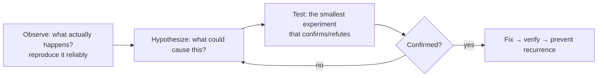
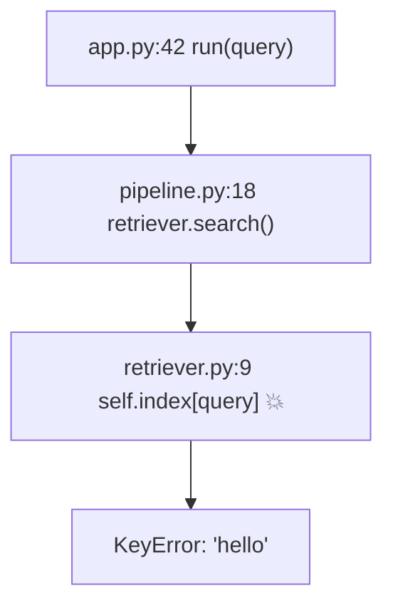
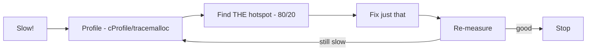
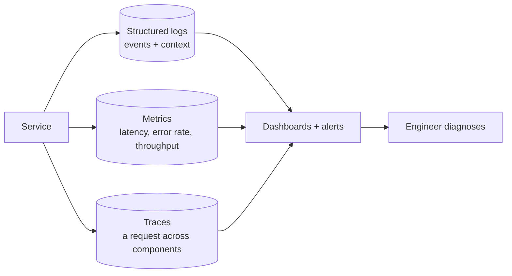
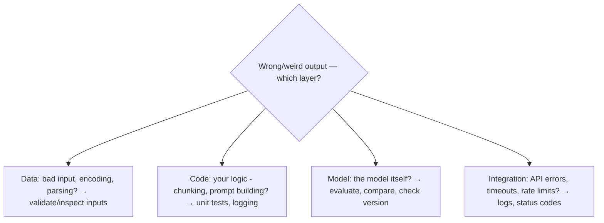

<!-- Module 02 · Lesson 12 — follows ../../../standards/. -->

# 02.12 · Debugging

[⬅ 02.11 System Design Basics](02.11-system-design-basics.md) · [🏠 Module](../README.md) · [🗺 Roadmap](../../../ROADMAP.md) · [Next ➡](02.13-projects-summary.md)

> Debugging is the highest-leverage skill in engineering — you'll do it every day, forever. This lesson makes it *systematic*: reading stack traces, profiling, logging, monitoring, and a repeatable method for the confusing failures that fill an AI Engineer's week.

| | |
|---|---|
| **Module** | `02 · Computer Science Foundations` |
| **Lesson** | `02.12` |
| **Difficulty** | ⭐⭐⭐ |
| **Estimated study time** | 60 min read |
| **Status** | 🟢 stable |

---

## 1. Learning Objectives

By the end of this lesson you will be able to:

- [ ] Read a **stack trace** and extract the real cause fast.
- [ ] Apply a **systematic debugging method** (hypothesis → test).
- [ ] **Profile** to find performance bottlenecks (CPU & memory).
- [ ] Use **logging and monitoring** to debug production without a debugger.
- [ ] Debug the failure modes specific to AI systems.

## 2. Prerequisites

- All of Module 02 (you'll debug across these layers) and [Module 01.9–01.11](../../01-Advanced-Python/weeks/01.9-error-handling-logging.md) (logging, testing, profiling).
- [Module 00.10 mindset](../../00-Orientation/weeks/00.10-ai-engineer-mindset.md) — debugging as a methodical loop.

---

## 3. Why This Topic Exists

Code breaks. Data is malformed, dependencies fail, models misbehave, servers fall over — and the difference between engineers is not who writes bug-free code (no one does) but **who finds and fixes problems fastest and calmest**. Debugging is a *trainable skill*, not a talent, and it compounds: every systematic fix makes you faster at the next.

AI systems are *especially* debug-heavy — many layers (data → model → serving → network), non-determinism, external dependencies, and failures that only appear under production load. Systematic debugging turns "it's broken and I'm panicking" into "here's my hypothesis, here's the test, here's the fix."

> [!IMPORTANT]
> The core discipline (from [Module 00.10](../../00-Orientation/weeks/00.10-ai-engineer-mindset.md)): **debugging is a methodical hypothesis-test loop, not random flailing.** Observe precisely → form a hypothesis → test the smallest thing → repeat. Changing code at random ("shotgun debugging") wastes time and adds new bugs. Slow down and be systematic — it's *faster*.

## 4. Problems It Solves

| Problem | Systematic debugging solves it by |
|---|---|
| "It crashes and I don't know why" | Reading the stack trace to the root |
| "It's slow and I don't know where" | Profiling to find the bottleneck |
| "It fails only in production" | Logging & monitoring |
| "Changing things at random" | A hypothesis-test method |
| "The model gives wrong answers" | Isolating data vs code vs model |

---

## 5. Mental Model: The Scientific Method

Debugging *is* the scientific method applied to code. A bug is a discrepancy between expected and actual behavior; you form hypotheses about the cause and test them until one holds.



| Step | Key practice |
|---|---|
| **Reproduce** | Find the *minimal, reliable* repro — you can't fix what you can't trigger |
| **Observe** | Read the *actual* error/output precisely; don't assume |
| **Hypothesize** | "If X is the cause, then Y should be true" |
| **Test** | Change *one thing*; check the prediction |
| **Fix & verify** | Confirm the fix; add a test so it can't regress |

> [!IMPORTANT]
> **Reproduction is half the battle.** A bug you can trigger on demand is nearly solved; an intermittent one you can't reproduce is agony. Invest in reproduction: minimize the input, fix the seed ([Module 01.11](../../01-Advanced-Python/weeks/01.11-performance.md)/reproducibility), capture the exact conditions. "Reduce to the smallest failing case" is the most powerful debugging move — it often reveals the cause outright.

---

## 6. Reading a Stack Trace

A **stack trace** (traceback) is a map of the call stack ([02.2](02.2-memory.md)) at the moment of failure — the sequence of function calls that led to the error. It's your first and best clue.

```text
Traceback (most recent call last):
  File "app.py", line 42, in <module>
    result = pipeline.run(query)                # ← where the call started
  File "pipeline.py", line 18, in run
    docs = self.retriever.search(query)         # ← intermediate call
  File "retriever.py", line 9, in search
    return self.index[query]                    # ← where it actually broke
KeyError: 'hello'                               # ← the error type & value
```



How to read it:

| Rule | Detail |
|---|---|
| **Read bottom-up for the cause** | The **last line** is the error type + message; the frame just above it is where it happened |
| **Read top-down for context** | The chain shows *how* you got there |
| **Your code vs library code** | Scan for the deepest frame in *your* files — usually the real culprit |
| **Error type tells you a lot** | `KeyError`, `TypeError`, `AttributeError: 'NoneType'...` each point at a class of bug |

> [!TIP]
> The **last line** (`KeyError: 'hello'`) is the *what*; the frames are the *where* and *how*. Beginners panic at the wall of text; experts read the last line first, then find the deepest frame in their own code. `'NoneType' object has no attribute 'x'` almost always means something returned `None` you didn't expect (recall `Optional` handling, [Module 01.8](../../01-Advanced-Python/weeks/01.8-type-hinting.md)). Log tracebacks with `logger.error(..., exc_info=True)` ([Module 01.9](../../01-Advanced-Python/weeks/01.9-error-handling-logging.md)) so production errors carry this map.

---

## 7. The Debugging Toolkit

Match the tool to the problem.

| Problem | Tools |
|---|---|
| Understand a crash | Stack trace, `logging`, `breakpoint()`/`pdb` |
| Inspect state at a point | Debugger (breakpoints, step, inspect), strategic logging |
| Slow code (CPU) | `cProfile`, `line_profiler`, `timeit` ([Module 01.11](../../01-Advanced-Python/weeks/01.11-performance.md)) |
| Memory growth/leak | `tracemalloc`, `memory_profiler`, `top`/`htop` ([02.2](02.2-memory.md)) |
| Production behavior | Structured logs, metrics, traces, dashboards |
| System-level | `top`, `free`, `nvidia-smi`, `dmesg`, `strace` ([02.6](02.6-operating-systems.md)) |
| Network | `curl -v`, `dig`, `ss` ([02.7](02.7-networking.md)) |

### Debuggers vs print/logging

```python
# Drop into an interactive debugger at a specific point (Python 3.7+)
def process(data):
    breakpoint()          # execution pauses here; inspect variables, step through
    return transform(data)
```

| Approach | Best when |
|---|---|
| **Debugger** (`pdb`, IDE) | You need to inspect state interactively, step through logic |
| **Logging** | Production, concurrency/async ([02.8](02.8-concurrency.md)), reproducing is hard, or you need history |
| **`print`** | Quick local checks (but graduate to logging — [Module 01.9](../../01-Advanced-Python/weeks/01.9-error-handling-logging.md)) |

> [!TIP]
> For **concurrent/async and production** code, a step-debugger is often impractical (timing changes behavior; you can't attach to prod). **Logging with context** (request IDs, thread/task IDs) is the workhorse there ([Module 01.9](../../01-Advanced-Python/weeks/01.9-error-handling-logging.md)). For local logic bugs, an interactive debugger is faster than sprinkling prints.

---

## 8. Performance Debugging — Measure, Don't Guess

Performance bugs need a different discipline: **profile to find the bottleneck, fix it, re-measure** ([Module 01.11](../../01-Advanced-Python/weeks/01.11-performance.md)).



| Symptom | Likely area | Tool |
|---|---|---|
| CPU-bound slowness | A hot function/loop | `cProfile`, `line_profiler` |
| Memory climbing | Leak/unbounded growth | `tracemalloc` ([02.2](02.2-memory.md)) |
| Slow, low CPU | I/O or network waiting | Logs/timing around I/O ([02.7](02.7-networking.md)) |
| Accidental O(n²) | Hidden op in a loop | Complexity analysis ([02.5](02.5-complexity.md)) |
| Slow first call, fast after | Cold cache / lazy load | Page cache ([02.6](02.6-operating-systems.md)) |

> [!WARNING]
> **Never optimize by intuition** ([Module 01.11](../../01-Advanced-Python/weeks/01.11-performance.md)). The bottleneck is rarely where you guess. Profile first — the ~80/20 rule holds: most time is in a small fraction of code. Fix *that*, re-measure, stop when good enough. Optimizing unprofiled code wastes effort on things that don't matter.

---

## 9. Logging and Monitoring in Production

You can't attach a debugger to a production service serving thousands of users — so you build **observability** in advance. This is where the structured logging from [Module 01.9](../../01-Advanced-Python/weeks/01.9-error-handling-logging.md) pays off.



| Pillar | Answers | Example |
|---|---|---|
| **Logs** | "What exactly happened (and when)?" | Structured events with request IDs ([Module 01.9](../../01-Advanced-Python/weeks/01.9-error-handling-logging.md)) |
| **Metrics** | "How is the system behaving overall?" | p50/p95/p99 latency, error rate, QPS, cost |
| **Traces** | "Where did this one request spend its time?" | A request's path across services ([02.7](02.7-networking.md)) |
| **Alerts** | "Tell me when something's wrong" | Error rate spikes, latency SLO breach |

> [!IMPORTANT]
> **Observability is designed in, not bolted on.** Instrument your service *before* it breaks: structured logs with correlation IDs, key metrics (latency percentiles, error rate, and for AI: **token counts, cost, model latency**), and traces across the pipeline ([02.7](02.7-networking.md)). When a 3 a.m. incident hits, these are the difference between a 5-minute fix and a multi-hour outage. This is the foundation of [Module 19 · Production AI](../../19-Production-AI/README.md). Watch **percentiles (p95/p99), not averages** — averages hide the tail latency that hurts real users.

---

## 10. Debugging AI Systems Specifically

AI adds failure modes ordinary software doesn't have. Isolate *which layer* is wrong.



| AI failure | Debugging approach |
|---|---|
| Malformed/None inputs crash pipeline | Validate at boundaries (Pydantic, [Module 01.8](../../01-Advanced-Python/weeks/01.8-type-hinting.md)); log inputs |
| Wrong/bad model output | Isolate: is it the prompt, the data, or the model? Compare, evaluate ([Module 19](../../19-Production-AI/README.md)) |
| Intermittent API failures | Check status codes/logs; 429/5xx → retry ([02.7](02.7-networking.md)) |
| CUDA OOM | Batch size, fragmentation, memory tools ([02.2](02.2-memory.md)) |
| Non-deterministic results | Fix seeds; log the exact inputs/params |
| Slow inference | Profile; is it model, network, or your code? |

> [!IMPORTANT]
> **The key AI-debugging move is layer isolation:** when output is wrong, determine whether the fault is in the **data**, your **code**, the **model**, or the **integration** — because the fix is completely different for each. Log the exact inputs and outputs at each stage so you can pinpoint where reality diverged from expectation. Unlike ordinary bugs, "the model was just wrong" is a valid (but distinct) diagnosis requiring *evaluation*, not code fixes ([Module 01.10 testing vs evaluation](../../01-Advanced-Python/weeks/01.10-testing.md)).

---

## 11. Common Mistakes & Debugging (Meta)

| Mistake | Better approach |
|---|---|
| Shotgun debugging (random changes) | Hypothesis-test method; change one thing |
| Not reading the actual error | Read the last traceback line first |
| Not reproducing reliably | Build a minimal, deterministic repro |
| Optimizing without profiling | Measure first |
| No logs in production | Instrument before you ship |
| Watching averages, not percentiles | Track p95/p99 (tail latency) |
| Assuming it's the model | Isolate data/code/model/integration |
| Fixing without a regression test | Add a test so it can't come back |

## 12. Performance Considerations

| Principle | Takeaway |
|---|---|
| Profile, don't guess | 80/20; fix the real hotspot |
| Log at the right level | Debug logs off in prod hot paths ([Module 01.9](../../01-Advanced-Python/weeks/01.9-error-handling-logging.md)) |
| Observability has cost | Sample high-volume traces/logs |
| Reproduce cheaply | Minimal repro speeds every fix |

## 13. Security Considerations

| Risk | Guidance |
|---|---|
| Secrets/PII in logs | Redact — logs are widely accessible ([Module 01.9](../../01-Advanced-Python/weeks/01.9-error-handling-logging.md)) |
| Verbose errors to users | Leak internals for recon — generic message + correlation ID ([Module 01.9](../../01-Advanced-Python/weeks/01.9-error-handling-logging.md)) |
| Debug endpoints in prod | `pdb`/debug mode exposed = RCE risk — disable in prod |
| Tracebacks exposed to clients | Reveal code/paths — log internally, return safe errors |

> [!CAUTION]
> **Never expose a debugger, debug mode, or full tracebacks to end users in production.** A remotely-triggerable `pdb`/debug console is a remote-code-execution hole, and tracebacks leak file paths, code, and stack details attackers use for reconnaissance. Log details internally; return a generic message plus a correlation ID the user can quote to support.

---

## 14. Interview Questions

**Beginner**
1. How do you read a Python stack trace — where's the cause?
2. What is the systematic debugging method?

**Intermediate**
1. When do you use a debugger vs logging? Why is logging preferred in production/async?
2. How do you debug a performance problem you can't locate?

**Advanced**
1. A model service returns wrong answers intermittently. Walk through isolating data vs code vs model vs integration.
2. Design the observability (logs/metrics/traces) for an AI service so 3 a.m. incidents are fast to diagnose. Why percentiles over averages?

**System-design prompt**
- You're paged: an LLM API service's error rate spiked and latency p99 doubled. Walk through your debugging process. — *Follow-ups:* What logs/metrics/traces do you check first? How do you tell if it's your code, the model provider, or infra? How do you mitigate while diagnosing?

---

## 15. Summary

| Key idea | Takeaway |
|---|---|
| Scientific method | Reproduce → observe → hypothesize → test → fix |
| Stack traces | Last line = cause; find the deepest frame in your code |
| Reproduce first | A reliable minimal repro is half the fix |
| Profile, don't guess | Measure to find the real bottleneck |
| Observability | Logs + metrics + traces, designed in |
| AI: isolate the layer | Data vs code vs model vs integration |

## 16. Cheat Sheet

```text
METHOD: reproduce (minimal, deterministic) → observe (read actual error) → hypothesize → test ONE thing → fix + regression test
STACK TRACE: read LAST line for the error type/value ; deepest frame in YOUR code = usual culprit
  'NoneType' has no attribute → unexpected None (check Optional) ; KeyError → missing key
TOOLS: breakpoint()/pdb (interactive) · logging+exc_info=True (prod/async) · cProfile/tracemalloc (perf/mem)
  system: top/free/nvidia-smi/dmesg/strace ; net: curl -v/dig/ss
PERF DEBUG: PROFILE first (never guess) → fix the 80/20 hotspot → re-measure
OBSERVABILITY (design in): structured LOGS(+request id) · METRICS(p95/p99 latency, error rate, tokens/cost) · TRACES
  watch PERCENTILES not averages
AI: isolate layer → DATA (bad input) | CODE (your logic) | MODEL (evaluate) | INTEGRATION (API/429/5xx/OOM)
DON'T: shotgun-debug · guess bottlenecks · expose pdb/tracebacks/secrets in prod
```

## 17. Flashcards

- **Q:** Where is the cause in a Python stack trace? — **A:** The last line gives the error type/message; the frame just above it (deepest, usually in your code) is where it happened.
- **Q:** What is the systematic debugging method? — **A:** Reproduce reliably → observe the actual behavior → hypothesize a cause → test the smallest experiment → fix and add a regression test.
- **Q:** Debugger vs logging — when each? — **A:** Debugger for interactive local logic bugs; logging for production, async/concurrent code, and hard-to-reproduce issues (and it leaves a history).
- **Q:** How do you debug performance problems? — **A:** Profile (cProfile/tracemalloc) to find the real bottleneck, fix it, re-measure — never guess.
- **Q:** The three pillars of observability? — **A:** Logs (what happened), metrics (overall behavior, e.g. p95/p99 latency & error rate), and traces (one request across components).
- **Q:** Key move for debugging wrong AI output? — **A:** Isolate the layer — data, code, model, or integration — because each has a completely different fix.

## 18. Hands-on Exercises

> Full set in [`../exercises/`](../exercises/).

- [ ] **(⭐ Reading)** Given three stack traces, identify the error type, the culprit line, and the likely cause.
- [ ] **(⭐⭐ Debug)** Take a buggy function (provided), reproduce the failure minimally, form a hypothesis, and fix it — documenting each step.
- [ ] **(⭐⭐ Perf)** Profile a slow script; find the hotspot; fix it; report before/after with numbers.
- [ ] **(⭐⭐ Logging)** Add structured logging with request IDs to a small service; trace one request end-to-end through the logs.
- [ ] **(⭐⭐⭐ AI)** Given an AI pipeline producing wrong output, systematically isolate whether it's data, code, or the (mocked) model.

## 19. Mini Project

> **Diagnostic toolkit + graph traversal visualizer (this module's showcase, v7 finale).** Build a small diagnostics module: a decorator that logs entry/exit/exception with timing ([Module 01.6](../../01-Advanced-Python/weeks/01.6-decorators.md)), a `cProfile` wrapper that reports the top hotspots, and a `tracemalloc` memory reporter — then use it to instrument and debug the **graph traversal visualizer** from [02.4](02.4-algorithms.md) (find and fix a planted performance bug). Deliverable: the toolkit + a written debugging report following the scientific method. This unites debugging with the module's algorithms project.

## 20. References

- Zeller, *Why Programs Fail* — the science of debugging ([reference standards](../../../standards/reference-standards.md)).
- Python docs — *`pdb`*, *`faulthandler`*, *`traceback`*, *`cProfile`*, *`tracemalloc`*.
- *Debugging* (Agans) — nine timeless rules; and observability primers (e.g., OpenTelemetry).

## 21. What's Next

You've learned the CS foundations layer by layer. The final lesson consolidates everything into the **seven mini-projects** and a full module review — cheat sheet, flashcards, interview prep, and readiness for Module 03.

➡️ **Next:** [02.13 · Mini Projects & Summary](02.13-projects-summary.md)

---

### 🔁 Revision checklist
- [ ] I can read a stack trace to its root cause
- [ ] I debug with the hypothesis-test method, not randomly
- [ ] I profile to find bottlenecks instead of guessing
- [ ] I can isolate AI failures across data/code/model/integration

### 🔗 Spaced-repetition callback
> Recall [Module 00.10's debugging mindset](../../00-Orientation/weeks/00.10-ai-engineer-mindset.md) and [Module 01.9's structured logging](../../01-Advanced-Python/weeks/01.9-error-handling-logging.md): this lesson is where they become concrete. Debugging is the methodical loop from Module 00, powered by the logging/profiling tools from Module 01, applied across every CS layer of Module 02.
