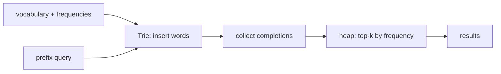
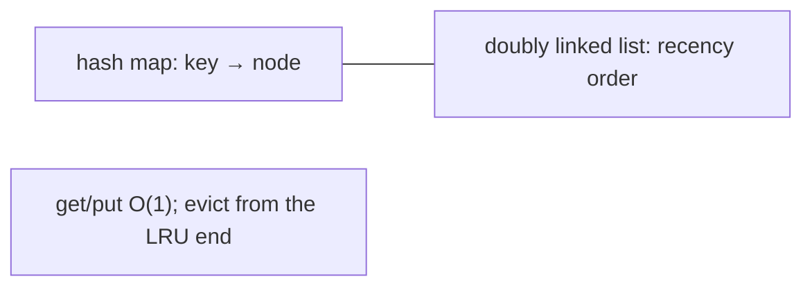
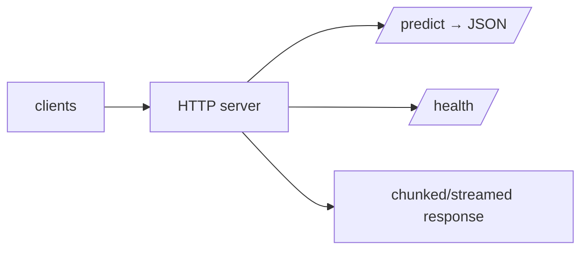
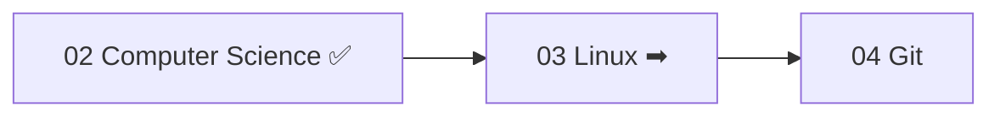

<!-- Module 02 · Lesson 13 — projects + module consolidation. Follows ../../../standards/. -->

# 02.13 · Mini Projects & Module Summary

[⬅ 02.12 Debugging](02.12-debugging.md) · [🏠 Module](../README.md) · [🗺 Roadmap](../../../ROADMAP.md) · [Next module ➡](../../03-Linux/README.md)

> Seven projects that turn CS theory into working code, followed by full consolidation: one-page summary, master cheat sheet, flashcards, interview prep, and your readiness check for Module 03.

| | |
|---|---|
| **Module** | `02 · Computer Science Foundations` |
| **Lesson** | `02.13` |
| **Difficulty** | ⭐⭐⭐⭐ |
| **Estimated study time** | project time varies · 45 min review |
| **Status** | 🟢 stable |

---

## Part A — Mini Projects

Each project implements a CS concept from scratch ("implement before import", [Module 00.4](../../00-Orientation/weeks/00.4-learning-strategy.md)) and follows the [project standards](../../../standards/project-standards.md): goal, requirements, architecture diagram, folder structure, testing. Build them in your study repo. They've been introduced throughout the module — here they're collected with their full briefs.

| # | Project | Concepts | Lesson |
|---|---|---|:--:|
| 1 | Trie-based Autocomplete | tries, heaps, hash maps | [02.3](02.3-data-structures.md) |
| 2 | Graph Traversal Visualizer | graphs, BFS/DFS, shortest path | [02.4](02.4-algorithms.md) |
| 3 | Thread-safe Queue | concurrency, locks, conditions | [02.6](02.6-operating-systems.md) |
| 4 | LRU Cache | hash map + linked list, thread safety | [02.8](02.8-concurrency.md) |
| 5 | In-memory Cache | caching, TTL, eviction, decorators | [02.11](02.11-system-design-basics.md) |
| 6 | URL Shortener (core) | hashing, storage, atomic writes | [02.10](02.10-file-systems.md) |
| 7 | Simple HTTP Server | networking, sockets, concurrency | [02.7](02.7-networking.md) |

---

### Project 1 · Trie-based Autocomplete ⭐⭐⭐

**Goal:** Return ranked completions for a prefix — the core of search bars and (conceptually) tokenizers.

| Requirement | Concept |
|---|---|
| Insert words into a **trie**; O(k) lookup | [02.3](02.3-data-structures.md) |
| Prefix query returns all completions | Trie traversal |
| Rank top-k by frequency with a **heap** | [02.3](02.3-data-structures.md) |
| Tests + complexity analysis | [02.5](02.5-complexity.md), [Module 01.10](../../01-Advanced-Python/weeks/01.10-testing.md) |

**Stretch:** fuzzy matching (edit distance, [02.4](02.4-algorithms.md)); persist the trie ([02.9](02.9-serialization.md)).

---

### Project 2 · Graph Traversal Visualizer ⭐⭐⭐

**Goal:** Animate/log BFS and DFS (and shortest path) step-by-step over a graph.

| Requirement | Concept |
|---|---|
| Adjacency-list graph | [02.3](02.3-data-structures.md) |
| Iterative BFS (queue) & DFS (stack) with `visited` | [02.4](02.4-algorithms.md) |
| Show frontier contents at each step | Traversal internals |
| Shortest path (BFS/Dijkstra) mode | [02.4](02.4-algorithms.md) |

**Stretch:** weighted graphs + Dijkstra; detect cycles; a small web UI ([02.7](02.7-networking.md)).

---

### Project 3 · Thread-safe Queue ⭐⭐⭐⭐

**Goal:** A bounded producer–consumer queue with correct synchronization.

| Requirement | Concept |
|---|---|
| Bounded queue with a **lock** | [02.6](02.6-operating-systems.md), [Module 01.7](../../01-Advanced-Python/weeks/01.7-context-managers.md) |
| Block producers when full, consumers when empty | Condition variables |
| Stress test: many threads, no lost/duplicated items | [02.8](02.8-concurrency.md) |
| Prove no races/deadlocks | [02.6](02.6-operating-systems.md) |

**Stretch:** priority queue (heap); compare with `queue.Queue`; benchmark throughput.

---

### Project 4 · LRU Cache ⭐⭐⭐⭐

**Goal:** O(1) get/put cache with Least-Recently-Used eviction, thread-safe.

| Requirement | Concept |
|---|---|
| **Hash map + doubly linked list** → O(1) get/put | [02.3](02.3-data-structures.md) |
| Evict least-recently-used on capacity | Eviction policy |
| Thread-safe under concurrent access | [02.8](02.8-concurrency.md) |
| Tests incl. eviction order & concurrency | [Module 01.10](../../01-Advanced-Python/weeks/01.10-testing.md) |

**Stretch:** TTL support; compare to `functools.lru_cache` ([Module 01.6](../../01-Advanced-Python/weeks/01.6-decorators.md)); metrics (hit rate).

> [!IMPORTANT]
> The LRU cache is a **classic interview question** *and* real infrastructure (it's what backs `functools.lru_cache` and countless caching layers). Building it from scratch cements hash maps, linked lists, and complexity in one go.

---

### Project 5 · In-memory Cache ⭐⭐⭐

**Goal:** A reusable caching layer (decorator + class) for expensive functions/"model calls" — the highest-leverage AI cost optimization ([02.11](02.11-system-design-basics.md)).

| Requirement | Concept |
|---|---|
| TTL expiry + LRU eviction (bounded) | [02.11](02.11-system-design-basics.md), [02.2](02.2-memory.md) |
| Decorator interface | [Module 01.6](../../01-Advanced-Python/weeks/01.6-decorators.md) |
| Hit/miss metrics | Observability ([02.12](02.12-debugging.md)) |
| Demo: cost/latency savings on repeated inputs | [02.11](02.11-system-design-basics.md) |

**Stretch:** pluggable backend (in-memory ↔ Redis-like); async support ([Module 01.12](../../01-Advanced-Python/weeks/01.12-async.md)).

---

### Project 6 · URL Shortener (core logic) ⭐⭐⭐

**Goal:** The storage/logic core of a URL shortener (not the web UI).

| Requirement | Concept |
|---|---|
| Hash-based short-code generation + collision handling | [02.3](02.3-data-structures.md) |
| Persistent key→URL store with **atomic durable writes** | [02.10](02.10-file-systems.md) |
| Safe path handling | [02.10](02.10-file-systems.md) security |
| CLI + tests | [Module 01.10/01.13](../../01-Advanced-Python/weeks/01.10-testing.md) |

**Stretch:** expiry/TTL; analytics counts; expose via the HTTP server (Project 7).

---

### Project 7 · Simple HTTP Server ⭐⭐⭐⭐

**Goal:** A minimal model-server skeleton: an HTTP endpoint returning JSON, handling concurrency and streaming.

| Requirement | Concept |
|---|---|
| Handle HTTP requests (sockets or minimal framework) | [02.7](02.7-networking.md) |
| `/predict` returns JSON; correct status codes | [02.7](02.7-networking.md), [02.9](02.9-serialization.md) |
| Concurrent request handling | [02.8](02.8-concurrency.md) |
| Header-based auth + health check + streaming | [02.7](02.7-networking.md), [02.11](02.11-system-design-basics.md) |

**Stretch:** rate limiting; integrate the cache (Project 5) and URL shortener (Project 6); async version.

> [!IMPORTANT]
> Together, projects 5–7 (cache + shortener + HTTP server) form a **mini production service** — a preview of what you'll build for real in [Module 16 (MLOps)](../../16-MLOps/README.md). They apply networking, concurrency, caching, storage, and serialization in one system.

---

## Part B — Module Consolidation

### One-page summary of Module 02

| Lesson | The one thing to remember |
|---|---|
| **02.1 Hardware** | Computation is cheap; moving data is expensive (why NumPy/GPUs) |
| **02.2 Memory** | Stack vs heap; fragmentation & leaks; cache locality = speed |
| **02.3 Data Structures** | Match structure to access pattern (hash O(1), heap top-k, trie prefix, graph relations) |
| **02.4 Algorithms** | Recognize the paradigm (search/sort/DP/greedy/graph/backtrack) |
| **02.5 Complexity** | Big-O = growth; the O(n log n)→O(n²) cliff; attention is O(n²) |
| **02.6 Operating Systems** | Process vs thread; scheduling; deadlocks; virtual memory/OOM |
| **02.7 Networking** | TCP/HTTP(S); REST/WS/gRPC; load balancers; the AI-API-call path |
| **02.8 Concurrency** | CPU→parallel(processes), I/O→concurrent(async); the GIL; races need locks |
| **02.9 Serialization** | JSON default; **never unpickle untrusted data**; deserialization = trust boundary |
| **02.10 File Systems** | Permissions; binary vs text; sequential formats; atomic durable writes |
| **02.11 System Design** | Stateless + horizontal scaling; design for failure; cache everywhere |
| **02.12 Debugging** | Reproduce → hypothesize → test → fix; profile don't guess; observability |

> [!IMPORTANT]
> The through-line of Module 02: **you now understand what happens beneath and across your code** — hardware, memory, OS, network — and can reason about how data structures, algorithms, and system design make AI systems fast, scalable, and correct. Two recurring themes tie it together: *(1) data movement dominates performance* (hardware → cache → structures → storage → network), and *(2) trust boundaries dominate security* (deserialization, untrusted input, permissions).

### Master cheat sheet

> The full one-pager lives at [`../cheat-sheets/cs-foundations-cheatsheet.md`](../cheat-sheets/cs-foundations-cheatsheet.md).

### Flashcards

> The complete deck (all 12 lessons) is in [`../flashcards/deck.md`](../flashcards/deck.md). Review on the [spaced-repetition schedule](../../../LEARNING_STRATEGY.md).

### Module interview questions (consolidated)

**Beginner**
1. Why is pure-Python numeric code slow, at the hardware level?
2. Array vs linked list; hash table vs BST — trade-offs?
3. Process vs thread; concurrency vs parallelism?

**Intermediate**
1. Explain the GIL and pick concurrency models for CPU- vs I/O-bound AI work.
2. Analyze a function's complexity; find and fix an accidental O(n²).
3. Why is unpickling untrusted data dangerous, and what do you use instead?

**Advanced**
1. Design a scalable, fault-tolerant, cached AI serving system (stateless + LB + cache).
2. Trace an AI API call end-to-end and place caching/retries/observability.
3. Debug a production latency spike systematically (logs/metrics/traces, p99).

**System-design prompt**
- Design a document search + LLM answering service for millions of users. — *Follow-ups:* Which data structures (index/top-k/graph NN)? Complexity at scale? Concurrency model? Caching? Serialization formats? How do you make it fault-tolerant and debuggable?

---

## Part C — Readiness Check & What's Next

### Module 02 mastery checklist (from memory)

- [ ] Explain the memory hierarchy and why data movement dominates
- [ ] Distinguish stack/heap and explain fragmentation, GC, cache locality
- [ ] State the complexity and AI use of each core data structure
- [ ] Recognize and apply the major algorithm paradigms
- [ ] Analyze Big-O/space of real code; spot the O(n²) cliff
- [ ] Distinguish processes/threads; explain scheduling, deadlocks, virtual memory
- [ ] Explain TCP/HTTP(S)/REST/WS/gRPC and load balancers; trace an API call
- [ ] Choose threading/multiprocessing/async; explain the GIL; prevent races
- [ ] Compare serialization formats; explain the untrusted-pickle risk
- [ ] Reason about permissions, binary/text, and durable storage
- [ ] Design a stateless, horizontally-scaled, cached, fault-tolerant service
- [ ] Debug systematically: stack traces, profiling, observability, layer isolation

### Glossary additions

Module 02 terms added to [GLOSSARY.md](../../../GLOSSARY.md): cache hierarchy/cache line, stack/heap, fragmentation, cache locality, hash table, heap, trie, graph, Big-O/Ω/Θ, process/thread, context switch, deadlock, virtual memory/paging, TCP/UDP, DNS, HTTP(S)/TLS, REST/gRPC/WebSocket, load balancer/reverse proxy, race condition, serialization/deserialization, horizontal/vertical scaling, statelessness, fault tolerance, stack trace, observability.

### Next module preview — 03 · Linux

You understand the OS and filesystem *conceptually*; Module 03 makes you *fluent at the command line* — the shell, processes, permissions, and remote servers where AI systems actually run.

> [!IMPORTANT]
> Module 03 turns the OS/filesystem concepts here into hands-on skill: the `top`, `df`, `chmod`, `ln -s`, and process commands referenced throughout this module become tools you wield daily. Concepts (Module 02) → fluency (Module 03).

➡️ **Begin:** [Module 03 · Linux](../../03-Linux/README.md)

---

### 🔁 Final revision checklist
- [ ] I completed the mastery checklist from memory
- [ ] I built at least the LRU cache (P4) and one system project (P5–P7)
- [ ] I added Module 02 terms to my flashcards
- [ ] My study repo has these projects, tested
- [ ] I'm ready for Module 03

### 🔗 Spaced-repetition callback
> These seven projects retrieve the whole module: the LRU cache alone touches data structures ([02.3](02.3-data-structures.md)), concurrency ([02.8](02.8-concurrency.md)), complexity ([02.5](02.5-complexity.md)), and caching ([02.11](02.11-system-design-basics.md)). And they build on Module 01 — decorators, testing, typing, async. Building them is the ultimate active-recall exercise ([Module 00.9](../../00-Orientation/weeks/00.9-learning-workflow.md)).
