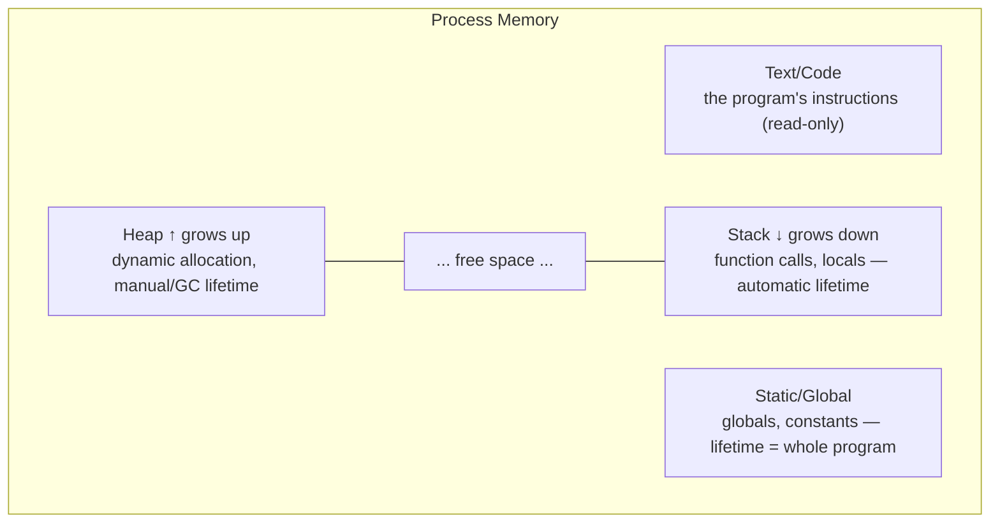
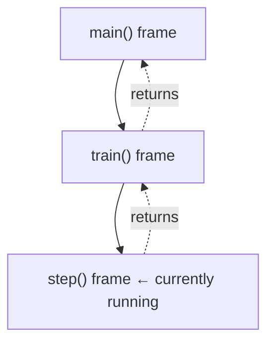
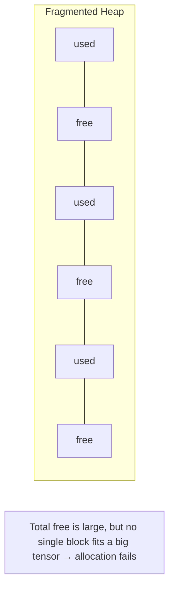
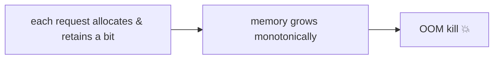
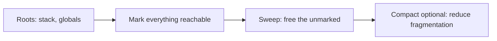
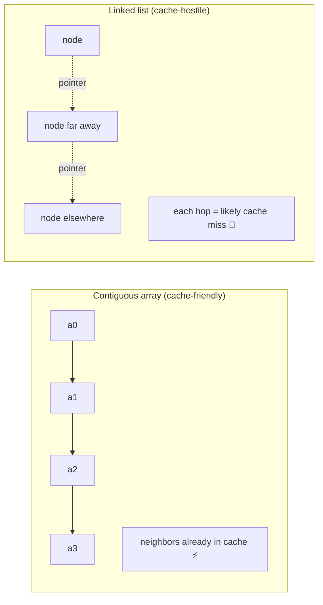

<!-- Module 02 · Lesson 2 — follows ../../../standards/. -->

# 02.2 · Memory

[⬅ 02.1 Hardware](02.1-how-computers-work.md) · [🏠 Module](../README.md) · [🗺 Roadmap](../../../ROADMAP.md) · [Next ➡](02.3-data-structures.md)

> How programs organize and allocate memory — stack vs heap, allocation and fragmentation, garbage collection, and cache locality. These determine whether your AI service runs for months or gets OOM-killed at 3 a.m.

| | |
|---|---|
| **Module** | `02 · Computer Science Foundations` |
| **Lesson** | `02.2` |
| **Difficulty** | ⭐⭐⭐ |
| **Estimated study time** | 60 min read |
| **Status** | 🟢 stable |

---

## 1. Learning Objectives

By the end of this lesson you will be able to:

- [ ] Distinguish the **stack**, the **heap**, and **static** memory.
- [ ] Explain **static vs dynamic** allocation and where each lives.
- [ ] Describe **memory fragmentation** and why it hurts long-running services.
- [ ] Explain **garbage collection** strategies and their trade-offs.
- [ ] Apply **cache locality** to make data structures fast.
- [ ] Reason about how memory shapes **AI workloads** (large tensors, long-lived services).

## 2. Prerequisites

- [02.1 · How Computers Work](02.1-how-computers-work.md) (the memory hierarchy, cache lines).
- [Module 01.2 · Memory Management](../../01-Advanced-Python/weeks/01.2-memory-management.md) (Python's object model, refcounting) — this generalizes it to CS fundamentals.

---

## 3. Why This Topic Exists

AI workloads are memory-hungry: datasets that dwarf RAM, models with billions of parameters, activations that balloon during training. The two most common ways AI systems fail in production are (1) **out-of-memory (OOM)** crashes and (2) **memory growth** that slowly starves a long-running service. Both are memory-management problems.

Understanding stack vs heap, allocation, fragmentation, and GC turns these from mysterious crashes into predictable, debuggable behavior — and lets you write code that uses memory efficiently under real constraints.

> [!IMPORTANT]
> In AI Engineering, **memory is frequently the binding constraint** — more than CPU. "Will this batch size fit in GPU memory?" and "Why is my server's RAM climbing?" are daily questions. This lesson gives you the model to answer them.

## 4. Problems It Solves

| Problem | Understanding memory solves it by |
|---|---|
| OOM crashes during training/inference | Reasoning about what's allocated and when |
| Server memory climbing over hours | Recognizing leaks/fragmentation |
| Mysterious slowness on large data | Cache-locality awareness |
| "Why did copying blow up my RAM?" | Stack/heap & allocation understanding |
| Choosing batch sizes | Knowing what consumes memory |

---

## 5. Mental Model: Two Regions With Opposite Rules

A running program's memory has several regions; the two you manage in practice are the **stack** and the **heap**. They behave oppositely.



| | Stack | Heap |
|---|---|---|
| **Holds** | Function call frames, local variables, return addresses | Dynamically allocated objects |
| **Lifetime** | Automatic — freed when the function returns | Manual (C) or GC-managed (Python/Java) |
| **Speed** | Very fast (just move a pointer) | Slower (find/track a block) |
| **Size** | Small, fixed limit (e.g., ~1–8 MB) | Large (bounded by RAM) |
| **Order** | LIFO (last-in-first-out) | Arbitrary |
| **Fragmentation** | None | Possible |

> **Illustration placeholder** — `assets/images/stack-vs-heap.png`: a memory column with the stack growing downward (frames stacking as functions are called) and the heap growing upward (scattered allocated blocks), a "free" gap between them, and a call chain `main → train → step` shown as stacked frames.

---

## 6. The Stack — Automatic and Fast

Each function call pushes a **stack frame** holding its parameters, local variables, and where to return. When the function returns, its frame is popped — instantly reclaiming that memory. This is why locals "disappear" after a function ends.



- **Fast:** allocation is just bumping the stack pointer; deallocation is popping.
- **LIFO:** the last frame pushed is the first popped — perfectly matching function call/return nesting.
- **Bounded:** the stack has a fixed size limit.

> [!WARNING]
> **Stack overflow** happens when the stack limit is exceeded — most often via **unbounded recursion**. In Python you'll hit `RecursionError` first (a safety limit ~1000 frames). This matters for AI/graph code: recursive tree/graph traversals on deep structures can overflow — prefer **iterative** versions with an explicit heap-allocated stack for deep data (you'll see this in Lesson 02.4).

---

## 7. The Heap — Dynamic and Flexible

Anything whose size or lifetime isn't known at compile time lives on the **heap**: objects, lists, arrays, tensors. You (or a garbage collector) request a block and free it later.

| Allocation type | Where | When size/lifetime known |
|---|---|---|
| **Static** | Static/global region | At compile time; lives whole program |
| **Automatic** | Stack | At compile time; lives for the function call |
| **Dynamic** | Heap | At runtime; lifetime controlled explicitly or by GC |

In Python, essentially **everything is a heap object** ([Module 01.2](../../01-Advanced-Python/weeks/01.2-memory-management.md)) — variables are stack references (names) pointing to heap objects. A NumPy array's *metadata* object is small, but its *data buffer* is a large contiguous heap allocation.

> [!IMPORTANT]
> This stack-references-heap-objects split is why passing a large array to a function is cheap (you copy a reference on the stack, not the data), and why an explicit `copy()` can suddenly consume gigabytes (it allocates a new heap buffer). Recall aliasing from [Module 01.2](../../01-Advanced-Python/weeks/01.2-memory-management.md) — this is its memory-region explanation.

---

## 8. Allocation, Fragmentation, and Leaks

### Allocation

Requesting heap memory (`malloc` in C, object creation in Python) means the allocator finds a free block of the right size, marks it used, and returns a pointer. Freeing returns it to the pool. Doing this constantly for many differently-sized objects is where problems arise.

### Fragmentation

Over time, allocations and frees leave the heap looking like Swiss cheese: enough *total* free memory, but no single *contiguous* block big enough for a large request.



| Type | Meaning |
|---|---|
| **External fragmentation** | Free memory scattered in small non-contiguous gaps |
| **Internal fragmentation** | Allocated blocks bigger than needed (rounding/padding) waste space |

> [!IMPORTANT]
> Fragmentation is a real and painful issue in **GPU memory** for deep learning: you can get a CUDA "out of memory" error even when the total free VRAM looks sufficient, because it's fragmented and no contiguous block fits your tensor. Frameworks use custom **caching allocators** (e.g., PyTorch's) to reduce this. Practical fixes: consistent batch/shape sizes, clearing cached memory, and avoiding churny alloc/free patterns.

### Leaks

A **memory leak** is memory that's allocated but never freed (in GC languages, still-referenced but unused — recall [Module 01.2](../../01-Advanced-Python/weeks/01.2-memory-management.md)). In a long-running service, even a small per-request leak compounds until the process is OOM-killed.



> [!WARNING]
> The classic AI-service leak: an **unbounded cache or growing global list** in a long-lived inference server (or logging every activation/batch during training). Works in tests, dies in production after hours. Always bound anything that grows per-request or per-iteration.

---

## 9. Garbage Collection

Manual memory management (C: `malloc`/`free`) is powerful but error-prone (leaks, double-frees, use-after-free). **Garbage collection (GC)** automates freeing memory that's no longer reachable.

| GC strategy | How it works | Used by |
|---|---|---|
| **Reference counting** | Free when an object's ref count hits 0 (prompt, but can't handle cycles) | CPython (primary) |
| **Mark-and-sweep** | Periodically mark all reachable objects, sweep (free) the rest | CPython's cycle collector, many VMs |
| **Generational** | Most objects die young → check young objects more often | CPython, JVM, .NET |
| **Manual (no GC)** | Programmer frees explicitly | C, C++ |



| Trade-off | Detail |
|---|---|
| ✅ Safety | Eliminates whole classes of memory bugs |
| ✅ Productivity | No manual free()/lifetime tracking |
| ❌ Overhead | CPU cost; refcount updates on every reference |
| ❌ Pauses | Collection can pause execution (latency spikes) |
| ❌ Less control | Timing of frees isn't fully in your hands |

> [!TIP]
> Recall [Module 01.2](../../01-Advanced-Python/weeks/01.2-memory-management.md): CPython combines **reference counting** (prompt) with a **generational cycle collector** (for cycles). You rarely tune GC, but in latency-sensitive serving you might call `gc.collect()` at safe points or (advanced) tune thresholds to avoid mid-request pauses. In C/C++ extensions and CUDA, you're back to explicit management.

---

## 10. Cache Locality — Making Memory Fast

From [02.1](02.1-how-computers-work.md): the CPU fetches memory in cache lines (~64 bytes), so **data laid out contiguously and accessed in order** is far faster than scattered access. This is *cache locality*, and it's why data structure choice has huge performance consequences.

| Locality type | Meaning | Example |
|---|---|---|
| **Spatial** | Nearby data is accessed close in time | Iterating an array in order |
| **Temporal** | Recently used data is reused soon | A hot loop variable |



> [!IMPORTANT]
> **This is why arrays beat linked lists in practice far more than Big-O suggests** (Lesson 02.3), and why NumPy/PyTorch store tensors as contiguous buffers. A cache-friendly O(n) array scan can crush a cache-hostile O(n) pointer-chase by 10×+. When you hear "vectorized" or "contiguous memory," think *cache locality*. Row-major vs column-major layout, and PyTorch's `.contiguous()`, are all about this.

---

## 11. How Memory Shapes AI Workloads

| AI reality | Memory concept |
|---|---|
| "Will this batch fit?" | Heap/VRAM capacity + fragmentation |
| Model weights loaded once, reused | Load from storage → RAM/VRAM (§2.1 hierarchy) |
| Activations balloon during training | Dynamic heap growth; gradient checkpointing trades compute for memory |
| Long-lived inference server RAM climbs | Leaks / unbounded caches |
| Tensors must be contiguous for speed | Cache locality; `.contiguous()` |
| CUDA OOM despite "free" memory | GPU fragmentation |
| Streaming datasets > RAM | Avoid loading all to heap ([Module 01.5 generators](../../01-Advanced-Python/weeks/01.5-iterators-generators.md)) |

> [!IMPORTANT]
> Two AI memory techniques worth naming now (you'll meet them in Modules 09/15/17): **gradient checkpointing** (recompute activations instead of storing them → less memory, more compute) and **quantization** (store weights in fewer bits → less memory & bandwidth). Both are direct trades against the memory constraints in this lesson.

---

## 12. Common Mistakes & Debugging

| Symptom | Likely cause | Fix / tool |
|---|---|---|
| `RecursionError` | Unbounded/deep recursion (stack) | Iterative + explicit stack; raise limit cautiously |
| RAM grows over hours | Leak: unbounded cache/global | Bound it; `tracemalloc` to find growth |
| CUDA OOM with "free" memory | GPU fragmentation | Consistent shapes; clear cache; smaller batch |
| Copy blew up memory | Deep copy of a large buffer | Use views; copy only when needed |
| Slow scan of big data | Poor cache locality | Contiguous layout; vectorize |
| GC pauses hurting p99 latency | Collection mid-request | Tune/trigger GC at safe points |

> [!TIP]
> Memory-debugging toolkit: `tracemalloc` (Python allocation growth), OS tools (`top`/`htop`/`free`, RSS over time), framework tools (e.g., `torch.cuda.memory_summary()`), and profilers. Same discipline as [Module 01.2](../../01-Advanced-Python/weeks/01.2-memory-management.md): snapshot, diff, find what's growing.

## 13. Performance Considerations

| Principle | Takeaway |
|---|---|
| Stack alloc ≈ free | Cheap; heap alloc has real cost |
| Minimize allocations in hot loops | Reuse buffers; preallocate |
| Contiguity | Cache-friendly layout = speed |
| Bound growth | Prevent leaks & fragmentation |
| Trade memory ↔ compute | Checkpointing, quantization, streaming |

## 14. Security Considerations

| Risk | Guidance |
|---|---|
| Sensitive data lingering in memory | Not zeroed on free; minimize secret lifetime ([Module 01.2](../../01-Advanced-Python/weeks/01.2-memory-management.md)) |
| Unbounded allocation from input | Memory-exhaustion DoS — cap input/buffer sizes |
| Buffer overflows (C/C++ extensions) | A major vulnerability class; validate bounds in native code |
| Use-after-free (native) | Undefined behavior/exploitable; GC languages avoid it |

> [!CAUTION]
> In **C/C++ extensions** (common in ML libraries), classic memory bugs — buffer overflows, use-after-free — are serious, exploitable vulnerabilities. Python's GC shields you in pure Python, but the moment you touch native code (or process untrusted binary data), bounds-checking and careful lifetime management matter for security, not just correctness.

---

## 15. Interview Questions

**Beginner**
1. What's the difference between the stack and the heap?
2. What is a memory leak, and how does it manifest differently in C vs Python?

**Intermediate**
1. What is memory fragmentation, and why can it cause a "no memory" error when memory is technically free?
2. Explain cache locality and why arrays often outperform linked lists beyond their Big-O.

**Advanced**
1. Compare reference counting, mark-and-sweep, and generational GC — trade-offs of each.
2. A deep-learning training run hits CUDA OOM intermittently. Walk through causes (fragmentation, batch size, activations) and mitigations.

**System-design prompt**
- Design memory management for a long-running inference server that must run for weeks without restart. — *Follow-ups:* How do you prevent leaks and fragmentation? How do you bound caches? How do you detect growth early?

---

## 16. Summary

| Key idea | Takeaway |
|---|---|
| Stack vs heap | Stack: fast, automatic, LIFO, small; heap: dynamic, GC-managed, large |
| Allocation types | Static, automatic (stack), dynamic (heap) |
| Fragmentation | Scattered free space → big allocations fail (esp. GPU) |
| Leaks | Retained-but-unused memory; deadly in long-lived services |
| GC | Refcount + mark-sweep + generational; safety vs overhead/pauses |
| Cache locality | Contiguous, in-order access = fast (why tensors are contiguous) |

## 17. Cheat Sheet

```text
REGIONS: code(RO) · static/global(whole program) · HEAP(dynamic, GC) · STACK(calls/locals, LIFO)
STACK: fast, automatic, small, bounded → overflow via deep recursion (RecursionError)
HEAP: dynamic objects/tensors · slower alloc · fragmentation possible
ALLOCATION: static | automatic(stack) | dynamic(heap)
FRAGMENTATION: total free large but no contiguous block → alloc fails (esp. GPU/CUDA OOM)
LEAK: allocated/retained but unused → grows over time → OOM (bound caches/globals)
GC: refcounting(prompt, no cycles) · mark-sweep(cycles) · generational(young die fast)
  trade: safety/productivity vs overhead + pauses
CACHE LOCALITY: contiguous + in-order = fast (arrays/tensors) ; pointer-chasing = slow (linked)
AI: batch fit, VRAM frag, activations, checkpointing (mem↔compute), quantization (fewer bits)
DEBUG: tracemalloc · top/htop/free (RSS) · torch.cuda.memory_summary()
```

## 18. Flashcards

- **Q:** Stack vs heap? — **A:** Stack: fast, automatic (freed on return), LIFO, small, for call frames/locals. Heap: dynamic, larger, GC/manual lifetime, for objects/tensors.
- **Q:** What is external fragmentation? — **A:** Free memory scattered in small non-contiguous gaps, so a large allocation fails despite sufficient total free memory.
- **Q:** Why can you get CUDA OOM with "free" memory? — **A:** GPU memory fragmentation — no single contiguous block large enough for the tensor.
- **Q:** Name three GC strategies. — **A:** Reference counting, mark-and-sweep, generational (CPython uses refcounting + a generational cycle collector).
- **Q:** What is cache locality and why does it matter? — **A:** Accessing contiguous data in order keeps the cache full (cache lines), making arrays/tensors much faster than pointer-chasing structures.
- **Q:** What is a stack overflow, typically caused by? — **A:** Exceeding the fixed stack size, usually via unbounded/deep recursion (Python raises `RecursionError`).

## 19. Hands-on Exercises

> Full set in [`../exercises/`](../exercises/).

- [ ] **(⭐ Conceptual)** Diagram a call chain's stack frames and identify what's on the heap for a function that builds a list.
- [ ] **(⭐⭐ Coding)** Trigger and catch a `RecursionError`; rewrite the recursion iteratively with an explicit stack.
- [ ] **(⭐⭐ Debug)** Simulate a leak with a growing global cache in a loop; find it with `tracemalloc`; fix it with a bounded cache.
- [ ] **(⭐⭐⭐ Coding)** Benchmark iterating a large contiguous array vs a linked-list-like structure of the same length; explain the gap via cache locality.

## 20. Mini Project

> **Memory inspector.** Build a tool that, for a running snippet, reports: peak allocation (`tracemalloc`), the largest allocations and where they came from, and a simple stack-depth tracker for recursive calls. Add a "before/after bounded-cache fix" demo showing flat vs growing memory. This makes the invisible visible and is a genuinely useful debugging aid.

## 21. References

- Python docs — *`tracemalloc`*, *`gc`* ([reference standards](../../../standards/reference-standards.md)).
- PyTorch docs — CUDA memory management & caching allocator.
- Drepper, *What Every Programmer Should Know About Memory* — caches & locality in depth.

## 22. What's Next

You understand raw memory. Now we use it deliberately: **data structures** — how arrays, hash tables, trees, heaps, and graphs are laid out, their complexity, and where each appears in AI systems.

➡️ **Next:** [02.3 · Data Structures](02.3-data-structures.md)

---

### 🔁 Revision checklist
- [ ] I can distinguish stack, heap, and static memory
- [ ] I can explain fragmentation and why GPUs suffer from it
- [ ] I can compare GC strategies and their trade-offs
- [ ] I can explain cache locality's performance impact

### 🔗 Spaced-repetition callback
> Recall [02.1's cache lines](02.1-how-computers-work.md) and [Module 01.2's refcounting](../../01-Advanced-Python/weeks/01.2-memory-management.md): this lesson unifies them — cache locality (hardware) explains *why* contiguous layout is fast, and GC (software) explains *how* Python frees the heap objects those names point to.
