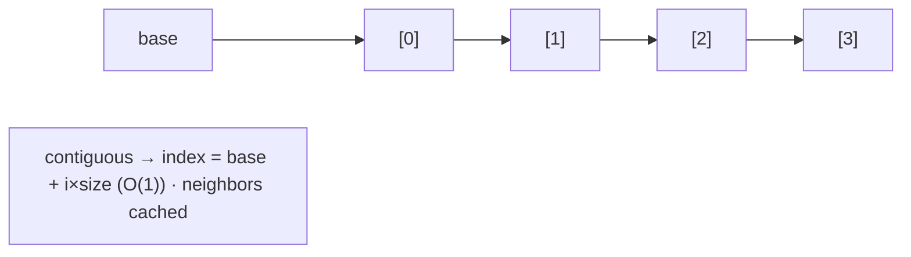
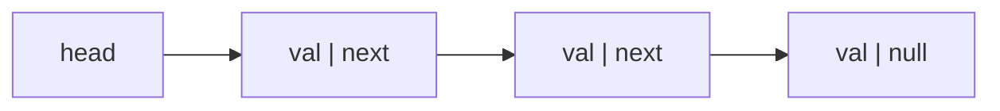
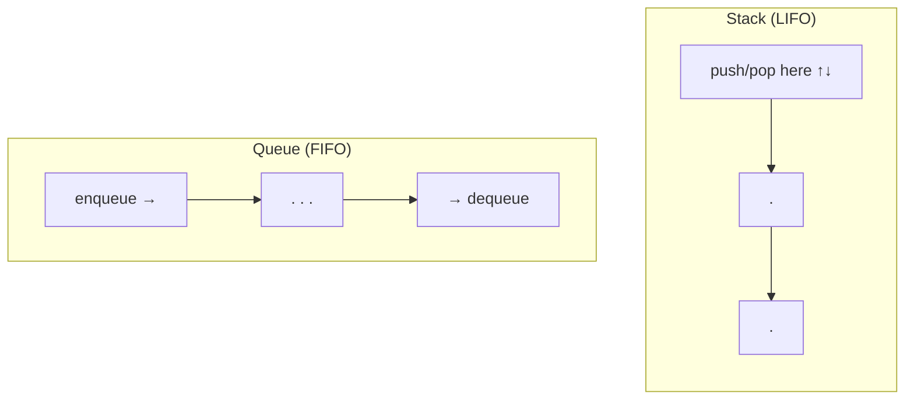
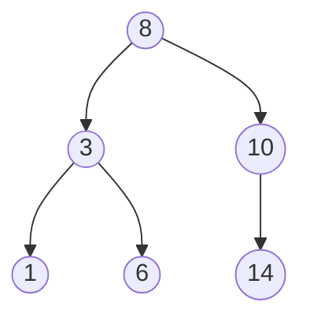
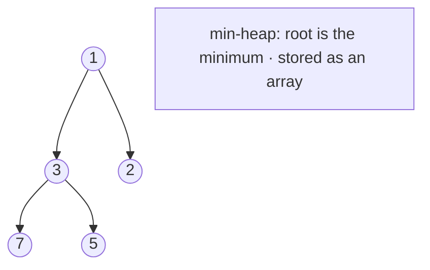
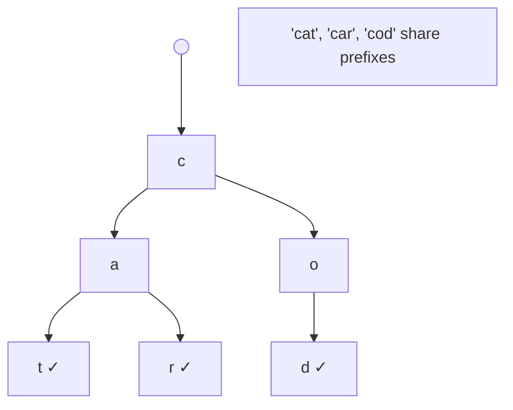
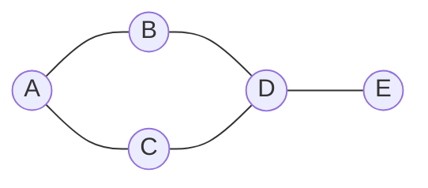

<!-- Module 02 · Lesson 3 — follows ../../../standards/. -->

# 02.3 · Data Structures

[⬅ 02.2 Memory](02.2-memory.md) · [🏠 Module](../README.md) · [🗺 Roadmap](../../../ROADMAP.md) · [Next ➡](02.4-algorithms.md)

> The right data structure turns an impossible problem into a trivial one — and the wrong one turns a fast system into a slow one. This lesson covers arrays through graphs: how each is laid out in memory, its complexity, and exactly where it appears in AI systems.

| | |
|---|---|
| **Module** | `02 · Computer Science Foundations` |
| **Lesson** | `02.3` |
| **Difficulty** | ⭐⭐⭐ |
| **Estimated study time** | 80 min read · 40 min practice |
| **Status** | 🟢 stable |

---

## 1. Learning Objectives

By the end of this lesson you will be able to:

- [ ] Explain the **internal layout**, **time**, and **space complexity** of core data structures.
- [ ] Choose the right structure for a task from its access pattern.
- [ ] Explain **arrays, linked lists, stacks, queues, hash tables, trees, BSTs, heaps, tries, and graphs**.
- [ ] Map each structure to a concrete **AI use case**.
- [ ] Recognize these structures inside AI frameworks and infra.

## 2. Prerequisites

- [02.1 Hardware](02.1-how-computers-work.md) & [02.2 Memory](02.2-memory.md) — cache locality and heap/stack are why layout matters.

---

## 3. Why This Topic Exists

A data structure is a way of organizing data so certain operations are fast. Every meaningful choice in a system — how you store embeddings, index documents, schedule work, deduplicate, or traverse relationships — is a data-structure choice, and it dictates whether an operation is instant or grinds to a halt at scale.

For AI Engineers this is concrete: vector databases are specialized data structures; tokenizers use tries and hash maps; task queues power training pipelines; knowledge graphs and computation graphs are graphs. You don't need to reinvent them, but you must know their trade-offs to pick and use them well.

> [!IMPORTANT]
> There is no "best" data structure — only the best *for a given access pattern*. The core skill is matching structure to how you'll read and write the data: "mostly random lookups by key?" → hash table; "always need the max?" → heap; "ordered range queries?" → tree. Learn the trade-offs, not just the definitions.

## 4. Problems It Solves

| Problem | Right structure |
|---|---|
| Fast lookup by key | Hash table — O(1) |
| Always retrieve the min/max | Heap — O(log n) |
| Ordered data + range queries | Balanced BST — O(log n) |
| Prefix matching / autocomplete | Trie |
| Model dependencies / relationships | Graph |
| FIFO task processing | Queue |
| Undo / call stack / DFS | Stack |
| Dense numeric data, fast scans | Array (contiguous) |

---

## 5. The Big Picture: Complexity at a Glance

Keep this table as your decision reference (complexities are typical/average; details follow).

| Structure | Access | Search | Insert | Delete | Ordered? | Cache-friendly? |
|---|:--:|:--:|:--:|:--:|:--:|:--:|
| **Array (dynamic)** | O(1) | O(n) | O(1)* end / O(n) mid | O(n) | index order | ✅✅ |
| **Linked list** | O(n) | O(n) | O(1)† | O(1)† | insertion | ❌ |
| **Stack** | O(1) top | — | O(1) | O(1) | LIFO | depends |
| **Queue** | O(1) ends | — | O(1) | O(1) | FIFO | depends |
| **Hash table** | — | O(1) avg | O(1) avg | O(1) avg | ❌ | ~ |
| **Balanced BST** | — | O(log n) | O(log n) | O(log n) | ✅ sorted | ~ |
| **Heap** | O(1) peek | O(n) | O(log n) | O(log n) | partial | ✅ (array) |
| **Trie** | — | O(k)‡ | O(k) | O(k) | prefix | ~ |
| **Graph** | — | varies | O(1) edge | O(1) edge | — | depends |

<sub>*amortized · †if you already have the node · ‡k = key length, not n</sub>

> [!TIP]
> Notice **hash table O(1)** vs **BST O(log n)**: hash tables win for pure lookups; BSTs win when you also need *sorted order* or *range queries*. That trade-off — "do I need order?" — decides between them constantly.

---

## 6. Arrays — Contiguous and Cache-Friendly

An **array** stores elements in one contiguous block of memory. Element *i* lives at `base + i × size`, so access by index is O(1) arithmetic — and, crucially, iteration is **cache-friendly** ([02.2](02.2-memory.md)).



| Operation | Cost | Why |
|---|:--:|---|
| Access `a[i]` | O(1) | Direct address arithmetic |
| Search (unsorted) | O(n) | Must scan |
| Append (dynamic array) | O(1) amortized | Occasionally resizes (doubles) & copies |
| Insert/delete middle | O(n) | Must shift elements |

**Dynamic arrays** (Python `list`, C++ `vector`) grow by allocating a bigger block and copying when full — hence *amortized* O(1) append.

> [!IMPORTANT]
> **AI use:** arrays are the foundation of all numeric computing. A **NumPy array / PyTorch tensor** is a contiguous typed array — that's what makes vectorized math and cache locality possible ([02.1](02.1-how-computers-work.md)). Embeddings, weights, activations, and batches are all arrays. When you hear "tensor," think "multi-dimensional contiguous array."

---

## 7. Linked Lists — Flexible but Cache-Hostile

A **linked list** stores each element in a **node** that also holds a pointer to the next node. Nodes can live anywhere in memory.



| Operation | Cost | Note |
|---|:--:|---|
| Access by index | O(n) | Must walk from the head |
| Insert/delete (given the node) | O(1) | Just re-point pointers |
| Search | O(n) | Walk the chain |

| Array vs Linked list | Array | Linked list |
|---|---|---|
| Random access | O(1) | O(n) |
| Insert/delete at ends/known node | O(n) mid / O(1) end | O(1) |
| Memory overhead | Low | High (pointer per node) |
| Cache locality | ✅ Excellent | ❌ Poor (pointer chasing) |

> [!WARNING]
> In practice, **arrays usually beat linked lists** even for operations where linked lists have better Big-O, because of cache locality ([02.2](02.2-memory.md)) — pointer chasing causes constant cache misses. Reach for a linked list only when you genuinely need O(1) insert/delete in the middle *with* a held reference. Most "linked list" needs are better served by dynamic arrays or deques.

---

## 8. Stacks and Queues — Restricted Access, Clear Purpose

These add *discipline* to access order, which is exactly what many algorithms need.

| | Stack (LIFO) | Queue (FIFO) |
|---|---|---|
| Order | Last-in, first-out | First-in, first-out |
| Ops | `push`, `pop` (top) | `enqueue`, `dequeue` (ends) |
| Analogy | Stack of plates | Line at a counter |
| Both ops | O(1) | O(1) |



| Use case | Structure |
|---|---|
| Function call frames ([02.2](02.2-memory.md)), DFS, undo, expression parsing | Stack |
| Task/job processing, BFS, request buffering, streaming | Queue |

> [!TIP]
> In Python use `collections.deque` for both (O(1) at both ends) — never `list.pop(0)` for a queue (that's O(n), shifting every element). **AI use:** queues power **task/data pipelines** (e.g., a `DataLoader`'s prefetch queue, message queues between training/serving stages); stacks appear in graph traversals and the call stack of recursive model code.

---

## 9. Hash Tables — O(1) Lookup, the Workhorse

A **hash table** (Python `dict`/`set`) maps keys to values using a **hash function** that turns a key into an array index. Look up, insert, and delete are O(1) *on average*.

```mermaid
flowchart LR
    K["key 'cat'"] -->|hash()| H["index 5"]
    H --> B["bucket array[5] → ('cat', value)"]
    K2["key 'dog'"] -->|hash()| H2["index 5 (collision!)"]
    H2 --> B
    B --> C["chain: ('cat',v), ('dog',v)"]
```

| Concept | Meaning |
|---|---|
| **Hash function** | Maps a key to a bucket index (fast, deterministic, well-spread) |
| **Collision** | Two keys hash to the same bucket |
| **Chaining / open addressing** | Strategies to resolve collisions |
| **Load factor** | Entries ÷ buckets; too high → resize (rehash) to keep O(1) |

| Operation | Average | Worst |
|---|:--:|:--:|
| Lookup / insert / delete | O(1) | O(n) (many collisions) |

> [!IMPORTANT]
> **AI use:** hash tables are *everywhere* — token-to-ID **vocabularies** in tokenizers, feature stores, caches (recall `lru_cache`, [Module 01.6](../../01-Advanced-Python/weeks/01.6-decorators.md)), deduplication, config, and counting. The O(1)-lookup superpower is why replacing `in list` with `in set` was the top speedup in [Module 01.11](../../01-Advanced-Python/weeks/01.11-performance.md). Keys must be **hashable** (immutable) — recall [Module 01.2](../../01-Advanced-Python/weeks/01.2-memory-management.md).

> [!WARNING]
> Hash tables are **unordered by hash** and have O(n) worst case under pathological collisions. For adversarial inputs, hash-collision attacks can degrade performance (a DoS vector) — Python randomizes string hashing per process to mitigate this. Don't rely on dict iteration order for anything but insertion order (which CPython guarantees since 3.7).

---

## 10. Trees and Binary Search Trees

A **tree** is a hierarchy: nodes with a parent and children, one **root**, no cycles. A **binary tree** limits each node to ≤ 2 children.



A **Binary Search Tree (BST)** maintains order: for every node, left subtree < node < right subtree. This makes search/insert/delete O(log n) — *if balanced*.

| Structure | Search | Note |
|---|:--:|---|
| BST (balanced) | O(log n) | Halves the search space each step |
| BST (degenerate) | O(n) | Unbalanced → becomes a linked list |
| **Balanced BST** (AVL, Red-Black, B-tree) | O(log n) guaranteed | Self-rebalancing |

> [!WARNING]
> A plain BST degrades to O(n) if you insert sorted data (it becomes a chain). Real systems use **self-balancing** trees (Red-Black, AVL) or **B-trees** (for disk/DB indexes, optimized for block reads). When you use a database index, you're using a B-tree; when you use Python's `sorted`/`bisect`, you're leveraging ordering, not a BST — but the concept is the same.

| Tree type | Purpose |
|---|---|
| Binary tree | General hierarchy |
| BST / balanced BST | Ordered set/map with range queries |
| B-tree / B+ tree | Database & filesystem indexes (disk-friendly) |
| **k-d tree / ball tree** | Nearest-neighbor search in low dimensions |

> [!IMPORTANT]
> **AI use:** trees model hierarchy (parse trees, decision trees in classical ML — [Module 08](../../08-Machine-Learning/README.md)), and **spatial trees (k-d/ball trees)** accelerate nearest-neighbor search — the seed of vector search. (In high dimensions these degrade, which is why vector DBs use approximate methods like HNSW — a *graph* — covered in [Module 13 · RAG](../../13-RAG/README.md).)

---

## 11. Heaps — Fast Access to the Extreme

A **heap** is a tree (stored compactly as an array) where every parent is ≤ (min-heap) or ≥ (max-heap) its children. The min/max is always at the root — O(1) to peek, O(log n) to insert or pop.



| Operation | Cost |
|---|:--:|
| Peek min/max | O(1) |
| Insert (push) | O(log n) |
| Pop min/max | O(log n) |
| Build from n items | O(n) |

> [!IMPORTANT]
> **AI use:** heaps power **top-k selection** — "give me the k highest-scoring documents/tokens/candidates" — which is *everywhere* in AI: top-k retrieval in RAG, top-k/beam decoding in LLMs ([Module 11](../../11-LLMs/README.md)), nearest-neighbor shortlists, priority scheduling. Python's `heapq` gives you a min-heap; `heapq.nlargest(k, ...)` is the idiomatic top-k. A heap finds top-k in O(n log k) without sorting everything (O(n log n)).

---

## 12. Tries — Prefix Trees

A **trie** stores strings by shared prefixes: each edge is a character, each path from the root spells a prefix. Lookup/insert is O(k) where k is the *key length* — independent of how many keys are stored.



| Operation | Cost | Note |
|---|:--:|---|
| Search / insert | O(k) | k = key length |
| Prefix query (all with prefix) | O(k + results) | The trie's superpower |

> [!IMPORTANT]
> **AI use:** tries drive **autocomplete/prefix search**, and the *concept* underlies **subword tokenization** — BPE/WordPiece tokenizers ([Module 10 · NLP](../../10-NLP/README.md)) match input against a vocabulary of subword units, and trie-like structures make longest-prefix matching efficient. You'll build a trie-based autocomplete in this module's projects.

---

## 13. Graphs — Modeling Relationships

A **graph** is nodes (**vertices**) connected by **edges**. Edges can be **directed** or **undirected**, **weighted** or not. Graphs model *anything with relationships*.



Two standard representations, with different trade-offs:

| Representation | Space | Edge lookup | Best for |
|---|---|---|---|
| **Adjacency list** | O(V + E) | O(degree) | Sparse graphs (most real graphs) |
| **Adjacency matrix** | O(V²) | O(1) | Dense graphs; fast edge checks |

> [!IMPORTANT]
> **AI use:** graphs are foundational — **computation graphs** (PyTorch/TensorFlow build a graph of operations for autodiff, [Module 09](../../09-Deep-Learning/README.md)), **knowledge graphs**, **GNNs** (graph neural networks), **HNSW** (the graph structure behind fast approximate vector search in RAG, [Module 13](../../13-RAG/README.md)), and **agent/workflow orchestration** (steps as a directed graph, [Module 14](../../14-AI-Agents/README.md)). Understanding graph representations and traversal (Lesson 02.4) is directly applicable.

---

## 14. Choosing a Structure — Decision Guide

```mermaid
flowchart TD
    Q1{Need lookup by key?} -->|yes| Q2{Need sorted order / range queries?}
    Q2 -->|no| HT[Hash table O(1)]
    Q2 -->|yes| BST[Balanced BST / sorted structure O(log n)]
    Q1 -->|no| Q3{Need only the min/max repeatedly?}
    Q3 -->|yes| HEAP[Heap]
    Q3 -->|no| Q4{Prefix / string matching?}
    Q4 -->|yes| TRIE[Trie]
    Q4 -->|no| Q5{Relationships between items?}
    Q5 -->|yes| GRAPH[Graph]
    Q5 -->|no| Q6{Ordered processing?}
    Q6 -->|LIFO| STACK[Stack]
    Q6 -->|FIFO| QUEUE[Queue]
    Q6 -->|indexed/numeric| ARR[Array/tensor]
```

> [!TIP]
> In Python you rarely implement these from scratch — you use `list`, `dict`, `set`, `collections.deque`, `heapq`, and libraries. But you must know *which* to reach for and *why*, and understanding the internals lets you predict performance and debug it. (Implementing a few from scratch — the projects — cements the understanding, per [Module 00.4's "implement before import"](../../00-Orientation/weeks/00.4-learning-strategy.md).)

---

## 15. Common Mistakes & Debugging

| Mistake | Consequence | Fix |
|---|---|---|
| `list.pop(0)` as a queue | O(n) per op → O(n²) | `collections.deque` |
| `in list` for membership | O(n) → O(n²) in a loop | `set`/`dict` (O(1)) |
| Unbalanced BST on sorted inserts | O(n) operations | Balanced tree / sorted list + `bisect` |
| Linked list for random access | O(n) access, cache misses | Array/deque |
| Unhashable dict/set keys | `TypeError` | Use immutable keys ([Module 01.2](../../01-Advanced-Python/weeks/01.2-memory-management.md)) |
| Adjacency matrix for a huge sparse graph | O(V²) memory blowup | Adjacency list |
| Sorting to get top-k | O(n log n) | Heap / `heapq.nlargest` → O(n log k) |

## 16. Performance Considerations

| Principle | Takeaway |
|---|---|
| Match structure to access pattern | The whole game |
| Cache locality matters | Prefer contiguous (arrays) when scanning |
| Amortized vs worst case | Dynamic array append is amortized O(1) |
| Big-O ≠ real speed | Constants & cache effects can dominate at practical n |
| Top-k with a heap | Beats full sort |

## 17. Security Considerations

| Risk | Guidance |
|---|---|
| Hash-collision DoS | Adversarial keys forcing O(n) buckets — Python randomizes hashing; validate/limit untrusted keys |
| Unbounded structure growth | Memory-exhaustion DoS — cap sizes ([02.2](02.2-memory.md)) |
| Deep recursion on attacker-controlled trees/graphs | Stack overflow — use iterative traversal + depth limits |
| Untrusted graph/tree input | Cycles/huge fan-out can hang traversals — bound & detect cycles |

> [!CAUTION]
> When a data structure's size or shape is controlled by untrusted input (graph depth, key count, string length for a trie), an attacker can force worst-case behavior (memory exhaustion, stack overflow, hash-collision slowdown). Bound inputs, prefer iterative traversal with depth limits, and rely on Python's hash randomization.

---

## 18. Interview Questions

**Beginner**
1. Array vs linked list — access and insert complexity, and which is cache-friendly?
2. When would you use a stack vs a queue?

**Intermediate**
1. How does a hash table achieve O(1) lookup, and what's the worst case?
2. When do you choose a hash table vs a balanced BST?

**Advanced**
1. Explain how a heap finds the top-k elements more efficiently than sorting, with complexity.
2. Why do arrays often outperform linked lists despite the same or worse Big-O for some operations?

**System-design prompt**
- Design the data structures for a document retrieval service: fast keyword lookup, top-k ranking, and autocomplete. — *Follow-ups:* Which structure for each need? How do they interact? Where would a graph come in (e.g., approximate vector search)?

---

## 19. Summary

| Key idea | Takeaway |
|---|---|
| Structure ↔ access pattern | Match the structure to how you read/write |
| Array/tensor | Contiguous, O(1) index, cache-friendly — the AI workhorse |
| Hash table | O(1) lookup; unordered; the vocabulary/cache workhorse |
| BST (balanced) | O(log n) ordered ops & range queries |
| Heap | O(1) peek, O(log n) push/pop — top-k, beam search |
| Trie | O(k) prefix matching — autocomplete, tokenization |
| Graph | Relationships — computation graphs, GNNs, HNSW, agents |

## 20. Cheat Sheet

```text
ARRAY/TENSOR: contiguous · a[i] O(1) · append amortized O(1) · scan cache-friendly · AI: everything numeric
LINKED LIST: O(1) insert (held node), O(n) access, cache-HOSTILE → usually prefer arrays/deque
STACK(LIFO): push/pop O(1) · DFS, call frames, undo
QUEUE(FIFO): O(1) ends (use deque, NOT list.pop(0)) · pipelines, BFS
HASH TABLE(dict/set): O(1) avg lookup, unordered, hashable keys · vocab, cache, dedup
BST(balanced): O(log n) search/insert/delete, SORTED + range queries (else O(n) if unbalanced)
HEAP(heapq): peek O(1), push/pop O(log n) · TOP-K, beam search, priority
TRIE: O(k) by key length · prefix search, autocomplete, subword tokenization
GRAPH: vertices+edges · adjacency LIST(sparse) vs MATRIX(dense) · comp graphs, GNN, HNSW, agents
CHOOSE: key lookup→hash · ordered→BST · min/max→heap · prefix→trie · relations→graph
TOP-K: heapq.nlargest(k) O(n log k) beats full sort O(n log n)
```

## 21. Flashcards

- **Q:** Why do arrays often beat linked lists in practice? — **A:** Contiguous layout gives cache locality; linked lists pointer-chase and cause cache misses, outweighing Big-O advantages.
- **Q:** Hash table vs balanced BST — when each? — **A:** Hash table for O(1) unordered lookups; balanced BST when you also need sorted order or range queries (O(log n)).
- **Q:** What does a heap give you, and a key AI use? — **A:** O(1) peek and O(log n) push/pop of the min/max; used for top-k retrieval and beam-search decoding.
- **Q:** What is a trie good for, and its complexity? — **A:** Prefix/string matching (autocomplete, tokenization) in O(k) where k is key length, independent of n.
- **Q:** Two graph representations and their trade-off? — **A:** Adjacency list (O(V+E), best for sparse) vs adjacency matrix (O(V²), O(1) edge check, best for dense).
- **Q:** Why is `list.pop(0)` a bug for a queue? — **A:** It's O(n) (shifts all elements); use `collections.deque` for O(1) at both ends.

## 22. Hands-on Exercises

> Full set in [`../exercises/`](../exercises/).

- [ ] **(⭐ Conceptual)** For 6 scenarios (given), pick the best structure and justify via access pattern.
- [ ] **(⭐⭐ Coding)** Implement a stack and a queue on top of a dynamic array/deque; verify O(1) ops.
- [ ] **(⭐⭐ Coding)** Use `heapq` to return the top-k largest of a stream in O(n log k); compare to sorting.
- [ ] **(⭐⭐⭐ Coding)** Implement a hash map from scratch (buckets + chaining); handle collisions and resizing.
- [ ] **(⭐⭐⭐ Coding)** Build a trie supporting insert and prefix query; test autocomplete.

## 23. Mini Project

> **Trie-based autocomplete (this module's showcase, v1).** Build an autocomplete engine: insert a vocabulary into a trie, then return all completions for a given prefix, ranked by frequency (using a heap for top-k). Include an architecture diagram, folder structure, and tests. This mirrors real tokenizer/search components and combines three structures (trie + heap + hash map).

## 24. References

- Cormen et al., *Introduction to Algorithms* (CLRS) — the canonical reference ([reference standards](../../../standards/reference-standards.md)).
- Python docs — *`collections`* (`deque`, `defaultdict`, `Counter`), *`heapq`*, *`bisect`*.
- *Big-O Cheat Sheet* (bigocheatsheet.com) — quick complexity reference.

## 25. What's Next

You have the containers; next you'll manipulate them with **algorithms** — searching, sorting, divide-and-conquer, dynamic programming, greedy methods, graph traversal, and backtracking — and see where each appears in AI.

➡️ **Next:** [02.4 · Algorithms](02.4-algorithms.md)

---

### 🔁 Revision checklist
- [ ] I can state the complexity and layout of each core structure
- [ ] I can choose a structure from an access pattern
- [ ] I mapped each structure to an AI use case
- [ ] I implemented at least a heap-based top-k and a trie

### 🔗 Spaced-repetition callback
> Recall [02.2's cache locality](02.2-memory.md): it's *why* contiguous arrays beat linked lists here. And [Module 01.11's "set beats list"](../../01-Advanced-Python/weeks/01.11-performance.md) is the hash-table O(1) lookup in action. Data structures are memory-layout decisions with complexity consequences — this lesson unites both prior ideas.
