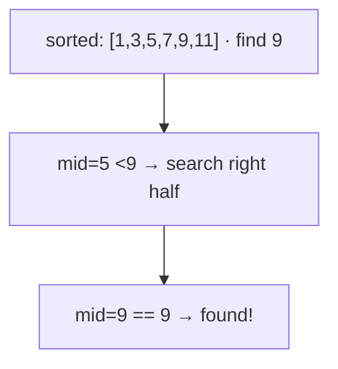
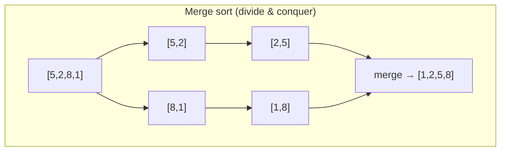
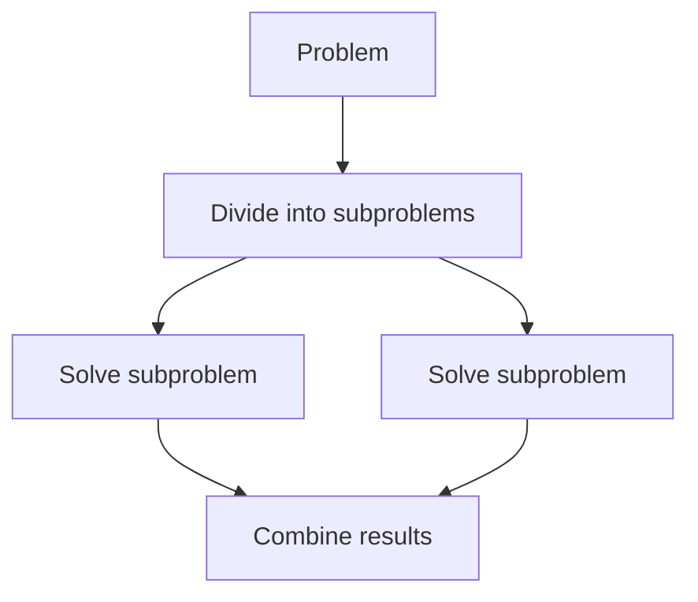
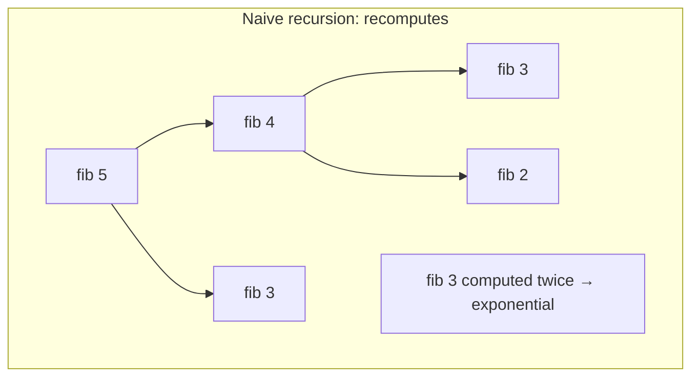
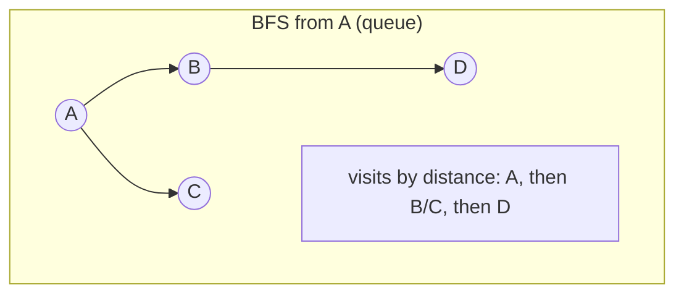
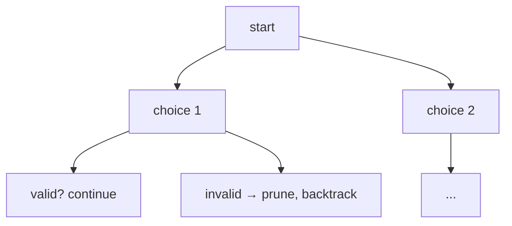
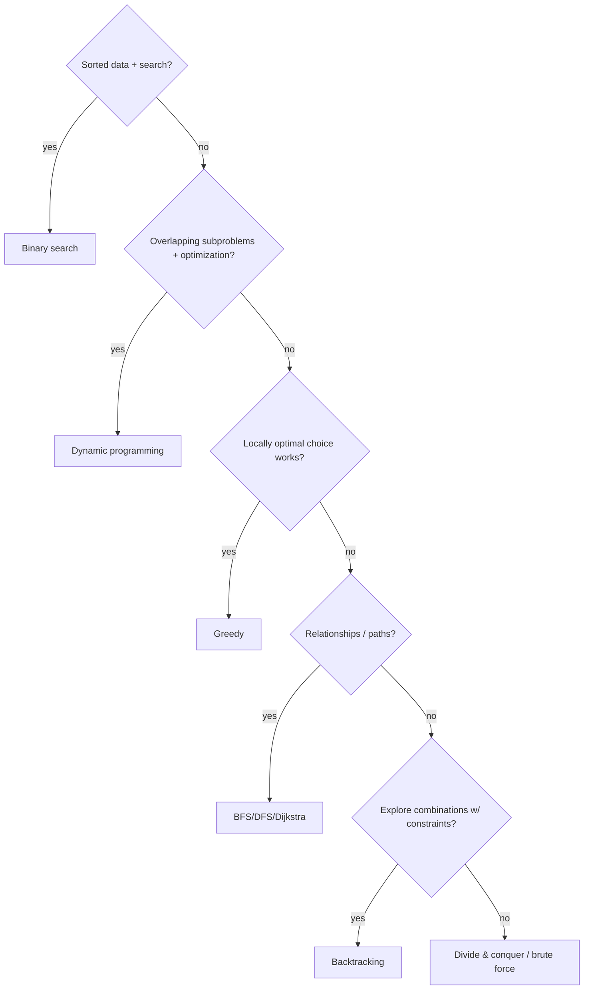

<!-- Module 02 · Lesson 4 — follows ../../../standards/. -->

# 02.4 · Algorithms

[⬅ 02.3 Data Structures](02.3-data-structures.md) · [🏠 Module](../README.md) · [🗺 Roadmap](../../../ROADMAP.md) · [Next ➡](02.5-complexity.md)

> Algorithms are the *strategies* for solving problems efficiently. This lesson covers the major families — searching, sorting, divide-and-conquer, dynamic programming, greedy, graph traversal, and backtracking — and where each shows up in AI systems.

| | |
|---|---|
| **Module** | `02 · Computer Science Foundations` |
| **Lesson** | `02.4` |
| **Difficulty** | ⭐⭐⭐⭐ |
| **Estimated study time** | 80 min read · 50 min practice |
| **Status** | 🟢 stable |

---

## 1. Learning Objectives

By the end of this lesson you will be able to:

- [ ] Apply **linear vs binary search** and know when each is valid.
- [ ] Explain common **sorting** algorithms and their complexity/trade-offs.
- [ ] Recognize the **divide-and-conquer, dynamic programming, greedy,** and **backtracking** paradigms.
- [ ] Perform **graph traversal** (BFS/DFS) and know key graph algorithms.
- [ ] Match each algorithmic approach to a concrete **AI use case**.

## 2. Prerequisites

- [02.3 · Data Structures](02.3-data-structures.md) — algorithms operate on these.
- [02.5 · Complexity](02.5-complexity.md) is a companion; Big-O is used here informally and formalized next.

---

## 3. Why This Topic Exists

Two programs can solve the same problem, one in a second and one in a week — the difference is the algorithm. As data scales (and AI data always scales), the *approach* matters more than the machine. Knowing the standard paradigms lets you recognize a problem's shape and reach for the right strategy instead of brute force.

You rarely implement sorting from scratch in production (libraries do it), but the *paradigms* — divide-and-conquer, dynamic programming, greedy, graph traversal — recur throughout AI: beam search is greedy+heap, the Viterbi/edit-distance style algorithms are DP, dependency resolution and retrieval are graph traversals, autodiff is a graph algorithm. And algorithmic thinking is the backbone of technical interviews ([Module 20](../../20-Interview-Preparation/README.md)).

> [!IMPORTANT]
> The goal isn't to memorize implementations — it's to recognize which **paradigm** fits a problem. "This has overlapping subproblems" → dynamic programming. "I can make a locally optimal choice" → greedy. "I need the shortest path" → BFS/Dijkstra. Pattern recognition is the skill.

## 4. Problems It Solves

| Problem | Paradigm |
|---|---|
| Find an item in sorted data fast | Binary search |
| Order data | Sorting |
| Break a big problem into smaller identical ones | Divide & conquer |
| Optimize with overlapping subproblems | Dynamic programming |
| Build a solution via locally optimal choices | Greedy |
| Explore relationships / shortest path | Graph traversal |
| Search a space of combinations with constraints | Backtracking |

---

## 5. Searching

### Linear search — O(n)

Scan until found. Works on *any* data. Unavoidable when data is unsorted.

### Binary search — O(log n)

On **sorted** data, repeatedly halve the search space: compare the middle, discard half.



```python
def binary_search(a: list[int], target: int) -> int:
    lo, hi = 0, len(a) - 1
    while lo <= hi:
        mid = (lo + hi) // 2
        if a[mid] == target:
            return mid
        if a[mid] < target:
            lo = mid + 1        # discard left half
        else:
            hi = mid - 1        # discard right half
    return -1
```

| | Linear | Binary |
|---|:--:|:--:|
| Requires sorted? | No | **Yes** |
| Complexity | O(n) | O(log n) |

> [!IMPORTANT]
> Binary search's power is halving the space each step — 1 million items in ~20 comparisons. But it **requires sorted data**, and sorting costs O(n log n). Rule of thumb: sort once, search many times → worth it; search once → linear scan is fine. Python's `bisect` module gives you binary search on sorted lists. The *idea* (halving via ordering) underlies balanced trees and DB indexes ([02.3](02.3-data-structures.md)).

---

## 6. Sorting

Sorting is a workhorse and a classic study of algorithmic trade-offs.

| Algorithm | Average | Worst | Space | Stable? | Idea |
|---|:--:|:--:|:--:|:--:|---|
| **Bubble/Insertion** | O(n²) | O(n²) | O(1) | ✅ | Simple, fine for tiny/nearly-sorted |
| **Merge sort** | O(n log n) | O(n log n) | O(n) | ✅ | Divide & conquer; predictable |
| **Quicksort** | O(n log n) | O(n²)* | O(log n) | ❌ | Partition around a pivot; fast in practice |
| **Heapsort** | O(n log n) | O(n log n) | O(1) | ❌ | Uses a heap ([02.3](02.3-data-structures.md)) |
| **Timsort** (Python's) | O(n log n) | O(n log n) | O(n) | ✅ | Hybrid merge+insertion; exploits runs |

<sub>*worst case avoided in practice with randomized/median pivots</sub>



> [!IMPORTANT]
> **You almost never write a sort in production — use the library.** Python's `sorted()`/`.sort()` use **Timsort** (stable, O(n log n), fast on real-world partially-ordered data). What matters is knowing: the O(n log n) lower bound for comparison sorts, what **stable** means (equal elements keep their relative order — important when sorting by multiple keys), and how to sort by a **key function** (recall [Module 01.4](../../01-Advanced-Python/weeks/01.4-functional-python.md)). **AI use:** ranking retrieved documents, sorting by score, ordering data — pervasive.

---

## 7. Divide and Conquer

**Divide and conquer:** break a problem into smaller subproblems of the *same type*, solve them (often recursively), and combine. Merge sort and binary search are examples.



| Property | Detail |
|---|---|
| Structure | Divide → conquer (recurse) → combine |
| Complexity | Often O(n log n) via the recursion tree |
| Examples | Merge sort, quicksort, binary search, FFT |

> [!IMPORTANT]
> **AI use:** divide-and-conquer thinking underlies **parallelism** — split a batch/dataset across workers/GPUs, process independently, combine (map-reduce style). Distributed training partitions work exactly this way ([Module 17](../../17-Cloud/README.md)). The FFT (a divide-and-conquer algorithm) appears in signal/audio processing.

---

## 8. Dynamic Programming (DP)

**DP** solves problems with **overlapping subproblems** and **optimal substructure** by solving each subproblem once and *storing* the result (memoization) instead of recomputing.



```python
import functools

@functools.cache            # memoize → each subproblem solved ONCE (Module 01.6)
def fib(n: int) -> int:
    if n < 2:
        return n
    return fib(n - 1) + fib(n - 2)
# without cache: O(2^n) ; with cache: O(n)
```

| Concept | Meaning |
|---|---|
| **Overlapping subproblems** | The same subproblem recurs many times |
| **Optimal substructure** | Optimal solution built from optimal sub-solutions |
| **Memoization (top-down)** | Recurse + cache results |
| **Tabulation (bottom-up)** | Fill a table iteratively |

> [!IMPORTANT]
> **AI use:** DP is the engine behind many sequence algorithms — **edit distance / sequence alignment** (used in evaluation and tokenization), the **Viterbi algorithm** (most-likely sequence in HMMs/decoding), and dynamic-programming-based **beam search** variants. The memoization pattern is exactly `functools.cache` from [Module 01.6](../../01-Advanced-Python/weeks/01.6-decorators.md) — DP is "recursion + caching overlapping work."

---

## 9. Greedy Algorithms

A **greedy** algorithm builds a solution by always making the **locally optimal** choice, hoping it leads to a global optimum. It's simple and fast — but only *correct* for problems with the right structure.

| Greedy | DP |
|---|---|
| One locally-best choice, never reconsiders | Considers all sub-solutions |
| Fast, simple | More work, but finds true optimum |
| Correct only for specific problems | General for optimal-substructure problems |


> [!IMPORTANT]
> **AI use:** **greedy decoding** in LLMs — at each step pick the single highest-probability token — is the canonical example ([Module 11](../../11-LLMs/README.md)). It's fast but can be myopic (locally best ≠ globally best sentence), which is exactly why **beam search** (keep the top-k partial sequences using a heap) exists as a less-greedy alternative. Huffman coding (compression) and many scheduling heuristics are greedy too.

> [!WARNING]
> Greedy is a **trap when misapplied** — it's only correct for problems with the "greedy choice property." For many optimization problems it gives a plausible but suboptimal answer. Greedy decoding producing a worse overall sentence than beam search is a real, everyday instance of this.

---

## 10. Graph Algorithms

Operating on graphs ([02.3](02.3-data-structures.md)). The two fundamental traversals:

| Traversal | Data structure | Explores | Finds |
|---|---|---|---|
| **BFS** (breadth-first) | **Queue** (FIFO) | Level by level | Shortest path (unweighted) |
| **DFS** (depth-first) | **Stack** (or recursion) | As deep as possible first | Reachability, cycles, topological order |



```python
from collections import deque

def bfs(graph: dict, start):
    visited, queue = {start}, deque([start])
    while queue:
        node = queue.popleft()            # FIFO → breadth-first
        for nbr in graph[node]:
            if nbr not in visited:
                visited.add(nbr)
                queue.append(nbr)
    return visited
```

Key named algorithms (know what they do):

| Algorithm | Purpose |
|---|---|
| **Dijkstra** | Shortest path, weighted (non-negative) |
| **A*** | Shortest path with a heuristic (guided) |
| **Topological sort** | Order a DAG respecting dependencies |
| **Union-Find** | Connectivity / clustering |
| **PageRank** | Node importance via link structure |

> [!IMPORTANT]
> **AI use:** graph traversal is everywhere — **computation graphs** are traversed in topological order for forward/backward passes (autodiff, [Module 09](../../09-Deep-Learning/README.md)); **agent/workflow orchestration** executes a directed graph of steps ([Module 14](../../14-AI-Agents/README.md)); **HNSW** vector search greedily traverses a graph to find nearest neighbors ([Module 13](../../13-RAG/README.md)); dependency resolution uses topological sort. BFS/DFS are the primitives underneath.

> [!WARNING]
> Use **iterative BFS/DFS with an explicit stack/queue** for large or untrusted graphs — recursive DFS can hit `RecursionError` on deep graphs ([02.2](02.2-memory.md)), and always track `visited` to avoid infinite loops on cycles.

---

## 11. Backtracking

**Backtracking** systematically explores a space of candidates, abandoning ("backtracking" from) a partial solution as soon as it can't lead to a valid one. It's DFS over a solution tree with pruning.



| Property | Detail |
|---|---|
| Structure | Try a choice → recurse → undo if it fails |
| Pruning | Abandon dead branches early (key to efficiency) |
| Examples | N-queens, Sudoku, permutations, constraint satisfaction |

> [!IMPORTANT]
> **AI use:** backtracking is the classic approach to **constraint satisfaction** and combinatorial search. In modern AI its spirit appears in **search-based reasoning** — e.g., exploring and pruning branches of possible solutions/tool-call sequences in agentic systems, or tree-of-thought-style reasoning. The core idea (explore, evaluate, prune, backtrack) is a reusable problem-solving pattern.

---

## 12. Paradigm Selection Guide



---

## 13. Common Mistakes & Debugging

| Mistake | Consequence | Fix |
|---|---|---|
| Binary search on unsorted data | Wrong results | Sort first (or use linear) |
| Off-by-one in binary search bounds | Infinite loop / miss | Careful `lo`/`hi`/`mid` handling; use `bisect` |
| Recomputing overlapping subproblems | Exponential blowup | Memoize (DP) |
| Greedy on a non-greedy problem | Suboptimal answer | Verify the greedy property; use DP |
| Recursive DFS on deep graphs | `RecursionError` | Iterative with explicit stack |
| Missing `visited` set in graph traversal | Infinite loop on cycles | Track visited nodes |
| Reimplementing sort | Bugs, slower | Use `sorted()` (Timsort) |

## 14. Performance Considerations

| Principle | Takeaway |
|---|---|
| Right paradigm > micro-tuning | O(n) vs O(2ⁿ) is the real win |
| Sort once, search many | Amortize the O(n log n) sort |
| Memoization | Turns exponential DP into polynomial |
| Iterative for depth | Avoid stack overflow on big inputs |
| Use library sorts | Timsort is battle-tested and fast |

## 15. Security Considerations

| Risk | Guidance |
|---|---|
| Algorithmic-complexity DoS | Attacker input forcing worst-case (e.g., quicksort O(n²), catastrophic regex backtracking) — use robust libs, bound input |
| Deep recursion from untrusted input | Stack overflow — iterative + depth limits |
| Unbounded search spaces | Backtracking/graph search on hostile input can hang — cap depth/time |
| ReDoS (regex backtracking) | Untrusted patterns/inputs can hang — validate, timeout |

> [!CAUTION]
> **Algorithmic-complexity attacks** are real: a crafted input can push an algorithm into its worst case (quadratic quicksort, exponential regex backtracking = "ReDoS", pathological hash collisions from [02.3](02.3-data-structures.md)) to exhaust CPU. Use hardened library implementations, bound input sizes/recursion depth, and set timeouts on untrusted-input processing.

---

## 16. Interview Questions

**Beginner**
1. When can you use binary search, and what's its complexity?
2. What does it mean for a sort to be "stable," and why does it matter?

**Intermediate**
1. Explain dynamic programming with an example. How does it relate to memoization?
2. BFS vs DFS — data structures used and what each is good for.

**Advanced**
1. When is greedy correct vs when does it fail? Relate greedy decoding vs beam search.
2. How would you avoid stack overflow and infinite loops when traversing a large, possibly-cyclic graph?

**System-design prompt**
- Design the ranking + retrieval logic for a search system over millions of documents. — *Follow-ups:* Where do sorting, heaps (top-k), and graph traversal (approximate NN) fit? How do you keep it fast at scale and safe against adversarial inputs?

---

## 17. Summary

| Key idea | Takeaway |
|---|---|
| Recognize the paradigm | Match problem shape to strategy |
| Binary search | O(log n) on sorted data |
| Sorting | Use library Timsort; know stability & the n log n bound |
| Divide & conquer | Split, solve, combine — basis of parallelism |
| DP | Overlapping subproblems → memoize (Viterbi, edit distance) |
| Greedy | Fast, locally optimal — greedy decoding vs beam search |
| Graph traversal | BFS (queue, shortest) / DFS (stack, reachability) |
| Backtracking | Explore + prune constrained search |

## 18. Cheat Sheet

```text
SEARCH: linear O(n) any data · binary O(log n) SORTED only (bisect)
SORT: use sorted()/Timsort (stable, n log n) · know: n log n lower bound, stability, key=
DIVIDE&CONQUER: split→solve→combine (merge sort, binary search) → basis of parallelism
DP: overlapping subproblems + optimal substructure → memoize (functools.cache) ; Viterbi, edit distance
GREEDY: locally optimal, fast, ONLY correct for greedy-property problems ; greedy decoding vs beam(heap top-k)
GRAPH: BFS=queue=shortest(unweighted) · DFS=stack/recursion=reachability/cycles/topo
  named: Dijkstra/A*(shortest) · topo sort(DAG deps) · union-find · PageRank
  iterative + visited set for big/cyclic graphs
BACKTRACKING: try→recurse→undo, prune early (N-queens, CSP, search reasoning)
CHOOSE: sorted+search→binary · overlap+optimize→DP · local-choice→greedy · paths→graph · combos+constraints→backtrack
SECURITY: complexity-DoS (quicksort O(n²), ReDoS, hash collisions) → hardened libs + bounds + timeouts
```

## 19. Flashcards

- **Q:** What does binary search require, and its complexity? — **A:** Sorted data; O(log n) by halving the search space each step.
- **Q:** What is dynamic programming? — **A:** Solving problems with overlapping subproblems by solving each once and caching (memoization/tabulation); e.g., turns O(2ⁿ) fib into O(n).
- **Q:** Greedy vs DP? — **A:** Greedy makes one locally optimal choice (fast, only correct for greedy-property problems); DP explores sub-solutions for the true optimum.
- **Q:** BFS vs DFS — structures and uses? — **A:** BFS uses a queue and finds shortest paths (unweighted); DFS uses a stack/recursion for reachability, cycles, and topological order.
- **Q:** Greedy decoding vs beam search — what's the relationship? — **A:** Greedy picks the top token each step (myopic); beam search keeps top-k partial sequences (heap) to reduce greediness — a greedy-vs-less-greedy trade-off.
- **Q:** What is backtracking? — **A:** DFS over candidate solutions that abandons (prunes) partial solutions that can't succeed — used for constraint satisfaction and combinatorial search.

## 20. Hands-on Exercises

> Full set in [`../exercises/`](../exercises/).

- [ ] **(⭐ Coding)** Implement binary search (and find/fix an off-by-one bug in a given version).
- [ ] **(⭐⭐ Coding)** Implement merge sort; verify it's stable and O(n log n).
- [ ] **(⭐⭐ Coding)** Solve a DP problem (edit distance or coin change) with memoization; compare to naive recursion timing.
- [ ] **(⭐⭐ Coding)** Implement BFS and DFS (iterative) on an adjacency list; find a shortest path with BFS.
- [ ] **(⭐⭐⭐ Coding)** Solve N-queens (or generate permutations) with backtracking + pruning.

## 21. Mini Project

> **Graph traversal visualizer (this module's showcase, v2).** Build a tool that takes a graph and animates/logs BFS and DFS step by step (visit order, frontier queue/stack contents), plus a shortest-path (BFS/Dijkstra) mode. Include an architecture diagram and folder structure. Great for building intuition and directly relevant to computation-graph and agent-workflow reasoning.

## 22. References

- CLRS, *Introduction to Algorithms* — the definitive reference ([reference standards](../../../standards/reference-standards.md)).
- Python docs — *`bisect`*, *`heapq`*, *`functools.cache`*.
- *VisuAlgo* / *Big-O Cheat Sheet* — visual and quick-reference resources.

## 23. What's Next

You've been using Big-O informally throughout. Next we make it precise: **time and space complexity** — Big-O, Big-Omega, Big-Theta — analyzed on real Python, and why it governs whether AI systems scale.

➡️ **Next:** [02.5 · Time & Space Complexity](02.5-complexity.md)

---

### 🔁 Revision checklist
- [ ] I can pick the right paradigm from a problem's shape
- [ ] I can implement binary search, a sort, a DP solution, and BFS/DFS
- [ ] I mapped each paradigm to an AI use (decoding, autodiff, retrieval)
- [ ] I know the security angle (complexity-DoS)

### 🔗 Spaced-repetition callback
> Recall [02.3's heap](02.3-data-structures.md): beam search here *is* a heap-backed top-k over greedy decoding. And DP's memoization is [Module 01.6's `functools.cache`](../../01-Advanced-Python/weeks/01.6-decorators.md). Algorithms are data structures in motion — every paradigm here leans on a structure from the last lesson.
