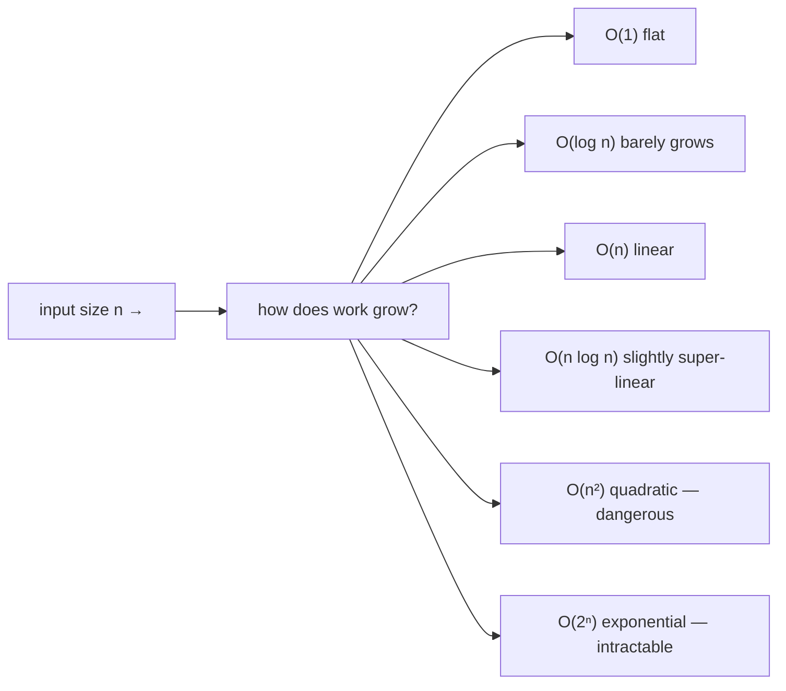
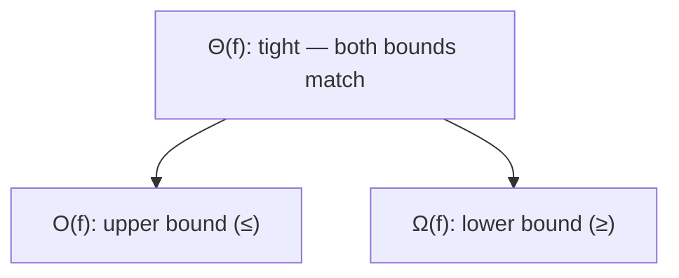

<!-- Module 02 · Lesson 5 — follows ../../../standards/. -->

# 02.5 · Time & Space Complexity

[⬅ 02.4 Algorithms](02.4-algorithms.md) · [🏠 Module](../README.md) · [🗺 Roadmap](../../../ROADMAP.md) · [Next ➡](02.6-operating-systems.md)

> Complexity analysis is how you predict whether code will scale *before* you run it on real data. Big-O turns "it feels slow" into "this is O(n²) and will die at a million rows" — the single most useful analytical tool for AI systems that always grow.

| | |
|---|---|
| **Module** | `02 · Computer Science Foundations` |
| **Lesson** | `02.5` |
| **Difficulty** | ⭐⭐⭐ |
| **Estimated study time** | 60 min read · 30 min practice |
| **Status** | 🟢 stable |

---

## 1. Learning Objectives

By the end of this lesson you will be able to:

- [ ] Define **Big-O, Big-Omega (Ω),** and **Big-Theta (Θ)** and their relationship.
- [ ] Analyze the **time and space complexity** of real Python code.
- [ ] Recognize the common complexity classes and their growth.
- [ ] Reason about **best/average/worst** case and **amortized** cost.
- [ ] Explain why complexity **governs whether AI systems scale**.

## 2. Prerequisites

- [02.3 Data Structures](02.3-data-structures.md) & [02.4 Algorithms](02.4-algorithms.md) — the complexities you'll now formalize.

---

## 3. Why This Topic Exists

AI systems process data that grows relentlessly — more documents, more users, more tokens. Code that works on 1,000 rows can be unusable on 10 million. Complexity analysis lets you **predict scaling behavior from the code alone**, catch the O(n²) that will melt in production, and communicate performance precisely ("this is O(n log n)").

It's also the language of technical interviews and system-design discussions. "What's the complexity?" is the most common follow-up to any coding answer. And it turns [Module 01.11's](../../01-Advanced-Python/weeks/01.11-performance.md) instinct ("set beats list") into rigorous reasoning.

> [!IMPORTANT]
> Complexity analysis is about **how cost grows with input size**, not absolute speed. An O(n²) algorithm can be faster than O(n log n) on small inputs — but as data grows, the *growth rate* wins. In AI, data always grows, so growth rate is what matters. Optimize the exponent before the constant.

## 4. Problems It Solves

| Problem | Complexity analysis solves it by |
|---|---|
| "Will this scale to production data?" | Predicting growth from code |
| Choosing between two implementations | Comparing growth rates |
| Explaining performance precisely | A shared vocabulary (Big-O) |
| Spotting a hidden O(n²) | Analyzing nested loops / operations |
| Estimating memory needs | Space complexity |

---

## 5. Mental Model: Growth Rate, Not Stopwatch

Big-O describes the **shape of the curve** as input size *n* grows toward infinity, ignoring constant factors and lower-order terms (which the growth rate dominates at scale).



> **Illustration placeholder** — `assets/images/big-o-growth-curves.png`: a line chart of work vs n for O(1), O(log n), O(n), O(n log n), O(n²), O(2ⁿ), showing how quadratic and exponential explode while log/linear stay manageable — annotate a "danger zone" above O(n log n).

> [!IMPORTANT]
> We drop constants and lower-order terms because they don't affect the *growth shape*: `3n² + 5n + 100` is O(n²) — for large n the `n²` dominates. This is why Big-O compares *scalability*, not exact runtime. (For small, fixed n, constants can matter — see §11.)

---

## 6. Big-O, Big-Omega, Big-Theta

Three related bounds describe an algorithm's growth:

| Notation | Bounds | Plain meaning | Common use |
|---|---|---|---|
| **Big-O** `O(f)` | Upper bound | "Grows *no faster* than f" (worst case) | Most common in practice |
| **Big-Omega** `Ω(f)` | Lower bound | "Grows *at least* as fast as f" (best case) | Fundamental limits |
| **Big-Theta** `Θ(f)` | Tight bound | "Grows *exactly* like f" (both O and Ω) | Precise characterization |



> [!NOTE]
> In everyday engineering, people say "Big-O" but often mean "the worst-case growth." Strictly: Θ is the precise bound when best and worst match; Ω is the lower bound. Example: comparison sorting is **Ω(n log n)** (no comparison sort can beat it) and good sorts are **Θ(n log n)**. Know the distinction for interviews; use "Big-O worst case" day to day.

---

## 7. The Complexity Classes You'll Meet

| Class | Name | Example | Feel |
|---|---|---|---|
| **O(1)** | Constant | Hash lookup, array index | Ideal |
| **O(log n)** | Logarithmic | Binary search, balanced BST | Excellent |
| **O(n)** | Linear | Scan a list, single loop | Good |
| **O(n log n)** | Linearithmic | Good sorts, many D&C | Fine — practical limit for "sort-like" |
| **O(n²)** | Quadratic | Nested loops over the data | ⚠️ Dangerous at scale |
| **O(n³)** | Cubic | Triple nested loops (naive matmul) | ⚠️ Worse |
| **O(2ⁿ)** | Exponential | Naive recursion over subsets | 🚫 Intractable |
| **O(n!)** | Factorial | Brute-force permutations | 🚫 Hopeless |

To feel the difference, for n = 1,000,000:

| Class | ~Operations |
|---|---|
| O(log n) | ~20 |
| O(n) | 1,000,000 |
| O(n log n) | ~20,000,000 |
| O(n²) | 1,000,000,000,000 (a trillion) |

> [!WARNING]
> The jump from O(n log n) to O(n²) is the cliff most systems fall off. At a million items, that's ~20 million vs a *trillion* operations — the difference between "instant" and "never finishes." Most production performance fires are an accidental O(n²) (often a hidden `in list` inside a loop, [02.3](02.3-data-structures.md)/[Module 01.11](../../01-Advanced-Python/weeks/01.11-performance.md)).

---

## 8. Analyzing Real Python

Read the code, count how work scales with input size.

```python
# O(1) — constant: no loop over input
def first(items): return items[0]

# O(n) — linear: one pass
def total(items):
    s = 0
    for x in items:        # n iterations
        s += x
    return s

# O(n²) — quadratic: nested loop over the same data
def has_duplicate_slow(items):
    for i in range(len(items)):          # n
        for j in range(i + 1, len(items)):  # ~n
            if items[i] == items[j]:
                return True
    return False

# O(n) — same problem, better: hash set membership is O(1)
def has_duplicate_fast(items):
    seen = set()
    for x in items:        # n iterations, O(1) each
        if x in seen:      # O(1) avg (dict/set)
            return True
        seen.add(x)
    return False
```

Rules of thumb for analysis:

| Pattern | Contributes |
|---|---|
| A single loop over n | O(n) |
| Two nested loops over n | O(n²) |
| Halving the input each step | O(log n) |
| Loop that does an O(n) op inside (`in list`, slicing) | O(n²) ⚠️ |
| Sequential (not nested) loops | Add, then keep the dominant term |
| Recursion | Solve the recurrence (draw the tree) |

> [!IMPORTANT]
> Watch for **hidden costs** inside loops. `x in a_list` is O(n); `a_list.insert(0, x)` is O(n); slicing `a[1:]` copies O(n). Put any of these inside a loop over n and you've silently created O(n²). This is the #1 accidental-quadratic source — and the fix is usually a `set`/`dict`/`deque` ([02.3](02.3-data-structures.md)).

---

## 9. Space Complexity

The same analysis applies to **memory**: how does extra space grow with input size? (Excludes the input itself; counts auxiliary allocation.)

```python
# O(1) space — a few variables regardless of n
def total(items):
    s = 0
    for x in items: s += x
    return s

# O(n) space — builds a structure proportional to input
def doubled(items):
    return [x * 2 for x in items]     # new list of n items

# O(n) space (call stack) — recursion depth n
def factorial(n):
    return 1 if n == 0 else n * factorial(n - 1)   # n stack frames ([02.2])
```

> [!IMPORTANT]
> **Time–space trade-offs** are central to AI. Memoization/DP ([02.4](02.4-algorithms.md)) spends O(n) *space* to cut *time* from exponential to linear. **Gradient checkpointing** ([02.2](02.2-memory.md)) does the reverse — spends compute to save memory. There's rarely a free lunch; you trade one resource for another based on your binding constraint.

---

## 10. Best, Average, Worst, and Amortized

| Case | Meaning | Example |
|---|---|---|
| **Best** Ω | Luckiest input | Quicksort on already-partitioned data |
| **Average** | Typical input | Hash lookup O(1) |
| **Worst** O | Adversarial input | Hash lookup O(n) (all collisions); quicksort O(n²) |
| **Amortized** | Average over a sequence of ops | Dynamic array append O(1) amortized (occasional O(n) resize) |

> [!NOTE]
> **Amortized** analysis matters for structures like dynamic arrays ([02.3](02.3-data-structures.md)): most appends are O(1), but occasionally the array doubles and copies (O(n)). Averaged over many appends, it's O(1) *amortized*. Don't confuse amortized (guaranteed average over a sequence) with average-case (probabilistic over inputs). For latency-sensitive serving, also watch the **worst case**, since that spike hits some request's p99.

---

## 11. When Big-O Lies (Constants and Reality)

Big-O ignores constants — but constants and hardware are real.

| Reality check | Detail |
|---|---|
| Small n | An O(n²) with tiny constant can beat O(n log n) — Timsort uses insertion sort for small runs |
| Cache effects | A cache-friendly O(n) can crush a cache-hostile O(n) ([02.2](02.2-memory.md)) — Big-O doesn't see this |
| Constant factors | O(n) with a huge constant may lose to O(n log n) at practical sizes |
| The "n" you have | If n is always ≤ 100, O(n²) is fine |

> [!TIP]
> Use Big-O to choose the **algorithmic approach** (avoid the O(n²) cliff), then **measure** ([Module 01.11](../../01-Advanced-Python/weeks/01.11-performance.md)) to tune constants and cache behavior. Big-O and profiling are complementary: theory picks the shape, measurement optimizes the constant. Never trust one alone.

---

## 12. Why Complexity Governs AI Scale

| AI scenario | Complexity insight |
|---|---|
| Deduplicating millions of documents | O(n²) pairwise = impossible; O(n) hashing = feasible |
| Self-attention over a sequence | **O(n²)** in sequence length → why long context is expensive ([Module 10/11](../../10-NLP/README.md)) |
| Nearest-neighbor over N vectors | Exact O(N·d) per query → approximate methods (HNSW) for scale ([Module 13](../../13-RAG/README.md)) |
| Training on a growing dataset | Per-epoch cost scales with data size |
| Naive matrix multiply | O(n³) → why efficient kernels/hardware matter |

> [!IMPORTANT]
> A landmark example: the Transformer's **self-attention is O(n²)** in sequence length. That single complexity fact drives an entire research area (efficient/long-context attention) and shapes cost and latency of every LLM. Recognizing complexity in model architectures — not just your own loops — is a mark of a strong AI Engineer. You'll analyze this directly in [Module 10](../../10-NLP/README.md).

---

## 13. Common Mistakes & Debugging

| Mistake | Consequence | Fix |
|---|---|---|
| Hidden O(n) op inside a loop | Accidental O(n²) | Use O(1) structures (set/dict/deque) |
| Confusing average and worst case | Surprise latency spikes | Analyze worst case for serving |
| Ignoring space complexity | OOM | Analyze memory growth too |
| Over-optimizing constants first | Wasted effort | Fix the exponent, then measure |
| Assuming Big-O = speed | Misjudge small-n / cache cases | Measure to confirm |
| Forgetting recursion's stack space | Stack overflow | Count call depth ([02.2](02.2-memory.md)) |

## 14. Performance Considerations

Complexity *is* the performance lesson — see [Module 01.11](../../01-Advanced-Python/weeks/01.11-performance.md) for the profiling counterpart. Key: **choose the complexity class with Big-O; optimize the constant with measurement.**

## 15. Security Considerations

| Risk | Guidance |
|---|---|
| Complexity-based DoS | Inputs forcing worst-case O(n²)/O(2ⁿ) exhaust CPU — bound input sizes, use hardened libs ([02.4](02.4-algorithms.md)) |
| Space-based DoS | Inputs forcing O(n) or worse memory — cap allocation |
| Unbounded recursion depth | Stack overflow from untrusted input — limit depth |

> [!CAUTION]
> Worst-case complexity is a **security property** when inputs are untrusted. If your average O(1) hash or O(n log n) sort has an O(n²)/O(n) worst case reachable by crafted input, that's a DoS vector. Bound input sizes and prefer implementations with good worst-case guarantees where it matters.

---

## 16. Interview Questions

**Beginner**
1. What does O(n²) mean, and why is it dangerous at scale?
2. What's the difference between Big-O, Big-Omega, and Big-Theta?

**Intermediate**
1. Analyze the time and space complexity of a given nested-loop function; then improve it.
2. Explain amortized complexity using dynamic array append.

**Advanced**
1. Give an example where an O(n²) algorithm outperforms O(n log n), and explain why (constants/cache).
2. Why is Transformer self-attention O(n²), and what does that imply for long-context LLMs?

**System-design prompt**
- You must deduplicate and rank 50M documents. Analyze the complexity of a naive approach and design a scalable one. — *Follow-ups:* Where's the O(n²) trap? How do hashing/heaps/approximate methods change the complexity? What about worst-case/adversarial inputs?

---

## 17. Summary

| Key idea | Takeaway |
|---|---|
| Growth, not stopwatch | Big-O = how cost scales with n |
| O / Ω / Θ | Upper / lower / tight bounds |
| The cliff | O(n log n) → O(n²) is where systems die |
| Analyze real code | Watch hidden O(n) ops inside loops |
| Space matters too | Time–space trade-offs (DP, checkpointing) |
| AI scale | Attention is O(n²); dedup/NN need better-than-naive |

## 18. Cheat Sheet

```text
BIG-O = growth of cost vs input n (drop constants & lower terms): 3n²+5n+100 → O(n²)
O (upper/worst) · Ω (lower/best) · Θ (tight, both match)
CLASSES (best→worst): O(1) < O(log n) < O(n) < O(n log n) < O(n²) < O(n³) < O(2ⁿ) < O(n!)
n=1e6: log~20 · n=1e6 · n log n~2e7 · n²=1e12 (the cliff!)
ANALYZE: 1 loop=O(n) · nested=O(n²) · halving=O(log n) · HIDDEN O(n) in loop (in list, insert(0), slice)=O(n²)!
SPACE: aux memory growth · recursion depth = O(depth) stack
CASES: best Ω · average · worst O · amortized (dynamic array append = O(1) amortized)
BIG-O LIES: small n / cache / constants → use Big-O to pick approach, MEASURE to tune
AI: self-attention O(n²) in seq len · dedup naive O(n²)→hash O(n) · exact NN O(N)→approx (HNSW)
SECURITY: worst-case = DoS vector on untrusted input → bound sizes/depth
```

## 19. Flashcards

- **Q:** What does Big-O describe? — **A:** How an algorithm's cost grows with input size n (worst-case upper bound), ignoring constants and lower-order terms.
- **Q:** O vs Ω vs Θ? — **A:** O = upper bound (≤, worst case), Ω = lower bound (≥, best case), Θ = tight bound (both match).
- **Q:** Why is the O(n log n)→O(n²) jump the danger zone? — **A:** At n=1M it's ~20M vs ~1 trillion operations — the difference between instant and never-finishing.
- **Q:** What silently creates O(n²) in Python? — **A:** A hidden O(n) operation inside a loop over n (e.g., `x in list`, `insert(0)`, slicing).
- **Q:** What is amortized complexity, with an example? — **A:** Average cost over a sequence of operations; dynamic array append is O(1) amortized (occasional O(n) resize averaged out).
- **Q:** Why is self-attention's complexity significant? — **A:** It's O(n²) in sequence length, making long context expensive — driving efficient-attention research and LLM cost/latency.

## 20. Hands-on Exercises

> Full set in [`../exercises/`](../exercises/).

- [ ] **(⭐ Conceptual)** Give the time & space complexity of 6 short functions (provided); justify each.
- [ ] **(⭐⭐ Debug)** Find the hidden O(n²) in a given function and fix it to O(n); measure the improvement at n=100k.
- [ ] **(⭐⭐ Coding)** Empirically confirm complexity: time a function at n = 1k, 10k, 100k and show the growth ratio matches its Big-O.
- [ ] **(⭐⭐⭐ Analysis)** Analyze a recursive function's time and space complexity by drawing its recursion tree; verify with `functools.cache`.

## 21. Mini Project

> **Complexity analyzer & visualizer.** Build a tool that runs a set of functions across increasing input sizes, records timings and peak memory, and plots the curves against reference lines (O(n), O(n log n), O(n²)) to visually classify each function's empirical complexity. Deliverable: a report matching measured curves to Big-O — bridging theory ([this lesson]) and measurement ([Module 01.11](../../01-Advanced-Python/weeks/01.11-performance.md)).

## 22. References

- CLRS, *Introduction to Algorithms* — asymptotic analysis chapters ([reference standards](../../../standards/reference-standards.md)).
- *Big-O Cheat Sheet* (bigocheatsheet.com) — complexities of common structures/algorithms.
- Vaswani et al., *Attention Is All You Need* — for the O(n²) attention example ([Module 10](../../10-NLP/README.md)).

## 23. What's Next

You can reason about single-program efficiency. Next we go up to the **operating system** — processes, threads, scheduling, virtual memory, and filesystems — and how they underpin AI training and serving.

➡️ **Next:** [02.6 · Operating Systems](02.6-operating-systems.md)

---

### 🔁 Revision checklist
- [ ] I can define O, Ω, and Θ
- [ ] I can analyze real Python for time and space complexity
- [ ] I can spot and fix accidental O(n²)
- [ ] I can explain why attention's O(n²) matters for LLMs

### 🔗 Spaced-repetition callback
> Recall [02.3](02.3-data-structures.md) and [Module 01.11](../../01-Advanced-Python/weeks/01.11-performance.md): every complexity here comes from a data-structure/algorithm choice. "Set beats list" is O(1) vs O(n); "heap for top-k" is O(n log k) vs O(n log n). This lesson is the rigorous vocabulary for instincts you've been building since Module 01.
