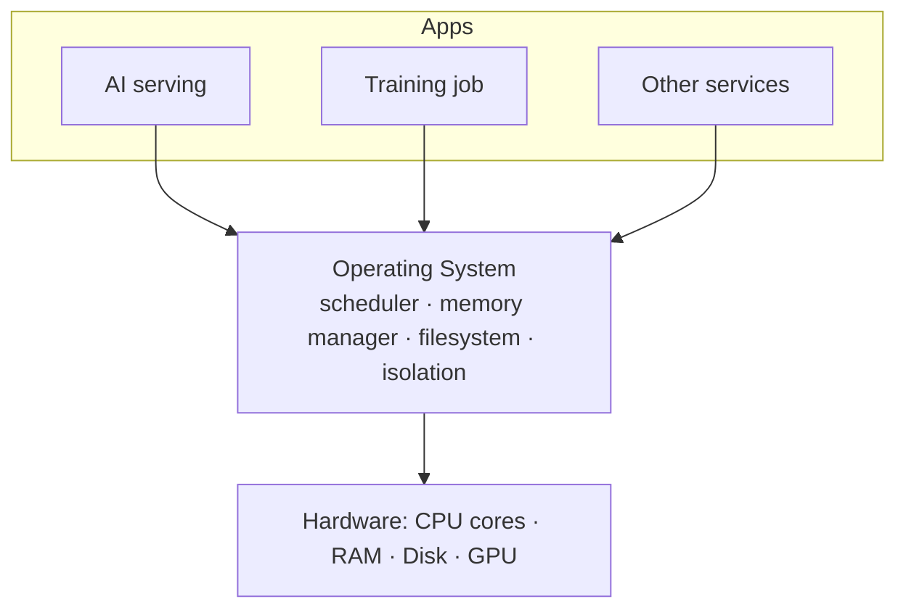
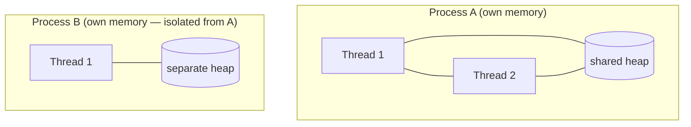
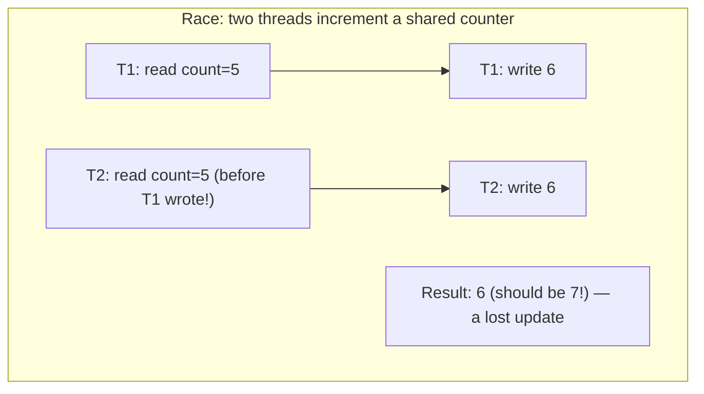
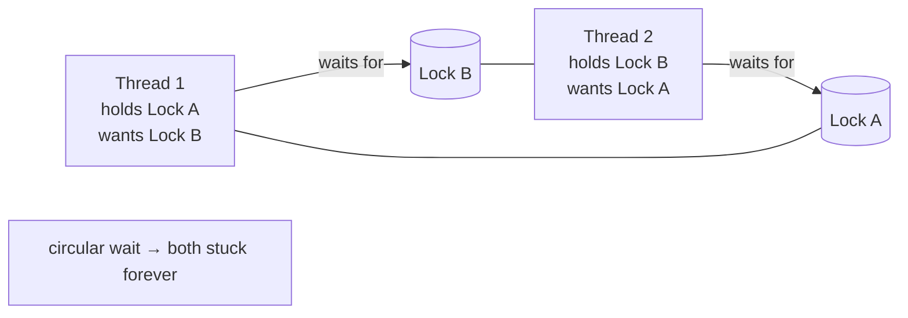
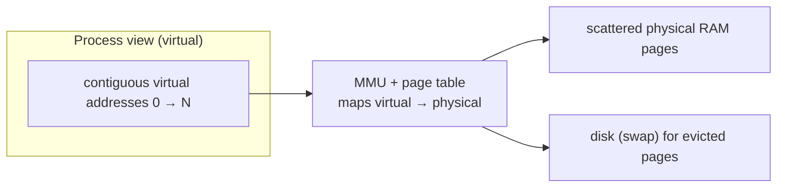

<!-- Module 02 · Lesson 6 — follows ../../../standards/. -->

# 02.6 · Operating Systems

[⬅ 02.5 Complexity](02.5-complexity.md) · [🏠 Module](../README.md) · [🗺 Roadmap](../../../ROADMAP.md) · [Next ➡](02.7-networking.md)

> The OS is the layer that turns hardware into something programs can share safely. Processes, threads, scheduling, virtual memory, and filesystems directly govern how AI models train, serve, and scale — and why the GIL and containers behave as they do.

| | |
|---|---|
| **Module** | `02 · Computer Science Foundations` |
| **Lesson** | `02.6` |
| **Difficulty** | ⭐⭐⭐ |
| **Estimated study time** | 70 min read |
| **Status** | 🟢 stable |

---

## 1. Learning Objectives

By the end of this lesson you will be able to:

- [ ] Distinguish **processes** from **threads** and know when to use each.
- [ ] Explain **scheduling** and **context switching** and their costs.
- [ ] Explain **synchronization**, **deadlocks**, and how to avoid them.
- [ ] Explain **virtual memory** and paging, and why they matter for large models.
- [ ] Describe how **filesystems** organize data on disk.
- [ ] Relate each concept to **AI model serving and training**.

## 2. Prerequisites

- [02.1 Hardware](02.1-how-computers-work.md) & [02.2 Memory](02.2-memory.md).
- [Module 01.11–01.12](../../01-Advanced-Python/weeks/01.11-performance.md) (GIL, threading/multiprocessing/async) — this explains the OS foundations beneath them.

---

## 3. Why This Topic Exists

Your AI code never runs alone on bare metal — it runs on an **operating system** that shares the CPU, memory, and disk among many programs, isolates them, and schedules their execution. Every practical question — "should I use threads or processes?", "why did my server get OOM-killed?", "why is my model loading slowly the first time?", "how do containers isolate my service?" — is answered at the OS layer.

The OS also explains phenomena you've already met: why the GIL exists ([Module 01.11](../../01-Advanced-Python/weeks/01.11-performance.md)), why multiprocessing is heavier than threading, and why virtual memory lets a model *appear* to fit when it partly lives on disk.

> [!IMPORTANT]
> As an AI Engineer you operate mostly *above* the OS, but you constantly *feel* it: process isolation (containers), the scheduler (latency), virtual memory (OOM kills), and the filesystem (dataset/checkpoint I/O). Knowing the model turns mysterious production behavior into predictable, debuggable events.

## 4. Problems It Solves

| Question | OS concept that answers it |
|---|---|
| Threads or processes for this workload? | Process/thread model + the GIL |
| Why was my container OOM-killed? | Virtual memory, cgroups limits |
| Why is concurrent code flaky? | Race conditions, synchronization |
| Why did the whole thing hang? | Deadlock |
| Why is first model load slow, then fast? | Page cache / paging |
| How do containers isolate services? | Processes, namespaces, cgroups |

---

## 5. Mental Model: The OS as a Resource Referee

Hardware has one set of CPUs, one pool of RAM, one disk. Many programs want them all at once. The OS is the **referee**: it gives each program the *illusion* of having the machine to itself (its own memory space, its fair share of CPU time) while safely multiplexing the real hardware underneath.



| OS responsibility | What it provides |
|---|---|
| **Process management** | Isolated running programs; scheduling |
| **Memory management** | Virtual memory; per-process address spaces |
| **Filesystem** | Named, organized, permissioned storage |
| **I/O & devices** | Talking to disk, network, GPU via drivers |
| **Isolation & security** | Users, permissions, resource limits |

---

## 6. Processes vs Threads

A **process** is a running program with its *own isolated memory space*. A **thread** is a unit of execution *within* a process; threads of one process **share** its memory.



| | Process | Thread |
|---|---|---|
| Memory | Isolated (own address space) | Shared within the process |
| Creation cost | Heavy | Light |
| Communication | IPC (pipes, sockets, shared mem) — must serialize | Shared variables (fast, but needs locks) |
| Crash isolation | One crash doesn't kill others | One thread crashing can take down the process |
| Parallelism (CPython) | ✅ True (separate GILs) | ❌ Limited by the GIL for CPU work |

> [!IMPORTANT]
> This table *is* the reason for [Module 01.11's](../../01-Advanced-Python/weeks/01.11-performance.md) concurrency guidance. **Multiprocessing** gives true CPU parallelism but pays for isolation: separate memory means data must be **serialized** (pickled) to cross process boundaries — expensive for big arrays. **Threading** shares memory (cheap communication) but the GIL blocks CPU parallelism. This trade-off — isolation+parallelism vs sharing+GIL — drives real architecture decisions in AI serving.

---

## 7. Scheduling and Context Switching

There are usually more threads/processes wanting to run than there are CPU cores. The **scheduler** decides who runs when, giving each a small **time slice**, creating the illusion of many things running at once on few cores.


A **context switch** saves the current thread's state (registers, program counter) and loads another's. It's the mechanism behind multitasking — but it isn't free.

| Concept | Detail |
|---|---|
| **Time slice / quantum** | How long a thread runs before the scheduler may preempt it |
| **Preemptive scheduling** | The OS can interrupt a thread (unlike cooperative async, [Module 01.12](../../01-Advanced-Python/weeks/01.12-async.md)) |
| **Context switch cost** | Saving/restoring state + cache disruption — microseconds, but adds up |
| **Priorities** | Higher-priority work scheduled preferentially |

> [!IMPORTANT]
> **Context switches have a hidden cost: cache disruption.** When the CPU switches threads, the new thread's data isn't in cache ([02.1](02.1-how-computers-work.md)), causing misses. This is why spawning *thousands* of OS threads is inefficient (lots of switching + cache thrash) and why **asyncio** — cooperative, single-thread concurrency ([Module 01.12](../../01-Advanced-Python/weeks/01.12-async.md)) — scales better for massive I/O concurrency: no OS-level context switches between tasks.

---

## 8. Synchronization and Race Conditions

When threads share memory, they can interfere. A **race condition** occurs when the outcome depends on the unpredictable timing of thread execution — the classic bug of concurrent programming.



The fix is **synchronization** — coordinating access so only one thread touches shared state at a time:

| Primitive | Purpose |
|---|---|
| **Lock / Mutex** | Only one thread holds it at a time (mutual exclusion) |
| **Semaphore** | Allow up to N concurrent holders ([Module 01.12](../../01-Advanced-Python/weeks/01.12-async.md)) |
| **Condition variable** | Wait for a condition, get notified |
| **Atomic operation** | Indivisible operation (no interruption mid-way) |

```python
import threading
lock = threading.Lock()
count = 0
def increment():
    global count
    with lock:          # only one thread in this block at a time (context manager!)
        count += 1      # now safe from races
```

> [!WARNING]
> Race conditions are **insidious**: the code works 999 times and fails the 1000th, non-deterministically, often only under production load. They're among the hardest bugs to reproduce and debug. The defense is disciplined synchronization around *all* shared mutable state — or avoiding shared mutable state entirely (message passing, immutable data, or process isolation). (Note: the GIL prevents *some* races on single bytecode ops but **not** on multi-step operations like `count += 1`.)

---

## 9. Deadlocks

A **deadlock** is when threads wait forever for each other's resources — nothing proceeds. It needs four conditions simultaneously (Coffman conditions); breaking any one prevents it.



| Coffman condition | Break it by… |
|---|---|
| Mutual exclusion | (Often unavoidable) |
| Hold and wait | Acquire all locks at once, or none |
| No preemption | Allow timeouts / lock stealing |
| **Circular wait** | **Always acquire locks in a fixed global order** |

> [!TIP]
> The most practical deadlock-prevention rule: **acquire multiple locks in a consistent global order** everywhere. If every thread grabs Lock A before Lock B, the circular wait can't form. Also use **lock timeouts** so a stuck acquire fails loudly instead of hanging forever. Symptom of a deadlock: the system hangs with no CPU usage and no progress.

---

## 10. Virtual Memory

The OS gives each process its own **virtual address space** — the illusion of a large, private, contiguous memory — and maps those virtual addresses to real physical RAM (or disk) behind the scenes.



| Concept | Meaning |
|---|---|
| **Page** | Fixed-size chunk of memory (e.g., 4 KB) |
| **Page table** | Maps virtual pages → physical frames (per process) |
| **Paging / swapping** | Moving pages between RAM and disk when RAM is full |
| **Page fault** | Accessing a page not currently in RAM → OS fetches it |
| **Page cache** | RAM caching of recently-read file data |

Benefits: **isolation** (a process can't see another's memory — the basis of security and container isolation), the illusion of more/contiguous memory than physically exists, and efficient sharing.

> [!IMPORTANT]
> Virtual memory explains several AI phenomena:
> - **First model load is slow, subsequent loads fast:** the OS **page cache** keeps the file's data in RAM after the first read.
> - **Swapping = catastrophic slowdown:** if a training/serving process exceeds RAM, the OS pages to disk ([02.1](02.1-how-computers-work.md): disk is ~10⁴× slower) — throughput collapses. In containers, exceeding the memory limit usually triggers an **OOM kill** instead.
> - **Memory-mapped files** (`mmap`) let you access a huge dataset/model file as if it were in memory, with the OS paging in only what you touch — used to load large models efficiently.

---

## 11. Filesystems

A **filesystem** organizes bytes on storage into named **files** within a hierarchy of **directories**, tracking metadata (size, permissions, timestamps) and where each file's data blocks physically live. (Deep dive in [Lesson 02.10](02.10-file-systems.md).)

| Concept | Meaning |
|---|---|
| **File** | A named sequence of bytes |
| **Directory** | A container mapping names → files/subdirectories |
| **Inode** (Unix) | Metadata + block pointers for a file |
| **Path** | Location in the hierarchy (`/data/train.csv`) |
| **Permissions** | Who can read/write/execute |
| **Block** | The unit of storage allocation |

> [!IMPORTANT]
> **AI relevance:** datasets, model checkpoints, and logs all live on the filesystem, and **I/O is often the bottleneck** — reading millions of small files is slow (per-file overhead), which is why datasets are packed into large sequential formats (e.g., sharded archives, Parquet, WebDataset) for fast, sequential, page-cache-friendly reads. Checkpoint writes must be durable (survive crashes). You'll go deeper in [02.10](02.10-file-systems.md).

---

## 12. How It All Maps to AI Systems

| AI scenario | OS concept |
|---|---|
| CPU-parallel data preprocessing | Multiprocessing (separate GILs) |
| High-concurrency model serving | Async (fewer context switches) + threads |
| Container gets OOM-killed | Virtual memory + cgroup memory limit |
| Slow first load, fast after | Page cache |
| Training exceeds RAM → crawls or dies | Swapping / OOM |
| Loading a huge model file efficiently | Memory-mapped files (`mmap`) |
| Flaky concurrent counter/metric | Race condition → needs a lock |
| Serving pipeline hangs | Deadlock (circular lock wait) |
| Slow dataset loading | Filesystem I/O; small-file overhead |
| Isolating microservices | Processes + namespaces/cgroups (containers) |

> [!NOTE]
> **Containers** (Docker, [Module 16](../../16-MLOps/README.md)) are an OS-level construct: a process (or group) with its own isolated view of the filesystem and resources (Linux **namespaces** for isolation, **cgroups** for CPU/memory limits). A container is *not* a VM — it's isolated processes sharing the host kernel. Understanding processes and virtual memory demystifies what a container actually is.

---

## 13. Common Mistakes & Debugging

| Symptom | Likely cause | Fix / tool |
|---|---|---|
| Threads not speeding up CPU work | GIL (single-process threads) | Multiprocessing / native libs |
| Non-deterministic wrong results | Race condition on shared state | Locks / avoid shared mutable state |
| System hangs, no CPU, no progress | Deadlock | Consistent lock order; timeouts |
| Container killed unexpectedly | Exceeded memory limit (OOM) | Lower batch/memory; raise limit; `dmesg`/exit code 137 |
| Sudden severe slowdown | Swapping (RAM exceeded) | Reduce memory; add RAM; avoid swap |
| Slow dataset reads | Many small files / random I/O | Pack into sequential formats |

> [!TIP]
> OS-level debugging tools every AI Engineer should know: `top`/`htop` (CPU/mem/processes), `free` (memory), `ps` (process list), `nvidia-smi` (GPU processes/memory), `dmesg` (kernel messages incl. OOM kills — **exit code 137 = OOM-killed**), `strace` (system calls), and `/proc` on Linux. You'll formalize debugging in [Lesson 02.12](02.12-debugging.md).

## 14. Performance Considerations

| Principle | Takeaway |
|---|---|
| Context switches cost cache | Fewer, coarser tasks > many tiny threads |
| Async for massive I/O | Avoids OS context-switch overhead |
| Avoid swapping | Disk-backed memory is catastrophic — stay within RAM |
| Page cache warms up | Repeated reads get fast; first read pays |
| IPC serialization cost | Minimize big data crossing process boundaries |

## 15. Security Considerations

| Risk | Guidance |
|---|---|
| Process isolation breaches | Rely on OS isolation; don't run untrusted code in-process |
| Resource-exhaustion DoS | Set cgroup CPU/memory/FD limits |
| Shared-memory data leaks | Sensitive data in shared segments — scope carefully |
| Privilege escalation | Run services as least-privilege users; drop root in containers |
| Race-condition vulnerabilities (TOCTOU) | Time-of-check-to-time-of-use bugs are exploitable — validate atomically |

> [!CAUTION]
> Run AI services with **least privilege** and enforce resource limits (cgroups/container limits). A model server that can consume unbounded CPU/memory, or runs as root, is both a reliability risk (one job starves others) and a security risk (a compromise gains more power). "Time-of-check-to-time-of-use" (TOCTOU) race conditions on files/permissions are a classic exploitable class.

---

## 16. Interview Questions

**Beginner**
1. What's the difference between a process and a thread?
2. What is a context switch, and why isn't it free?

**Intermediate**
1. Why does multiprocessing give CPU parallelism in Python but threading doesn't? What's the cost?
2. What is a race condition? How do you prevent it?

**Advanced**
1. Explain virtual memory and how it relates to a container being OOM-killed.
2. What are the conditions for deadlock, and which is easiest to break in practice?

**System-design prompt**
- Design the process/thread architecture for a model-serving service that must handle many concurrent requests and do some CPU-heavy post-processing. — *Follow-ups:* Where do you use async vs threads vs processes? How do you prevent OOM and set resource limits? How do you isolate it (containers)?

---

## 17. Summary

| Key idea | Takeaway |
|---|---|
| Process vs thread | Isolated memory vs shared; parallel (GILs) vs GIL-limited |
| Scheduling | Time slices + context switches (cache cost) |
| Race conditions | Timing-dependent bugs on shared state → locks |
| Deadlock | Circular lock wait → consistent lock order |
| Virtual memory | Per-process illusion; paging/page cache/OOM |
| Filesystem | Named, hierarchical storage; I/O often the bottleneck |

## 18. Cheat Sheet

```text
PROCESS: own isolated memory · heavy · IPC(serialize) · true parallelism (own GIL)
THREAD: shared memory · light · fast comms but needs LOCKS · GIL limits CPU work
  → CPU-bound → multiprocessing ; I/O-bound → threads/async
SCHEDULER: time slices + preemption ; context switch saves state + THRASHES CACHE
  → thousands of threads = bad ; async avoids OS switches for massive I/O
RACE CONDITION: timing-dependent bug on shared mutable state (count+=1 is NOT atomic)
  fix: Lock/mutex (with lock:) · semaphore(N) · avoid shared state
DEADLOCK: circular wait for locks → ALWAYS acquire locks in a fixed global order + timeouts
VIRTUAL MEMORY: per-process address space → page table → RAM/disk
  page cache (fast re-reads) · swapping (RAM exceeded = catastrophic) · OOM kill (exit 137)
  mmap = access huge file as memory, paged in on demand
FILESYSTEM: files/dirs/inodes/permissions ; small-file I/O slow → pack into sequential formats
CONTAINERS = isolated processes (namespaces) + limits (cgroups), NOT VMs
DEBUG: top/htop · free · ps · nvidia-smi · dmesg (OOM) · strace
```

## 19. Flashcards

- **Q:** Process vs thread? — **A:** A process has isolated memory (heavy, true parallelism via separate GILs); threads share the process's memory (light, but GIL-limited for CPU and need locks).
- **Q:** Why isn't a context switch free? — **A:** It saves/restores thread state and disrupts the CPU cache, causing misses — so thousands of threads thrash performance.
- **Q:** What is a race condition and its fix? — **A:** A bug where the result depends on thread timing on shared mutable state; fix with synchronization (locks) or by avoiding shared state.
- **Q:** How do you prevent deadlock in practice? — **A:** Acquire multiple locks in a consistent global order (breaks circular wait), and use lock timeouts.
- **Q:** What does virtual memory provide, and what's an OOM kill? — **A:** Each process gets a private virtual address space mapped to RAM/disk; exceeding a memory limit triggers the OS killing the process (Linux exit code 137).
- **Q:** Why is the first model load slow but later loads fast? — **A:** The OS page cache keeps the file's data in RAM after the first read.

## 20. Hands-on Exercises

> Full set in [`../exercises/`](../exercises/).

- [ ] **(⭐ Conceptual)** Explain, for three workloads, whether you'd use threads, processes, or async — and why.
- [ ] **(⭐⭐ Coding)** Reproduce a race condition with two threads incrementing a shared counter without a lock; then fix it with a lock and confirm.
- [ ] **(⭐⭐⭐ Coding)** Construct a deadlock with two locks acquired in opposite orders; fix it by ordering the locks.
- [ ] **(⭐⭐ Debug)** Simulate an OOM (grow memory in a loop under a low `ulimit`/container limit); observe the kill; explain exit code 137.

## 21. Mini Project

> **Thread-safe queue (this module's showcase, v3).** Implement a bounded, thread-safe queue from scratch using a lock and condition variables: producers block when full, consumers block when empty (the producer–consumer pattern). Include tests that stress it with multiple threads and prove no races or lost items, plus a diagram of the synchronization flow. This is the core of every data pipeline and task system.

## 22. References

- Silberschatz et al., *Operating System Concepts* — the standard text ([reference standards](../../../standards/reference-standards.md)).
- *Operating Systems: Three Easy Pieces* (free online) — excellent, readable.
- Python docs — *`threading`*, *`multiprocessing`*, *`mmap`*.

## 23. What's Next

Programs on one machine must also talk to each other and to users. Next: **networking** — TCP/IP, HTTP(S), REST, WebSockets, gRPC, and load balancers — how AI APIs actually communicate.

➡️ **Next:** [02.7 · Networking](02.7-networking.md)

---

### 🔁 Revision checklist
- [ ] I can distinguish processes and threads and their trade-offs
- [ ] I can explain and fix a race condition and a deadlock
- [ ] I can explain virtual memory, paging, and OOM kills
- [ ] I know the OS debugging tools (top, free, nvidia-smi, dmesg)

### 🔗 Spaced-repetition callback
> Recall [Module 01.11–01.12](../../01-Advanced-Python/weeks/01.11-performance.md): the GIL, and the threads-vs-processes-vs-async choice, are *OS realities*. This lesson is the foundation those Python lessons stood on — processes have separate GILs (true parallelism), threads share memory (races + GIL), async avoids OS context switches. Same decisions, deeper "why."
