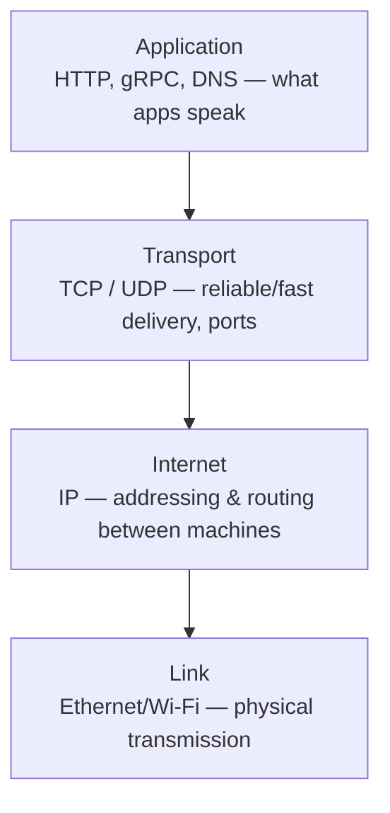
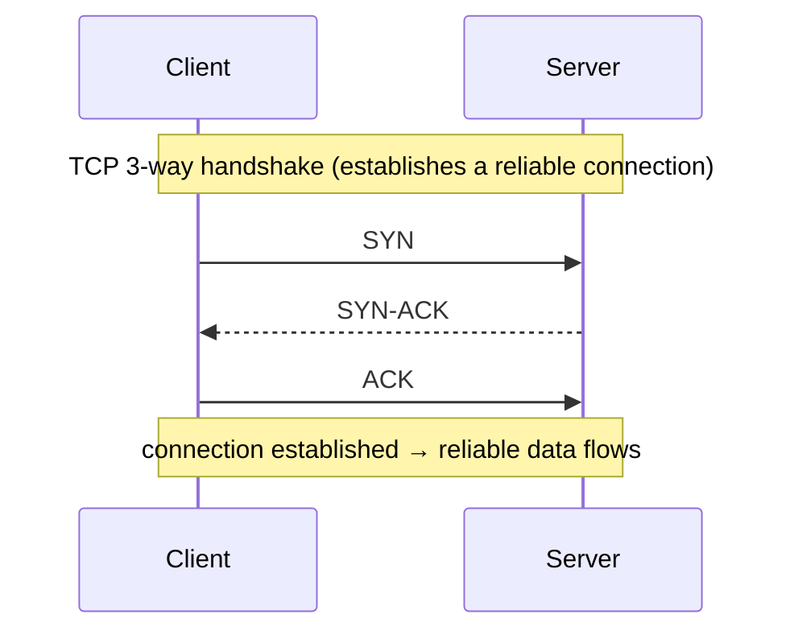
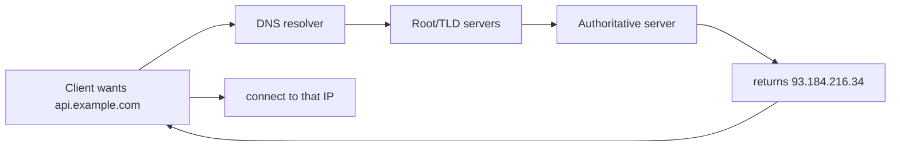
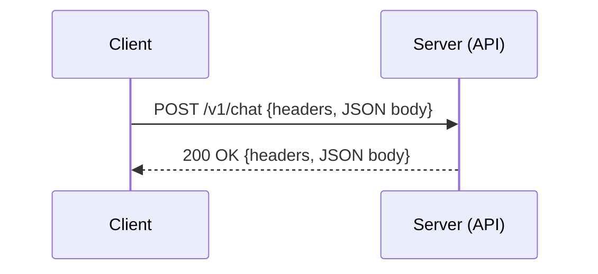
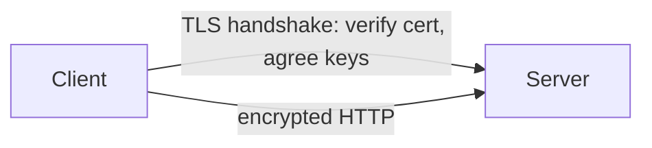
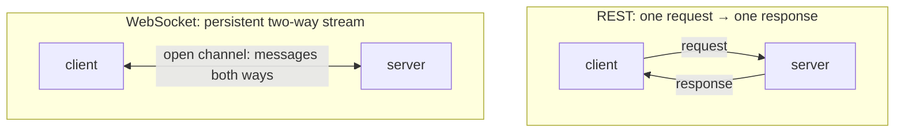
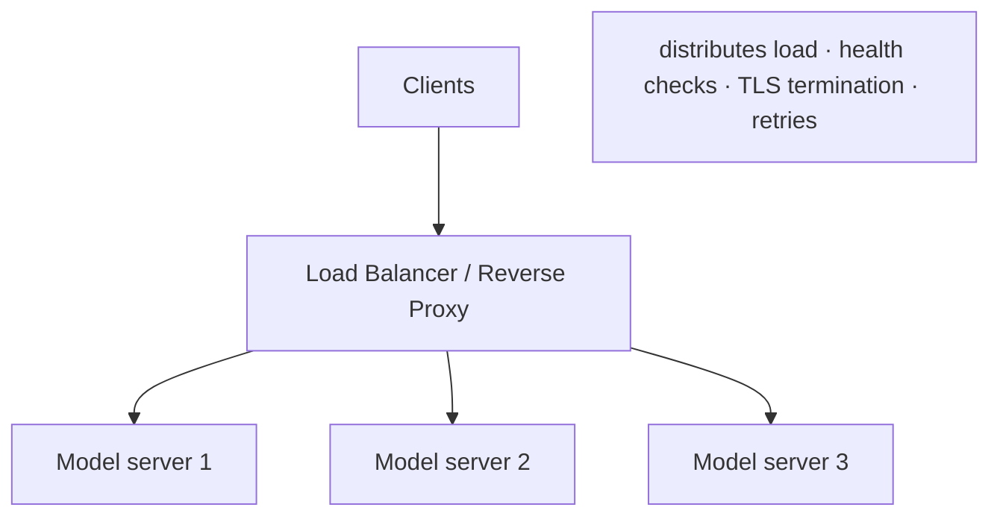
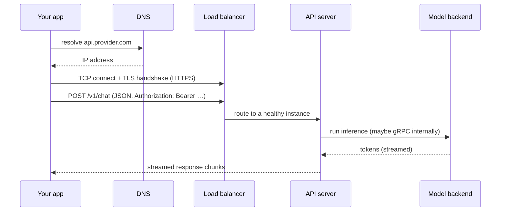

<!-- Module 02 · Lesson 7 — follows ../../../standards/. -->

# 02.7 · Networking

[⬅ 02.6 Operating Systems](02.6-operating-systems.md) · [🏠 Module](../README.md) · [🗺 Roadmap](../../../ROADMAP.md) · [Next ➡](02.8-concurrency.md)

> Every AI API call, every model download, every distributed training gradient sync travels over a network. This lesson demystifies the stack — TCP/IP, DNS, HTTP(S), REST, WebSockets, gRPC, and the load balancers and proxies that make services scale.

| | |
|---|---|
| **Module** | `02 · Computer Science Foundations` |
| **Lesson** | `02.7` |
| **Difficulty** | ⭐⭐⭐ |
| **Estimated study time** | 70 min read |
| **Status** | 🟢 stable |

---

## 1. Learning Objectives

By the end of this lesson you will be able to:

- [ ] Explain the **TCP/IP** model and the roles of **TCP vs UDP**.
- [ ] Explain **DNS, HTTP, HTTPS,** and the request/response cycle.
- [ ] Compare **REST, WebSockets,** and **gRPC** and when to use each.
- [ ] Explain **load balancers** and **reverse proxies** and why services need them.
- [ ] Trace how an **AI API call** travels from client to model and back.

## 2. Prerequisites

- [02.6 Operating Systems](02.6-operating-systems.md) (processes, ports).
- [Module 01.12 Async](../../01-Advanced-Python/weeks/01.12-async.md) (why network calls are I/O-bound & concurrent).

---

## 3. Why This Topic Exists

Modern AI is a *networked* discipline. You call hosted model APIs over HTTP; you serve your own models behind HTTP/gRPC endpoints; you fetch datasets from object storage; distributed training synchronizes gradients across machines. Latency, throughput, timeouts, retries, and streaming — the daily concerns of AI Engineering — are all networking concerns.

Understanding the stack lets you debug the inevitable ("why is this request slow/timing out?"), choose the right protocol (REST vs WebSocket vs gRPC for streaming tokens), and design services that scale (load balancers, proxies). It's the connective tissue of every production AI system.

> [!IMPORTANT]
> When you call an LLM API, a lot happens beneath `response = client.chat(...)`: DNS resolution, a TCP connection, a TLS handshake, an HTTP request, the server's work, and a (possibly streamed) response — each a place latency or failure can occur. Knowing the stack turns "the API is slow" into a specific, fixable diagnosis.

## 4. Problems It Solves

| Problem | Networking knowledge solves it by |
|---|---|
| "Why is my API call slow/timing out?" | Understanding each stage (DNS, TLS, TCP, server) |
| Streaming tokens as they generate | Choosing WebSockets/SSE/streaming HTTP |
| High-throughput internal services | gRPC + load balancing |
| Scaling a model service | Load balancers, reverse proxies |
| Secure communication | HTTPS/TLS |
| Reliable delivery vs speed | TCP vs UDP choice |

---

## 5. Mental Model: A Layered Postal System

Networking is built in **layers**, each handling one job and relying on the one below — like a postal system: you write a letter (application), put it in an addressed envelope (transport), the post office routes it across cities (internet/IP), and trucks/planes carry the physical bits (link).



| Layer | Job | Examples |
|---|---|---|
| **Application** | What programs exchange | HTTP, HTTPS, gRPC, DNS |
| **Transport** | End-to-end delivery + ports | TCP, UDP |
| **Internet** | Addressing & routing | IP (addresses) |
| **Link** | Physical transmission | Ethernet, Wi-Fi |

> [!NOTE]
> This is the **TCP/IP model** (4 layers). You may also see the 7-layer **OSI model** in interviews — same idea, finer divisions. Each layer wraps the one above in its own header (encapsulation), like nested envelopes.

---

## 6. IP, TCP, and UDP

### IP — addressing and routing

**IP (Internet Protocol)** gives every machine an **address** (e.g., `93.184.216.34` for IPv4, or the longer IPv6) and routes packets between them. IP is *best-effort*: packets can be lost, duplicated, or arrive out of order. The transport layer fixes that (or not).

### TCP vs UDP

| | TCP | UDP |
|---|---|---|
| Reliability | ✅ Guaranteed, ordered delivery | ❌ Best-effort, may drop/reorder |
| Connection | Connection-oriented (handshake) | Connectionless |
| Speed/overhead | Slower (acks, retransmit) | Faster, lightweight |
| Use for | Web, APIs, files — correctness matters | Streaming, gaming, DNS — speed > perfection |



> [!IMPORTANT]
> **Almost all AI API traffic is TCP** (via HTTP), because correctness matters — you can't tolerate a dropped chunk of a model's response. TCP's reliability costs a handshake and acknowledgments, which is why **connection reuse** (keep-alive) matters for performance: reusing a connection avoids repeating the handshake on every request. (UDP appears in specialized high-performance distributed-training communication and real-time media.)

### Ports

A machine has one IP but runs many services; **ports** (0–65535) distinguish them. Combined, `IP:port` identifies a specific service endpoint (e.g., `:443` for HTTPS, `:80` HTTP, `:8000` a dev server). A **socket** is the OS abstraction for one end of a connection ([02.6](02.6-operating-systems.md)).

---

## 7. DNS — Names to Addresses

Humans use names (`api.example.com`); machines need IP addresses. **DNS (Domain Name System)** is the internet's phone book, translating names to IPs.



| Concept | Meaning |
|---|---|
| **Resolver** | Service that looks up names for you (often your ISP/cloud) |
| **Caching + TTL** | Results cached for a time-to-live to avoid repeat lookups |
| **A / AAAA record** | Name → IPv4 / IPv6 address |
| **CNAME** | An alias to another name |

> [!TIP]
> DNS resolution is the **first step of any API call** and can be a hidden source of latency or failure (a slow/misconfigured resolver, an expired record). Results are cached (per TTL). "It works from my laptop but not the server" is often DNS or firewall differences — check name resolution first when debugging connectivity.

---

## 8. HTTP and HTTPS

**HTTP (HyperText Transfer Protocol)** is the request/response protocol of the web and virtually all AI APIs. A client sends a **request** (method, path, headers, optional body); the server returns a **response** (status code, headers, body).



| Part | Examples |
|---|---|
| **Methods** | `GET` (read), `POST` (create/act), `PUT`/`PATCH` (update), `DELETE` |
| **Status codes** | `2xx` success · `3xx` redirect · `4xx` client error (400 bad, 401 auth, 404 not found, **429 rate-limited**) · `5xx` server error |
| **Headers** | `Content-Type`, `Authorization`, `User-Agent` |
| **Body** | Usually JSON for APIs ([Module 02.9](02.9-serialization.md)) |

**HTTPS** is HTTP over **TLS** — it encrypts the connection so data can't be read or tampered with in transit, and authenticates the server (via certificates).



> [!IMPORTANT]
> **Always use HTTPS for AI APIs.** Your requests carry API keys and often sensitive data; over plain HTTP they'd be readable by anyone on the path. The TLS handshake adds latency (another round trip), which is another reason to **reuse connections**. Recognize **429 (rate limited)** and **5xx (server error)** as the transient failures your retry logic ([Module 01.9](../../01-Advanced-Python/weeks/01.9-error-handling-logging.md)) should handle, and **4xx** (except 429) as permanent (don't retry).

---

## 9. REST, WebSockets, and gRPC

Three common ways AI services communicate, each suited to different needs:

| | REST (HTTP) | WebSockets | gRPC |
|---|---|---|---|
| Style | Request/response | Persistent, bidirectional | Request/response + streaming |
| Transport | HTTP/1.1 or 2 | Upgraded HTTP → long-lived | HTTP/2 |
| Data format | Usually JSON (text) | Any (often JSON) | Protobuf (binary, [02.9](02.9-serialization.md)) |
| Best for | Standard APIs, simplicity | Real-time, server push, streaming | High-performance internal services |
| Human-readable | ✅ | ✅/❌ | ❌ (binary) |



- **REST** is the default for public AI APIs — simple, cacheable, universally supported. Resources are addressed by URL, acted on with HTTP methods.
- **WebSockets** keep a connection **open** for continuous two-way messaging — ideal for **streaming** and live interaction.
- **gRPC** uses HTTP/2 + Protobuf for fast, strongly-typed, streaming-capable calls — favored for **internal, high-throughput microservice** communication (e.g., a serving layer talking to a model backend).

> [!IMPORTANT]
> **Streaming LLM tokens** — showing text as it generates — is a networking pattern. It's commonly done with **Server-Sent Events (SSE)** or streaming HTTP responses (the server sends chunks over one long-lived response), and sometimes WebSockets. gRPC streaming is used for high-performance internal token streaming. Understanding these lets you build responsive AI UIs and efficient serving ([Module 16](../../16-MLOps/README.md)).

---

## 10. Load Balancers and Reverse Proxies

One server can't handle production traffic or provide high availability. A **load balancer** spreads incoming requests across many identical server instances; a **reverse proxy** sits in front of your servers handling cross-cutting concerns.



| Concern | Handled by |
|---|---|
| **Load balancing** | Distribute requests (round-robin, least-connections) |
| **High availability** | Route around unhealthy instances (health checks) |
| **TLS termination** | Decrypt HTTPS once at the edge |
| **Rate limiting / auth** | Enforce at the gateway |
| **Caching / compression** | Offload from app servers |

| Term | Role |
|---|---|
| **Load balancer** | Distributes traffic across backends for scale & availability |
| **Reverse proxy** | Fronts servers (nginx, Envoy); TLS, routing, caching, security |
| **Forward proxy** | Fronts *clients* (outbound), e.g., corporate egress |
| **API gateway** | Reverse proxy + auth, rate limiting, routing for APIs |

> [!IMPORTANT]
> **AI relevance:** model servers are expensive (GPUs) and must scale horizontally — a load balancer across multiple GPU-backed instances is how you serve production traffic and stay available during failures/deploys. Reverse proxies handle TLS, auth, and rate limiting so your model server focuses on inference. This is the backbone of [Module 16 (MLOps)](../../16-MLOps/README.md) and [Module 18 (System Design)](../../18-System-Design/README.md). Note: **stateful streaming** (WebSockets) complicates load balancing (a connection must stick to one server — "session affinity").

---

## 11. Tracing a Real AI API Call

Putting it together — what happens when your code calls a hosted model:



Each hop is a potential source of latency (DNS, TLS, queueing, inference) or failure (timeout, 429, 5xx) — which is exactly why your client needs **timeouts, retries with backoff, and connection reuse** ([Module 01.9](../../01-Advanced-Python/weeks/01.9-error-handling-logging.md), [01.12](../../01-Advanced-Python/weeks/01.12-async.md)).

---

## 12. Common Mistakes & Debugging

| Symptom | Likely cause | Fix / tool |
|---|---|---|
| Intermittent timeouts | No/short timeouts; network blips | Set timeouts + retries with backoff |
| Slow every request | New connection each time (handshake) | Reuse connections (keep-alive/session) |
| 429 errors | Rate limited | Backoff + bounded concurrency ([Module 01.12](../../01-Advanced-Python/weeks/01.12-async.md)) |
| Works locally, not on server | DNS/firewall/port differences | Check name resolution, ports, security groups |
| 4xx you keep retrying | Permanent client error (bad request/auth) | Fix the request; don't retry (except 429) |
| Streaming not working behind proxy | Proxy buffering responses | Configure the proxy for streaming/SSE |

> [!TIP]
> Networking debugging toolkit: `curl -v` (see the full request/response, headers, timing), `ping`/`traceroute` (reachability/route), `dig`/`nslookup` (DNS), `netstat`/`ss` (open connections/ports), browser dev-tools network tab, and status codes. Reproduce a failing API call with `curl` first — it isolates whether the problem is your code or the network/server.

## 13. Performance Considerations

| Principle | Takeaway |
|---|---|
| Reuse connections | Avoid repeated TCP+TLS handshakes |
| Concurrency for I/O | Async overlaps many network waits ([Module 01.12](../../01-Advanced-Python/weeks/01.12-async.md)) |
| Stream large/slow responses | Better perceived latency (tokens as they arrive) |
| Compress payloads | Less data over the wire |
| Locate services close | Latency ∝ distance (speed of light is real) |
| gRPC/Protobuf internally | Faster, smaller than JSON for high throughput |

## 14. Security Considerations

| Risk | Guidance |
|---|---|
| Plaintext HTTP | Eavesdropping/tampering — **always HTTPS/TLS** |
| API keys in transit/URLs/logs | Use headers over TLS; never in URLs or logs ([Module 01.9](../../01-Advanced-Python/weeks/01.9-error-handling-logging.md)) |
| No auth on endpoints | Anyone can call your (costly) model — require auth |
| Injection via request data | Validate/sanitize inputs (Pydantic, [Module 01.8](../../01-Advanced-Python/weeks/01.8-type-hinting.md)) |
| DDoS / abuse | Rate limiting, WAF at the gateway |
| SSRF (server-side request forgery) | An LLM/agent fetching attacker-controlled URLs can hit internal services — allowlist/validate outbound URLs |

> [!CAUTION]
> **SSRF is a rising AI-specific risk:** if your agent or tool lets a model trigger network requests to arbitrary URLs, an attacker can make your server fetch internal/metadata endpoints (a serious cloud vulnerability). Allowlist destinations, block internal IP ranges, and never let untrusted model output drive raw network calls without validation. (More in [Module 19 · Production AI](../../19-Production-AI/README.md).)

---

## 15. Interview Questions

**Beginner**
1. What's the difference between TCP and UDP? Which do AI APIs use and why?
2. What does DNS do, and where does it fit in an API call?

**Intermediate**
1. Explain HTTPS. What does TLS add over HTTP, and what latency cost?
2. Compare REST, WebSockets, and gRPC — when would you choose each?

**Advanced**
1. How would you implement streaming of LLM tokens to a client, and what networking mechanisms enable it?
2. Why does a service need a load balancer and reverse proxy? What complications do stateful (streaming) connections add?

**System-design prompt**
- Design the networking architecture for a public LLM API serving many users with token streaming. — *Follow-ups:* REST vs WebSocket vs SSE for streaming? Where do the load balancer, TLS termination, rate limiting, and retries live? How do you handle 429s and failures?

---

## 16. Summary

| Key idea | Takeaway |
|---|---|
| Layers | App (HTTP/gRPC) → Transport (TCP/UDP) → IP → Link |
| TCP vs UDP | Reliable/ordered vs fast/best-effort; APIs use TCP |
| DNS | Names → IPs; first (cacheable) step of a call |
| HTTP(S) | Request/response; HTTPS = TLS encryption; know status codes |
| REST/WS/gRPC | Simple APIs / real-time streams / high-perf internal |
| LB & proxy | Scale, availability, TLS, auth, rate limiting |

## 17. Cheat Sheet

```text
LAYERS: Application(HTTP/gRPC/DNS) → Transport(TCP/UDP, ports) → Internet(IP) → Link
TCP: reliable, ordered, connection (3-way handshake) → APIs ; UDP: fast, best-effort → streaming/DNS
IP:port identifies a service · socket = one connection end (OS)
DNS: name → IP (cached, TTL) · first step of a call · common failure point
HTTP: method(GET/POST/PUT/DELETE) + path + headers + body(JSON)
  status: 2xx ok · 3xx redirect · 4xx client(400/401/404, 429=rate limit) · 5xx server
  retry: 429 + 5xx (transient) ; NOT other 4xx (permanent)
HTTPS = HTTP + TLS (encrypt + authenticate) — ALWAYS use ; reuse connections (avoid handshakes)
REST(request/response, JSON) · WebSocket(persistent 2-way, real-time) · gRPC(HTTP/2+Protobuf, fast internal)
STREAM TOKENS: SSE / streaming HTTP / WebSocket / gRPC streaming
LOAD BALANCER: spread traffic across GPU servers, health checks, HA
REVERSE PROXY(nginx/Envoy): TLS termination, routing, auth, rate limiting, caching
DEBUG: curl -v · dig/nslookup · ping/traceroute · ss/netstat
SECURITY: HTTPS · keys in headers not URLs/logs · auth+rate limit · validate input · SSRF (allowlist URLs)
```

## 18. Flashcards

- **Q:** TCP vs UDP, and which do AI APIs use? — **A:** TCP = reliable, ordered, connection-based (used by HTTP/APIs); UDP = fast, best-effort (streaming/DNS). APIs use TCP because correctness matters.
- **Q:** What does DNS do? — **A:** Translates human names (api.example.com) to IP addresses; it's the cached first step of any networked call.
- **Q:** What does HTTPS add over HTTP? — **A:** TLS encryption (privacy + tamper-resistance) and server authentication via certificates — at the cost of a handshake round trip.
- **Q:** Which HTTP status codes should you retry? — **A:** 429 (rate limited) and 5xx (server errors) as transient; not other 4xx (permanent client errors).
- **Q:** REST vs WebSocket vs gRPC? — **A:** REST = simple request/response (JSON); WebSocket = persistent bidirectional (real-time/streaming); gRPC = HTTP/2 + Protobuf for fast internal services.
- **Q:** What does a load balancer provide for model serving? — **A:** Distributes requests across multiple (GPU) instances for scalability and high availability, with health checks.

## 19. Hands-on Exercises

> Full set in [`../exercises/`](../exercises/).

- [ ] **(⭐ Conceptual)** Trace an API call end-to-end (DNS → TCP → TLS → HTTP → response); label where latency/failures can occur.
- [ ] **(⭐⭐ Coding)** Use `curl -v` and Python to make a request to a public API; inspect headers, status code, and timing.
- [ ] **(⭐⭐ Coding)** Build a tiny HTTP client that handles 429/5xx with retry+backoff and reuses a connection (session).
- [ ] **(⭐⭐⭐ Conceptual)** Design (on paper) how you'd stream LLM tokens to a browser; pick SSE vs WebSocket and justify.

## 20. Mini Project

> **Simple HTTP server (this module's showcase, v4).** Build a minimal HTTP server from a low level (raw sockets, or a tiny framework) that exposes a `/predict` endpoint returning JSON, handles concurrent requests, and streams a response chunk-by-chunk. Add correct status codes, basic auth via a header, and a health check. Include an architecture diagram. This is a stripped-down model server — you'll build the real thing in [Module 16](../../16-MLOps/README.md).

## 21. References

- Kurose & Ross, *Computer Networking: A Top-Down Approach* — the standard text ([reference standards](../../../standards/reference-standards.md)).
- MDN Web Docs — HTTP, status codes, WebSockets (excellent, practical).
- gRPC and HTTP/2 documentation; *High Performance Browser Networking* (Grigorik, free online).

## 22. What's Next

Networked, multi-core AI systems need to do many things at once. Next we consolidate **concurrency** — threading, multiprocessing, async, locks, and races — comparing the models and Python's limits (the GIL), building on [Module 01](../../01-Advanced-Python/weeks/01.11-performance.md) and [02.6](02.6-operating-systems.md).

➡️ **Next:** [02.8 · Concurrency](02.8-concurrency.md)

---

### 🔁 Revision checklist
- [ ] I can explain the network layers and TCP vs UDP
- [ ] I understand HTTP methods/status codes and HTTPS/TLS
- [ ] I can choose REST vs WebSocket vs gRPC for a need
- [ ] I can trace an AI API call and place load balancers/proxies

### 🔗 Spaced-repetition callback
> Recall [Module 01.9's retry logic](../../01-Advanced-Python/weeks/01.9-error-handling-logging.md) and [01.12's async](../../01-Advanced-Python/weeks/01.12-async.md): now you know *why* — 429/5xx are network-layer transient failures, and async exists to overlap the TCP/HTTP waits this lesson describes. The client patterns you built are direct responses to this networking reality.
